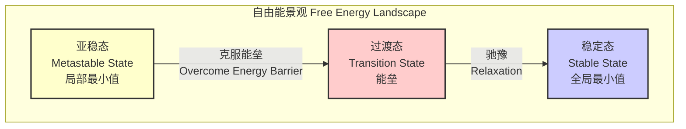
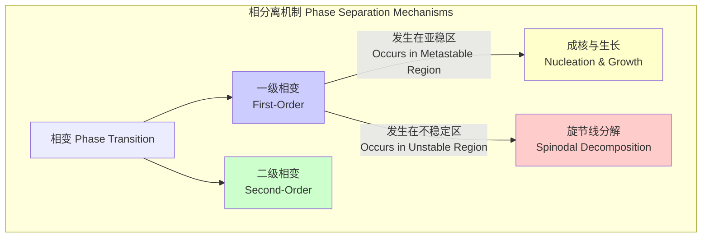

## 亚稳相变 (metastable phase transition)

亚稳相变是指一个系统从亚稳态（一个热力学上的局部能量最低点）向更稳定的基态（全局能量最低点）转变的过程。这个过程不是瞬时发生的，而是通过一个被称为“成核与生长”（nucleation and growth）的随机过程来完成。亚稳态在宏观尺度上看似稳定，但微观尺度的热涨落会最终驱动系统越过一个能量势垒，从而完成向稳定相的转变。这一现象在材料科学、大气物理、化学和技术领域中普遍存在。

### 1. 核心概念与数学基础

#### 1.1 热力学势与相稳定性

在恒定温度（$T$）和压力（$P$）下，一个系统的热力学平衡态由其吉布斯自由能（Gibbs Free Energy, $G$）的最小值决定。

*   **稳定相 (Stable Phase)**: 对应于吉布斯自由能的全局最小值。
*   **亚稳相 (Metastable Phase)**: 对应于吉布斯自由能的一个局部最小值，但不是全局最小值。系统可以暂时“陷入”这个状态。
*   **不稳定相 (Unstable Phase)**: 对应于吉布斯自由能的局部最大值，任何微小的扰动都会使其向更低能量的状态演化。

下图形象地展示了这三种状态。

#### 1.2 经典成核理论 (Classical Nucleation Theory, CNT)

亚稳相变的核心机制是成核。经典成核理论为描述这一过程提供了数学框架。当一个亚稳相（如过冷液体）中形成一个新稳定相（如晶体）的微小核（胚）时，系统的总自由能变化 $\Delta G_{total}$ 由两部分组成：

1.  **体自由能贡献 ($\Delta G_{volume}$)**: 新相的形成会降低系统的自由能，这是一个有利因素。
2.  **表面能贡献 ($\Delta G_{surface}$)**: 形成新相与母相之间的界面需要消耗能量，这是一个不利因素。

假设形成一个半径为 $r$ 的球形成核，总自由能变化可以表示为：

$$
\Delta G_{total}(r) = \Delta G_{volume} + \Delta G_{surface} = -\frac{4}{3}\pi r^3 \Delta G_v + 4\pi r^2 \gamma
$$

其中：
*   $r$: 新相核的半径 (m)。
*   $\Delta G_v$: 单位体积新相形成时的体自由能降低 (J/m³)。这是一个正值，代表了相变的驱动力。对于过冷液体结晶，其近似值为 $\Delta G_v \approx \frac{L_v \Delta T}{T_m}$，其中 $L_v$ 是单位体积的潜热，$T_m$ 是熔点温度，$\Delta T = T_m - T$ 是过冷度。
*   $\gamma$: 两相之间的界面能 (J/m²)。

#### 1.3 临界核与活化能

为了形成一个能够稳定长大的核，系统必须克服一个能量势垒。这个势垒的高度对应于 $\Delta G_{total}(r)$ 的最大值。通过对 $\Delta G_{total}(r)$ 求导并令其为零，可以找到临界核半径 $r^*$ 和相应的活化能 $\Delta G^*$。

$$
\frac{d(\Delta G_{total})}{dr} = -4\pi r^2 \Delta G_v + 8\pi r \gamma = 0
$$

解得临界核半径 $r^*$:

$$
r^* = \frac{2\gamma}{\Delta G_v}
$$

将 $r^*$ 代回 $\Delta G_{total}(r)$ 方程，得到成核所需的活化能（能垒）$\Delta G^*$:

$$
\Delta G^* = \Delta G_{total}(r^*) = \frac{16\pi\gamma^3}{3(\Delta G_v)^2}
$$

只有当热涨落提供的能量超过 $\Delta G^*$，形成的核半径大于 $r^*$ 时，该核才能自发长大，从而驱动整个系统向稳定相转变。

#### 1.4 成核速率

单位时间、单位体积内形成临界核的数量，即成核速率 $J$，通常用阿伦尼乌斯类型的方程描述：

$$
J = J_0 \exp\left(-\frac{\Delta G^*}{k_B T}\right)
$$

其中：
*   $J$: 成核速率 (个/m³·s)。
*   $J_0$: 指前因子 (pre-exponential factor)，与原子扩散、碰撞频率等动力学因素有关。其量级通常在 $10^{30}$ 到 $10^{40}$ 个/m³·s 之间。
*   $k_B$: 玻尔兹曼常数 ($1.3806 \times 10^{-23}$ J/K)。
*   $T$: 绝对温度 (K)。

### 2. 关键技术规格

以下表格列出了描述亚稳相变的关键参数，并以水在-10°C (263.15 K) 过冷结冰为例给出典型的数值。

| 参数 (Parameter) | 符号 (Symbol) | 定义 (Definition) | 典型值 (水在-10°C) | 单位 (Unit) |
| :--- | :--- | :--- | :--- | :--- |
| 界面能 (Interfacial Energy) | $\gamma$ | 冰-水界面单位面积的能量 | $\approx 29 \times 10^{-3}$ | J/m² |
| 体自由能变化 (Volumetric Free Energy Change) | $\Delta G_v$ | 单位体积结晶释放的自由能 | $\approx 1.2 \times 10^7$ | J/m³ |
| 临界核半径 (Critical Nucleus Radius) | $r^*$ | 能够稳定长大的最小核半径 | $\approx 4.8 \times 10^{-9}$ | m (或 nm) |
| 活化能 (Activation Energy) | $\Delta G^*$ | 形成一个临界核所需的能量势垒 | $\approx 1.1 \times 10^{-18}$ | J |
| 指前因子 (Pre-exponential Factor) | $J_0$ | 与动力学相关的常数 | $\sim 10^{39}$ | m⁻³s⁻¹ |
| 成核速率 (Nucleation Rate) | $J$ | 单位体积、单位时间的成核数 | 高度依赖于纯度，理论值可计算 | m⁻³s⁻¹ |

### 3. 常见用例与性能指标

| 应用领域 (Use Case) | 描述 (Description) | 关键性能指标 (Quantitative Performance Metrics) |
| :--- | :--- | :--- |
| **材料科学 (Materials Science)** | 合金（如钢、铝合金）中的析出物强化。通过热处理形成亚稳的析出相，阻碍位错运动，提高强度。 | 屈服强度 (Yield Strength): 300 - 2000 MPa 硬度 (Hardness): 150 - 800 HV |
| **相变存储器 (Phase-Change Memory, PCM)** | 利用材料在非晶态（亚稳）和晶态（稳定）之间的快速转变来存储数据。非晶态电阻高（'0'），晶态电阻低（'1'）。 | 擦写速度 (Switching Speed): 10 - 100 ns 读写寿命 (Endurance): > $10^8$ 次循环 数据保持时间 (Retention): > 10 年 @ 85°C |
| **大气科学 (Atmospheric Science)** | 云中过冷水滴结冰或水汽凝结成雨滴。成核过程是降水形成的关键步骤。 | 降水率 (Precipitation Rate): 1 - 50 mm/hr 云滴成核时间 (Droplet Nucleation Time): ms - s |
| **玻璃制造 (Glass Formation)** | 将液体快速冷却，使其黏度急剧增大，原子来不及排列成有序的晶体结构，从而形成亚稳的非晶态固体（玻璃）。 | 临界冷却速率 (Critical Cooling Rate): $10^2$ - $10^6$ K/s (对金属玻璃) |

### 4. 实现考量与算法复杂度

在计算模拟中研究亚稳相变，通常采用以下方法：

| 模拟方法 (Simulation Method) | 描述 (Description) | 算法复杂度 (Algorithmic Complexity) |
| :--- | :--- | :--- |
| **蒙特卡洛 (Monte Carlo, MC)** | 基于概率抽样模拟系统状态演化，特别适用于研究平衡态和相变。如伊辛模型（Ising model）。 | 每个MC步: $O(1)$ 或 $O(\log N)$ 模拟逃离亚稳态: 复杂度随系统大小 $N$ 和温度 $T$ 呈指数关系 $O(e^{\Delta G^*/k_B T})$。 |
| **分子动力学 (Molecular Dynamics, MD)** | 通过求解牛顿运动方程模拟原子/分子的轨迹，可以直接观察成核的动力学过程。 | 每个时间步: $O(N)$ 或 $O(N \log N)$ (使用邻居列表) 观察成核需要极长的模拟时间。 |
| **相场模型 (Phase-Field Model)** | 求解一个连续的序参数场 $\phi(\mathbf{x}, t)$ 的偏微分方程，以描述相的分布和演化。 | 每个时间步 (显式格式): $O(M^d)$，其中 $M^d$ 是 $d$ 维空间中的网格点数。 |

### 5. 性能特征与统计度量

亚稳态的寿命是一个随机变量，其行为具有显著的统计特征。

*   **平均寿命 ($\tau$)**: 亚稳态的平均存在时间与成核速率 $J$ 和系统体积 $V$ 的乘积成反比。
    $$
    \tau \approx \frac{1}{J \cdot V}
    $$
*   **衰变概率**: 系统在时间 $t$ 仍然保持在亚稳态的概率 $P(t)$ 通常遵循指数衰减规律，这与泊松过程的特征一致。
    $$
    P(t) = e^{-t/\tau}
    $$
*   **统计分布**: 对于大量相同的系统，在时间 $t$ 仍处于亚稳态的系统数量 $N(t)$ 遵循 $N(t) = N_0 e^{-t/\tau}$，其中 $N_0$ 是初始系统数量。
*   **置信区间**: 由于成核的随机性，实验测量的寿命值会有波动。通常使用95%置信区间来报告寿命的范围。对于指数分布，其标准差等于平均值 ($\sigma = \tau$)，这表明其波动性非常大。
*   **孕育时间 (Incubation Time)**: 在达到稳态成核速率 $J$ 之前，系统可能需要一段“孕育时间”或“时间延迟”($t_{lag}$)，在此期间成核速率较低。

### 6. 相关技术与数学模型比较

亚稳相变是相变现象的一个子集。理解其与其他相变机制的区别至关重要。

#### 6.1 一级相变 vs. 二级相变

*   **一级相变 (First-Order Transition)**:
    *   **特征**: 自由能的一阶导数（如熵、体积）不连续。存在潜热和相共存。
    *   **机制**: 亚稳相变属于一级相变，通过成核与生长完成。
    *   **模型**: 经典成核理论 (CNT)。

*   **二级相变 (Second-Order Transition)**:
    *   **特征**: 自由能的一阶导数连续，但二阶导数（如比热、磁化率）不连续。没有潜热，在临界点发生。
    *   **机制**: 涨落的关联长度在临界点发散。
    *   **模型**: **朗道理论 (Landau Theory)**。自由能 $F$ 按序参数 $\eta$ 展开：
        $$
        F(\eta) = F_0 + \alpha(T-T_c)\eta^2 + \beta\eta^4 + \dots
        $$
        其中 $T_c$ 是临界温度。对于一级相变，可以通过引入奇次项（如 $\eta^3$）或设置 $\beta < 0$ 来描述，此时 $F(\eta)$ 会出现局部极小值，即亚稳态。

#### 6.2 成核 vs. 旋节线分解

两者都是一级相变中常见的相分离机制，但发生的条件和动力学完全不同。

*   **成核与生长 (Nucleation and Growth)**:
    *   **条件**: 系统处于**亚稳区 (metastable region)**。
    *   **过程**: 需要克服能量势垒，通过形成离散的、大于临界尺寸的核来启动相变。
    *   **数学模型**: 经典成核理论 (CNT)。

*   **旋节线分解 (Spinodal Decomposition)**:
    *   **条件**: 系统处于**不稳定区 (unstable region)**，即 $\frac{\partial^2 G}{\partial \phi^2} < 0$，其中 $\phi$ 是成分或序参数。
    *   **过程**: 无需克服能量势垒，任何微小的浓度涨落都会自发地、连续地增长，导致相分离。最终形成相互交错的网状结构。
    *   **数学模型**: **Cahn-Hilliard 方程**:
        $$
        \frac{\partial \phi}{\partial t} = M \nabla^2 \left( \frac{\partial f(\phi)}{\partial \phi} - \kappa \nabla^2 \phi \right)
        $$
        其中 $M$ 是迁移率， $f(\phi)$ 是局部自由能密度，$\kappa$ 是梯度能量系数。该方程描述了浓度场 $\phi$ 随时间和空间的演化。

### 7. 参考文献

1.  Becker, R., & Döring, W. (1935). Kinetische Behandlung der Keimbildung in übersättigten Dämpfen. *Annalen der Physik*, 416(8), 719–752. DOI: [10.1002/andp.19354160806](https://doi.org/10.1002/andp.19354160806)
2.  Kelton, K. F., & Greer, A. L. (2010). *Nucleation in condensed matter: applications in materials and biology*. Elsevier.
3.  Wölk, J., & Strey, R. (2001). Homogeneous nucleation of H2O and D2O in comparison: The isotope effect. *The Journal of Physical Chemistry B*, 105(47), 11683–11701. DOI: [10.1021/jp0115805](https://doi.org/10.1021/jp0115805)
4.  Wuttig, M., & Yamada, N. (2007). Phase-change materials for rewriteable data storage. *Nature Materials*, 6(11), 824–832. DOI: [10.1038/nmat2009](https://doi.org/10.1038/nmat2009)