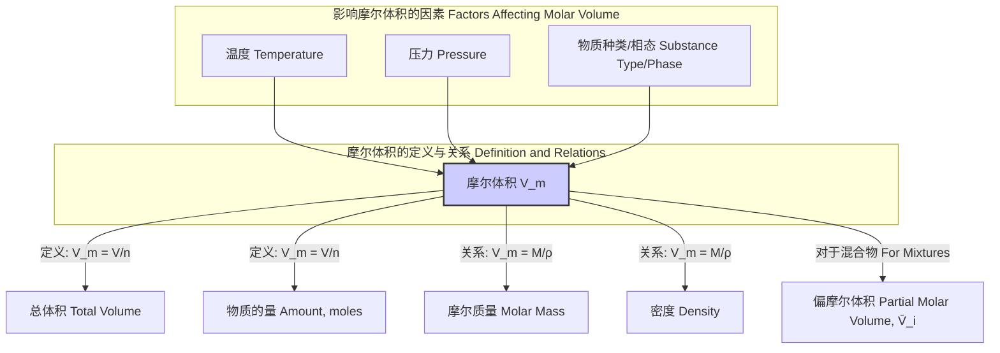
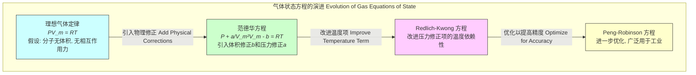

## 摩尔体积

摩尔体积（Molar Volume），符号为 $V_m$，是一个基础而重要的热力学和物理化学概念。它被定义为单位物质的量的某种物质在特定温度和压力下所占有的体积。这个属性连接了宏观的体积与微观的粒子数量，是理解物质状态和行为的关键。

### 1. 核心概念与数学基础

#### 1.1 基本定义

摩尔体积是物质的体积 $V$ 与其物质的量 $n$ 的比值。它是一个强度性质，不依赖于物质的总量。

$$
V_m = \frac{V}{n}
$$

其中：
*   $V_m$ 是摩尔体积，国际单位制（SI）单位为 立方米/摩尔 ($m^3/mol$)。在化学中，更常用的单位是 升/摩尔 ($L/mol$) 或 立方分米/摩尔 ($dm^3/mol$)。
*   $V$ 是物质的总占据体积，单位为 $m^3$、$L$ 或 $dm^3$。
*   $n$ 是物质的量，单位为 摩尔 ($mol$)。

摩尔体积也可以通过物质的摩尔质量 $M$ 和其密度 $\rho$ 计算得出：

$$
V_m = \frac{M}{\rho}
$$

其中：
*   $M$ 是摩尔质量，单位为 千克/摩尔 ($kg/mol$) 或 克/摩尔 ($g/mol$)。
*   $\rho$ 是密度，单位为 千克/立方米 ($kg/m^3$) 或 克/立方厘米 ($g/cm^3$)。

#### 1.2 对状态变量的依赖性

摩尔体积不是一个常数，它强烈地依赖于物质所处的状态，主要是温度 ($T$) 和压力 ($P$)。因此，在引述一个摩尔体积值时，必须指明其对应的温度和压力条件。

$$
V_m = f(T, P)
$$

这种依赖关系构成了物质的**状态方程**（Equation of State, EoS）。

#### 1.3 偏摩尔体积

对于多组分混合物（如溶液），我们引入**偏摩尔体积**（Partial Molar Volume）的概念来描述单个组分对总体积的贡献。组分 $i$ 的偏摩尔体积 $\bar{V}_i$ 定义为，在恒定温度、压力以及其他组分物质的量不变的情况下，向系统中加入一摩尔组分 $i$ 所引起的体积变化。

其数学定义为体积 $V$ 对组分 $i$ 的物质的量 $n_i$ 的偏导数：

$$
\bar{V}_i = \left( \frac{\partial V}{\partial n_i} \right)_{T, P, n_{j \neq i}}
$$

对于一个含有 $k$ 个组分的混合物，其总体积可以通过所有组分的偏摩尔体积和其对应的物质的量求和得到（吉布斯-杜亥姆方程的一个应用）：

$$
V = \sum_{i=1}^{k} n_i \bar{V}_i
$$

值得注意的是，由于分子间相互作用力的变化，混合物的总体积通常不等于各纯组分体积的简单加和，即 $V \neq \sum V_i^{pure}$。偏摩尔体积精确地量化了这种非理想性。

### 2. 关键技术规格

摩尔体积的值在标准条件下被广泛引用和使用。国际纯粹与应用化学联合会（IUPAC）定义了不同的标准条件。

| 参数 | 条件 | 值 | 单位 |
| :--- | :--- | :--- | :--- |
| **理想气体**摩尔体积 | **STP** (标准温度和压力: 273.15 K, 100 kPa) | 22.710 955 (4) | L/mol |
| **理想气体**摩尔体积 | **SATP** (标准环境温度和压力: 298.15 K, 100 kPa) | 24.789 570 (4) | L/mol |
| **理想气体**摩尔体积 | 旧版STP (273.15 K, 1 atm = 101.325 kPa) | 22.413 969 (4) | L/mol |
| **水 (H₂O, 液体)** | 298.15 K, 101.325 kPa | 0.018068 | L/mol |
| **乙醇 (C₂H₅OH, 液体)** | 293.15 K, 101.325 kPa | 0.05868 | L/mol |
| **铁 (Fe, α-铁, 固态)** | 293 K, 101.325 kPa | 0.00709 | L/mol |
| **金刚石 (C, 固态)** | 298.15 K, 101.325 kPa | 0.003417 | L/mol |

*注：括号中的数字表示末位的标准不确定度。*

### 3. 常见用例

摩尔体积在多个科学和工程领域都有关键应用。

*   **气体化学计量学**: 根据阿伏伽德罗定律，在同温同压下，相同体积的任何理想气体都含有相同数目的分子。这使得摩尔体积成为计算气相反应中反应物和生成物体积比的基础。例如，在合成氨反应 $N_2(g) + 3H_2(g) \rightarrow 2NH_3(g)$ 中，1体积单位的氮气与3体积单位的氢气反应生成2体积单位的氨气。
*   **热力学计算**: 摩尔体积是计算热力学功（特别是体积功 $W = -\int P dV$）的关键参数。它也出现在许多重要的热力学关系式中，例如，等压热容膨胀系数 $\alpha_P$ 的定义：
    $$ \alpha_P = \frac{1}{V_m} \left( \frac{\partial V_m}{\partial T} \right)_P $$
*   **材料科学与晶体学**: 对于晶体材料，摩尔体积与晶胞参数直接相关。通过X射线衍射（XRD）测定晶胞体积 $V_{cell}$ 和晶胞中的原子数 $Z$，可以精确计算摩尔体积：
    $$ V_m = \frac{V_{cell} \cdot N_A}{Z} $$
    其中 $N_A$ 是阿伏伽德罗常数。这个值可以用来验证材料的密度和原子堆积效率。
*   **化学工程**: 在反应器设计、分离过程（如蒸馏、吸收）和流体输送系统的尺寸确定中，物质的摩尔体积（或密度）是必不可少的设计参数。它影响设备的容积、流速和相平衡计算。

### 4. 实现考量（计算与测量）

#### 4.1 计算方法

摩尔体积的计算复杂度取决于所使用的物理模型。

*   **理想气体模型**: 计算非常简单，复杂度为 $O(1)$。
    $$ V_m = \frac{RT}{P} $$
    其中 $R$ 是理想气体常数， $T$ 是绝对温度， $P$ 是压力。该模型仅在低压和高温下准确。

*   **真实气体模型 (如范德华方程)**: 计算涉及求解一个关于 $V_m$ 的三次多项式。
    范德华方程：$\left(P + \frac{a}{V_m^2}\right)(V_m - b) = RT$
    整理后得到一个三次方程：
    $$ V_m^3 - \left(b + \frac{RT}{P}\right)V_m^2 + \left(\frac{a}{P}\right)V_m - \frac{ab}{P} = 0 $$
    该方程可以通过解析方法（如卡尔达诺公式）或数值方法（如牛顿-拉夫逊迭代法）求解。数值方法的计算复杂度取决于所需的收敛精度，但对于单次计算通常很快。

#### 4.2 实验测量方法

*   **气体**: 使用**气体比重瓶**（Gas Pycnometer）或通过精确测量已知质量气体的压力、体积和温度来确定。
*   **液体和固体**:
    *   **比重瓶法** (Pycnometry): 通过精确测量样品质量以及其排开的已知密度液体的体积来确定样品体积，从而计算摩尔体积。这是一种高精度的方法。
    *   **膨胀计法** (Dilatometry): 用于测量物质体积随温度的变化，从而得到不同温度下的摩尔体积和热膨胀系数。
    *   **X射线衍射 (XRD)**: 专用于晶体材料，通过分析衍射图谱确定晶胞参数，是计算晶体摩尔体积的最精确方法之一。

### 5. 性能特征（准确性与偏差）

#### 5.1 压缩因子

为了量化真实气体对其理想行为的偏离程度，引入了**压缩因子**（Compressibility Factor） $Z$。

$$
Z = \frac{PV_m}{RT}
$$

*   对于**理想气体**，$Z=1$ 恒成立。
*   对于**真实气体**，$Z$ 是温度和压力的函数。$Z > 1$ 表明此时斥力占主导，气体比理想气体更难压缩。$Z < 1$ 表明此时引力占主导，气体比理想气体更容易压缩。

**氮气(N₂)在不同温度下的压缩因子Z与压力的关系**
| 压力 (MPa) | Z (在 300 K) | Z (在 500 K) |
| :--- | :--- | :--- |
| 1 | 0.9995 | 1.0004 |
| 10 | 0.9893 | 1.0039 |
| 20 | 0.9815 | 1.0088 |
| 50 | 1.0094 | 1.0264 |
| 100 | 1.1378 | 1.0660 |

#### 5.2 测量不确定度

实验测量的摩尔体积具有不确定性。如果 $V_m$ 是通过 $V_m = M/\rho$ 计算的，其相对不确定度可以通过误差传播公式估算：

$$
\frac{\delta V_m}{V_m} = \sqrt{\left(\frac{\delta M}{M}\right)^2 + \left(\frac{\delta \rho}{\rho}\right)^2}
$$

其中 $\delta X$ 表示物理量 $X$ 的标准不确定度。通常，摩尔质量 $M$ 的不确定度远小于密度 $\rho$ 的测量不确定度。现代高精度比重瓶法测量密度的不确定度可达到 $\pm 0.01\%$ 至 $\pm 0.1\%$ 的水平，这决定了计算出的摩尔体积的精度。

### 6. 相关技术与比较模型

描述物质 $P-V_m-T$ 关系的状态方程（EoS）是计算摩尔体积的核心工具。以下是一些关键模型的比较。

#### 6.1 理想气体定律 (Ideal Gas Law)

$$
PV_m = RT
$$

*   **描述**: 最简单的状态方程，假设气体分子是无相互作用、无体积的点粒子。
*   **适用性**: 在低压、高温条件下对大多数气体是很好的近似。

#### 6.2 范德华方程 (Van der Waals Equation)

$$
\left(P + \frac{a}{V_m^2}\right)(V_m - b) = RT
$$

*   **描述**: 对理想气体模型的第一次重要修正。
*   **参数**:
    *   $a$: 分子间吸引力修正项。它减小了分子对器壁的有效碰撞压力。
    *   $b$: 分子自身体积修正项（排除体积），它减小了分子可自由运动的有效空间。
*   **适用性**: 定性地解释了气液相变和临界现象，但在定量预测上精度有限。

#### 6.3 Redlich-Kwong (RK) 方程

$$
P = \frac{RT}{V_m - b} - \frac{a}{\sqrt{T}V_m(V_m+b)}
$$

*   **描述**: 对范德华方程的重大改进，特别是压力修正项中引入了对温度的依赖性 ($1/\sqrt{T}$)。
*   **适用性**: 在很宽的温度和压力范围内，尤其是在高压下，其对气体摩尔体积的预测比范德华方程准确得多。

#### 6.4 Peng-Robinson (PR) 方程

$$
P = \frac{RT}{V_m - b} - \frac{a(T)}{V_m(V_m+b) + b(V_m-b)}
$$

*   **描述**: 对RK方程的进一步优化，特别是在临界点附近和对液体密度的预测方面进行了改进。参数 $a$ 是一个更复杂的温度函数 $a(T)$。
*   **适用性**: 是目前石油、天然气和化学工业中应用最广泛的状态方程之一，因为它在预测气液平衡（VLE）和热力学性质方面表现出良好的平衡性和准确性。

### 7. 参考文献

1.  Peng, D.-Y., & Robinson, D. B. (1976). A New Two-Constant Equation of State. *Industrial & Engineering Chemistry Fundamentals*, *15*(1), 59–64. [https://doi.org/10.1021/i160057a011](https://doi.org/10.1021/i160057a011)
2.  Redlich, O., & Kwong, J. N. S. (1949). On the Thermodynamics of Solutions. V. An Equation of State. Fugacities of Gaseous Solutions. *Chemical Reviews*, *44*(1), 233–244. [https://doi.org/10.1021/cr60137a013](https://doi.org/10.1021/cr60137a013)
3.  Van der Waals, J. D. (1873). *Over de Continuïteit van den Gas- en Vloeistoftoestand* (On the continuity of the gas and liquid state). Doctoral dissertation, Leiden University. (这是该领域的开创性历史文献)
4.  Atkins, P., & de Paula, J. (2014). *Atkins' Physical Chemistry* (10th ed.). Oxford University Press. (这是一本关于物理化学的权威教科书，详细介绍了摩尔体积和状态方程)