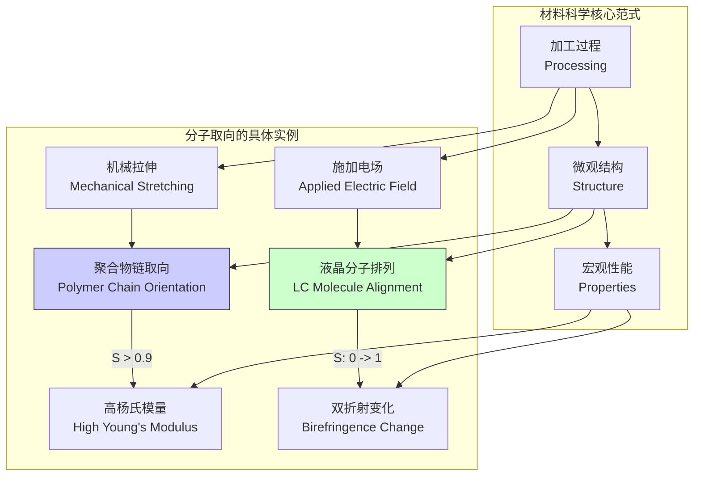

## 分子取向

分子取向（Molecular Orientation）是描述材料中分子或分子链段在空间中的非随机排列的科学概念。它是一个核心的结构参数，直接决定了材料的各向异性（anisotropy）物理和化学性质，如机械强度、光学特性、热导率和电导率。在各向同性（isotropic）材料中，分子取向是完全随机的；而在各向异性材料中，分子表现出一种或多种优势取向。

### 核心概念与数学基础

#### 1. 坐标系与欧拉角（Euler Angles）

为了定量描述一个刚性分子的取向，我们通常使用两个坐标系：
*   **空间固定坐标系 (Space-Fixed Frame, S-frame)**: 一个固定的实验室参考系，通常表示为 $(X, Y, Z)$。
*   **分子固定坐标系 (Body-Fixed Frame, B-frame)**: 一个固定在分子上的参考系，通常表示为 $(x, y, z)$，其坐标轴通常与分子的对称轴或惯性主轴对齐。

分子取向即被定义为将分子固定坐标系旋转至与空间固定坐标系重合所需要的操作。这个旋转操作最常用欧拉角 $(\alpha, \beta, \gamma)$ 或 $(\phi, \theta, \psi)$ 来描述。一个常见的约定是 $z-y'-z''$ 旋转：
1.  绕 $Z$ 轴旋转角度 $\alpha$。
2.  绕新的 $y'$ 轴旋转角度 $\beta$。
3.  绕最终的 $z''$ 轴旋转角度 $\gamma$。

该旋转可以通过一个旋转矩阵 $\mathbf{R}(\alpha, \beta, \gamma)$ 表示，它将分子坐标系中的向量 $\mathbf{v}_B$ 变换到空间坐标系中的向量 $\mathbf{v}_S$：$\mathbf{v}_S = \mathbf{R} \mathbf{v}_B$。

$$
\mathbf{R}(\alpha, \beta, \gamma) =
\begin{pmatrix}
\cos\alpha\cos\gamma - \sin\alpha\cos\beta\sin\gamma & -\cos\alpha\sin\gamma - \sin\alpha\cos\beta\cos\gamma & \sin\alpha\sin\beta \\
\sin\alpha\cos\gamma + \cos\alpha\cos\beta\sin\gamma & -\sin\alpha\sin\gamma + \cos\alpha\cos\beta\cos\gamma & -\cos\alpha\sin\beta \\
\sin\beta\sin\gamma & \sin\beta\cos\gamma & \cos\beta
\end{pmatrix}
$$

*   $\alpha \in [0, 2\pi)$: 绕 $Z$ 轴的旋转角。
*   $\beta \in [0, \pi]$: 绕新 $y'$ 轴的倾斜角，代表分子主轴与空间 $Z$ 轴的夹角。
*   $\gamma \in [0, 2\pi)$: 绕最终分子主轴 $z''$ 的旋转角。

#### 2. 取向分布函数 (Orientation Distribution Function, ODF)

对于一个包含大量分子的宏观体系，我们使用取向分布函数 $f(g)$ 或 $f(\alpha, \beta, \gamma)$ 来统计描述整体的取向状态。ODF 定义了在欧拉角空间中，一个分子处于特定取向 $(\alpha, \beta, \gamma)$ 的概率密度。它必须满足归一化条件：

$$
\int_{0}^{2\pi} \int_{0}^{\pi} \int_{0}^{2\pi} f(\alpha, \beta, \gamma) \sin\beta \,d\alpha \,d\beta \,d\gamma = 1
$$

*   $f(\alpha, \beta, \gamma)$: 取向分布函数，无量纲。
*   $\sin\beta$: 雅可比行列式，用于在球坐标系中进行体积微元积分。

对于一个完全随机的（各向同性）体系，$f(\alpha, \beta, \gamma) = \frac{1}{8\pi^2}$。

#### 3. 序参数 (Order Parameters)

为了用简洁的数值量化取向程度，我们使用序参数。它们是 ODF 的矩。ODF 可以展开为维格纳 D 函数（Wigner D-functions，$D^l_{mn}(g)$）的级数，其系数即为序参数。

对于具有单轴对称性（uniaxial symmetry）的体系（如向列相液晶或拉伸聚合物），其取向可以用一个方向矢量——“指向矢 (director)” $\mathbf{n}$ 来描述。最常用的序参数是二阶勒让德多项式 $P_2(\cos\theta)$ 的系综平均，通常被称为赫尔曼取向因子 (Herman's orientation function) 或向列相序参数 $S$。

$$
S = \langle P_2(\cos\theta) \rangle = \int_{0}^{\pi} P_2(\cos\theta) f(\theta) \sin\theta \,d\theta = \left\langle \frac{3\cos^2\theta - 1}{2} \right\rangle
$$

*   $\theta$: 分子主轴与指向矢 $\mathbf{n}$ 之间的夹角。
*   $\langle \dots \rangle$: 表示对体系中所有分子进行的系综平均。
*   $S = 1$: 所有分子完美平行于指向矢 $\mathbf{n}$。
*   $S = 0$: 分子取向完全随机（各向同性）。
*   $S = -0.5$: 所有分子完美垂直于指向矢 $\mathbf{n}$。

### 关键技术指标

下表总结了用于表征分子取向的关键参数。

| 参数 (Parameter) | 符号 (Symbol) | 数学定义 (Mathematical Definition) | 取值范围 (Value Range) | 典型测量技术 (Measurement Technique) |
| :--- | :--- | :--- | :--- | :--- |
| 赫尔曼取向因子 (Herman's Orientation Factor) | $S$ 或 $f_H$ | $\langle \frac{3\cos^2\theta - 1}{2} \rangle$ | $[-0.5, 1]$ | 偏振红外/拉曼光谱、双折射、X射线衍射 (XRD) |
| 索佩序张量 (Saupe Order Tensor) | $\mathbf{S}$ | $S_{ij} = \langle \frac{3}{2}u_i u_j - \frac{1}{2}\delta_{ij} \rangle$ | $S_{ij} \in [-0.5, 1]$ | 核磁共振 (NMR)、XRD、偏振光谱 |
| 四阶序参数 (Fourth-Rank Order Parameter) | $\langle P_4(\cos\theta) \rangle$ | $\langle \frac{35\cos^4\theta - 30\cos^2\theta + 3}{8} \rangle$ | $[-3/8, 1]$ | 偏振拉曼光谱、非线性光学 |
| 极图 (Pole Figure) | $P_h(\chi, \eta)$ | 从衍射强度反演得到的晶面法线分布 | 概率密度 | X射线衍射、中子衍射 |

### 常见用例

分子取向的控制在工业和自然界中至关重要。

*   **高性能聚合物纤维**:
    *   **案例**: 凯夫拉 (Kevlar®) 或迪尼玛 (Dyneema®) 纤维。通过拉伸工艺使聚合物长链高度沿纤维轴取向。
    *   **性能指标**:
        *   取向态凯夫拉-49的杨氏模量: $\approx 131$ GPa
        *   非取向态尼龙的杨氏模量: $\approx 3$ GPa
        *   赫尔曼取向因子 $S$ 通常 > 0.9。

*   **液晶显示器 (Liquid Crystal Displays, LCDs)**:
    *   **案例**: 向列相液晶分子在电场作用下改变取向，从而控制光的偏振状态，实现像素的亮暗切换。
    *   **性能指标**:
        *   响应时间: 5-20 ms
        *   对比度: > 1000:1
        *   电场关闭时，$S \approx 0.5-0.7$（沿基板排列）；电场开启时，$S \to 1$（沿电场方向）。

*   **生物系统**:
    *   **案例**: 肌腱中的胶原蛋白纤维。其高度单轴取向赋予了肌腱极高的抗拉强度。
    *   **性能指标**:
        *   肌腱的极限抗拉强度: 50-100 MPa
        *   胶原纤维的取向分布标准差非常小，通常小于 $5^\circ$。

### 实现考量

#### 测量与计算算法

测量分子取向通常是间接的，需要通过算法从实验数据中反演出 ODF 或序参数。

*   **X射线衍射 (XRD)**:
    *   **方法**: 通过测量不同方向的衍射强度，构建晶面的极图（Pole Figure）。然后使用数学算法从一个或多个极图反演计算完整的ODF。
    *   **算法**: 常用的有 WIMV (Williams-Imhof-Matthies-Vinel) 算法，它是一种迭代方法，旨在求解一个方程组，使计算出的极图与实验极图之间的误差最小化。
    *   **算法复杂度**: WIMV 算法的复杂度与 ODF 和极图的空间分辨率（例如，角度网格点数 $N_g$）有关，通常是 $O(N_g \log N_g)$ 或更高，具体取决于迭代次数。

*   **分子动力学模拟 (Molecular Dynamics, MD)**:
    *   **方法**: 在原子尺度上模拟分子体系的运动。通过对模拟轨迹中的每个分子在每个时间步的坐标进行分析，可以直接计算 ODF 和序参数。
    *   **算法**: MD 模拟的核心是积分牛顿运动方程。对于长程相互作用，常使用粒子网格-埃瓦尔德 (PME) 等方法。
    *   **算法复杂度**: 对于包含 $N$ 个粒子的体系，使用 PME 的 MD 模拟复杂度约为 $O(N \log N)$。从一个模拟快照计算序参数的复杂度为 $O(N)$。

### 性能特征

分子取向是一个统计概念，其表征涉及统计测量。

*   **统计度量**:
    *   ODF 本身是一个概率密度函数 (PDF)。序参数是其不同阶的矩，描述了分布的形状。
    *   **均值取向**: ODF 峰值的位置给出了最可能的分子取向。
    *   **取向弥散 (Dispersion)**: ODF 峰的宽度（例如，半峰全宽 FWHM）量化了取向围绕均值的分布范围。

*   **置信区间**:
    *   任何实验测量的序参数都是一个估计值，应报告其不确定性。例如，一个结果可以表示为 $S = 0.85 \pm 0.02$ (95% 置信区间)。
    *   不确定性的来源包括：
        *   仪器噪声和精度。
        *   有限的采样数量（例如，在光谱或 XRD 中测量的体积）。
        *   样品的不均匀性。
        *   用于数据分析的模型的系统误差。

下面的 Mermaid 图展示了加工、结构（取向）和性能之间的关系。



### 相关技术

分子取向与其他描述分子状态的概念密切相关。

#### 1. 取向 (Orientation) vs. 构象 (Conformation)

*   **取向**: 描述整个分子作为一个刚性体在空间中的旋转状态。由欧拉角 $(\alpha, \beta, \gamma)$ 定义。
*   **构象**: 描述分子内部由于围绕单键旋转而产生的原子空间排布。由二面角 (dihedral angles) 定义。

在柔性分子（如长链聚合物）中，取向和构象是强耦合的。拉伸不仅使分子链整体取向，还会促使链从卷曲构象转变为更伸展的构象（如全反式构象）。

#### 2. 标量序参数 (Scalar) vs. 张量序参数 (Tensor)

*   **标量序参数 ($S$)**:
    *   **模型**: 假设体系是单轴对称的。它只量化了分子轴沿一个特殊方向（指向矢）的对齐程度。
    *   **优点**: 简单直观。
    *   **缺点**: 无法描述更复杂的取向，如双轴取向（biaxial orientation）。

*   **张量序参数 ($\mathbf{S}$)**:
    *   **模型**: 这是一个二阶、对称、无迹张量，提供了更完整的取向信息。
    *   **数学形式**:
        $$
        \mathbf{S} = \begin{pmatrix} S_{XX} & S_{XY} & S_{XZ} \\ S_{YX} & S_{YY} & S_{YZ} \\ S_{ZX} & S_{ZY} & S_{ZZ} \end{pmatrix}
        $$
        其中 $S_{ij} = \langle \frac{3}{2}u_i u_j - \frac{1}{2}\delta_{ij} \rangle$，$u_i$ 是分子轴在空间坐标系中第 $i$ 个方向的单位矢量分量，$\delta_{ij}$ 是克罗内克符号。
    *   **优点**: 能够描述双轴取向。例如，在薄膜中，分子可能在平面内有一个优势取向，同时在厚度方向有另一个不同的取向。
    *   **关系**: 在单轴对称情况下，如果指向矢沿 Z 轴，则 $\mathbf{S}$ 简化为对角矩阵，其分量为 $(-\frac{S}{2}, -\frac{S}{2}, S)$。

```mermaid
graph LR
    subgraph "描述分子排列的框架"
        A["分子状态<br>Molecular State"] --> O["取向<br>Orientation"];
        A --> C["构象<br>Conformation"];

        O -- "描述方式" --> S["标量序参数 S<br>Scalar
```