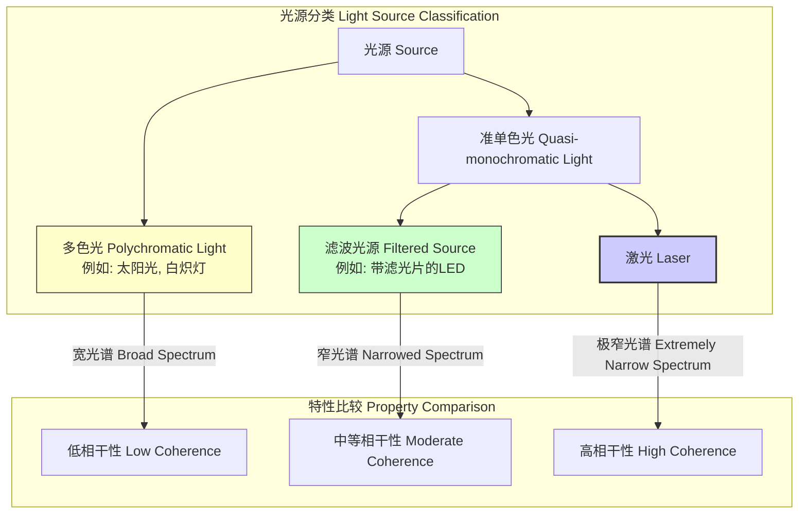
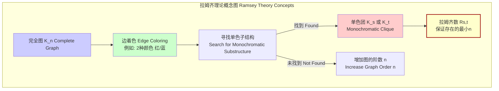

## 单色的 (monochromatic)

“单色的”一词源于希腊语，“mono”意为“单一”，“chroma”意为“颜色”。在科学和数学领域，它描述了由单一组分构成的系统或属性，最常用于描述具有单一频率的光波，但也应用于图论等抽象数学概念中。本技术文档将从物理光学和组合数学两个主要方面，对“单色”概念进行严谨的科学和数学阐述。

### 核心概念及其数学基础

#### 1. 物理学中的单色辐射

在物理学，特别是光学中，单色辐射（通常指单色光）是指由单一频率或波长的电磁波组成的辐射。

**理想单色波 (Ideal Monochromatic Wave):**
一个理想的单色平面波在数学上可以表示为一个无穷延伸、频率恒定的正弦波。其电场分量 $E$ 在空间位置 $\vec{r}$ 和时间 $t$ 的表达式为：

$$
E(\vec{r}, t) = \vec{E_0} \cos(\vec{k} \cdot \vec{r} - \omega t + \phi_0)
$$

其中：
*   $\vec{E_0}$ 是振幅矢量，表示波的最大电场强度和偏振方向。
*   $\vec{k}$ 是波矢量，其方向为波的传播方向，大小 $k = |\vec{k}| = 2\pi/\lambda$，称为波数。
*   $\omega$ 是角频率，与频率 $\nu$ 的关系为 $\omega = 2\pi\nu$。
*   $\lambda$ 是波长，与频率 $\nu$ 和波速 $c$ (在真空中为光速) 的关系为 $c = \lambda\nu$。
*   $\phi_0$ 是初始相位。

在频域中，一个理想单色波的傅里叶变换是一个狄拉克δ函数 (Dirac delta function)，表示其所有能量都集中在一个无限窄的频率点 $\nu_0$ 上。

$$
\mathcal{F}\{E(t)\}(\nu) \propto \delta(\nu - \nu_0)
$$

**准单色波 (Quasi-monochromatic Wave):**
在现实世界中，不存在完美的理想单色光源。任何实际光源发出的光都具有一定的频率范围，即谱线宽度 (spectral linewidth)。如果这个频率范围 $\Delta\nu$ 远小于中心频率 $\nu_0$ (即 $\Delta\nu \ll \nu_0$)，我们就称之为准单色光。激光是目前最接近理想单色光源的典型例子。

准单色光的关键特性是其相干性。单色性与时间相干性密切相关。

*   **相干时间 ($\tau_c$)**: 波列保持可预测相位关系的时间。它与谱线宽度成反比：
    $$
    \tau_c \approx \frac{1}{\Delta\nu}
    $$
*   **相干长度 ($L_c$)**: 在该长度内，波的不同部分保持相干。
    $$
    L_c = c \cdot \tau_c \approx \frac{c}{\Delta\nu} = \frac{\lambda_0^2}{\Delta\lambda}
    $$
    其中 $\lambda_0$ 是中心波长，$\Delta\lambda$ 是波长谱宽。

#### 2. 数学中的单色结构 (拉姆齐理论)

在组合数学，特别是拉姆齐理论 (Ramsey Theory) 中，“单色”用来描述一个更大的、被着色的数学结构中的同色子结构。

**基本定义:**
考虑一个完全图 $K_n$，即一个有 $n$ 个顶点且每对不同顶点之间都有一条边的图。对其所有边进行 $c$ 种颜色的着色。一个**单色子图**是指 $K_n$ 的一个子图，其所有边都具有相同的颜色。

拉姆齐理论的核心思想是：在任何足够大的、被有限种颜色染色的结构中，必然存在一个有序的单色子结构。

**拉姆齐数 (Ramsey Number):**
最简单的例子是双色拉姆齐数 $R(s, t)$。它被定义为最小的正整数 $n$，使得任何一个用红色或蓝色对边进行着色的 $n$ 阶完全图 $K_n$，都必然包含一个红色的 $s$ 阶完全子图 ($K_s$) 或一个蓝色的 $t$ 阶完全子图 ($K_t$)。

例如，$R(3, 3) = 6$ 意味着，在一个6人的聚会中，必然存在3个人互相认识（构成一个单色“认识”团），或者3个人互相不认识（构成一个单色“不认识”团）。

### 关键技术规格

以下是典型单色或准单色光源的技术规格。

| 参数 (Parameter) | 符号 (Symbol) | 单位 (Unit) | 钠光灯 (Sodium Lamp) | 氦氖激光器 (HeNe Laser) | 稳频二极管激光器 (Stabilized Diode Laser) |
| :--- | :--- | :--- | :--- | :--- | :--- |
| 中心波长 (Center Wavelength) | $\lambda_0$ | nm | 589.3 (D-line doublet) | 632.8 | 780.2 |
| 谱线宽度 (Spectral Linewidth) | $\Delta\nu$ | MHz | ~1,000 | 1 - 10 | < 0.1 |
| 谱线宽度 (Spectral Linewidth) | $\Delta\lambda$ | pm | ~120 | ~ $1.3 \times 10^{-3}$ | < $1 \times 10^{-4}$ |
| 相干时间 (Coherence Time) | $\tau_c$ | ns | ~1 | 100 - 1000 | > 10,000 |
| 相干长度 (Coherence Length) | $L_c$ | m | ~0.0003 | 30 - 300 | > 3,000 |
| 功率稳定性 (Power Stability) | - | % (over 8h) | 较差 (>5%) | < 2% | < 0.1% |

### 常见用例与性能指标

| 应用领域 (Use Case) | 关键性能要求 (Key Requirement) | 定量性能指标 (Quantitative Metric) | 典型值 (Typical Value) |
| :--- | :--- | :--- | :--- |
| **高分辨率光谱学** (High-Res Spectroscopy) | 极窄的谱线宽度 | 分辨本领 $R = \lambda / \Delta\lambda$ | > $10^7$ |
| **全息术** (Holography) | 长的相干长度 | 最大物景深度 $\approx L_c / 2$ | > 1 m |
| **干涉测量术** (Interferometry) | 高时间相干性和空间相干性 | 条纹可见度 $V = \frac{I_{max}-I_{min}}{I_{max}+I_{min}}$ | > 0.95 |
| **激光冷却与囚禁** (Laser Cooling & Trapping) | 精确的频率和窄线宽 | 多普勒冷却极限温度 $T_D = \frac{\hbar\Gamma}{2k_B}$ | μK - mK |
| **拉姆齐理论应用** (Ramsey Theory Apps) | 保证网络/通信中的同质子群 | 拉姆齐数 $R(s, t)$ | $R(5,5)$ 未知, 43 ≤ R(5,5) ≤ 48 |

### 实现考量与算法复杂度

#### 1. 单色光的产生

*   **滤波法**: 使用滤光片（如干涉滤光片）从宽谱光源（如白炽灯）中选择出一个窄带。效率低，单色性有限。
*   **色散法**: 使用棱镜或衍射光栅将复色光按波长分离开，再通过狭缝选取特定波长。光谱仪和单色仪基于此原理。
*   **受激辐射法 (Lasers)**: 激光器通过在谐振腔内利用受激辐射过程放大特定频率的光，从而产生具有极高单色性和相干性的光。这是目前获得高质量单色光最主要的技术。

#### 2. 单色子图的查找

在图论中，寻找单色子结构是一个计算难题。

*   **问题**: 在一个双色完全图 $K_n$ 中，找到一个大小为 $k$ 的单色团 (monochromatic k-clique)。
*   **算法复杂度**: 这个问题是**NP完全 (NP-Complete)** 的。这意味着没有已知的多项式时间算法可以解决它。对于给定的 $k$，检查所有 $\binom{n}{k}$ 个子图是否为单色团的暴力算法，其复杂度为 $O(\binom{n}{k} k^2)$，当 $k$ 随 $n$ 增长时，这是指数级的。
*   **拉姆齐数的计算**: 计算精确的拉姆齐数 $R(s, t)$ 极其困难。目前已知的精确值很少，大部分的界限是通过复杂的计算机搜索和概率方法得到的。

### 性能特征与统计度量

描述准单色光源性能的关键统计量：

*   **谱线形状与半峰全宽 (FWHM)**: 光源的功率谱密度 $S(\nu)$ 描述了光功率随频率的分布。常见的线型有洛伦兹线型 (Lorentzian) 和高斯线型 (Gaussian)。**半峰全宽 (Full Width at Half Maximum, FWHM)** 是谱线峰值一半高度处的宽度 $\Delta\nu_{FWHM}$，是衡量单色性最直接的指标。
*   **频率稳定性**: 中心频率 $\nu_0$ 随时间的变化。通常使用**艾伦方差 (Allan Variance)** $\sigma_y^2(\tau)$ 来表征，它衡量了在平均时间 $\tau$ 内的频率起伏。
    $$
    \sigma_y^2(\tau) = \frac{1}{2(M-1)} \sum_{i=1}^{M-1} (\bar{y}_{i+1} - \bar{y}_i)^2
    $$
    其中 $\bar{y}_i$ 是第 $i$ 个连续测量的归一化频率偏差。
*   **相对强度噪声 (RIN)**: 光功率的随机波动，定义为光功率波动的方差与平均光功率平方之比的谱密度。
    $$
    RIN(\omega) = \frac{S_{\delta P}(\omega)}{\bar{P}^2} \quad [\text{dB/Hz}]
    $$
    其中 $S_{\delta P}(\omega)$ 是功率波动 $\delta P(t)$ 的功率谱密度，$\bar{P}$ 是平均光功率。对于高精度测量，RIN通常要求低于 -140 dB/Hz。

### 相关技术与比较模型

**单色光 vs. 多色光 (Monochromatic vs. Polychromatic)**
*   **数学模型**: 多色光信号 $S(t)$ 是多个频率分量的叠加，可以用傅里叶积分表示：
    $$
    S(t) = \int_{-\infty}^{\infty} A(\nu) e^{i(2\pi\nu t + \phi(\nu))} d\nu
    $$
    而理想单色光信号是：
    $$
    S(t) = A_0 e^{i(2\pi\nu_0 t + \phi_0)}
    $$
    其中 $A(\nu)$ 是频谱振幅，$A_0$ 是常数振幅。

**相干光 vs. 非相干光 (Coherent vs. Incoherent)**
*   单色性是**时间相干性**的必要但不充分条件。一个理想的单色点光源同时具有完美的时间和空间相干性。
*   **维纳-辛钦定理 (Wiener-Khinchin Theorem)** 将这两者联系起来：一个波的时间相干函数（自相关函数）的傅里叶变换是其功率谱密度。
    $$
    S_E(\nu) = \int_{-\infty}^{\infty} \Gamma_E(\tau) e^{-i2\pi\nu\tau} d\tau
    $$
    其中 $S_E(\nu)$ 是功率谱密度（描述单色性），$\Gamma_E(\tau) = \langle E^*(t)E(t+\tau) \rangle$ 是自相关函数（描述时间相干性）。谱线越窄（单色性越好），自相关函数衰减得越慢（时间相干性越好）。

**拉姆齐理论中的相关概念**

### 参考文献

1.  Schawlow, A. L., & Townes, C. H. (1958). Infrared and optical masers. *Physical Review*, 112(6), 1940–1949. DOI: [10.1103/PhysRev.112.1940](https://doi.org/10.1103/PhysRev.112.1940)
2.  Graham, R. L., Rothschild, B. L., & Spencer, J. H. (1990). *Ramsey Theory* (2nd ed.). John Wiley & Sons. ISBN: 978-0471500469.
3.  Radziszowski, S. P. (2021). Small Ramsey Numbers. *The Electronic Journal of Combinatorics*, DS1, 1-113 (Dynamic Survey). [Link](https://www.combinatorics.org/ojs/index.php/eljc/article/view/DS1)
4.  Born, M., & Wolf, E. (1999). *Principles of Optics: Electromagnetic Theory of Propagation, Interference and Diffraction of Light* (7th ed.). Cambridge University Press. ISBN: 978-0521642224.