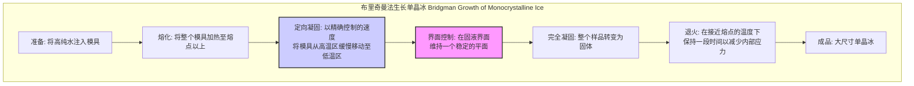
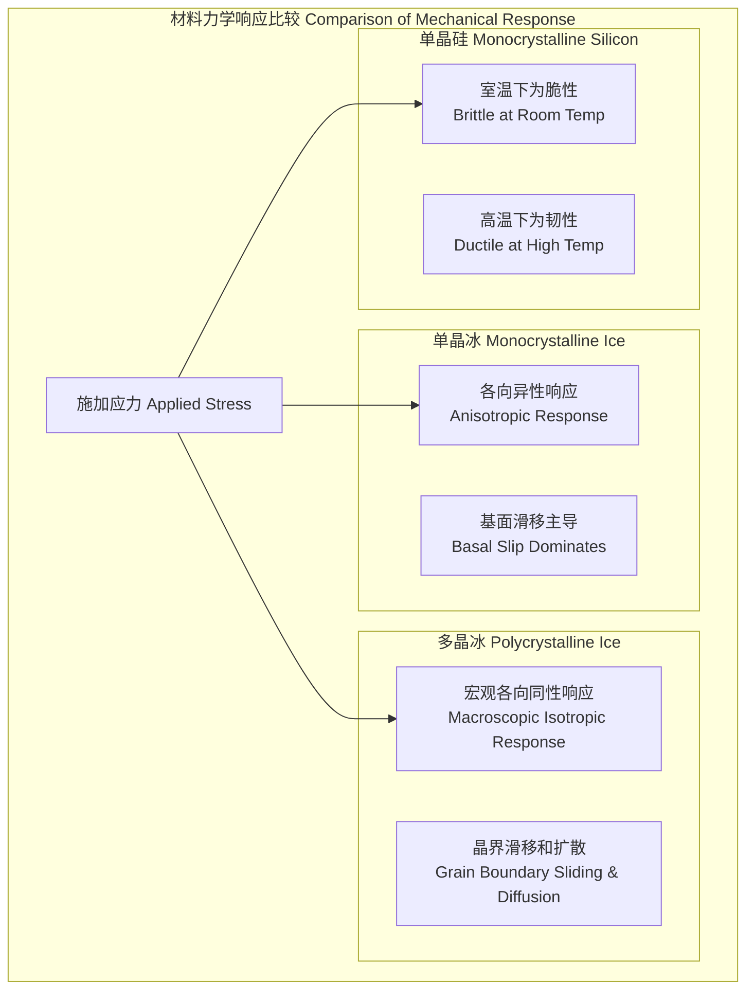

## 单晶冰

单晶冰，顾名思义，是指由单一、连续且无间断的晶格构成的冰体。与我们日常生活中常见的由无数微小冰晶粒组成的多晶冰（例如冰块或雪花）不同，单晶冰在宏观尺度上展现出完美的晶体结构，不存在晶界。这种独特的结构使其成为研究冰的物理、化学和力学性质的理想模型系统，并在冰川学、材料科学和光学等领域具有重要的科学价值。

最常见的单晶冰形态是六方晶系的冰Ih相（Ice Ih），其水分子（H₂O）通过氢键网络排列成一个具有特定对称性的周期性结构。这种长程有序的结构导致了其物理性质的显著各向异性（Anisotropy），即在不同晶体学方向上表现出不同的特性。

### 核心概念与数学基础

#### 晶体结构 (Crystal Structure)

冰Ih属于六方晶系，其空间群为 $P6_3/mmc$。晶格由氧原子构成，每个氧原子位于一个六方密堆积（hcp）格点上。氢原子的位置是无序的，但遵循所谓的“冰规则”（Pauling's ice rules）：
1.  每个氧原子与四个相邻的氢原子成键。
2.  其中两个氢原子距离较近（共价键，约0.96 Å），另外两个距离较远（氢键，约1.79 Å）。
3.  在连接任意两个相邻氧原子的氢键上，只存在一个氢原子。

这种质子无序性（proton disorder）是冰Ih的一个关键特征，赋予了其独特的介电和热力学性质。

晶体结构可以通过X射线衍射等技术进行表征。衍射峰的位置由布拉格定律（Bragg's Law）决定：

$$ n\lambda = 2d_{hkl} \sin\theta $$

其中：
*   $n$ 是一个正整数，代表衍射级数。
*   $\lambda$ 是入射X射线的波长。
*   $d_{hkl}$ 是密勒指数为 $(hkl)$ 的晶面族的面间距。
*   $\theta$ 是入射光束与衍射晶面之间的夹角，即布拉格角。

对于六方晶系，晶面间距 $d_{hkl}$ 可以通过晶格常数 $a$ 和 $c$ 计算得出：

$$ \frac{1}{d_{hkl}^2} = \frac{4}{3} \frac{h^2 + hk + k^2}{a^2} + \frac{l^2}{c^2} $$

在标准大气压和0°C下，冰Ih的晶格常数约为 $a = 4.52$ Å 和 $c = 7.37$ Å。

#### 各向异性 (Anisotropy)

单晶冰最重要的特性之一是其各向异性。物理性质（如弹性、塑性、导热性、光学折射率）在平行于c轴（主轴）方向和垂直于c轴的基面（basal plane）方向上存在显著差异。

```mermaid
graph LR
    subgraph "单晶冰的各向异性 Anisotropy in Monocrystalline Ice"
        direction "晶体学方向 Crystallographic Orientation"]
        Stress["施加应力 Applied Stress"] --> direction;
        direction -- "平行于c轴 Parallel to c-axis" --> Response_c["响应 Response - 更硬 Stiffer"];
        direction -- "平行于基面 Parallel to Basal Plane" --> Response_basal["响应 Response - 更软 Softer"];
        Response_c --> Elastic_Modulus_c["弹性模量 E_c"];
        Response_basal --> Elastic_Modulus_basal["弹性模量 E_basal"];
        Response_basal --> Plastic_Flow["塑性流动 Plastic Flow - 易于滑移"];
    end

    style Plastic_Flow fill:#ffcccc,stroke:#990000
    style Response_basal fill:#ccffcc,stroke:#006600
```

### 关键技术规格

下表列出了单晶冰Ih在特定条件下的关键物理性质。请注意，这些值具有各向异性，因此分别给出了平行（$||c$）和垂直（$\perp c$）于c轴方向的数值。

| 属性 (Property) | 符号 (Symbol) | 数值 (Value) | 单位 (Unit) | 条件 (Conditions) |
| :--- | :--- | :--- | :--- | :--- |
| 密度 (Density) | $\rho$ | 916.7 | kg·m⁻³ | 0 °C, 1 atm |
| 导热系数 (Thermal Conductivity) | $\kappa_{||c}$ | 2.34 | W·m⁻¹·K⁻¹ | -10 °C |
| | $\kappa_{\perp c}$ | 2.23 | W·m⁻¹·K⁻¹ | -10 °C |
| 弹性劲度系数 (Elastic Stiffness) | $C_{11}$ | 13.93 ± 0.03 | GPa | -16 °C |
| | $C_{33}$ | 15.01 ± 0.04 | GPa | -16 °C |
| | $C_{12}$ | 7.08 ± 0.03 | GPa | -16 °C |
| | $C_{13}$ | 5.77 ± 0.04 | GPa | -16 °C |
| | $C_{44}$ | 3.01 ± 0.01 | GPa | -16 °C |
| | $C_{66}$ | 3.42 | GPa | -16 °C |
| 折射率 (Refractive Index) | $n_o$ (寻常光) | 1.3090 | - | 589 nm, 0 °C |
| | $n_e$ (非常光) | 1.3105 | - | 589 nm, 0 °C |
| 双折射 (Birefringence) | $\Delta n = n_e - n_o$ | +0.0015 | - | 589 nm, 0 °C |

*注：$C_{66} = (C_{11} - C_{12})/2$ 是六方对称性的要求。*

### 常见用例与量化性能指标

*   **冰川学与地球物理学 (Glaciology and Geophysics)**
    *   **用途**: 作为理解冰盖和冰川宏观流动的微观力学模型。通过对单晶冰进行蠕变实验，可以标定冰流动的本构关系。
    *   **性能指标**: 在特定应力($\tau$)和温度($T$)下的蠕变速率($\dot{\epsilon}$)。例如，在-10°C和0.1 MPa的剪应力下，沿基面方向的剪切应变率可达 $10^{-7} s^{-1}$，比其他方向高出几个数量级。

*   **材料科学 (Materials Science)**
    *   **用途**: 研究位错动力学、断裂力学和晶体塑性的基本模型系统。氢键晶体的行为与金属或陶瓷有显著不同。
    *   **性能指标**: 断裂韧性 ($K_{IC}$)。单晶冰的断裂韧性表现出各向异性，典型值范围为 $0.08 \pm 0.02$ MPa·m¹/²。

*   **光学 (Optics)**
    *   **用途**: 作为一种天然的、成本低廉的双折射材料，用于教学演示和特定光学应用。
    *   **性能指标**: 光学透明窗口（约300 nm至1.3 µm），以及在可见光波段的双折射值 $\Delta n \approx 0.0015$。

### 实现考量：晶体生长

高质量、大尺寸的单晶冰通常在实验室中通过定向凝固技术制备。最常用的方法是**布里奇曼-斯托克巴格法 (Bridgman-Stockbarger Method)**。



#### 算法复杂性分析

晶体生长的核心是维持一个稳定的固液界面，防止出现胞状或树枝状的不稳定生长。这在数学上由**马林斯-塞克卡不稳定性 (Mullins-Sekerka Instability)** 理论描述。

对于一个以速度 $V$ 移动的平面界面，其稳定性取决于热梯度、杂质浓度梯度和界面能。一个简化的稳定性判据是避免**成分过冷 (Constitutional Supercooling)**。当界面处的实际温度梯度 $G_L$ 小于由杂质引起的平衡液相线温度梯度时，界面会变得不稳定。

$$ G_L < G_c = m_L \frac{V C_0 (1-k)}{D_L k} $$

其中：
*   $G_L = (\frac{\partial T}{\partial z})_{\text{interface}}$ 是液体中的实际温度梯度。
*   $G_c$ 是临界温度梯度。
*   $m_L$ 是相图上液相线的斜率。
*   $V$ 是界面生长速度。
*   $C_0$ 是初始杂质浓度。
*   $k$ 是杂质的平衡分配系数 ($k = C_S/C_L$)。
*   $D_L$ 是杂质在液体中的扩散系数。

在控制算法层面，维持稳定的 $G_L$ 和 $V$ 是一个关键的控制问题。通常采用PID（比例-积分-微分）控制器来调节加热器功率。对于一个单输入单输出（SISO）的PID控制系统，其计算复杂度为 $O(1)$，因为它在每个时间步长只执行固定的几次乘法和加法。然而，为该热力学系统确定最优PID参数（即系统辨识）的过程可能非常复杂。

### 性能特征

#### 力学性能

单晶冰的力学行为由弹性变形和塑性变形主导。

*   **弹性 (Elasticity)**: 在小应变下，应力($\sigma$)和应变($\epsilon$)的关系是线性的，并由胡克定律的张量形式描述：
    $$ \sigma_{ij} = C_{ijkl} \epsilon_{kl} $$
    对于六方对称性的冰Ih，独立的弹性劲度系数 ($C_{ijkl}$) 只有5个（$C_{11}, C_{33}, C_{12}, C_{13}, C_{44}$）。

*   **塑性/蠕变 (Plasticity/Creep)**: 在持续载荷下，冰会发生塑性流动，即蠕变。这种流动在单晶冰中是高度各向异性的，主要由基面（(0001)面）上的位错滑移控制。当剪应力作用于基面时，冰非常容易变形。描述冰蠕变的经验本构方程是**Glen流动定律 (Glen's Flow Law)**，一个幂律关系：
    $$ \dot{\epsilon}_e = A \tau_e^n $$
    其中：
    *   $\dot{\epsilon}_e$ 是等效应变率。
    *   $\tau_e$ 是等效应力。
    *   $A$ 是一个与温度和晶体结构（包括织构）相关的速率因子。
    *   $n$ 是应力指数，通常被认为是一个常数。

    **统计测量**: 大量实验表明，$n$ 的值接近3。一个典型的报告值为 $n = 3.0 \pm 0.2$ (95%置信区间)。速率因子 $A$ 遵循阿伦尼乌斯关系，对温度非常敏感：
    $$ A = A_0 \exp\left(-\frac{Q}{RT}\right) $$
    其中 $Q$ 是蠕变的激活能（对于基面滑移，约为 60-70 kJ/mol），$R$ 是气体常数，$T$ 是绝对温度。

#### 光学性能

单晶冰是光学上的**单轴晶体**，具有双折射性。这意味着光在晶体中的传播速度取决于其偏振方向和传播方向。
*   当光沿着c轴传播时，所有偏振方向的光速相同，表现为各向同性。
*   当光垂直于c轴传播时，速度差异最大。与c轴平行的偏振分量（非常光，$e$-ray）和与c轴垂直的偏振分量（寻常光，$o$-ray）具有不同的折射率（$n_e$ 和 $n_o$）。

### 相关技术与比较

单晶冰的性质可以与其他形态的冰或其他的单晶材料进行比较，以突显其独特性。



#### 数学模型比较

| 材料类型 (Material Type) | 蠕变模型 (Creep Model) | 关键方程 | 物理机制 (Mechanism) |
| :--- | :--- | :--- | :--- |
| **单晶冰 (Monocrystal Ice)** | Glen流动定律 (各向异性) | $\dot{\gamma} = A \tau^n$ | 基面位错滑移 |
| **多晶冰 (Polycrystal Ice)** | Glen流动定律 (各向同性) | $\dot{\epsilon}_e = A' \tau_e^n$ | 位错滑移、晶界滑动、扩散蠕变 |
| **金属 (高温) (Metals, High T)** | Weertman 蠕变 | $\dot{\epsilon} = B \frac{D G b}{kT} \left(\frac{\sigma}{G}\right)^m$ | 位错攀移 |

在Weertman蠕变模型中：
*   $B$ 是一个常数。
*   $D$ 是自扩散系数。
*   $G$ 是剪切模量。
*   $b$ 是伯格斯矢量的大小。
*   $k$ 是玻尔兹曼常数。
*   $\sigma$ 是施加的应力。
*   $m$ 是应力指数（通常为4-7）。

比较这些模型可以看出，尽管它们都呈幂律形式，但背后的物理机制和参数（如应力指数$n$或$m$）是完全不同的，反映了材料内部微观结构和键合类型的差异。

### 参考文献

1.  Petrenko, V. F., & Whitworth, R. W. (1999). *Physics of Ice*. Oxford University Press.
2.  Glen, J. W. (1955). The creep of polycrystalline ice. *Proceedings of the Royal Society of London. Series A. Mathematical and Physical Sciences*, 228(1175), 519-538. DOI: [10.1098/rspa.1955.0074](https://doi.org/10.1098/rspa.1955.0074)
3.  Duval, P., Ashby, M. F., & Anderman, I. (1983). Rate-controlling processes in the creep of polycrystalline ice. *Journal of Physical Chemistry*, 87(21), 4066-4074. DOI: [10.1021/j100244a012](https://doi.org/10.1021/j100244a012)
4.  Schulson, E. M. (1999). The structure and mechanical behavior of ice. *JOM*, 51(2), 21-27. DOI: [10.1007/s11837-999-0285-5](https://doi.org/10.1007/s11837-999-0285-5)
5.  Gagnon, R. E., et al. (1988). The elastic constants of single-crystal ice Ih at -16°C by Brillouin spectroscopy. *Journal of Glaciology*, 34(118), 306-311. DOI: [10.1017/S002214300000889X](https://doi.org/10.1017/S002214300000889X)