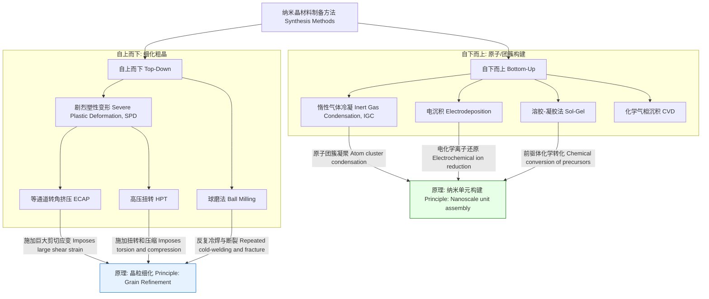
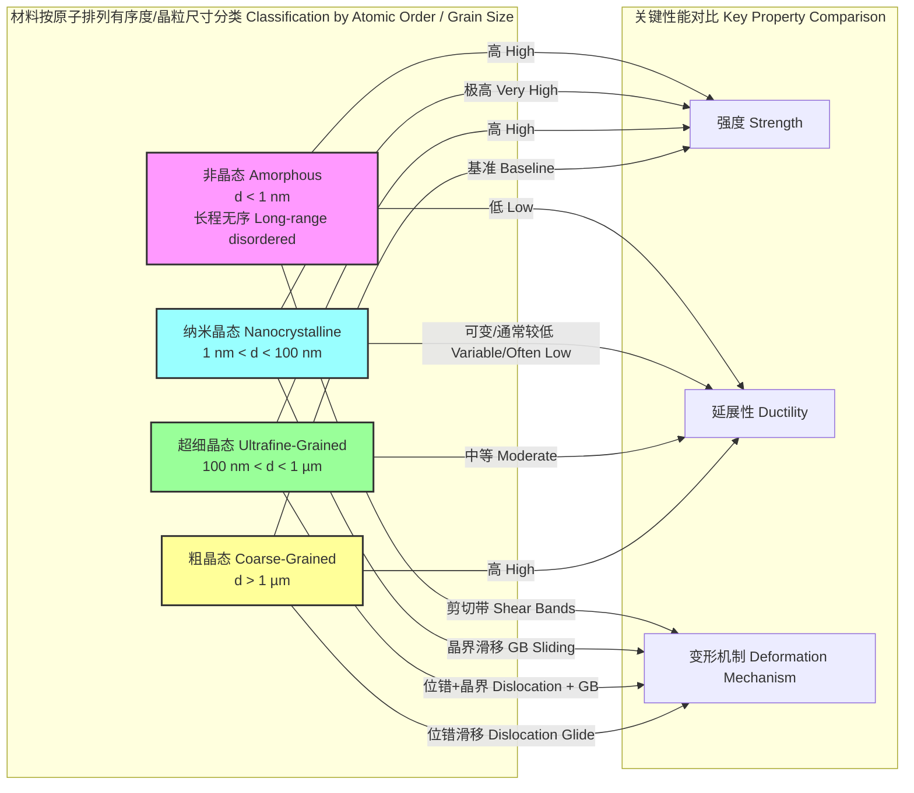

## 纳米晶态

纳米晶态 (Nanocrystalline State) 是指材料由纳米级（通常定义为晶粒尺寸小于100纳米）的晶粒构成的多晶固态结构。与传统的粗晶材料相比，纳米晶材料的一个显著特征是其内部含有极高体积分数的晶界及其他界面。这些界面原子排列不规则，其结构和性质与晶粒内部的原子截然不同，从而赋予了纳米晶材料一系列独特且优异的物理、化学和力学性能。

### 核心概念与数学基础

#### 晶界体积分数 (Volume Fraction of Grain Boundaries)

晶界体积分数是纳米晶材料的核心参数之一。我们可以通过一个简化的几何模型来估算它与晶粒尺寸的关系。假设晶粒为边长为 $d$ 的立方体，晶界厚度为 $\delta$。

每个立方体晶粒的体积为 $V_{grain} = d^3$。
一个立方体有6个面，每个面由两个晶粒共享，因此等效于每个晶粒拥有3个面的晶界。单个晶粒相关的晶界体积近似为 $V_{gb, single} \approx 3d^2\delta$。
因此，晶界所占的体积分数 $V_{gb}$ 可以表示为：

$$ V_{gb} = \frac{V_{gb, single}}{V_{grain}} \approx \frac{3d^2\delta}{d^3} = \frac{3\delta}{d} $$

其中：
*   $V_{gb}$：晶界体积分数 (无量纲)
*   $\delta$：晶界平均厚度 (通常约为 0.5 - 2 nm)
*   $d$：平均晶粒尺寸 (nm)

此公式表明，晶界体积分数与晶粒尺寸成反比。当晶粒尺寸从1微米减小到10纳米时，晶界体积分数会从约0.3%急剧增加到约30%。

#### Hall-Petch 关系 (Hall-Petch Relationship)

Hall-Petch关系描述了多晶材料的屈服强度随晶粒尺寸减小而增加的现象，这是由于晶界阻碍了位错运动。其数学表达式为：

$$ \sigma_y = \sigma_0 + k_y d^{-1/2} $$

其中：
*   $\sigma_y$：材料的屈服强度 (MPa)
*   $\sigma_0$：单晶的晶格摩擦应力，即位错在晶格内运动的固有阻力 (MPa)
*   $k_y$：Hall-Petch系数，是与材料相关的常数，表征晶界对位错运动的阻碍能力 (MPa·m1/2)
*   $d$：平均晶粒尺寸 (m)

对于纳米晶材料，由于 $d$ 非常小，$d^{-1/2}$ 项变得非常大，从而导致其强度远高于传统粗晶材料。

#### 反常 Hall-Petch 效应 (Inverse Hall-Petch Effect)

当晶粒尺寸减小到某一临界值（通常为10-20 nm）以下时，材料的强度不再继续增加，反而开始下降。这种现象被称为反常Hall-Petch效应或晶粒软化。这主要是因为变形机制发生了改变，从晶内位错运动主导转变为晶界主导的机制，如晶界滑移 (grain boundary sliding)、晶界扩散（Coble蠕变）或晶粒转动。

#### 热力学不稳定性 (Thermodynamic Instability)

纳米晶材料具有巨大的晶界面积，导致其拥有很高的过剩吉布斯自由能。单位体积的过剩自由能 $\Delta G_{gb}$ 可估算为：

$$ \Delta G_{gb} = \frac{\gamma_{gb} A_{gb}}{V_{total}} \approx \frac{3\gamma_{gb}}{d} $$

其中：
*   $\Delta G_{gb}$：单位体积的过剩吉布斯自由能 (J/m³)
*   $\gamma_{gb}$：单位面积的晶界能 (J/m²)
*   $d$：平均晶粒尺寸 (m)

这种高能量状态使得纳米晶材料在热力学上是不稳定的，在一定温度下（甚至室温）容易发生晶粒长大，从而丧失其独特性质。

---

### 关键技术规格

下表列出了纳米晶材料的一些典型技术规格。

| 参数 (Parameter) | 典型值范围 (Typical Value Range) | 单位 (Unit) | 备注 (Notes) |
| :--- | :--- | :--- | :--- |
| 平均晶粒尺寸 (Average Grain Size) | 1 – 100 | nm | 纳米晶态的核心定义 |
| 晶界体积分数 (GB Volume Fraction) | 5 – 50 | % | 随晶粒尺寸减小而急剧增加 |
| 维氏硬度 (Vickers Hardness) | 2 – 7 倍于粗晶对应物 | GPa | Hall-Petch效应的直接体现 |
| 屈服强度 (Yield Strength) | 3 – 8 倍于粗晶对应物 | MPa / GPa | 高于粗晶和超细晶材料 |
| 断裂伸长率 (Elongation to Failure) | 1 – 30 | % | 高度依赖于制备方法和微观结构 |
| 热稳定温度 (Thermal Stability Temp.) | 0.3 – 0.5 $T_m$ | K | $T_m$ 为材料的熔点 |

---

### 常见用例与性能指标

*   **高强度结构件**: 用于航空航天、汽车和国防领域，要求轻质高强。
    *   **性能指标**: 比强度 (Specific Strength) > 600 MPa/(g/cm³)。
*   **耐磨涂层**: 用于切削工具、轴承和模具表面，以提高使用寿命。
    *   **性能指标**: 磨损率 (Wear Rate) < $10^{-6}$ mm³/(N·m)；摩擦系数 (Coefficient of Friction) < 0.4。
*   **软磁材料**: 用于高频变压器铁芯、传感器和磁记录磁头。纳米化可以有效平均掉磁晶各向异性，获得优异的软磁性能。
    *   **性能指标**: 矫顽力 (Coercivity, $H_c$) < 10 A/m；高饱和磁化强度 (Saturation Magnetization, $B_s$) > 1.2 T；高磁导率 (Permeability, $\mu$)。
*   **催化剂**: 巨大的比表面积为化学反应提供了更多的活性位点。
    *   **性能指标**: 催化转换频率 (Turnover Frequency, TOF) > 10 s⁻¹。
*   **生物医用植入物**: 如人造关节和牙科植入物，具有优异的生物相容性、耐磨性和耐腐蚀性。
    *   **性能指标**: 细胞存活率 (Cell Viability) > 95%；腐蚀速率 (Corrosion Rate) < 0.01 mm/year。

---

### 实现考量：制备方法

纳米晶材料的制备方法可分为“自上而下”和“自下而上”两大类。

#### 剧烈塑性变形 (SPD) 的应变分析

以等通道转角挤压（ECAP）为例，其通过模具对材料施加巨大的剪切应变，从而细化晶粒。经过 $N$ 道次挤压后，材料累积的等效塑性应变 $\varepsilon_N$ 可近似计算：

$$ \varepsilon_N \approx N \frac{2 \cot(\Phi/2)}{\sqrt{3}} $$

其中：
*   $\varepsilon_N$：$N$ 道次后的等效塑性应变
*   $N$：挤压道次数
*   $\Phi$：模具内通道的转角 (通常为 90° 或 120°)

通过控制 $N$ 和 $\Phi$，可以精确调控材料的微观结构和最终性能，但其工艺复杂，难以制备大型或复杂形状的构件。

---

### 性能特征与统计度量

纳米晶材料的性能通常呈现出一定的分布，而非单一确定值。

#### 晶粒尺寸分布

实际材料中的晶粒尺寸并非均一，通常遵循对数正态分布 (Log-normal distribution)。其概率密度函数 (PDF) 为：

$$ f(d; \mu, \sigma) = \frac{1}{d\sigma\sqrt{2\pi}} \exp\left(-\frac{(\ln d - \mu)^2}{2\sigma^2}\right) $$

其中：
*   $d$：晶粒尺寸
*   $\mu$：$\ln(d)$ 的均值
*   $\sigma$：$\ln(d)$ 的标准差

晶粒尺寸的分布宽度对材料的宏观性能（如延展性）有重要影响。例如，一个具有双峰分布（bimodal distribution）的微观结构，即包含纳米晶粒和少量微米晶粒，有时可以同时实现高强度和良好的延展性。

#### 热稳定性与晶粒长大的动力学

热稳定性是纳米晶材料应用的关键瓶颈。在加热时，晶粒会发生长大以降低系统总的界面能。晶粒长大的动力学过程可以用以下经验公式描述：

$$ d^n - d_0^n = K t $$

其中：
*   $d$：在时间 $t$ 时的平均晶粒尺寸
*   $d_0$：初始平均晶粒尺寸
*   $n$：晶粒长大指数，取决于主要的原子输运机制 (通常为 2-4)
*   $K$：速率常数，强烈依赖于温度
*   $t$：时间

速率常数 $K$ 遵循阿伦尼乌斯关系 (Arrhenius relationship)：

$$ K = K_0 \exp\left(-\frac{Q}{RT}\right) $$

其中：
*   $K_0$：指前因子 (常数)
*   $Q$：晶粒长大的表观激活能 (J/mol)
*   $R$：理想气体常数 (8.314 J/(mol·K))
*   $T$：绝对温度 (K)

通过合金化或引入第二相粒子钉扎晶界，可以有效提高激活能 $Q$，从而提升纳米晶材料的热稳定性。例如，某纳米晶铜的硬度在 300°C (573 K) 时开始显著下降，而通过添加少量锆 (Zr) 形成的纳米析出物可以将其稳定温度提高到 500°C (773 K) 以上。

---

### 相关技术与比较模型

纳米晶态是材料结构谱系中的一环，与其他材料形态既有联系也有区别。

#### 与非晶态材料的比较

*   **结构**: 非晶态材料（金属玻璃）缺乏长程周期性结构，可以看作是晶粒尺寸的极限，即原子尺度。纳米晶材料则由明确的晶粒和晶界构成。
*   **X射线衍射 (XRD)**: 纳米晶材料的XRD图谱显示出因小晶粒尺寸而宽化的布拉格衍射峰。而非晶材料则显示为几个宽缓的弥散峰。
*   **谢乐公式 (Scherrer Equation)**: 对于纳米晶材料，平均晶粒尺寸 $\tau$ 可以通过衍射峰的宽度来估算：
    $$ \tau = \frac{K\lambda}{\beta \cos\theta} $$
    其中：
    *   $\tau$：垂直于衍射晶面的平均晶粒尺寸 (nm)
    *   $K$：谢乐常数 (通常取 0.9)
    *   $\lambda$：X射线波长 (nm)
    *   $\beta$：衍射峰的半高全宽 (FWHM)，需扣除仪器宽化 (弧度)
    *   $\theta$：布拉格衍射角 (弧度)
*   **力学性能**: 非晶合金通常具有比纳米晶材料更高的弹性极限和强度，但塑性变形能力非常有限，常表现为脆性断裂。

#### 与超细晶 (UFG) 材料的比较

超细晶材料（晶粒尺寸 100 nm - 1 µm）是连接纳米晶和传统粗晶材料的桥梁。它们的强度和硬度显著高于粗晶材料，且通常能保持比纳米晶材料更好的延展性。其力学行为仍然主要遵循Hall-Petch关系，变形机制是位错运动和晶界活动共同作用的结果。

---

### 参考文献

1.  Gleiter, H. (1989). Nanocrystalline materials. *Progress in Materials Science*, 33(4), 223-315. DOI: [10.1016/0079-6425(89)90001-7](https://doi.org/10.1016/0079-6425(89)90001-7)
2.  Meyers, M. A., Mishra, A., & Berbon, D. J. (2001). Mechanical properties of nanocrystalline materials. *Progress in Materials Science*, 46(1-2), 1-222. DOI: [10.1016/S0079-6425(00)00002-1](https://doi.org/10.1016/S0079-6425(00)00002-1)
3.  Koch, C. C., Ovid'ko, I. A., Seal, S., & Veprek, S. (2007). *Structural Nanocrystalline Materials: Fundamentals and Applications*. Cambridge University Press.
4.  Valiev, R. Z., & Langdon, T. G. (2006). Principles of equal-channel angular pressing as a processing tool for grain refinement. *Progress in Materials Science*, 51(7), 881-981. DOI: [10.1016/j.pmatsci.2006.02.003](https://doi.org/10.1016/j.pmatsci.2006.02.003)