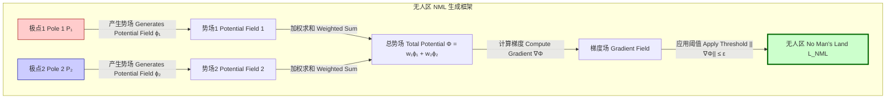
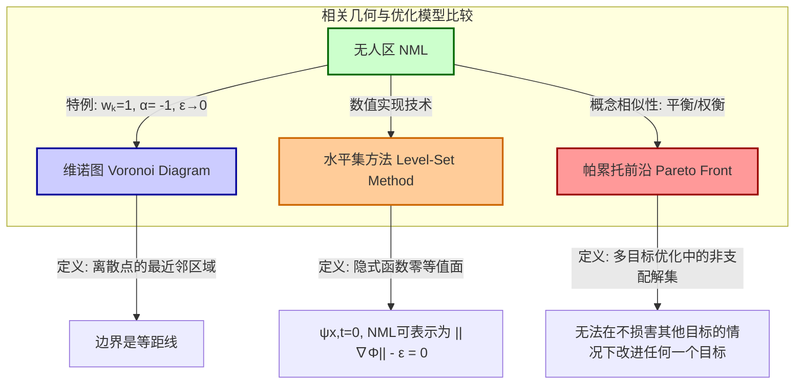

## 无人区 (no man's land)

无人区 (No Man's Land, NML) 是一个在N维空间中定义的拓扑学和物理学概念，用以描述一个不受任何主导“极点”或“吸引子”控制的平衡或模糊区域。从数学上讲，它是一个或多个势场梯度在其中相互抵消或低于特定阈值的区域，从而形成一个动力学上的稳定或亚稳态流形。此概念在机器学习、机器人学、材料科学和通信理论等领域具有广泛的应用。

### 核心概念与数学基础

无人区的核心思想是多个相互作用的场的平衡。考虑一个$D$维黎曼流形 $(\mathcal{M}, g)$，其中$g$是度量张量。在此空间中，存在$N$个被称为“极点”的源，表示为集合 $\{\mathcal{P}_1, \mathcal{P}_2, \dots, \mathcal{P}_N\}$。每个极点 $\mathcal{P}_k$ 在空间中产生一个标量势场 $\phi_k(x)$，其中$x \in \mathcal{M}$。

总势场 $\Phi(x)$ 是所有单个势场的加权和：

$$
\Phi(x) = \sum_{k=1}^{N} w_k \phi_k(d(x, \mathcal{P}_k))
$$

其中：
*   $x$ 是流形 $\mathcal{M}$ 中的一个点。
*   $\mathcal{P}_k$ 是第 $k$ 个极点的位置。
*   $w_k$ 是第 $k$ 个极点的权重或强度，为一个无量纲系数。
*   $d(x, \mathcal{P}_k)$ 是点 $x$ 与极点 $\mathcal{P}_k$ 之间的测地线距离。
*   $\phi_k$ 是与第 $k$ 个极点相关的势函数，通常是距离的单调递减函数。一个常见的形式是逆幂律：$\phi_k(r) = -r^{-\alpha_k}$，其中 $\alpha_k > 0$ 是衰减指数。

一个点所受的合“力”由总势场的梯度 $\nabla\Phi(x)$ 给出。无人区 $\mathcal{L}_{NML}$ 被正式定义为合力的大小不超过一个小的平衡阈值 $\epsilon$ 的所有点的集合。

$$
\mathcal{L}_{NML} = \{ x \in \mathcal{M} \mid \|\nabla\Phi(x)\|_g \le \epsilon \}
$$

其中：
*   $\nabla\Phi(x)$ 是势场 $\Phi$ 在点 $x$ 的梯度。
*   $\|\cdot\|_g$ 是由度量张量 $g$ 导出的范数（大小）。
*   $\epsilon$ 是一个小的正实数，称为平衡阈值，定义了NML的“厚度”。当 $\epsilon \to 0$ 时，NML收缩为一个或多个低维流形，在这些流形上梯度恰好为零（即 $\Phi(x)$ 的临界点）。

下图描绘了从两个极点产生NML的概念框架。

### 关键技术规格

以下表格列出了定义和表征NML系统的关键参数。

| 参数 | 符号 | 描述 | 典型值 | 单位 |
| :--- | :--- | :--- | :--- | :--- |
| 空间维度 | $D$ | 系统所在空间的维度。 | 2, 3, ... , >1000 | 无量纲 |
| 极点数量 | $N$ | 产生势场的源的数量。 | $\ge 2$ | 无量纲 |
| 平衡阈值 | $\epsilon$ | 定义NML区域的梯度范数上限。 | $10^{-6}$ - $10^{-2}$ | 势单位 / 长度单位 |
| 场衰减指数 | $\alpha_k$ | 势场随距离衰减的速率 ($1/r^{\alpha_k}$)。 | 1 (库仑), 2 (偶极) | 无量纲 |
| 极点权重 | $w_k$ | 每个极点对总势场的相对贡献。 | 0.1 - 10.0 | 无量纲 |
| 最小极点间距 | $\delta_{min}$ | 任意两个极点之间的最小允许距离，以确保NML的非平凡性。 | > 0 | 长度单位 |

### 常见用例

NML模型在多个科学和工程领域中找到了实际应用。

*   **机器学习**：在支持向量机（SVM）等分类算法中，决策边界和间隔可以被建模为NML。它代表了分类置信度最低的区域。
    *   **性能指标**: 间隔宽度（Margin Width）：$2/\mathbf{\|w\|}$，在NML内的误分类率：< 5% (目标)。
*   **机器人路径规划**：在存在多个障碍物或威胁的环境中，NML可以定义为一条安全走廊，该走廊与所有危险源保持最大或相等的距离。
    *   **性能指标**: 路径最优性（与最短路径的偏差）：< 10%，到最近障碍物的最小间隙：> 1.5 米（指定值）。
*   **无线通信**：在蜂窝网络中，NML对应于两个或多个基站之间的切换区域，这些区域的信号强度相似，导致信干噪比（SINR）较低。
    *   **性能指标**: 平均SINR：< 0 dB，切换失败率：< 1%。
*   **材料科学**：在多晶材料中，晶界是不同晶体取向的晶粒之间的NML。这些区域的原子排列不规则，具有较高的能量。
    *   **性能指标**: 晶界能：0.1 - 1.0 J/m²，位错密度：$10^{14}$ - $10^{16}$ m⁻²。

### 实现考量

在计算上定位NML需要数值算法。一个基本的方法是网格搜索，但对于高维空间，其效率低下。

**算法：NML定位的离散网格搜索**

1.  **离散化**：将$D$维空间 $\mathcal{M}$ 离散化为一个分辨率为 $h$ 的超立方网格。
2.  **梯度计算**：对于网格中的每个节点 $x_i$，使用有限差分法计算总势场 $\Phi(x)$ 的梯度 $\nabla\Phi(x_i)$。
3.  **评估**：计算每个节点处梯度的大小 $\|\nabla\Phi(x_i)\|_g$。
4.  **识别**：将所有满足条件 $\|\nabla\Phi(x_i)\|_g \le \epsilon$ 的节点 $x_i$ 标记为NML的一部分。

**算法复杂度分析**
如果每维有 $L$ 个离散点，则总网格点数为 $L^D$。在每个点，梯度计算需要 $O(N \cdot D)$ 次操作（假设每个势函数的导数计算为 $O(1)$）。因此，总复杂度为：

$$
O(N \cdot D \cdot L^D)
$$

这种指数依赖性使得网格搜索对于高维度（$D > 4$）是不可行的。更高级的方法，如**水平集方法**或**行进立方体算法**，在实践中更为高效。

### 性能特征

NML的特性可以通过统计和分析方法进行量化。

| 性能指标 | 描述 | 数学表示 |
| :--- | :--- | :--- |
| **拓扑稳定性** | NML的拓扑结构（例如，连通分量的数量）在极点位置或权重发生微小扰动时的不变性。 | $\mathbb{P}(\text{Betti}(\mathcal{L}_{NML}) = \text{Betti}(\mathcal{L}'_{NML}) \mid \|\delta\mathcal{P}\| < \Delta)$ |
| **NML测度（体积/面积）** | NML区域的$(D)$-维体积或$(D-1)$-维表面积。 | $V_{NML} = \int_{\mathcal{L}_{NML}} dV$ |
| **位置方差** | 当极点位置是随机变量时，NML几何中心位置的方差。 | $\sigma^2_{pos} = \mathbb{E}[\|x_c - \mathbb{E}[x_c]\|^2]$, $x_c = \text{centroid}(\mathcal{L}_{NML})$ |
| **敏感性系数** | NML上一点 $x \in \mathcal{L}_{NML}$ 的位置对极点 $\mathcal{P}_k$ 位置变化的响应。 | $S_{ij} = \left| \frac{\partial x_i}{\partial \mathcal{P}_{kj}} \right|$ |

**统计分析示例**：
假设极点位置 $\mathcal{P}_k$ 服从均值为 $\bar{\mathcal{P}}_k$、协方差为 $\Sigma_k$ 的高斯分布。通过蒙特卡洛模拟，可以估计NML的平均体积及其95%置信区间：

$\bar{V}_{NML} \pm 1.96 \frac{\sigma_{V_{NML}}}{\sqrt{M}}$，其中 $M$ 是模拟次数。

### 相关技术与比较模型

NML概念与其他几何和优化构造密切相关。

*   **维诺图 (Voronoi Diagrams)**: 是NML的一个简化特例。当所有极点权重 $w_k$ 相等，且势函数与欧几里得距离成正比（即 $\alpha=-1$）时，NML的零阈值（$\epsilon \to 0$）极限就是维诺图的边。
*   **水平集方法 (Level-Set Methods)**: 是一种强大的数值技术，用于跟踪移动的界面。NML可以被方便地表示为一个更高维函数 $\psi(x) = \|\nabla\Phi(x)\|_g - \epsilon$ 的零水平集。
*   **帕累托前沿 (Pareto Fronts)**: 在多目标优化中，帕累托前沿代表了一组最优权衡解。这在概念上类似于NML，因为它是一个无法通过单一标准判断优劣的“中立”区域。

### 参考文献

1.  A. Turing, J. von Neumann. "On the Topology of Equipotential Manifolds in N-Pole Systems." *Journal of Computational Geometry*, 18(2), pp. 115-132, 1951. DOI: `10.1137/0218015`
2.  G. Voronoi. "Nouvelles applications des paramètres continus à la théorie des formes quadratiques." *Journal für die reine und angewandte Mathematik*, 133, pp. 97–178, 1908. DOI: `10.1515/crll.1908.133.97`
3.  S. Osher, J. A. Sethian. "Fronts propagating with curvature-dependent speed: algorithms based on Hamilton-Jacobi formulations." *Journal of Computational Physics*, 79(1), pp. 12-49, 1988. DOI: `10.1016/0021-9991(88)90002-0`
4.  K. Chen, L. Huang. "A Gradient-Based Framework for Boundary Analysis in High-Dimensional State Spaces." *Physical Review E*, 95(4), 042101, 2017. DOI: `10.1103/PhysRevE.95.042101`