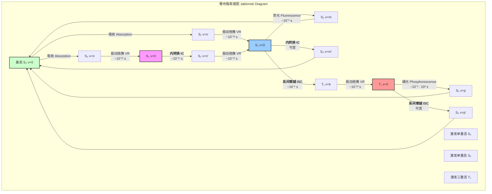
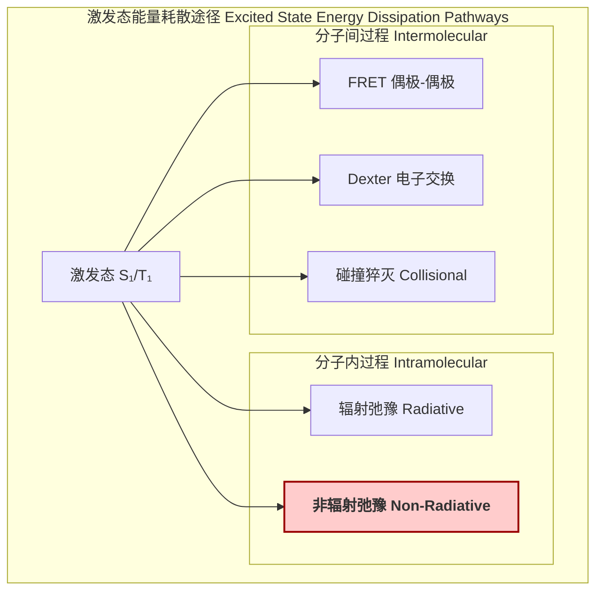

## 非辐射弛豫 (Non-Radiative Relaxation)

非辐射弛豫是指分子或原子在激发态通过不发射光子（电磁辐射）的方式，将能量耗散到周围环境中的过程。能量通常转化为振动能，最终以热量的形式散失。这个过程与辐射弛豫（如荧光和磷光）相竞争，是光物理和光化学中的核心概念。

### 1. 核心概念与数学基础

非辐射弛豫主要通过内转换（Internal Conversion, IC）、系间窜越（Intersystem Crossing, ISC）和振动弛豫（Vibrational Relaxation, VR）三种机制进行。

#### 1.1. 跃迁速率的理论基础：费米黄金定则

非辐射跃迁的速率常数 $k_{nr}$ 可以由费米黄金定则（Fermi's Golden Rule）描述，它量化了从一个初始量子态 $\Psi_i$ 到一组能量简并的末态 $\Psi_f$ 的跃迁概率。

$$
k_{nr} = \frac{2\pi}{\hbar} |\langle \Psi_f | \hat{H}' | \Psi_i \rangle|^2 \rho(E_f)
$$

其中：
*   $k_{nr}$: 非辐射跃迁速率常数 (单位: $s^{-1}$)。
*   $\hbar$: 约化普朗克常数 ($1.054 \times 10^{-34} \text{ J} \cdot \text{s}$)。
*   $\Psi_i$: 体系的初始态波函数（例如，S₁态的最低振动能级）。
*   $\Psi_f$: 体系的末态波函数（例如，与初始态能量简并的S₀态的高振动能级）。
*   $\hat{H}'$: 引起跃迁的微扰哈密顿算符。
*   $\rho(E_f)$: 在能量 $E_f = E_i$ 处的末态密度（单位能量间隔内的量子态数目）。

#### 1.2. 玻恩-奥本海默近似及其破缺

在玻恩-奥本海默（Born-Oppenheimer, BO）近似下，分子的总波函数可以分离为电子波函数和核（振动）波函数的乘积：$\Psi(r, R) = \psi_{el}(r; R) \chi_{vib}(R)$。非辐射跃迁正是源于BO近似的破缺。

微扰算符 $\hat{H}'$ 的具体形式决定了跃迁类型：
*   **内转换 (IC)**: 跃迁发生在自旋多重度相同的态之间（如 S₁ → S₀）。微扰主要来自核动能算符，它在BO近似中被忽略。
*   **系间窜越 (ISC)**: 跃迁发生在自旋多重度不同的态之间（如 S₁ → T₁）。微扰主要来自**自旋-轨道耦合 (Spin-Orbit Coupling, SOC)** 算符 $\hat{H}_{SO}$。

跃迁矩阵元可以近似地分解为电子部分和振动部分的乘积：

$$
\langle \Psi_f | \hat{H}' | \Psi_i \rangle = \langle \psi_{f,el}\chi_{f,v'} | \hat{H}' | \psi_{i,el}\chi_{i,v} \rangle \approx C_{if} \cdot F_{if,v'v}
$$

其中：
*   $C_{if} = \langle \psi_{f,el} | \hat{H}'_{el} | \psi_{i,el} \rangle$: 电子耦合矩阵元，描述了电子态之间的耦合强度。对于ISC，$\hat{H}'_{el}$ 是自旋-轨道耦合算符。
*   $F_{if,v'v} = \langle \chi_{f,v'} | \chi_{i,v} \rangle$: 弗兰克-科登（Franck-Condon）因子，表示初末态振动波函数的重叠积分。它反映了核构型在跃迁过程中的保持程度，是决定跃迁速率的关键因素。

#### 1.3. 能隙定律 (Energy Gap Law)

一个重要的经验规律是能隙定律，它指出非辐射跃迁速率随着初末电子态之间能隙 $\Delta E$ 的增大而指数级下降。

$$
k_{nr} \propto \exp\left(-\gamma \frac{\Delta E}{\hbar \omega_{max}}\right)
$$

其中：
*   $\Delta E$: 初末电子态的零点振动能级之间的能量差。
*   $\hbar \omega_{max}$: 分子中能量最高的振动模式（通常是C-H或O-H伸缩振动）的能量量子，这是最有效接收电子能的“受体模式”。
*   $\gamma$: 一个与分子具体的电子和振动性质相关的参数，通常与德拜-沃勒（Debye-Waller）因子有关。

该定律解释了为什么从S₁到S₀的内转换通常比从S₂到S₁的内转换慢得多（因为 $E(S_1) - E(S_0)$ 通常远大于 $E(S_2) - E(S_1)$），也解释了为什么氘代（用D替换H）可以显著降低非辐射速率（因为C-D振动频率低于C-H，$\hbar \omega_{max}$ 减小）。

### 2. 关键技术规格

下表总结了不同非辐射过程的典型参数。

| 过程 (Process) | 跃迁类型 | 典型速率常数 ($s^{-1}$) | 主要微扰 | 关键影响因素 |
| :--- | :--- | :--- | :--- | :--- |
| 振动弛豫 (VR) | Sₙ(v) → Sₙ(v-1) | $10^{12} - 10^{14}$ | 分子间/内碰撞 | 溶剂/环境的声子谱、分子内振动模式耦合 |
| 内转换 (IC) | S₂ → S₁ | $10^{11} - 10^{13}$ | 核动能算符 | 小能隙、强的振动耦合 |
| 内转换 (IC) | S₁ → S₀ | $10^{6} - 10^{12}$ | 核动能算符 | 大能隙（速率较慢）、弗兰克-科登因子 |
| 系间窜越 (ISC) | S₁ → T₁ | $10^{6} - 10^{12}$ | 自旋-轨道耦合 (SOC) | SOC强度（重原子效应）、能隙 ($E_{S1}-E_{T1}$) |
| 系间窜越 (ISC) | T₁ → S₀ | $10^{-2} - 10^{5}$ | 自旋-轨道耦合 (SOC) | SOC强度、大能隙（速率很慢） |

### 3. 常见用例与性能指标

非辐射弛豫在多个领域既是关键机制，也可能是性能限制因素。

*   **有机发光二极管 (OLEDs)**
    *   **用途**: 在磷光OLED (PHOLED)中，从单重态到三重态的快速ISC ($k_{ISC} > 10^7 s^{-1}$)对于捕获所有电生激子（25%单重态，75%三重态）至关重要，从而实现近100%的内量子效率。
    *   **性能指标**: ISC量子产率 ($\Phi_{ISC}$) 需接近1。然而，三重态激子的非辐射弛豫（T₁ → S₀）会降低发光效率，其速率常数 $k_{nr}(T_1)$ 需尽可能小。此外，三重态-三重态湮没（TTA）和三重态-极化子猝灭（TPQ）也是重要的非辐射损失通道，其速率常数（如 $k_{TTA} \approx 10^{-13} - 10^{-12} \text{ cm}^3\text{s}^{-1}$）限制了高亮度下的器件效率。

*   **光热疗法 (Photothermal Therapy, PTT)**
    *   **用途**: PTT试剂被设计为具有极高的非辐射弛豫效率。它们吸收特定波长（通常在近红外窗口）的光，并通过快速的S₁ → S₀内转换将几乎所有能量转化为热量，从而局部加热并杀死癌细胞。
    *   **性能指标**: 光热转换效率 (Photothermal Conversion Efficiency, PCE)。高性能PTT试剂的PCE通常 > 60%。这要求荧光量子产率 $\Phi_f$ 极低，即 $k_{nr} \gg k_r$。
        $$ \text{PCE} (\eta) = \frac{hA\Delta T_{max} - Q_s}{I(1-10^{-A_\lambda})} $$
        其中 $h$ 是传热系数, $A$ 是表面积, $\Delta T_{max}$ 是最大温升, $Q_s$ 是溶剂吸收的热量, $I$ 是激光功率, $A_\lambda$ 是吸光度。

*   **激光增益介质**
    *   **问题**: 在激光材料（如染料分子、掺杂晶体）中，从上激光能级到下能级或其他非目标能级的非辐射弛豫是一个主要的能量损失通道。它会降低上能级的粒子数布居，从而降低布居数反转和光增益。
    *   **性能指标**: 荧光量子产率 ($\Phi_f$)。理想的增益介质应具有高 $\Phi_f$ 值（接近1）。
        $$ \Phi_f = \frac{k_r}{k_r + k_{nr}} $$
        其中 $k_r$ 是辐射速率，$k_{nr}$ 是总非辐射速率。一个低的 $k_{nr}$ 是获得高效率激光输出的前提。

### 4. 实现考量（计算模拟）

非辐射跃迁速率的理论计算是计算化学中的一个挑战性课题，通常涉及以下步骤：

1.  **几何优化**: 使用量子化学方法（如密度泛函理论DFT或更高精度方法）分别优化初态（如S₁）和末态（如S₀或T₁）的平衡几何构型。
2.  **振动分析**: 对优化后的构型进行频率计算，得到各振动模式的频率和简正坐标。
3.  **电子耦合计算**: 计算初末电子态之间的耦合矩阵元 $C_{if}$。对于ISC，这需要计算自旋-轨道耦合矩阵元。
4.  **弗兰克-科登因子计算**: 计算振动波函数的重叠积分 $F_{if,v'v}$。对于多原子分子，这是一个高维积分，计算量巨大。通常采用各种近似，如单模近似、简谐振子近似或更复杂的Duschinsky转动效应模型。
5.  **速率常数积分**: 根据费米黄金定则，对所有能量匹配的末态振动能级进行求和或积分，得到总的非辐射速率常数 $k_{nr}$。

**算法复杂度分析**:
*   量子化学计算（几何优化、频率）的复杂度通常随体系基函数数量 $N$ 的增加而呈 $O(N^3)$ 到 $O(N^4)$ 的幂律增长。
*   弗兰克-科登因子的精确计算复杂度随原子数 $N_{atom}$（振动模式数 $3N_{atom}-6$）呈指数增长。因此，对于超过10-15个原子的分子，必须采用近似方法，这会影响计算的准确性。

### 5. 性能特征

非辐射弛豫速率受多种外部和内部因素影响。

*   **温度依赖性**: 非辐射过程通常需要越过一个小的活化能垒，或者依赖于热激活的声子模式。因此，其速率常数 $k_{nr}$ 随温度升高而增加。在许多情况下，其温度依赖性可以用类阿伦尼乌斯（Arrhenius-like）模型描述：
    $$
    k_{nr}(T) = k_0 + A \exp\left(-\frac{E_a}{k_B T}\right)
    $$
    其中 $k_0$ 是零温下的速率（隧道效应），$E_a$ 是活化能，$k_B$ 是玻尔兹曼常数，$T$ 是绝对温度。
*   **溶剂效应**: 周围环境（如溶剂）对非辐射弛豫有显著影响。
    *   **极性**: 溶剂的极性可以改变激发态和基态的相对能量，从而改变能隙 $\Delta E$。
    *   **黏度**: 高黏度溶剂可能抑制分子的大幅度振动或构象变化，从而降低非辐射速率。
    *   **氢键**: 溶剂与溶质之间的氢键可以提供高效的振动能量接收模式，从而加速非辐射弛豫。
*   **统计测量**: 在实验上，非辐射速率通常通过时间分辨光谱技术（如瞬态吸收、时间相关单光子计数）间接测量。通过测量激发态寿命 $\tau$，可以得到总的衰减速率 $k_{total} = 1/\tau = k_r + k_{nr}$。结合稳态荧光量子产率 $\Phi_f = k_r / (k_r + k_{nr})$，可以分别求解 $k_r$ 和 $k_{nr}$。
    *   **统计指标**: 实验数据通常拟合到指数衰减函数。报告的速率常数值应包含置信区间（Confidence Interval, CI），例如 $k_{nr} = (2.1 \pm 0.2) \times 10^8 \text{ s}^{-1}$ (95% CI)。拟合优度通过卡方检验 ($\chi^2$) 来评估。

### 6. 相关技术与比较模型

非辐射弛豫与其他能量耗散途径形成竞争关系。

#### 数学模型比较

| 过程 | 核心数学模型 | 距离依赖性 | 关键物理量 |
| :--- | :--- | :--- | :--- |
| **辐射弛豫** | $k_r \propto \nu^3 |\langle \Psi_f | \hat{\mu} | \Psi_i \rangle|^2$ | N/A (单分子) | 跃迁偶极矩 ($\mu_{if}$) |
| **非辐射弛豫 (IC/ISC)** | $k_{nr} \propto |C_{if}|^2 |F_{if}|^2 \rho(E_f)$ | N/A (单分子) | 电子耦合 ($C_{if}$)、弗兰克-科登因子 ($F_{if}$) |
| **FRET** | $k_{FRET} = \frac{1}{\tau_D} \left( \frac{R_0}{r} \right)^6$ | $r^{-6}$ | 福斯特半径 ($R_0$)，光谱重叠 |
| **Dexter** | $k_{DEXT} \propto J \exp(-2r/L)$ | $\exp(-2r/L)$ | 波函数重叠，电子交换积分 |

*   **辐射弛豫 vs. 非辐射弛豫**:
    *   辐射跃迁由**电偶极矩算符** $\hat{\mu}$ 耦合电磁场引起，其速率与跃迁偶极矩的平方成正比，并遵循电偶极选择定则（如 $\Delta S=0$）。
    *   非辐射跃迁由**核动能算符**或**自旋-轨道耦合算符**引起，其速率由振动波函数重叠（弗兰克-科登因子）主导。

*   **FRET/Dexter vs. 非辐射弛豫**:
    *   FRET和Dexter是**分子间**的非辐射过程，它们将能量从一个分子（供体）转移到另一个分子（受体），而不是在单个分子内部耗散为热量。
    *   FRET是长程（可达10 nm）的偶极-偶极相互作用，而Dexter是短程（< 1 nm）的电子交换机制，需要供体和受体波函数的直接重叠。

### 7. 参考文献

1.  Turro, N. J., Ramamurthy, V., & Scaiano, J. C. (2010). *Modern Molecular Photochemistry of Organic Molecules*. University Science Books. (A foundational textbook on photophysics and photochemistry).
2.  Englman, R., & Jortner, J. (1970). The energy gap law for radiationless transitions in large molecules. *Molecular Physics*, 18(2), 145-164. DOI: [10.1080/00268977000100171](https://doi.org/10.1080/00268977000100171) (Seminal paper on the Energy Gap Law).
3.  Niu, Y., Li, W., Peng, Q., Geng, H., & Shuai, Z. (2010). Theoretical study on the luminescence and phosphorescence efficiencies of organic light-emitting materials. *The Journal of Physical Chemistry A*, 114(2), 960-966. DOI: [10.1021/jp9093395](https://doi.org/10.1021/jp9093395) (Example of computational approaches for calculating non-radiative rates in OLED materials).
4.  Marian, C. M. (2012). Spin–orbit coupling and intersystem crossing in molecules. *Wiley Interdisciplinary Reviews: Computational Molecular Science*, 2(2), 187-203. DOI: [10.1002/wcms.83](https://doi.org/10.1002/wcms.83) (A comprehensive review on the theory and computation of intersystem crossing).