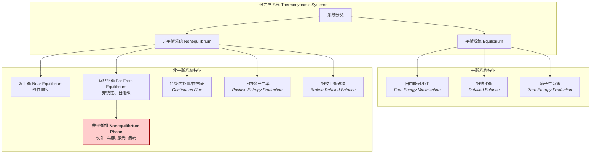

## 非平衡相

非平衡相是指在远离热力学平衡条件下，由持续的能量、物质或信息流维持的宏观有序或稳定的物质状态。与由自由能最小化原理决定的平衡相（如固相、液相、气相）不同，非平衡相的稳定性和结构是由系统内部的动力学过程与外部驱动之间的复杂相互作用决定的。这些相的特征是持续的熵产生、时间反演对称性破缺以及通常违反涨落-耗散定理。

### 1. 核心概念与数学基础

#### 1.1 热力学平衡 vs. 非平衡

*   **热力学平衡 (Thermodynamic Equilibrium)**：一个孤立系统或与恒温热库接触的系统，在长时间演化后达到的宏观性质不随时间变化的状态。其微观特征是**细致平衡 (Detailed Balance)**，即任何微观过程与其逆过程的速率相等。系统由少数几个状态函数（如温度 $T$、压强 $P$、体积 $V$）描述，其宏观相由相应的热力学势（如自由能 $F$）最小化确定。

*   **非平衡 (Nonequilibrium)**：系统受到外部驱动，存在能量流、粒子流或信息流穿过系统边界。这导致系统无法达到热力学平衡。
    *   **近平衡区 (Near Equilibrium)**：驱动较弱，系统对驱动的响应是线性的。例如，傅里叶热传导定律。
    *   **远非平衡区 (Far From Equilibrium)**：驱动很强，系统响应是非线性的，可以自发组织形成复杂的时空结构，即**非平衡相**。

#### 1.2 熵产生

在非平衡定态 (Nonequilibrium Steady State, NESS) 中，系统的宏观性质不随时间变化，但内部持续有能量耗散。总熵变率 $\dot{S}_{tot}$ 大于零，由系统熵变率 $\dot{S}_{sys}$ 和环境熵变率 $\dot{S}_{env}$ 组成。对于定态，$\dot{S}_{sys}=0$，因此所有熵产生都在环境中。

熵产生率 $\dot{S}_i$ 可以表示为广义热力学流 $J_j$ 与其共轭的广义力 $X_j$ 的乘积之和：
$$
\dot{S}_i = \sum_j J_j X_j \ge 0
$$
其中：
*   $J_j$: 第 $j$ 种广义流（如热流、粒子流、化学反应速率）。
*   $X_j$: 第 $j$ 种广义力（如温度梯度、化学势梯度、化学亲和势）。
在非平衡相中，至少存在一个非零的流和一个非零的力，使得 $\dot{S}_i > 0$。

#### 1.3 数学描述：福克-普朗克方程

非平衡系统的动力学通常是随机的，其状态由概率分布函数 $P(\mathbf{x}, t)$ 描述，其演化遵循福克-普朗克方程 (Fokker-Planck Equation)：
$$
\frac{\partial P(\mathbf{x}, t)}{\partial t} = -\sum_i \frac{\partial}{\partial x_i} [A_i(\mathbf{x}) P(\mathbf{x}, t)] + \sum_{i,j} \frac{\partial^2}{\partial x_i \partial x_j} [D_{ij}(\mathbf{x}) P(\mathbf{x}, t)]
$$
其中：
*   $P(\mathbf{x}, t)$: 在时刻 $t$ 系统处于状态 $\mathbf{x}$ 的概率密度。
*   $A_i(\mathbf{x})$: 漂移矢量，描述了系统状态的确定性演化部分。
*   $D_{ij}(\mathbf{x})$: 扩散张量，描述了系统状态的随机涨落部分，与噪声强度有关。

在非平衡定态下，$\frac{\partial P}{\partial t} = 0$，但概率流 $J_p = A P - \nabla \cdot (D P)$ 通常不为零，这体现了细致平衡的破缺。



### 2. 关键技术规格

非平衡相的特征由一系列控制参数和序参量来表征，而非固定的材料常数。

| 参数 (Parameter) | 符号 (Symbol) | 描述 (Description) | 典型值/范围 (Typical Value/Range) | 单位 (Units) |
| :--- | :---: | :--- | :--- | :--- |
| 能量注入率 (Energy Injection Rate) | $\dot{E}_{in}$ | 单位时间内注入系统的能量，用于维持非平衡状态。 | $10^{-15} - 10^6$ | W (瓦特) |
| 控制参数 (Control Parameter) | $r$ | 外部可调的、驱动系统发生相变的参数（如温度梯度、泵浦功率）。 | 无量纲或特定单位 | - |
| 序参量 (Order Parameter) | $\Phi$ | 描述相的宏观有序程度的物理量。在无序相中为零，在有序相中非零。 | $0 \le \Phi \le 1$ | 无量纲 |
| 关联长度 (Correlation Length) | $\xi$ | 描述系统中物理量涨落的空间关联范围。在相变点附近发散。 | $10^{-9} - 10^3$ | m (米) |
| 弛豫时间 (Relaxation Time) | $\tau$ | 系统受到微小扰动后恢复到定态所需的时间。 | $10^{-12} - 10^4$ | s (秒) |
| 熵产生率 (Entropy Production Rate) | $\dot{S}_i$ | 单位时间内由于不可逆过程产生的熵。 | $> 0$ | J K⁻¹ s⁻¹ |

### 3. 常见用例与性能指标

#### 3.1 活性物质 (Active Matter)

*   **描述**: 由消耗能量并进行自主运动的粒子组成的系统，如鸟群、鱼群、细菌悬浮液。
*   **非平衡相**: 集体运动的“群集相”(flocking phase)。
*   **数学模型**: Vicsek模型是经典的agent-based模型。
*   **性能指标**:
    *   **极化序参量 (Polarization Order Parameter)**:
        $$ \Phi = \frac{1}{N v_0} \left| \sum_{i=1}^N \mathbf{v}_i \right| $$
        其中 $N$ 是粒子数，$\mathbf{v}_i$ 是粒子 $i$ 的速度，$v_0$ 是其速率。对于随机运动，$\Phi \approx 0$；对于完美对齐的群集，$\Phi = 1$。
    *   **巨数涨落 (Giant Number Fluctuations)**: 在一个子区域内，粒子数的标准差 $\sigma_N$ 与平均数 $\langle N \rangle$ 的关系为 $\sigma_N \sim \langle N \rangle^\alpha$，$\alpha > 1/2$ (通常 $\alpha \approx 0.8$)，远超平衡理想气体的泊松分布 ($\alpha = 1/2$)。

#### 3.2 图样形成 (Pattern Formation)

*   **描述**: 在流体、化学反应或材料中，当外部驱动超过某个阈值时，均匀状态失稳，形成规则的空间结构。
*   **非平衡相**: Rayleigh-Bénard对流中的对流元胞（滚筒状或六边形）。
*   **控制参数**: 瑞利数 (Rayleigh number) $Ra$，一个无量纲数，表示浮力与耗散力的比值。
*   **性能指标**:
    *   **临界瑞利数 ($Ra_c$)**: 系统从导热状态转变为对流状态的阈值。对于标准边界条件，$Ra_c \approx 1708$。
    *   **努塞尔特数 (Nusselt number) $Nu$**: 对流传热与纯导热的效率之比。$Nu = 1$ 表示纯导热；$Nu > 1$ 表示对流发生，其值随 $Ra$ 的增加而增加。

#### 3.3 激光 (Lasers)

*   **描述**: 通过受激辐射产生和放大相干光的过程。
*   **非平衡相**: 激光阈值之上的相干光输出状态。
*   **控制参数**: 泵浦功率 (Pump Power) $P_{pump}$。
*   **性能指标**:
    *   **激光阈值 ($P_{th}$)**: 产生激光所需的最小泵浦功率。低于阈值时，光源为非相干的自发辐射；高于阈值时，为相干的受激辐射。
    *   **相干长度 ($L_c$)**: 光束保持其相干性的距离。激光的相干长度可达数公里，而普通光源仅为微米量级。

### 4. 实现考量（数值模拟）

模拟非平衡相通常需要直接求解其动力学方程。

| 算法/方法 | 描述 | 算法复杂度 |
| :--- | :--- | :--- |
| **基于智能体的模型 (Agent-Based Models)** | 模拟大量个体（如Vicsek模型中的鸟）的相互作用。每个时间步更新每个智能体的状态。 | $O(N^2)$ (朴素算法) <br> $O(N \log N)$ 或 $O(N)$ (使用空间划分，如k-d树或网格) |
| **朗之万动力学 (Langevin Dynamics)** | 通过求解随机微分方程来模拟粒子轨迹，适用于活性布朗粒子(ABP)等。 | $O(N_{steps} \times N)$，其中 $N_{steps}$ 是时间步数，N是粒子数。 |
| **求解偏微分方程 (PDE Solvers)** | 对于连续场模型（如Swift-Hohenberg方程），使用有限差分、有限元或谱方法求解。 | 复杂度依赖于网格大小和方法，例如谱方法为 $O(M \log M)$，其中M是网格点数。|

#### 活性布朗粒子 (Active Brownian Particle, ABP) 的朗之万方程

一个典型的ABP模型描述如下：
$$
\gamma \frac{d\mathbf{r}_i}{dt} = v_0 \mathbf{n}_i(t) - \sum_{j \neq i} \nabla_i U(\mathbf{r}_{ij}) + \sqrt{2D_t \gamma^2} \boldsymbol{\eta}_i(t)
$$
$$
\frac{d\mathbf{n}_i}{dt} = \sqrt{2D_r} \boldsymbol{\xi}_i(t) \times \mathbf{n}_i(t)
$$
其中：
*   $\mathbf{r}_i$: 粒子 $i$ 的位置。
*   $\gamma$: 摩擦系数。
*   $v_0$: 自驱动速率。
*   $\mathbf{n}_i(t)$: 粒子 $i$ 的方向矢量，一个单位矢量。
*   $U(\mathbf{r}_{ij})$: 粒子间的相互作用势（如WCA势）。
*   $D_t = k_B T / \gamma$: 平动扩散系数，$T$ 是环境温度。
*   $\boldsymbol{\eta}_i(t)$: 均值为零、方差为1的高斯白噪声。
*   $D_r$: 转动扩散系数。
*   $\boldsymbol{\xi}_i(t)$: 另一个独立的、均值为零的高斯白噪声。

### 5. 性能特征与统计度量

非平衡相的涨落行为与平衡系统有显著区别。

*   **涨落-耗散定理的违背 (Violation of Fluctuation-Dissipation Theorem, FDT)**: 在平衡态，系统对微小扰动的响应函数与自发涨落的关联函数之间存在一个简单的比例关系（FDT）。在非平衡相中，这个关系通常被打破。可以定义一个**有效温度 (Effective Temperature)** $T_{eff}$，它依赖于所观察的自由度和时间/空间尺度，并且通常不等于环境的热力学温度。
*   **非高斯分布 (Non-Gaussian Distributions)**: 许多宏观量的概率分布不再是高斯分布。例如，活性物质中的速度分量或流体中的速度梯度可以表现出具有重尾（fat tails）的分布。这些分布可以通过高阶矩来表征：
    *   **偏度 (Skewness)**: 度量分布的不对称性。
    *   **峰度 (Kurtosis)**: 度量分布的尾部厚度。
*   **长程关联 (Long-Range Correlations)**: 即使相互作用是短程的，非平衡相也可以展现出代数衰减的长程空间关联。例如，在二维不可压缩的活性流体中，速度-速度关联函数 $C(r) = \langle \mathbf{v}(\mathbf{x}) \cdot \mathbf{v}(\mathbf{x}+\mathbf{r}) \rangle$ 随距离 $r$ 的衰减非常缓慢。

### 6. 相关技术与比较

```mermaid
graph TD
    subgraph "相变理论框架 Frameworks for Phase Transitions"
        A["平衡相变 Equilibrium Phase Transition<br>例如: 铁磁性"]
        B["非平衡相变 Nonequilibrium Phase Transition<br>例如: 鸟群行为"]
    end

    subgraph "平衡理论 Equilibrium Theory"
        A --> A1["基本原理: 自由能最小化<br><i>Principle: Free Energy Minimization</i>"];
        A --> A2["数学模型: 朗道理论 Landau Theory<br>$$ F[\phi] = \int d^d x \left[ aT-T_c\phi^2 + b\phi^4 + c\nabla\phi^2 \right] $$"];
        A --> A3["动力学: 时间依赖的Ginzburg-Landau方程<br>$$ \partial_t \phi = -\Gamma \frac\delta F\delta \phi $$"];
        A --> A4["对称性: 时间反演对称<br><i>Time-Reversal Symmetry</i>"];
    end

    subgraph "非平衡理论 Nonequilibrium Theory"
        B --> B1["基本原理: 动力学稳定性/分岔<br><i>Principle: Dynamical Stability / Bifurcation</i>"];
        B --> B2["数学模型: 动力学方程<br>例如: Swift-Hohenberg 方程<br>$$ \partial_t \psi = [r - q_c^2 + \nabla^2^2]\psi - \psi^3 $$"];
        B --> B3["动力学: 本身就是动力学方程<br><i>Inherently Dynamical</i>"];
        B --> B4["对称性: 时间反演对称性破缺<br><i>Broken Time-Reversal Symmetry</i>"];
    end

    style A fill:#cceeff,stroke:#003366
    style B fill:#ffcccc,stroke:#990000
```

#### 数学模型对比

*   **平衡相变 (朗道理论)**:
    $$ F[\phi] = \int d^d x \left[ \frac{a}{2}(T-T_c)\phi^2 + \frac{b}{4}\phi^4 + \frac{c}{2}(\nabla\phi)^2 \right] $$
    描述了一个标量序参量 $\phi$ 的自由能泛函。相变发生在 $T=T_c$ 时，此时 $\phi=0$ 的解失稳。动力学描述了系统如何弛豫到自由能最小的状态。

*   **非平衡相变 (Swift-Hohenberg 方程)**:
    $$ \partial_t \psi(\mathbf{x},t) = \left[ r - (q_c^2 + \nabla^2)^2 \right] \psi - \psi^3 $$
    这是一个描述图样形成的唯象模型。
    *   $\psi(\mathbf{x},t)$: 描述系统偏离均匀状态的序参量（如对流中的温度场）。
    *   $r$: 控制参数（类似于 $T_c-T$）。
    *   $q_c$: 决定了所形成图样的特征波数（波长）。
    *   $\nabla^2$: 拉普拉斯算子。
    当 $r>0$ 时，均匀解 $\psi=0$ 失稳，系统演化到具有空间周期性（波数约为 $q_c$）的条纹或六边形图样。这个方程不对应于任何自由能的梯度流，体现了其非平衡的本质。

### 7. 参考文献

*   Cross, M. C., & Hohenberg, P. C. (1993). Pattern formation outside of equilibrium. *Reviews of Modern Physics*, 65(3), 851–1112. DOI: [10.1103/RevModPhys.65.851](https://doi.org/10.1103/RevModPhys.65.851)
*   Toner, J., & Tu, Y. (1995). Long-Range Order in a Two-Dimensional Dynamical XY Model: How Birds Fly Together. *Physical Review Letters*, 75(23), 4326–4329. DOI: [10.1103/PhysRevLett.75.4326](https://doi.org/10.1103/PhysRevLett.75.4326)
*   Marchetti, M. C., Joanny, J. F., Ramaswamy, S., Liverpool, T. B., Prost, J., Rao, M., & Simha, R. A. (2013). Hydrodynamics of soft active matter. *Reviews of Modern Physics*, 85(3), 1143–1189. DOI: [10.1103/RevModPhys.85.1143](https://doi.org/10.1103/RevModPhys.85.1143)
*   Seifert, U. (2012). Stochastic thermodynamics, fluctuation theorems and molecular machines. *Reports on Progress in Physics*, 75(12), 126001. DOI: [10.1088/0034-4885/75/12/126001](https://doi.org/10.1088/0034-4885/75/12/126001)