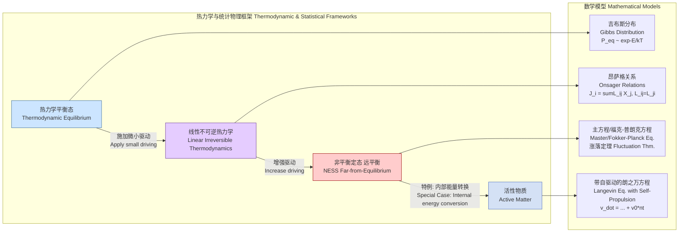

## 非平衡定态

非平衡定态（Nonequilibrium Stationary State, NESS）是统计物理学和热力学中的一个核心概念，用于描述一类特殊的物理状态。在这种状态下，系统的宏观性质（如温度、密度、压强）不随时间变化，但系统内部存在持续的物质、能量或信息的净通量。这与热力学平衡态形成了鲜明对比，在平衡态中，所有净通量均为零。

NESS 的存在依赖于系统与外部环境的持续相互作用，例如通过施加恒定的温度梯度、电场或化学势差。这些外部驱动力维持着系统偏离平衡，并导致持续的熵产生。

### 核心概念与数学基础

#### 1. 定义与区分

*   **热力学平衡态 (Thermodynamic Equilibrium)**: 一个孤立或与恒温热源接触的系统，在长时间演化后达到的状态。其特征是**细致平衡（Detailed Balance）**，即任何微观过程与其逆过程的发生速率完全相等，导致所有宏观净通量为零。
*   **非平衡定态 (NESS)**: 一个开放系统，在外部恒定驱动下达到的稳定状态。其宏观量不随时间改变，但存在非零的净通量。其特征是**细致平衡被破坏**，但流入和流出任何一个微观状态的总概率流相等，即满足**全局平衡（Global Balance）**。

```mermaid
graph TD
    subgraph "系统状态分类 System State Classification"
        A[系统状态] --> B["是否存在净通量? Net Flux?[";
        B -- "否 No" --> C[热力学平衡态<br>Thermodynamic Equilibrium];
        B -- "是 Yes" --> D["宏观量是否随时间恒定? Macroscopic variables constant?[";
        D -- "是 Yes" --> E[非平衡定态<br>Nonequilibrium Stationary State NESS];
        D -- "否 No" --> F[瞬态/弛豫过程<br>Transient/Relaxation Process];

        C -- "特征: 细致平衡<br>Property: Detailed Balance" --> G[熵产生率为零<br>Zero Entropy Production];
        E -- "特征: 破坏细致平衡<br>Property: Broken Detailed Balance" --> H[持续正的熵产生<br>Continuous Positive Entropy Production];
    end

    style C fill:#cce5ff,stroke:#336699
    style E fill:#ffcccc,stroke:#990000
    style F fill:#fff2cc,stroke:#cc9900
```

#### 2. 数学框架：主方程

对于一个由离散微观状态 $\mathbf{x}$ 描述的随机系统，其概率分布 $P(\mathbf{x}, t)$ 的时间演化由主方程（Master Equation）决定：

$$
\frac{d P(\mathbf{x}, t)}{dt} = \sum_{\mathbf{x}' \neq \mathbf{x}} [W(\mathbf{x}|\mathbf{x}')P(\mathbf{x}', t) - W(\mathbf{x}'|\mathbf{x})P(\mathbf{x}, t)]
$$

其中：
*   $P(\mathbf{x}, t)$: 系统在时刻 $t$ 处于微观状态 $\mathbf{x}$ 的概率。
*   $W(\mathbf{x}'|\mathbf{x})$: 系统从状态 $\mathbf{x}$ 跃迁到状态 $\mathbf{x}'$ 的单位时间跃迁速率。

在定态下，概率分布不随时间变化，即 $\frac{d P_{ss}(\mathbf{x})}{dt} = 0$。这导出了定态条件（全局平衡）：

$$
\sum_{\mathbf{x}' \neq \mathbf{x}} W(\mathbf{x}|\mathbf{x}')P_{ss}(\mathbf{x}') = \left( \sum_{\mathbf{x}' \neq \mathbf{x}} W(\mathbf{x}'|\mathbf{x}) \right) P_{ss}(\mathbf{x})
$$

这表示在定态 $P_{ss}$ 下，流入任意状态 $\mathbf{x}$ 的总概率通量等于流出该状态的总概率通量。

#### 3. 概率流与熵产生

定义从状态 $\mathbf{x}'$ 到 $\mathbf{x}$ 的净概率流（Probability Current）为：

$$
J(\mathbf{x}, \mathbf{x}') = W(\mathbf{x}|\mathbf{x}')P_{ss}(\mathbf{x}') - W(\mathbf{x}'|\mathbf{x})P_{ss}(\mathbf{x})
$$

*   在**平衡态**下，细致平衡条件 $W(\mathbf{x}|\mathbf{x}')P_{eq}(\mathbf{x}') = W(\mathbf{x}'|\mathbf{x})P_{eq}(\mathbf{x})$ 成立，因此对于任意状态对 $(\mathbf{x}, \mathbf{x}')$，都有 $J_{eq}(\mathbf{x}, \mathbf{x}') = 0$。
*   在**非平衡定态**下，至少存在一对状态 $(\mathbf{x}, \mathbf{x}')$ 使得 $J_{ness}(\mathbf{x}, \mathbf{x}') \neq 0$。这表明在状态空间中存在持续的概率环流。

NESS 的一个根本特征是持续的熵产生。总熵产生率 $\sigma$ 可以表示为：

$$
\sigma = k_B \sum_{\mathbf{x}, \mathbf{x}'} J(\mathbf{x}, \mathbf{x}') \ln \frac{W(\mathbf{x}|\mathbf{x}')}{W(\mathbf{x}'|\mathbf{x})} = \frac{k_B}{2} \sum_{\mathbf{x}, \mathbf{x}'} \left[ W(\mathbf{x}|\mathbf{x}')P_{ss}(\mathbf{x}') - W(\mathbf{x}'|\mathbf{x})P_{ss}(\mathbf{x}) \right] \ln \frac{W(\mathbf{x}|\mathbf{x}')P_{ss}(\mathbf{x}')}{W(\mathbf{x}'|\mathbf{x})P_{ss}(\mathbf{x})} \ge 0
$$

其中：
*   $k_B$: 玻尔兹曼常数 ($1.380649 \times 10^{-23}$ J/K)。
*   $\sigma > 0$ 是 NESS 的标志，而 $\sigma = 0$ 仅在平衡态下成立。

### 关键技术规格

下表以一维热传导为例，展示了表征 NESS 的关键物理量。

| 参数 (Parameter) | 符号 (Symbol) | 定义 (Definition) | 典型值 (Typical Value) | 单位 (Unit) |
| :--- | :--- | :--- | :--- | :--- |
| 热力学力 (Thermodynamic Force) | $\nabla T$ | 系统两端的温度梯度 | $10^2 - 10^4$ | K/m |
| 宏观通量 (Macroscopic Flux) | $J_q$ | 单位面积通过的热流 | $10^3 - 10^6$ | W/m² |
| 响应系数 (Response Coefficient) | $\kappa$ | 热导率 (Thermal Conductivity) | $10 - 400$ (for metals) | W/(m·K) |
| 熵产生率 (Entropy Production Rate) | $\sigma$ | 单位时间单位体积产生的熵 | $> 0$, 依赖于 $J_q$ 和 $\nabla T$ | W/(m³·K) |
| 弛豫时间 (Relaxation Time) | $\tau_{relax}$ | 系统达到定态所需的时间 | $10^{-12} - 10^{-9}$ (phonons) | s |

**关系**: 傅里叶热传导定律 $J_q = -\kappa \nabla T$ 是线性响应区域内 NESS 的一个宏观描述。熵产生率密度为 $\sigma = J_q \cdot \nabla(1/T) \approx \kappa (\nabla T)^2 / T^2 > 0$。

### 常见用例与性能指标

| 用例 (Use Case) | 描述 (Description) | 关键性能指标 (Quantitative Performance Metrics) |
| :--- | :--- | :--- |
| **生物细胞 (Biological Cells)** | 细胞通过消耗ATP维持离子浓度梯度，进行主动运输，是典型的NESS。 | 离子通量: $10^7$ ions/s (通过单个通道) <br> ATP消耗率: $\sim 10^{-18}$ mol/s (单个分子马达) |
| **热电器件 (Thermoelectric Devices)** | 利用塞贝克效应，在温差下产生电压，形成电流。 | 功率因子: $S^2 \sigma_e$ (S: Seebeck系数, $\sigma_e$: 电导率) <br> 品质因数 (ZT): $S^2 \sigma_e T / \kappa$ |
| **剪切流体 (Sheared Fluids)** | 在两块平行板之间施加恒定剪切应力，流体达到稳定的速度梯度分布。 | 剪切速率: $\dot{\gamma}$ (s⁻¹) <br> 表观粘度: $\eta = \tau_{xy} / \dot{\gamma}$ (Pa·s) |
| **化学恒化器 (Chemostat)** | 反应物持续流入反应器，产物和混合物持续流出，维持恒定的化学反应速率。 | 稀释率: $D$ (h⁻¹) <br> 稳态底物浓度: $S_{ss}$ (mol/L) |

### 实现考量与算法分析

在计算上模拟 NESS 通常涉及对底层随机过程的仿真，直至系统达到统计上的定态。

#### 随机模拟算法 (Gillespie 算法)

Gillespie 算法（或称随机模拟算法, SSA）是精确模拟主方程描述的化学或物理过程的标准方法。

**算法步骤**:
1.  **初始化**: 设置系统初始状态 $\mathbf{x}_0$ 和时间 $t=0$。
2.  **计算倾向函数 (Propensities)**: 对 $M$ 个可能的跃迁通道 $R_j$，计算其倾向函数 $a_j(\mathbf{x}) = c_j h_j(\mathbf{x})$，其中 $c_j$ 是速率常数，$h_j(\mathbf{x})$ 是反应物数量的组合。
3.  **计算总倾向**: $a_{tot}(\mathbf{x}) = \sum_{j=1}^{M} a_j(\mathbf{x})$。
4.  **生成随机数**: 从均匀分布 $U(0,1)$ 中抽取两个随机数 $r_1$ 和 $r_2$。
5.  **确定下一个事件的时间**: 时间增量 $\Delta t = \frac{1}{a_{tot}(\mathbf{x})} \ln(\frac{1}{r_1})$。
6.  **确定下一个事件的类型**: 找到索引 $\mu$ 使得 $\sum_{j=1}^{\mu-1} a_j(\mathbf{x}) < r_2 a_{tot}(\mathbf{x}) \le \sum_{j=1}^{\mu} a_j(\mathbf{x})$。
7.  **更新系统**: 根据发生的事件 $R_\mu$ 更新系统状态 $\mathbf{x} \to \mathbf{x}'$，并更新时间 $t \to t + \Delta t$。
8.  **循环**: 重复步骤 2-7。

**算法复杂度**:
*   **时间复杂度**: 每一步的标准实现是 $O(M)$，其中 $M$ 是跃迁通道的数量。使用依赖图等优化方法可降至 $O(\log M)$。
*   **空间复杂度**: $O(N)$，其中 $N$ 是系统组分的数量。

**达到定态**: 模拟需要运行足够长的时间（“burn-in”阶段）以消除初始瞬态效应，之后的数据才可用于计算 NESS 的系综平均值。

### 性能特征与统计度量

NESS 中的可观测量围绕其平均值波动，这些波动包含了系统动力学的重要信息。

*   **涨落定理 (Fluctuation Theorems)**: 这是非平衡统计物理学的里程碑式成果。例如，Gallavotti-Cohen 涨落对称性（针对 NESS）指出，在长时间极限下，熵产生率 $\sigma_\tau$ 在时间 $\tau$ 内的平均值的概率分布满足：
    $$
    \lim_{\tau \to \infty} \frac{1}{\tau} \ln \frac{P(\sigma_\tau = A)}{P(\sigma_\tau = -A)} = A
    $$
    这个定理意味着，观察到熵减少的“违背热力学第二定律”的轨迹虽然极其罕见，但其概率与熵增加的轨迹通过一个普适的指数关系联系在一起。

*   **统计量**:
    *   **均值**: $\langle O \rangle_{ss} = \int O(\mathbf{x}) P_{ss}(\mathbf{x}) d\mathbf{x}$
    *   **方差**: $\text{Var}(O) = \langle O^2 \rangle_{ss} - \langle O \rangle_{ss}^2$
    *   **时间相关函数**: $C_{AB}(t) = \langle A(t) B(0) \rangle_{ss} - \langle A \rangle_{ss} \langle B \rangle_{ss}$。在 NESS 中，涨落-耗散定理（Fluctuation-Dissipation Theorem）的经典形式通常不成立，其修正形式包含了对细致平衡破坏的度量。

*   **置信区间**: 在模拟中，一个可观测量 $O$ 的均值估计 $\bar{O}$ 的置信区间（如 95% CI）通常由 $\bar{O} \pm 1.96 \frac{s}{\sqrt{N_{eff}}}$ 给出，其中 $s$ 是样本标准差，$N_{eff}$ 是考虑了数据时间相关性后的有效样本数。

### 相关技术与数学模型比较



*   **热力学平衡态**: 由吉布斯-玻尔兹曼分布描述，$P_{eq}(\mathbf{x}) \propto e^{-E(\mathbf{x})/(k_B T)}$。系统处于自由能最低点，熵产生率为零。
*   **线性不可逆热力学**: 描述接近平衡的系统。通量 $J_i$ 与热力学力 $X_j$ 呈线性关系，$J_i = \sum_j L_{ij} X_j$。输运系数矩阵 $L$ 满足昂萨格倒易关系 $L_{ij} = L_{ji}$。
*   **远非平衡定态**: 当驱动力很大时，线性关系失效。系统由非线性的动力学方程（如主方程或非线性福克-普朗克方程）描述。昂萨格关系不再成立，但更普适的涨落定理依然有效。
*   **活性物质**: NESS 的一个重要子领域。系统由许多消耗能量并将其转化为定向运动的“活性”粒子组成。其噪声来源不仅有热涨落，还有粒子自身活动产生的“活性噪声”，导致了丰富的集体行为，如集群和涌现。

### References

1.  Seifert, U. (2012). Stochastic thermodynamics, fluctuation theorems and molecular machines. *Reports on Progress in Physics*, 75(12), 126001. [DOI: 10.1088/0034-4885/75/12/126001](https://doi.org/10.1088/0034-4885/75/12/126001)
2.  Gillespie, D. T. (1977). Exact stochastic simulation of coupled chemical reactions. *The Journal of Physical Chemistry*, 81(25), 2340–2361. [DOI: 10.1021/j100540a008](https://doi.org/10.1021/j100540a008)
3.  Gallavotti, G., & Cohen, E. G. D. (1995). Dynamical Ensembles in Nonequilibrium Statistical Mechanics. *Physical Review Letters*, 74(14), 2694–2697. [DOI: 10.1103/PhysRevLett.74.2694](https://doi.org/10.1103/PhysRevLett.74.2694)
4.  Jarzynski, C. (2011). Equalities and inequalities: Irreversibility and the second law of thermodynamics at the nanoscale. *Annual Review of Condensed Matter Physics*, 2(1), 329–351. [DOI: 10.1146/annurev-conmatphys-062910-140506](https://doi.org/10.1146/annurev-conmatphys-062910-140506)