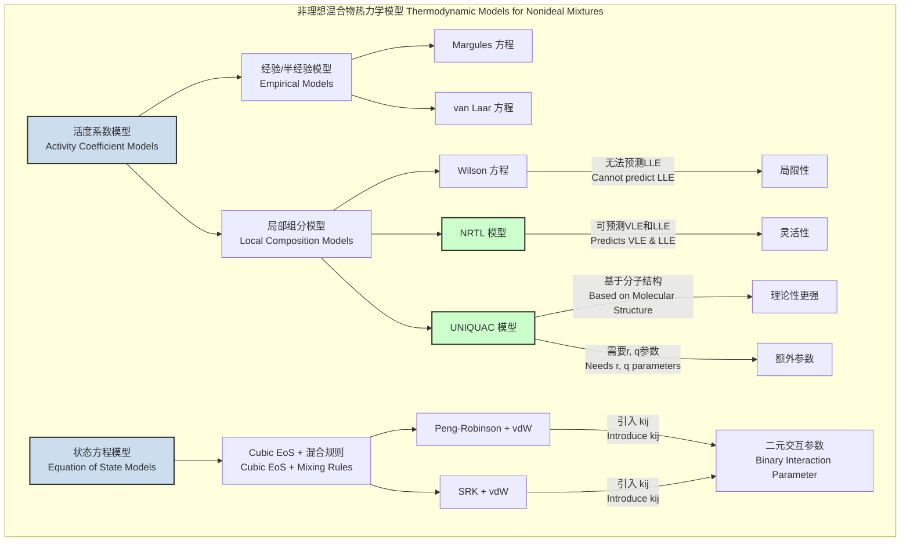
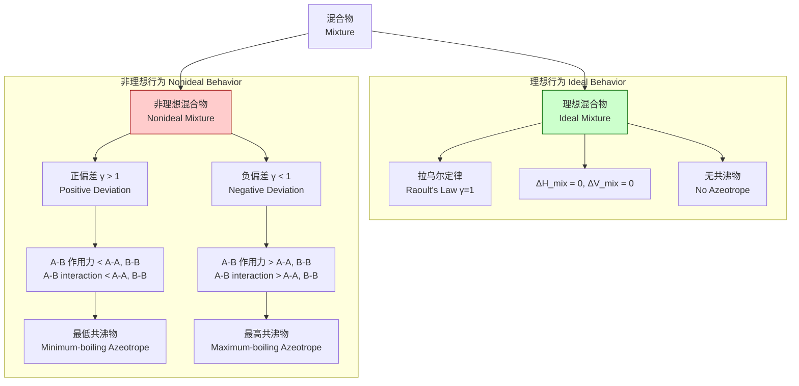

## 非理想混合物

非理想混合物（Nonideal Mixture）是指其热力学性质偏离理想混合物行为的混合物。在理想混合物中，不同组分分子间的相互作用力与同种组分分子间的相互作用力是完全相同的。然而，在现实世界中，绝大多数混合物都是非理想的，因为不同分子间的吸引力或排斥力（如范德华力、氢键）的大小和性质各不相同。这种非理想性对化学工程中的相平衡计算，特别是蒸馏、萃取和结晶等分离过程的设计与优化，具有至关重要的影响。

### 1. 核心概念与数学基础

非理想性的核心在于描述组分在混合物中的“有效浓度”或“有效压力”，这通过引入活度（Activity）和活度系数（Activity Coefficient）来实现。

#### 1.1 理想混合物与拉乌尔定律（Raoult's Law）

对于一个理想的液相混合物，其上方蒸气相中组分 $i$ 的分压 $p_i$ 遵循拉乌尔定律：

$$
p_i = x_i p_i^{\text{sat}}
$$

其中：
*   $p_i$ 是组分 $i$ 在气相中的分压。
*   $x_i$ 是组分 $i$ 在液相中的摩尔分数。
*   $p_i^{\text{sat}}$ 是纯组分 $i$ 在相同温度下的饱和蒸气压。

#### 1.2 非理想混合物与修正拉乌尔定律

对于非理想混合物，组分间的相互作用力导致其行为偏离拉乌尔定律。为了量化这种偏离，引入了活度系数 $\gamma_i$。修正的拉乌尔定律表示为：

$$
p_i = a_i p_i^{\text{sat}} = (\gamma_i x_i) p_i^{\text{sat}}
$$

其中：
*   $a_i$ 是组分 $i$ 在液相中的**活度**（Activity），代表其有效摩尔分数。
*   $\gamma_i$ 是组分 $i$ 的**活度系数**（Activity Coefficient），是一个无量纲的修正因子。
    *   如果 $\gamma_i > 1$，表示**正偏差**（Positive Deviation）。这意味着组分 $i$ 的分子更倾向于“逃离”液相，因为异种分子间的吸引力（A-B）弱于同种分子间的平均吸引力（A-A, B-B）。这通常会导致形成**最低共沸物**。
    *   如果 $\gamma_i < 1$，表示**负偏差**（Negative Deviation）。这意味着异种分子间的吸引力（A-B）强于同种分子间的平均吸引力（A-A, B-B），分子被更强地束缚在液相中。这通常会导致形成**最高共沸物**。
    *   如果 $\gamma_i = 1$，混合物在该组分和浓度下表现为理想行为。

#### 1.3 超额吉布斯自由能 ($G^E$)

超额吉布斯自由能是衡量混合物非理想程度的关键热力学函数。它定义为真实混合物的吉布斯自由能与同温度、同压力、同组成的理想混合物的吉布斯自由能之差。

$$
G^E = G_{\text{real}} - G_{\text{ideal}}
$$

$G^E$ 与活度系数直接相关：

$$
\frac{G^E}{RT} = \sum_{i=1}^{N} x_i \ln \gamma_i
$$

其中：
*   $G^E$ 是单位摩尔的超额吉布斯自由能 (J/mol)。
*   $R$ 是理想气体常数 (8.314 J/(mol·K))。
*   $T$ 是绝对温度 (K)。
*   $N$ 是混合物中的组分总数。

反之，活度系数可以通过对总超额吉布斯自由能求偏导数得到：

$$
\ln \gamma_i = \left[ \frac{\partial (n_T G^E / RT)}{\partial n_i} \right]_{T, P, n_{j \neq i}}
$$

其中 $n_T$ 是总摩尔数，$n_i$ 是组分 $i$ 的摩尔数。

#### 1.4 吉布斯-杜亥姆方程（Gibbs-Duhem Equation）

对于一个二元体系，在恒温恒压下，活度系数必须满足吉布斯-杜亥姆方程，这是热力学一致性的一个重要检验：

$$
\sum_{i=1}^{N} x_i d(\ln \gamma_i) = 0 \quad (\text{常数 T, P})
$$

对于二元体系，它简化为：

$$
x_1 \frac{d(\ln \gamma_1)}{dx_1} + x_2 \frac{d(\ln \gamma_2)}{dx_1} = 0
$$

### 2. 关键技术规格

下表总结了理想与非理想混合物在混合过程中的热力学性质变化。

| 属性 (Property) | 符号 (Symbol) | 理想混合物 (Ideal Mixture) | 非理想混合物 (Nonideal Mixture) | 单位 (Unit) |
| :--- | :---: | :--- | :--- | :---: |
| 混合焓 (Enthalpy of Mixing) | $\Delta H_{\text{mix}}$ | $0$ | $\Delta H_{\text{mix}} = H^E \neq 0$ | J/mol |
| 混合体积 (Volume of Mixing) | $\Delta V_{\text{mix}}$ | $0$ | $\Delta V_{\text{mix}} = V^E \neq 0$ | m³/mol |
| 混合熵 (Entropy of Mixing) | $\Delta S_{\text{mix}}$ | $-R \sum x_i \ln x_i$ | $-R \sum x_i \ln x_i + S^E$ | J/(mol·K) |
| 混合吉布斯自由能 | $\Delta G_{\text{mix}}$ | $RT \sum x_i \ln x_i$ | $RT \sum x_i \ln x_i + G^E$ | J/mol |

其中，$H^E$, $V^E$, $S^E$, 和 $G^E$ 分别是超额焓、超额体积、超额熵和超额吉布斯自由能。

### 3. 常见用例与量化性能指标

非理想混合物模型在化工分离领域有广泛应用。

*   **精馏分离 (Distillation Separation)**
    *   **应用**: 预测汽液平衡（VLE）数据，设计精馏塔。非理想性决定了是否会形成共沸物（Azeotrope），从而限制了普通精馏的分离极限。
    *   **量化指标**:
        *   **共沸点**: 例如，乙醇-水体系在1 atm下，于约95.6%（质量分数）乙醇处形成最低共沸物，共沸温度为78.15°C。活度系数模型必须能准确预测此点。
        *   **相对挥发度 ($\alpha_{ij}$)**: $\alpha_{ij} = \frac{y_i/x_i}{y_j/x_j} = \frac{\gamma_i p_i^{\text{sat}}}{\gamma_j p_j^{\text{sat}}}$。$\alpha_{ij}$ 的变化范围决定了分离的难易程度。当 $\alpha_{ij}=1$ 时，形成共沸物，无法通过普通精馏分离。

*   **液-液萃取 (Liquid-Liquid Extraction)**
    *   **应用**: 当精馏不可行时（如分离共沸物或热敏性物质），可采用萃取。非理想性导致液体分层（液液平衡, LLE）。NRTL、UNIQUAC等模型能够预测互溶区和分配系数。
    *   **量化指标**:
        *   **分配系数 (Distribution Coefficient, $K_D$)**: $K_D = \frac{C_{\text{extract}}}{C_{\text{raffinate}}}$，其中 $C$ 是溶质在萃取相和萃余相中的浓度。$K_D$ 的值受活度系数强烈影响，直接决定萃取效率。一个好的萃取剂应使 $K_D \gg 1$。

*   **结晶与溶解度 (Crystallization & Solubility)**
    *   **应用**: 预测药物或化学品在单一或混合溶剂中的溶解度。固液平衡（SLE）本质上是一个高度非理想的系统。
    *   **量化指标**:
        *   **溶解度 (Solubility, $x_s$)**: 固体溶质在溶剂中的摩尔分数。理论模型（如UNIFAC或活度系数模型）预测的溶解度与实验值的偏差是衡量模型性能的关键。例如，预测值与实验值误差在±10%以内被认为是高质量的预测。

### 4. 实现考量与算法复杂度

在实际应用中，活度系数模型的参数（如NRTL的二元交互参数）通常需要通过拟合实验数据（如VLE, LLE, $H^E$数据）来确定。

*   **参数拟合算法**:
    1.  **目标函数定义**: 定义一个目标函数（Objective Function, OF），通常是模型计算值与实验值之间的残差平方和（Sum of Squared Residuals, SSR）。
        $$
        \text{OF} = \sum_{k=1}^{M} \left( (P_{k, \text{exp}} - P_{k, \text{calc}})^2 + (y_{1,k,\text{exp}} - y_{1,k,\text{calc}})^2 \right)
        $$
        其中 $M$ 是数据点总数，$P$ 是压力，$y_1$ 是气相摩尔分数。
    2.  **数值优化**: 使用非线性优化算法（如Levenberg-Marquardt、Nelder-Mead单纯形法）来最小化目标函数，从而获得最佳的模型参数。
    3.  **热力学一致性检验**: 使用吉布斯-杜亥姆方程对拟合结果进行检验。

*   **算法复杂度**:
    *   对于一个包含 $N$ 个组分的体系，计算一次所有组分的活度系数，对于大多数基于局部组成概念的模型（如NRTL, UNIQUAC），其计算复杂度为 $O(N^2)$，因为它们依赖于对所有二元组分对 $(i, j)$ 的交互作用进行求和。
    *   参数拟合过程是迭代的，总复杂度为 $O(I \cdot M \cdot N^2)$，其中 $I$ 是优化算法的迭代次数，$M$ 是实验数据点的数量。

### 5. 性能特征与统计度量

模型的优劣通过其预测值与实验数据的吻合程度来评估。

*   **常用统计指标**:
    *   **平均绝对偏差 (Average Absolute Deviation, AAD)**:
        $$ \text{AAD}(\%)_Y = \frac{100}{M} \sum_{k=1}^{M} \left| \frac{Y_{k, \text{exp}} - Y_{k, \text{calc}}}{Y_{k, \text{exp}}} \right| $$
        其中 $Y$ 可以是压力、温度或摩尔分数。在VLE拟合中，压力AAD < 1% 和气相摩尔分数AAD < 0.01（或1%）通常被认为是高质量的拟合。
    *   **均方根误差 (Root Mean Square Error, RMSE)**:
        $$ \text{RMSE}_Y = \sqrt{\frac{1}{M} \sum_{k=1}^{M} (Y_{k, \text{exp}} - Y_{k, \text{calc}})^2} $$
        RMSE对较大的误差更为敏感。
    *   **决定系数 ($R^2$)**: 衡量模型解释数据变异性的能力，值越接近1越好。

*   **参数不确定性**:
    *   通过优化算法得到的模型参数（如NRTL的 $\Delta g_{12}, \Delta g_{21}$）本身具有不确定性。这种不确定性可以通过计算参数的**置信区间 (Confidence Intervals)** 来量化，这对于评估模型的鲁棒性和预测精度至关重要。

### 6. 相关技术与数学模型比较

多种活度系数模型被开发出来以适应不同类型的非理想混合物。

#### 6.1 Margules 方程

一个简单的多项式模型，适用于简单、非极性或弱极性体系。双参数形式如下：

$$
\frac{G^E}{RT} = x_1 x_2 (A_{21} x_1 + A_{12} x_2)
$$

由此可得活度系数：
$$
\ln \gamma_1 = x_2^2 [A_{12} + 2(A_{21} - A_{12})x_1]
$$
$$
\ln \gamma_2 = x_1^2 [A_{21} + 2(A_{12} - A_{21})x_2]
$$

其中 $A_{12}$ 和 $A_{21}$ 是通过实验数据拟合的二元交互参数。

#### 6.2 NRTL (Non-Random Two-Liquid) 模型

NRTL是基于局部组分概念的强大模型，能同时处理汽液平衡（VLE）和液液平衡（LLE）。

$$
\ln \gamma_i = \frac{\sum_{j=1}^{N} x_j \tau_{ji} G_{ji}}{\sum_{k=1}^{N} x_k G_{ki}} + \sum_{j=1}^{N} \frac{x_j G_{ij}}{\sum_{k=1}^{N} x_k G_{kj}} \left( \tau_{ij} - \frac{\sum_{m=1}^{N} x_m \tau_{mj} G_{mj}}{\sum_{k=1}^{N} x_k G_{kj}} \right)
$$

其中：
*   $G_{ij} = \exp(-\alpha_{ij} \tau_{ij})$
*   $\tau_{ij} = \frac{g_{ij} - g_{jj}}{RT} = \frac{\Delta g_{ij}}{RT}$
*   $\Delta g_{ij}$ 是二元交互能量参数 (J/mol)，是模型的核心拟合参数。通常 $\Delta g_{ij} \neq \Delta g_{ji}$。
*   $\alpha_{ij}$ 是非随机性参数，反映了局部组分的非随机分布。通常 $\alpha_{ij} = \alpha_{ji}$，对于特定类型的混合物可以设定为常数（如0.2, 0.3, 0.47）。

#### 6.3 UNIQUAC (Universal Quasi-Chemical) 模型

UNIQUAC模型将活度系数分为两部分：组合项（Combinatorial）和残基项（Residual）。

$$
\ln \gamma_i = \ln \gamma_i^C + \ln \gamma_i^R
$$

*   **组合项 $\ln \gamma_i^C$**: 主要考虑分子大小和形状的差异，与能量无关。它由纯组分的体积参数 $r_i$ 和表面积参数 $q_i$ 计算得出。
    $$
    \ln \gamma_i^C = \ln\left(\frac{\Phi_i}{x_i}\right) + \frac{z}{2} q_i \ln\left(\frac{\theta_i}{\Phi_i}\right) + L_i - \frac{\Phi_i}{x_i} \sum_{j=1}^{N} x_j L_j
    $$
*   **残基项 $\ln \gamma_i^R$**: 主要考虑分子间的相互作用能。其形式类似于NRTL，也包含二元交互参数。
    $$
    \ln \gamma_i^R = q_i \left[1 - \ln\left(\sum_{j=1}^{N} \theta_j \tau_{ji}\right) - \sum_{j=1}^{N} \frac{\theta_j \tau_{ij}}{\sum_{k=1}^{N} \theta_k \tau_{kj}}\right]
    $$
    其中 $\theta_i$ 是表面积摩尔分数，$\Phi_i$ 是体积分数，$\tau_{ij} = \exp(-u_{ij}/RT)$ 是二元交互能量参数。

UNIQUAC的优势在于其半理论基础，并且其扩展模型UNIFAC可以通过分子结构基团贡献法来预测没有实验数据体系的活度系数。

#### 6.4 概念关系图

下图展示了非理想性如何导致与理想行为的偏差以及共沸物的形成。

### 7. 参考文献

1.  Renon, H., & Prausnitz, J. M. (1968). Local compositions in thermodynamic excess functions for liquid mixtures. *AIChE Journal*, 14(1), 135-144. DOI: [10.1002/aic.690140124](https://doi.org/10.1002/aic.690140124) (The original paper for the NRTL model).
2.  Abrams, D. S., & Prausnitz, J. M. (1975). Statistical thermodynamics of liquid mixtures: A new expression for the excess Gibbs energy of partly or completely miscible systems. *AIChE Journal*, 21(1), 116-128. DOI: [10.1002/aic.690210115](https://doi.org/10.1002/aic.690210115) (The original paper for the UNIQUAC model).
3.  Poling, B. E., Prausnitz, J. M., & O'Connell, J. P. (2001). *The Properties of Gases and Liquids* (5th ed.). McGraw-Hill. (A comprehensive reference for thermodynamic models and physical property data).
4.  Smith, J. M., Van Ness, H. C., & Abbott, M. M. (2018). *Introduction to Chemical Engineering Thermodynamics* (8th ed.). McGraw-Hill. (A standard textbook covering the fundamentals of nonideal mixtures).