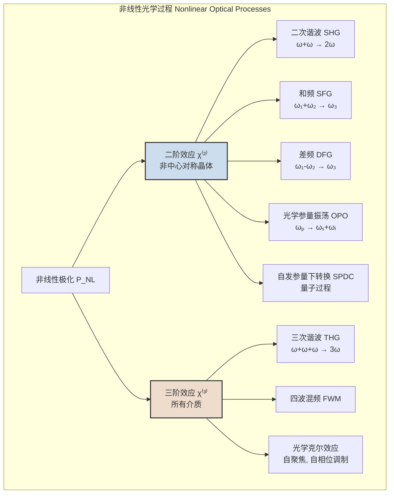
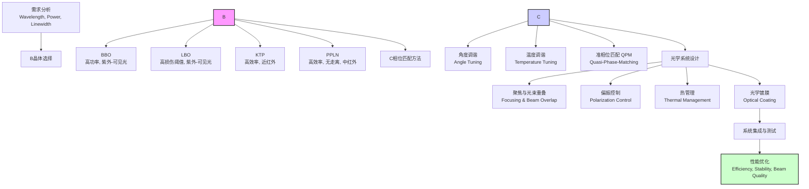
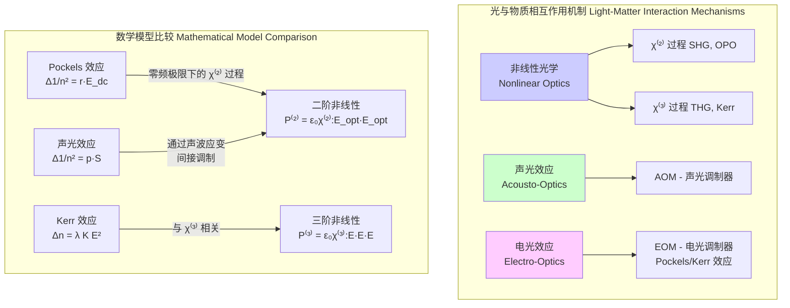

## 非线性晶体

非线性晶体是一种特殊的光学介质。当高强度光（例如来自激光的光束）穿过它时，其光学响应与入射光的电场强度呈非线性关系。这种特性使其能够实现多种频率变换功能，是现代激光技术、量子光学和光子学研究中不可或缺的核心元件。

### 1. 核心概念与数学基础

#### 1.1 线性与非线性极化

在传统（线性）光学中，介质的感应电极化强度 $\vec{P}$ 与外加电场强度 $\vec{E}$ 成正比。这种关系由一阶电极化率张量 $\chi^{(1)}$ 描述：

$$
P_i = \epsilon_0 \sum_j \chi_{ij}^{(1)} E_j
$$

其中：
*   $P_i$ 是电极化强度的第 $i$ 个分量。
*   $\epsilon_0$ 是真空介电常数 ($\approx 8.854 \times 10^{-12}$ F/m)。
*   $\chi_{ij}^{(1)}$ 是一阶电极化率张量的分量，它描述了介质的线性光学响应（如折射和吸收）。
*   $E_j$ 是电场强度的第 $j$ 个分量。

然而，当电场强度非常高时（通常 > $10^6$ V/m），线性近似不再成立。此时，电极化强度需要用电场强度的泰勒级数来更精确地描述：

$$
\vec{P} = \epsilon_0 \left( \chi^{(1)} \cdot \vec{E} + \chi^{(2)} : \vec{E}\vec{E} + \chi^{(3)} \vdots \vec{E}\vec{E}\vec{E} + \dots \right)
$$

其张量分量形式为：

$$
P_i = \epsilon_0 \left( \sum_j \chi_{ij}^{(1)} E_j + \sum_{j,k} \chi_{ijk}^{(2)} E_j E_k + \sum_{j,k,l} \chi_{ijkl}^{(3)} E_j E_k E_l + \dots \right)
$$

其中：
*   $\chi_{ijk}^{(2)}$ 是二阶非线性极化率张量。
*   $\chi_{ijkl}^{(3)}$ 是三阶非线性极化率张量。

非线性晶体特指那些具有显著二阶非线性极化率 $\chi^{(2)}$ 或三阶非线性极化率 $\chi^{(3)}$ 的材料。

#### 1.2 二阶非线性效应 ($\chi^{(2)}$)

二阶非线性效应是许多非线性晶体应用的基础。一个关键的物理约束是，**只有在缺乏中心反演对称性的晶体中，$\chi^{(2)}$ 才不为零**。这是因为在中心对称介质中，将电场反向（$\vec{E} \to -\vec{E}$）必须也使极化反向（$\vec{P} \to -\vec{P}$），但 $\chi^{(2)} : \vec{E}\vec{E}$ 项变为 $\chi^{(2)} : (-\vec{E})(-\vec{E}) = \chi^{(2)} : \vec{E}\vec{E}$，没有变号，这导致了矛盾，因此 $\chi^{(2)}$ 必须为零。

二阶非线性极化项 $P^{(2)} = \epsilon_0 \chi^{(2)} : \vec{E}\vec{E}$ 产生了多种频率混合现象。考虑一个由两个不同频率 $\omega_1$ 和 $\omega_2$ 组成的电场 $\vec{E}(t) = \vec{E}_1 \cos(\omega_1 t) + \vec{E}_2 \cos(\omega_2 t)$。其平方项 $\vec{E}^2(t)$ 将包含以下频率成分：
*   $2\omega_1$, $2\omega_2$ (倍频)
*   $\omega_1 + \omega_2$ (和频)
*   $\omega_1 - \omega_2$ (差频)
*   0 (直流，光整流)

这对应了以下关键的非线性过程：
*   **二次谐波产生 (Second Harmonic Generation, SHG):** $\omega + \omega \to 2\omega$。将输入激光频率加倍。例如，将 1064 nm 的红外光转换为 532 nm 的绿光。
*   **和频产生 (Sum Frequency Generation, SFG):** $\omega_1 + \omega_2 \to \omega_3$。将两个不同频率的光混合产生更高频率的光。
*   **差频产生 (Difference Frequency Generation, DFG):** $\omega_1 - \omega_2 \to \omega_3$。产生频率为输入光频率之差的新光。
*   **光学参量放大/振荡 (Optical Parametric Amplification/Oscillation, OPA/OPO):** $\omega_p \to \omega_s + \omega_i$。一个高频泵浦光子 ($\omega_p$) 分裂成一个信号光子 ($\omega_s$) 和一个闲暇光子 ($\omega_i$)。这是实现可调谐激光输出的重要技术。

在实际应用中，通常使用有效非线性系数 $d_{eff}$ 来代替 $\chi^{(2)}$ 张量。它们的关系为 $d_{ij} = \frac{1}{2} \chi^{(2)}_{ijk}$ (在特定缩并符号下)。

#### 1.3 相位匹配 (Phase Matching)

为了实现从输入光到输出光的有效能量转换，相互作用的光波必须保持恒定的相位关系，这被称为相位匹配。在光子图像中，这等效于动量守恒。波矢 $\vec{k}$ 代表光子的动量 ($\vec{p} = \hbar \vec{k}$)。

对于二次谐波产生 (SHG)，相位匹配条件为：
$$
\Delta \vec{k} = \vec{k}(2\omega) - 2\vec{k}(\omega) = 0
$$

其中：
*   $\vec{k}(\omega)$ 是基频光的波矢，其大小为 $k(\omega) = n(\omega)\omega/c$。
*   $\vec{k}(2\omega)$ 是倍频光的波矢，其大小为 $k(2\omega) = n(2\omega)2\omega/c$。
*   $n(\omega)$ 和 $n(2\omega)$ 分别是介质在基频和倍频下的折射率。
*   $\Delta \vec{k}$ 是相位失配矢量。

由于材料的色散效应，通常 $n(2\omega) > n(\omega)$，导致 $\Delta k \neq 0$，转换效率极低。为了克服这个问题，主要采用以下两种技术：

*   **双折射相位匹配 (Birefringent Phase Matching, BPM):**
    在各向异性的双折射晶体中，折射率与光的偏振方向和传播方向有关。通过精确选择光的传播角度和偏振，可以利用寻常光 (o-ray) 和非常光 (e-ray) 之间不同的折射率来补偿色散。
    *   **I 型匹配:** 两个基频光子具有相同的偏振（均为 o-ray 或 e-ray），产生的倍频光子具有正交的偏振。
    *   **II 型匹配:** 两个基频光子具有相互正交的偏振（一个 o-ray，一个 e-ray）。

*   **准相位匹配 (Quasi-Phase-Matching, QPM):**
    通过周期性地反转非线性晶体的极化方向（例如，周期性极化铌酸锂, PPLN），可以引入一个额外的“晶格”波矢 $K_g = 2\pi/\Lambda$，其中 $\Lambda$ 是极化周期。这可以补偿固有的相位失配。
    新的相位匹配条件变为：
    $$
    \Delta k_{QPM} = \Delta k - K_g = 0
    $$
    QPM 允许使用材料中最大的非线性系数，并且无需临界角度匹配，从而避免了走离效应。

### 2. 关键技术规格

下表列出了一些常用非线性晶体的关键技术参数。这些值是典型值，具体数值会因晶体生长质量、温度和具体波长而异。

| 参数 | BBO (偏硼酸钡) | LBO (三硼酸锂) | KTP (磷酸钛氧钾) | KDP (磷酸二氢钾) | PPLN (周期性极化铌酸锂) |
| :--- | :--- | :--- | :--- | :--- | :--- |
| **化学式** | $\beta$-BaB$_2$O$_4$ | LiB$_3$O$_5$ | KTiOPO$_4$ | KH$_2$PO$_4$ | LiNbO$_3$ |
| **透明范围 (nm)** | 190 - 3500 | 160 - 2600 | 350 - 4500 | 200 - 1500 | 400 - 5000 |
| **有效非线性系数 $d_{eff}$ (pm/V)** | ~2.2 (@1064nm) | ~0.85 (@1064nm) | ~3.2 (@1064nm) | ~0.39 (@1064nm) | ~17 (@1064nm, QPM) |
| **损伤阈值 (GW/cm² @10ns)** | ~10 | ~18 | ~1 | ~2 | ~0.3 |
| **折射率 (@1064nm)** | $n_o$=1.655, $n_e$=1.542 | $n_x$=1.565, $n_y$=1.590, $n_z$=1.605 | $n_x$=1.738, $n_y$=1.745, $n_z$=1.830 | $n_o$=1.494, $n_e$=1.460 | $n_o$=2.23, $n_e$=2.15 |
| **相位匹配类型** | I, II 型角度匹配 | I, II 型角度/温度匹配 | II 型角度匹配 | I, II 型角度匹配 | QPM |
| **走离角 (mrad)** | ~77 (@1064nm SHG) | ~12 (@1064nm SHG) | ~4.5 (@1064nm SHG) | ~27 (@1064nm SHG) | 0 |
| **接收角 (mrad·cm)** | ~0.8 | ~25 | ~10 | ~1.5 | N/A (由周期决定) |

### 3. 常见用例与性能指标

*   **激光频率转换:**
    *   **应用:** 将 Nd:YAG 激光器的 1064 nm 基频光通过 SHG 转换为 532 nm 的绿光，用于激光显示、医疗和工业加工。
    *   **性能指标:** 对于高功率脉冲激光，使用 LBO 或 BBO 晶体的 SHG 转换效率通常可以达到 **>80%**。对于连续波 (CW) 激光，使用腔内倍频技术，效率可达 **>50%**。

*   **可调谐激光源 (OPO):**
    *   **应用:** 产生在宽光谱范围内可调谐的相干辐射，用于光谱学、遥感和生物成像。
    *   **性能指标:** 一个由 532 nm 激光泵浦的 BBO OPO，其信号光和闲暇光输出可以覆盖 **~650 nm 到 >2500 nm** 的范围。输出脉冲能量可达数十毫焦耳，平均功率可达数瓦。

*   **太赫兹 (THz) 波产生:**
    *   **应用:** 通过在 GaSe、ZnTe 或 DAST 等晶体中进行差频产生 (DFG)，将两束近红外光转换为 THz 辐射，用于安检、无损检测和科学研究。
    *   **性能指标:** 典型输出功率范围为 **μW 到 mW** 级别，频率覆盖 **0.1 - 10 THz**。

*   **量子纠缠光源:**
    *   **应用:** 通过自发参量下转换 (Spontaneous Parametric Down-Conversion, SPDC) 过程，将一个高能泵浦光子分裂成一对时间和动量相关的纠缠光子对，是量子计算、量子通信和量子密码学的基石。
    *   **性能指标:** 使用 PPLN 波导，纠缠光子对的产生率可超过 **$10^7$ 对/秒/毫瓦泵浦功率**，纠缠保真度可达 **>99.5%**。

### 4. 实现考量

成功实现非线性频率转换需要仔细考虑多个因素。

*   **晶体选择:** 依据目标波长、所需非线性系数、损伤阈值和成本进行选择。
*   **相位匹配方法:** 角度调谐简单但存在走离效应；温度调谐提供非临界匹配但响应慢；QPM 效率最高但对温度和周期精度要求苛刻。
*   **光学对准:** 必须精确对准光束以最大化空间重叠，并满足相位匹配的角度要求，通常需要亚毫弧度的精度。
*   **热管理:** 高功率激光会导致晶体内部产生热量，引起热透镜效应和相位失配，必须通过主动冷却（如 TEC）来控制晶体温度。
*   **光学镀膜:** 在晶体端面镀上高质量的增透 (AR) 膜，以减少菲涅尔反射损耗（通常每个表面约 4-10%）。
*   **数值建模复杂度:** 描述非线性相互作用的耦合波方程是一组非线性常微分方程。例如，对于无泵浦损耗的 SHG：
    $$
    \frac{dA_1}{dz} = -i \kappa A_2 A_1^* e^{-i\Delta k z}
    $$
    $$
    \frac{dA_2}{dz} = -i \frac{\kappa}{2} A_1^2 e^{+i\Delta k z}
    $$
    其中 $A_1, A_2$ 是基频和倍频光的复振幅，$z$ 是传播距离，$\kappa$ 是与 $d_{eff}$ 成正比的耦合系数。使用分步傅里叶法等数值方法求解这些方程，对于包含 $N$ 个空间网格点的模型，每一步的计算复杂度为 **O(N log N)**。

### 5. 性能特征

*   **转换效率 ($\eta$):**
    衡量性能的首要指标。在平面波、低转换效率近似下，SHG 的效率为：
    $$
    \eta_{SHG} = \frac{P_{2\omega}}{P_{\omega}} \approx \frac{8 \pi^2 d_{eff}^2 L^2 I_{\omega}}{\epsilon_0 c n_{2\omega} n_{\omega}^2 \lambda_{\omega}^2} \cdot \text{sinc}^2\left(\frac{\Delta k L}{2}\right)
    $$
    其中：
    *   $P_{\omega}, P_{2\omega}$ 分别是基频和倍频光功率。
    *   $d_{eff}$ 是有效非线性系数。
    *   $L$ 是晶体长度。
    *   $I_{\omega}$ 是基频光强度。
    *   $n_{\omega}, n_{2\omega}$ 是折射率。
    *   $\lambda_{\omega}$ 是基频光波长。
    *   $c$ 是光速。
    *   $\text{sinc}(x) = \sin(x)/x$ 函数描述了效率对相位失配 $\Delta k$ 的敏感性。

*   **带宽:**
    转换效率维持在峰值 50% 以上的参数范围。包括光谱带宽 (nm)、角度带宽 (mrad) 和温度带宽 (°C)。带宽通常与晶体长度 $L$ 成反比。

*   **光束质量 ($M^2$):**
    生成的非线性信号的光束质量。由于走离效应、热效应或非均匀泵浦，输出光束的 $M^2$ 因子可能会劣化。QPM 由于没有走离效应，通常能保持更好的光束质量。

*   **稳定性:**
    输出功率或能量的长期稳定性，通常用均方根 (RMS) 噪声来衡量。例如，一个商业激光系统可能要求在 8 小时内功率波动的 RMS < 1%。其主要受泵浦激光器稳定性、环境温度波动和机械振动的影响。

### 6. 相关技术与比较

非线性晶体是光与物质相互作用的一种方式，但并非唯一。

*   **三阶非线性效应 ($\chi^{(3)}$):**
    *   **原理:** 由三阶极化率 $\chi^{(3)}$ 主导，存在于所有材料中（包括中心对称材料如玻璃和气体）。
    *   **现象:** 包括三次谐波产生 (THG)、四波混频 (FWM)、以及与强度相关的折射率变化（光学克尔效应），后者导致自聚焦和自相位调制。
    *   **数学模型:** $P_i^{(3)} = \epsilon_0 \sum_{j,k,l} \chi_{ijkl}^{(3)} E_j E_k E_l$。

*   **声光调制器 (AOM):**
    *   **原理:** 利用声光效应。外加的射频信号驱动压电换能器，在声光晶体（如 TeO₂）中产生行进的声波，形成周期性的折射率光栅。入射光被此光栅衍射（布拉格衍射）。
    *   **数学模型:** 折射率变化由光弹效应描述：$(\Delta(1/n^2))_{ij} = \sum_{k,l} p_{ijkl} S_{kl}$，其中 $p_{ijkl}$ 是光弹张量，$S_{kl}$ 是声波应变张量。这是一个机械应变引起的折射率变化，而非直接的电子极化。

*   **电光调制器 (EOM):**
    *   **原理:** 利用电光效应。外加的直流或射频电场改变晶体（如 LiNbO₃, KDP）的折射率。
    *   **数学模型:**
        *   **泡克耳斯效应 (Pockels Effect):** 折射率变化与电场成正比，$\Delta(1/n^2)_i = \sum_j r_{ij} E_j$，$r_{ij}$ 是线性电光张量。这本质上是一个二阶非线性过程，是一个光场和一个零频/低频电场的混频。
        *   **克尔效应 (Kerr Effect):** 折射率变化与电场平方成正比，与三阶非线性效应相关。

### 7. 参考文献

1.  Boyd, R. W. (2020). *Nonlinear Optics* (4th ed.). Academic Press. (非线性光学领域的权威教科书).
2.  Bloembergen, N. (1962). Interaction of Light Waves in a Nonlinear Dielectric. *Physical Review*, 127(6), 1918–1939. [DOI: 10.1103/PhysRev.127.1918](https://doi.org/10.1103/PhysRev.127.1918) (奠基性论文之一).
3.  Fejer, M. M., Magel, G. A., Jundt, D. H., & Byer, R. L. (1992). Quasi-phase-matched second harmonic generation: tuning and tolerances. *IEEE Journal of Quantum Electronics*, 28(11), 2631-2654. [DOI: 10.1109/3.161322](https://doi.org/10.1109/3.161322) (关于准相位匹配的里程碑式论文).
4.  Dmitriev, V. G., Gurzadyan, G. G., & Nikogosyan, D. N. (1997). *Handbook of Nonlinear Optical Crystals*. Springer. (一本非常实用的非线性晶体手册).