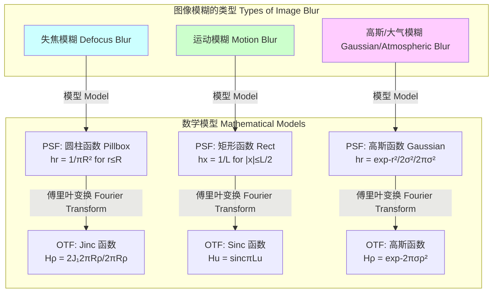

## 失焦 (out of focus)

失焦是一种光学现象，当成像系统（如相机镜头或显微镜）的焦点未精确对准物体时发生。其结果是，来自物体的单个点源在传感器或胶片平面上不再汇聚成一个理想的点，而是形成一个模糊的斑点。这种模糊效应在科学上可以通过几何光学和傅里叶光学的原理进行精确的数学描述和建模。失焦不仅仅是一种图像缺陷，它也被广泛应用于深度估计、艺术摄影和材料科学等领域。

### 核心概念与数学基础

#### 1. 几何光学模型与薄透镜方程

光学系统中的失焦现象可以通过薄透镜方程来描述。该方程关联了物距、像距和焦距。

$$
\frac{1}{s_o} + \frac{1}{s_i} = \frac{1}{f}
$$

其中：
*   $s_o$ 是物距（物体到透镜中心的距离）。
*   $s_i$ 是像距（图像传感器到透镜中心的距离）。
*   $f$ 是透镜的焦距。

当物体位于焦点平面上时，$s_i$ 满足上述方程，图像清晰。如果传感器平面与理想的焦平面存在一个位移 $\Delta s_i$，则图像就会失焦。

#### 2. 弥散圆 (Circle of Confusion - CoC)

当系统失焦时，来自物体的单个点光源在传感器平面上会形成一个模糊的圆盘，称为弥散圆。其直径 $C$ 可以通过相似三角形原理推导得出：

$$
C = \frac{|s_i' - s_i|}{s_i'} A = \frac{|s_i' - s_i|}{s_i'} \frac{f}{N}
$$

其中：
*   $s_i'$ 是实际的传感器平面位置。
*   $s_i$ 是根据薄透镜方程计算出的理想像距。
*   $A$ 是透镜的有效孔径直径。
*   $N$ 是透镜的F值（f-number），定义为 $N = f/A$。

这个弥散圆是理解失焦模糊的关键，它构成了失焦系统的点扩散函数（PSF）的几何近似。

#### 3. 点扩散函数 (Point Spread Function - PSF)

点扩散函数 $h(x, y)$ 描述了成像系统对一个理想点光源的响应。对于一个由失焦引起的、无像差的圆形孔径系统，其PSF可以被建模为一个均匀强度的圆柱函数（也称为“Pillbox”函数）：

$$
h(x, y) = \begin{cases} \frac{1}{\pi R^2} & \text{if } \sqrt{x^2 + y^2} \le R \\ 0 & \text{otherwise} \end{cases}
$$

其中：
*   $R$ 是弥散圆的半径 ($R = C/2$)。
*   $\frac{1}{\pi R^2}$ 是归一化常数，确保PSF的总能量为1。

#### 4. 卷积模型

失焦图像的形成过程可以被建模为理想清晰图像与系统PSF之间的卷积运算，并通常伴有加性噪声。

$$
g(x, y) = (h * f)(x, y) + n(x, y) = \iint_{-\infty}^{\infty} h(x-x', y-y') f(x', y') dx' dy' + n(x, y)
$$

其中：
*   $g(x, y)$ 是观测到的失焦图像。
*   $f(x, y)$ 是潜在的、理想的清晰图像。
*   $h(x, y)$ 是失焦系统的点扩散函数。
*   $n(x, y)$ 是加性系统噪声（例如，传感器噪声）。
*   $*$ 表示二维卷积运算。

#### 5. 频域分析与光学传递函数 (OTF)

根据卷积定理，空间域的卷积等效于频率域的乘积。对卷积模型进行傅里叶变换，我们得到：

$$
G(u, v) = H(u, v) \cdot F(u, v) + N(u, v)
$$

其中：
*   $G(u, v)$, $F(u, v)$, $H(u, v)$, $N(u, v)$ 分别是 $g(x, y)$, $f(x, y)$, $h(x, y)$, $n(x, y)$ 的二维傅里叶变换。
*   $H(u, v)$ 被称为光学传递函数 (OTF)，它是一个复数函数，描述了系统对不同空间频率（$u, v$）的响应。

对于一个由失焦引起的圆形PSF，其OTF是PSF的傅里叶变换，可以用一阶贝塞尔函数 $J_1$ 表示：

$$
H(\rho) = \mathcal{F}\{h(x, y)\} = 2 \frac{J_1(2\pi R \rho)}{2\pi R \rho}
$$

其中：
*   $\rho = \sqrt{u^2 + v^2}$ 是径向空间频率。
*   $R$ 是弥散圆的半径。
*   $J_1(\cdot)$ 是一阶第一类贝塞尔函数。

这个函数也被称为Jinc函数。OTF的幅度 $|H(u, v)|$ 称为调制传递函数 (MTF)，它显示失焦会作为一个低通滤波器，衰减图像的高频细节。OTF的零点位置与模糊半径 $R$ 直接相关，这为从失焦图像中估计模糊程度提供了理论基础。

### 关键技术规格

以下表格列出了描述和量化失焦效应的关键参数。

| 参数 (Parameter) | 符号 (Symbol) | 典型值 (Typical Value) | 单位 (Unit) | 描述 (Description) |
| :--- | :---: | :---: | :---: | :--- |
| 焦距 (Focal Length) | $f$ | 50 | mm | 透镜的光学属性，决定放大率和视角 |
| F值 (f-number) | $N$ | f/1.4 - f/22 | 无 | 焦距与孔径直径之比，控制进光量和景深 |
| 弥散圆直径 (CoC Diameter) | $C$ | 0.01 - 2.0 | mm | 失焦的点光源在传感器上形成的斑点大小 |
| 像素尺寸 (Pixel Pitch) | $p$ | 1.5 - 6.0 | µm | 图像传感器上单个像素的物理尺寸 |
| 模糊核半径 (Blur Kernel Radius) | $R_{pix}$ | 2 - 50 | 像素 (pixels) | 以像素为单位的PSF半径， $R_{pix} = R/p$ |
| 景深 (Depth of Field) | DoF | 0.1 - $\infty$ | m | 场景中物体能够被可接受地清晰成像的距离范围 |

### 常见用例与量化性能指标

| 用例 (Use Case) | 描述 (Description) | 关键性能指标 (Key Performance Metric) | 量化目标 (Quantitative Target) |
| :--- | :--- | :--- | :--- |
| **艺术摄影 (散景)** | 利用浅景深创造模糊背景，突出主体。 | 散景质量 (Bokeh Quality) | 平滑的模糊盘，无明显边缘或“洋葱圈”伪影 |
| **从失焦中恢复深度 (DFD)** | 通过分析不同焦点设置下图像的模糊程度来计算场景深度。 | 深度图均方根误差 (RMSE of Depth Map) | < 1% of the object distance |
| **图像去模糊** | 通过算法恢复因失焦而损失的图像细节。 | 峰值信噪比 (PSNR) / 结构相似性 (SSIM) | PSNR > 30 dB / SSIM > 0.90 |
| **显微成像** | 通过Z轴扫描和反卷积来重建三维结构。 | 轴向分辨率 (Axial Resolution) | 依赖于物镜NA和波长，可达 ~500 nm |
| **自动对焦系统** | 通过最大化图像对比度（高频能量）来确定最佳焦点。 | 对焦速度 (Focusing Speed) / 精度 (Accuracy) | < 100 ms / > 99.5% 成功率 |

### 实现考量与算法复杂度

从失焦图像中恢复清晰图像（去卷积）是一个经典的逆问题，通常是病态的。

#### 图像去模糊工作流

```mermaid
graph TD
    A[输入: 失焦图像 gx,y] --> B["PSF是否已知?[";
    B -- Yes --> C[非盲去卷积 Non-blind Deconvolution];
    B -- No --> D[盲去卷积 Blind Deconvolution];
    D --> E[1. 估计PSF hx,y];
    E --> F[2. 使用估计的PSF进行去卷积];
    C --> G[去卷积算法];
    F --> G;
    G --> H[输出: 复原图像 f'x,y];
    subgraph "去卷积算法 Deconvolution Algorithms"
        G1[维纳滤波 Wiener Filter]
        G2[Richardson-Lucy 迭代]
        G3[约束最小二乘法 Constrained Least Squares]
        G4[基于深度学习的方法 Deep Learning]
    end
    G --> G1
    G --> G2
    G --> G3
    G --> G4

    style A fill:#f9f,stroke:#333,stroke-width:2px
    style H fill:#9cf,stroke:#333,stroke-width:2px
    style D fill:#fcf,stroke:#333,stroke-width:2px
```

#### 1. 维纳滤波 (Wiener Filter)

维纳滤波是一种经典的线性去卷积方法，它在最小化均方误差（MMSE）准则下提供最优解。其频域解为：

$$
\hat{F}(u, v) = \left[ \frac{|H(u, v)|^2}{|H(u, v)|^2 + S_n(u, v) / S_f(u, v)} \right] \frac{G(u, v)}{H(u, v)}
$$

其中：
*   $\hat{F}(u, v)$ 是估计的清晰图像的傅里叶变换。
*   $H(u, v)$ 是OTF。
*   $G(u, v)$ 是失焦图像的傅里叶变换。
*   $S_n(u, v)$ 是噪声的功率谱密度 (PSD)。
*   $S_f(u, v)$ 是原始图像的功率谱密度。
*   比率 $S_n/S_f$ 通常被一个常数 $K$ (信噪比的倒数) 所替代。

**算法复杂度**: 维纳滤波主要依赖于快速傅里叶变换 (FFT)。对于一个 $N \times N$ 的图像，其复杂度为 $O(N^2 \log N)$。

#### 2. Richardson-Lucy 算法

这是一种基于贝叶斯理论的非线性迭代算法，假设图像泊松噪声。它能产生较好的结果，尤其是在保留边缘方面。

$$
f_{k+1}(x, y) = f_k(x, y) \cdot \left[ \left( \frac{g(x, y)}{f_k(x, y) * h(x, y)} \right) * h(-x, -y) \right]
$$

其中：
*   $f_k$ 是第 $k$ 次迭代的估计图像。
*   $h(-x, -y)$ 是PSF的翻转版本（相关核）。

**算法复杂度**: 每次迭代包含两次卷积（通过FFT实现）。如果迭代 $I$ 次，总复杂度为 $O(I \cdot N^2 \log N)$。

### 性能特征与统计度量

*   **鲁棒性**: 去卷积算法的性能高度依赖于PSF估计的准确性。一个小的PSF半径误差可能导致显著的复原伪影。对于一个估计半径 $\hat{R}$，其置信区间可以表示为 $\hat{R} \pm z \cdot \sigma_{\hat{R}}$，其中 $\sigma_{\hat{R}}$ 是估计的标准差。
*   **伪影 (Artifacts)**:
    *   **振铃效应 (Ringing artifacts)**: 在强边缘附近出现波纹，常见于线性滤波方法。
    *   **噪声放大 (Noise amplification)**: 在OTF值接近零的频率处，去卷积会极大地放大噪声。维纳滤波和正则化方法旨在抑制此现象。
*   **统计评估**:
    *   **均方误差 (MSE)**: $MSE = \frac{1}{MN} \sum_{i=0}^{M-1}\sum_{j=0}^{N-1} [I(i,j) - K(i,j)]^2$。值越小越好。
    *   **峰值信噪比 (PSNR)**: $PSNR = 20 \cdot \log_{10}(MAX_I) - 10 \cdot \log_{10}(MSE)$。值越大越好，通常以dB为单位。对于高质量复原，PSNR > 30 dB。
    *   **结构相似性 (SSIM)**: 衡量复原图像与原始图像在亮度、对比度和结构上的相似性。取值范围为[-1, 1]，越接近1越好。

### 相关技术与数学模型比较

失焦模糊是图像退化的一种形式，其他常见的退化类型包括运动模糊和大气湍流模糊（通常用高斯模糊近似）。



#### 数学模型对比

*   **失焦模糊 (Defocus Blur)**:
    *   PSF: 如前述，为圆柱函数。
    *   OTF: Jinc函数，具有周期性的零点，这些零点是频域中的信息完全丢失点。

*   **线性运动模糊 (Linear Motion Blur)**:
    *   PSF: 沿运动方向的矩形函数。
    *   $h(x, y) = \begin{cases} \frac{1}{L} & \text{if } |x| \le L/2 \text{ and } y=0 \\ 0 & \text{otherwise} \end{cases}$ (假设水平运动)
    *   OTF: Sinc函数，$H(u, v) = \text{sinc}(\pi L u) = \frac{\sin(\pi L u)}{\pi L u}$。同样具有周期性零点。

*   **高斯模糊 (Gaussian Blur)**:
    *   PSF: 高斯分布，常用于模拟大气湍流或作为其他模糊类型的近似。
    *   $h(x, y) = \frac{1}{2\pi\sigma^2} e^{-\frac{x^2+y^2}{2\sigma^2}}$
    *   OTF: 也是一个高斯函数，$H(u, v) = e^{-2\pi^2\sigma^2(u^2+v^2)}$。其特点是永远不会达到零，意味着理论上没有信息被完全丢失，只是被严重衰减。

### 参考文献

1.  Pentland, A. P. (1987). "A new sense for depth of field". *IEEE Transactions on Pattern Analysis and Machine Intelligence*, PAMI-9(4), 523–531. DOI: `10.1109/TPAMI.1987.4767940`
2.  Richardson, W. H. (1972). "Bayesian-Based Iterative Method of Image Restoration". *Journal of the Optical Society of America*, 62(1), 55–59. DOI: `10.1364/JOSA.62.000055`
3.  Lucy, L. B. (1974). "An iterative technique for the rectification of observed distributions". *The Astronomical Journal*, 79, 745. DOI: `10.1086/111605`
4.  Levin, A., Weiss, Y., Durand, F., & Freeman, W. T. (2009). "Understanding and evaluating blind deconvolution algorithms". *2009 IEEE Conference on Computer Vision and Pattern Recognition*, 1964–1971. DOI: `10.1109/CVPR.2009.5206815`