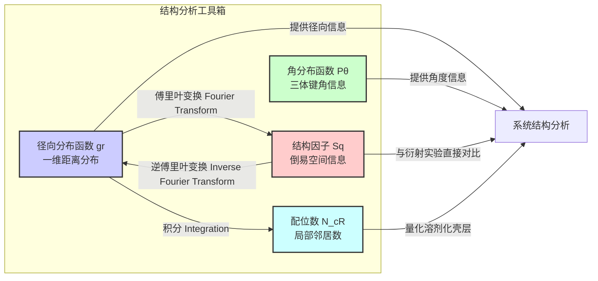

## 氧-氧径向分布函数

氧-氧径向分布函数（Oxygen-Oxygen Radial Distribution Function），通常表示为 $g_{OO}(r)$ 或简写为 $g(r)$，是一种描述在一个由多个粒子组成的系统中，以一个氧原子为中心，在距离其 $r$ 处找到另一个氧原子的概率密度函数。这个函数是研究液体和非晶态材料（特别是水）结构的关键工具，因为它直接揭示了原子尺度的局部有序性和排列方式。

$g_{OO}(r)$ 的值与理想气体（完全无序）的概率密度相关联。
*   当 $g_{OO}(r) > 1$ 时，表示在距离 $r$ 处找到另一个氧原子的概率高于随机分布，这通常对应于一个有序的“溶剂化壳层”或“配位层”。
*   当 $g_{OO}(r) < 1$ 时，表示在该距离处找到氧原子的概率低于随机分布，这通常是由于空间位阻或粒子间的排斥作用。
*   当 $r \to \infty$ 时，$g_{OO}(r) \to 1$，表明在宏观距离上，系统的结构趋于均匀，失去了局部相关性。

### 核心概念的数学基础

径向分布函数 $g_{\alpha\beta}(r)$ 的通用定义是，在给定一个 $\alpha$ 类型粒子位于原点的情况下，在距离 $r$ 处的体积元 $dV$ 中找到一个 $\beta$ 类型粒子的平均数，与宏观平均密度下的期望数之比。对于氧-氧径向分布函数，$\alpha$ 和 $\beta$ 均为氧原子。

其数学表达式为：
$$ g_{OO}(r) = \frac{V}{N_O^2} \left\langle \sum_{i=1}^{N_O} \sum_{j=1, j\neq i}^{N_O} \frac{\delta(r - r_{ij})}{4\pi r^2} \right\rangle $$
其中：
*   $g_{OO}(r)$: 氧-氧径向分布函数，是距离 $r$ 的无量纲函数。
*   $V$: 系统的总体积（单位：$\text{m}^3$ 或 $\text{Å}^3$）。
*   $N_O$: 系统中氧原子的总数。
*   $\langle \dots \rangle$: 表示在统计系综（例如，分子动力学模拟中的时间平均或蒙特卡洛模拟中的系综平均）上的平均值。
*   $r_{ij}$: 氧原子 $i$ 和氧原子 $j$ 之间的距离，即 $|\vec{r}_i - \vec{r}_j|$。
*   $\delta(x)$: 狄拉克 $\delta$ 函数。这个公式在理论上是精确的，但在实际计算中不便使用。

在计算实践中，通常使用直方图法。将距离 $r$ 划分为一系列宽度为 $\Delta r$ 的小区间（bins），然后计算落入每个球壳中的原子对数。其计算公式为：
$$ g_{OO}(r) = \frac{\langle N(r, \Delta r) \rangle}{4 \pi r^2 \Delta r \rho_O} $$
其中：
*   $\langle N(r, \Delta r) \rangle$: 在以任意一个氧原子为中心，半径从 $r$ 到 $r+\Delta r$ 的球壳内，找到其他氧原子的平均数量。
*   $4 \pi r^2 \Delta r$: 半径为 $r$、厚度为 $\Delta r$ 的球壳的体积。
*   $\rho_O$: 氧原子的数密度，定义为 $\rho_O = N_O / V$。分母 $4 \pi r^2 \Delta r \rho_O$ 代表在一个完全随机的系统中，该球壳内氧原子的期望数量。

### 关键技术规格

以下表格展示了在标准温度和压力（STP，约 298 K, 1 atm）下，液态水的氧-氧径向分布函数的典型特征值。这些值通常通过X射线衍射、中子衍射实验或精确的分子动力学模拟（如使用TIP4P/2005或SPC/E水模型）获得。

| 特征 (Feature) | 典型值 (Typical Value) | 单位 (Unit) | 物理意义 (Physical Significance) |
| :--- | :--- | :--- | :--- |
| 第一峰位置 (1st Peak Position) | 2.75 - 2.85 | Å (埃) | 最可能的氢键O-O距离，代表第一配位层。 |
| 第一峰高度 (1st Peak Height) | 2.5 - 3.2 | 无量纲 | 第一配位层中氧原子的高度局部化程度。 |
| 第一谷位置 (1st Minimum Position) | 3.3 - 3.5 | Å (埃) | 第一配位层的边界。 |
| 第二峰位置 (2nd Peak Position) | 4.4 - 4.6 | Å (埃) | 第二配位层的平均距离，反映了四面体网络结构。 |
| 第二峰高度 (2nd Peak Height) | 1.1 - 1.2 | 无量纲 | 第二配位层的有序性，通常比第一峰低得多。 |
| 配位数 (Coordination Number) | 4.4 - 5.0 | 无量纲 | 在第一谷定义的半径内，一个氧原子平均的近邻氧原子数。 |

### 常见用例

$g_{OO}(r)$ 在凝聚态物理、化学和材料科学中有着广泛的应用。

*   **验证分子动力学力场**: 模拟得到的 $g_{OO}(r)$ 可以与实验（如X射线衍射）数据进行直接比较。若两者吻合良好，则表明所用力场能准确再现液体的局部结构。定量上，可以通过计算模拟与实验曲线之间的均方根误差（RMSE）来评估力场性能。
*   **研究液体结构**: $g_{OO}(r)$ 的峰形、峰高和峰位揭示了液体的微观结构。例如，水的 $g_{OO}(r)$ 在不同温度和压力下的变化，可以用来解释其密度反常、高热容等独特性质。
*   **计算配位数**: 通过对 $g_{OO}(r)$ 进行积分，可以得到配位数 $N_c(R)$，即在半径 $R$ 范围内一个中心原子周围的平均邻居数。这对于理解溶剂化效应和化学反应环境至关重要。
    $$ N_c(R) = 4\pi \rho_O \int_0^R r^2 g_{OO}(r) dr $$
    通常，$R$ 取为 $g_{OO}(r)$ 的第一个极小值点的位置。对于液态水，积分到约 3.4 Å 得到的配位数约为4.4，这证实了其局部类似冰的四面体结构。
*   **分析相变**: 在相变过程中（如液体到固体或液体到气体），$g_{OO}(r)$ 的形态会发生剧烈变化。固体的 $g(r)$ 具有尖锐、分立的峰，而气体的 $g(r)$ 在短距离外迅速趋近于1。

### 实现考量

从分子动力学或蒙特卡洛模拟的轨迹数据中计算 $g_{OO}(r)$ 的算法流程如下。

```mermaid
graph TD
    A[输入: N个氧原子的坐标轨迹] --> B["选择一个模拟快照Frame[";
    B --> C["对于每个氧原子 i 作为中心[";
    C --> D["对于每个其他氧原子 j j ≠ i[";
    D --> E[计算距离 r_ij];
    E --> F["将 r_ij 归入对应的直方图区间 k[";
    F --> G["直方图 Hk 计数加一"];
    D -- "遍历所有 j" --> H["遍历所有 i[";
    H -- "完成中心原子遍历" --> I["对所有快照重复 B-H 过程[";
    I --> J["对直方图 Hk 进行时间平均 <Hk>"];
    J --> K["根据公式进行归一化处理"];
    K --> L[输出: g_OOr 曲线];

    subgraph "归一化步骤 K"
        direction LR
        K1["<Nr, Δr> = <Hk> / N_O"] --> K2["gr = <Nr, Δr> / 4πr²Δrρ_O"];
    end

    style A fill:#cde,stroke:#333
    style L fill:#cfc,stroke:#333
```

**算法复杂度分析**:
*   **暴力算法 (Brute-force)**: 对于一个包含 $N_O$ 个氧原子的体系，需要计算 $N_O(N_O-1)/2$ 个原子对的距离。因此，处理单个快照的计算复杂度为 $O(N_O^2)$。对于一个包含 $M$ 帧的轨迹，总复杂度为 $O(M \cdot N_O^2)$。
*   **优化算法 (Cell Lists / Verlet Lists)**: 为了提高效率，可以将模拟盒子划分为边长不小于截断半径 $r_{cut}$ 的网格单元。在计算时，对于每个原子，只需考虑其所在单元及相邻单元内的其他原子。如果原子分布相对均匀，每个单元内的原子数近似恒定，该算法可以将单帧计算复杂度降低到 $O(N_O)$。这对于大规模模拟至关重要。

### 性能特征

$g_{OO}(r)$ 是一个统计量，其精度取决于模拟的时长和体系的大小。

*   **统计噪声**: 在有限的模拟时间内，计算出的 $g(r)$ 会有统计噪声，尤其是在 $r$ 较大的区域，因为远距离的原子对样本较少。
*   **收敛性**: 需要足够长的模拟时间来确保 $g(r)$ 曲线收敛，即其形状不再随模拟时间的增加而显著变化。
*   **误差分析**: 为了量化不确定性，通常采用**块平均法 (Block Averaging)**。将整个模拟轨迹分成若干个数据块，对每个块独立计算 $g(r)$，然后计算这些 $g(r)$ 曲线在每个 $r$ 点的标准差或标准误差。最终结果通常以带有置信区间（例如，95% CI）的曲线图形式呈现。
*   **有限尺寸效应**: 在小尺寸的模拟盒子中，由于周期性边界条件，$g(r)$ 在大于盒子长度一半的距离处会出现人为的结构。因此，$r$ 的有效范围通常被限制在 $L/2$ 以内，其中 $L$ 是模拟盒子的最小边长。

### 相关技术与比较

$g_{OO}(r)$ 是描述系统结构的重要工具，但它只提供了一维的距离信息。其他技术可以提供补充信息。



*   **结构因子 (Structure Factor), $S(q)$**:
    $S(q)$ 是 $g(r)$ 在倒易空间（或称q空间）的对应物，可以通过X射线或中子衍射实验直接测量。它与 $g(r)$ 通过傅里叶变换相关联：
    $$ S(q) = 1 + \rho_O \int_V [g_{OO}(r) - 1] e^{-i\vec{q}\cdot\vec{r}} d\vec{r} $$
    对于各向同性的液体，上式简化为：
    $$ S(q) = 1 + 4\pi \rho_O \int_0^\infty [g_{OO}(r) - 1] \frac{\sin(qr)}{qr} r^2 dr $$
    其中 $q$ 是散射波矢的大小。$S(q)$ 和 $g(r)$ 提供了等价的信息，但从不同角度描述了原子结构。

*   **角分布函数 (Angular Distribution Function), $P(\theta)$**:
    $g(r)$ 只描述了原子间的距离，而角分布函数描述了由三个原子组成的键角（例如，水中的O-O-O角）的分布。这对于理解具有方向性相互作用（如氢键）的系统的网络结构（如水的四面体网络）至关重要。

*   **空间分布函数 (Spatial Distribution Function), SDF**:
    SDF是 $g(r)$ 的三维推广，它描述了在一个中心分子周围特定位置和方向上找到另一个分子的概率密度。它提供了比 $g(r)$ 和 $P(\theta)$ 更完整的结构图像，但计算和可视化也更为复杂。

### 参考文献

1.  Soper, A. K., & Ricci, M. A. (2000). Structures of high-density and low-density water. *Physical Review Letters*, 84(13), 2881–2884. [DOI: 10.1103/PhysRevLett.84.2881](https://doi.org/10.1103/PhysRevLett.84.2881)
2.  Hura, G., Sorenson, J. M., Glaeser, R. M., & Head-Gordon, T. (2000). A high-quality x-ray scattering experiment on liquid water at ambient conditions. *The Journal of Chemical Physics*, 113(20), 9140–9148. [DOI: 10.1063/1.1319614](https://doi.org/10.1063/1.1319614)
3.  Abascal, J. L. F., & Vega, C. (2005). A general purpose model for the condensed phases of water: TIP4P/2005. *The Journal of Chemical Physics*, 123(23), 234505. [DOI: 10.1063/1.2121687](https://doi.org/10.1063/1.2121687)
4.  Allen, M. P., & Tildesley, D. J. (1989). *Computer Simulation of Liquids*. Oxford University Press. (This book provides a comprehensive theoretical and practical guide to calculating RDFs).