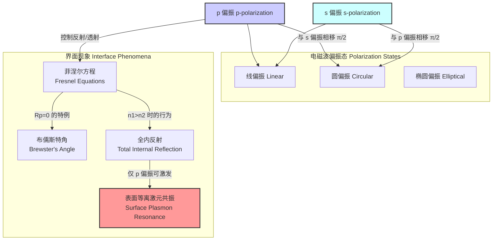

## p 偏振

p 偏振（p-polarization），亦称为平行偏振或TM模（Transverse Magnetic mode），是电磁波的一种特定偏振状态。当一束电磁波（如光）与两种不同介质的界面相互作用时，p 偏振的定义是其电场矢量平行于入射面。与之对应的是 s 偏振，其电场矢量垂直于入射面。理解 p 偏振对于光学、电磁学和相关技术领域至关重要。

### 核心概念与数学基础

#### 1. 入射面 (Plane of Incidence)
入射面是一个几何平面，由入射波的波矢量、反射波的波矢量以及界面法线共同定义。在 p 偏振中，电场矢量 $\vec{E}$ 在此平面内振荡，而磁场矢量 $\vec{H}$ 则与该平面垂直。

```mermaid
graph TD
    subgraph "p 偏振几何结构 p-polarization Geometry"
        direction LR
        A[入射波<br>Incident Wave] --> B界面<br>Interface;
        B --> C[反射波<br>Reflected Wave];
        B --> D[折射波<br>Refracted Wave];
        
        subgraph "入射面 Plane of Incidence"
            direction TB
            E_p["电场 E 平行<br>Electric Field E parallel"]
            k_i["入射波矢量 k_i<br>Incident k-vector"]
            k_r["反射波矢量 k_r<br>Reflected k-vector"]
            k_t["折射波矢量 k_t<br>Transmitted k-vector"]
            Normal["法线<br>Normal"]
        end
        
        H_p["磁场 H 垂直<br>Magnetic Field H perpendicular"]
        
        E_p -- "在平面内<br>In Plane" --> k_i;
        H_p -- "垂直于平面<br>Perpendicular to Plane" --> k_i;
    end

    style E_p fill:#cff,stroke:#333
    style H_p fill:#fcf,stroke:#333
```

#### 2. 菲涅尔方程 (Fresnel Equations)
p 偏振波在介质界面上的反射和透射行为由菲涅尔方程描述。这些方程源于在界面上应用麦克斯韦方程的边界条件（电场和磁场的切向分量连续）。

假设一个 p 偏振平面波从折射率为 $n_1$ 的介质入射到折射率为 $n_2$ 的介质，入射角为 $\theta_i$，折射角为 $\theta_t$。反射系数 $r_p$（反射波与入射波的电场振幅之比）和透射系数 $t_p$（透射波与入射波的电场振幅之比）由以下公式给出：

$$
r_p = \frac{E_{0r}}{E_{0i}} = \frac{n_2 \cos\theta_i - n_1 \cos\theta_t}{n_2 \cos\theta_i + n_1 \cos\theta_t}
$$

$$
t_p = \frac{E_{0t}}{E_{0i}} = \frac{2 n_1 \cos\theta_i}{n_2 \cos\theta_i + n_1 \cos\theta_t}
$$

其中：
*   $E_{0i}$, $E_{0r}$, $E_{0t}$ 分别是入射波、反射波和透射波的电场振幅。
*   $n_1$ 是入射介质的折射率。
*   $n_2$ 是透射介质的折射率。
*   $\theta_i$ 是入射角。
*   $\theta_t$ 是折射角，由斯涅尔定律 (Snell's Law) 决定：$n_1 \sin\theta_i = n_2 \sin\theta_t$。

反射率 $R_p$ 和透射率 $T_p$ 分别是反射波和透射波的能量（功率）与入射波能量之比：
$$
R_p = |r_p|^2
$$
$$
T_p = \frac{n_2 \cos\theta_t}{n_1 \cos\theta_i} |t_p|^2
$$
根据能量守恒定律，$R_p + T_p = 1$（假设介质无吸收）。

#### 3. 布儒斯特角 (Brewster's Angle)
p 偏振的一个最显著特征是存在布儒斯特角 $\theta_B$。当入射角等于布儒斯特角时，p 偏振光的反射系数 $r_p$ 为零，即没有反射发生，所有能量都被透射。

通过设置 $r_p = 0$，我们得到 $n_2 \cos\theta_B = n_1 \cos\theta_t$。结合斯涅尔定律，可以推导出布儒斯特角的表达式：
$$
\tan\theta_B = \frac{n_2}{n_1}
$$
在布儒斯特角入射时，反射光线与折射光线之间的夹角恰好为 90°。物理上，介质2中的偶极子沿折射光电场方向振荡，而这个方向正是反射光应传播的方向。由于偶极子在其振荡方向上没有辐射，因此没有 p 偏振光被反射。

#### 4. 全内反射 (Total Internal Reflection, TIR)
当光从光密介质 ($n_1$) 入射到光疏介质 ($n_2$) 且 $n_1 > n_2$ 时，如果入射角大于临界角 $\theta_c$，光将发生全内反射。临界角由下式给出：
$$
\theta_c = \arcsin\left(\frac{n_2}{n_1}\right)
$$
在全内反射条件下（$\theta_i > \theta_c$），反射率 $R_p = 1$。然而，反射波会经历一个非零的相位移动 $\delta_p$，该相移依赖于入射角：
$$
\tan\left(\frac{\delta_p}{2}\right) = -\frac{\sqrt{\sin^2\theta_i - (n_2/n_1)^2}}{(n_2/n_1)^2 \cos\theta_i}
$$

### 关键技术规格

下表总结了 p 偏振在空气-玻璃界面（$n_1=1.00$, $n_2=1.50$）下的关键参数。

| 参数 (Parameter) | 符号 (Symbol) | 公式 (Formula) | 示例值 (空气-玻璃) | 单位 (Unit) |
| :--- | :---: | :--- | :---: | :---: |
| 反射系数 | $r_p$ | $\frac{n_2 \cos\theta_i - n_1 \cos\theta_t}{n_2 \cos\theta_i + n_1 \cos\theta_t}$ | 依赖于 $\theta_i$ | 无量纲 |
| 反射率 | $R_p$ | $|r_p|^2$ | $0 \to 1$ | 无量纲 |
| 透射率 | $T_p$ | $1 - R_p$ | $0 \to 1$ | 无量纲 |
| 布儒斯特角 | $\theta_B$ | $\arctan(n_2/n_1)$ | $56.31^\circ$ | 度 (Degrees) |
| 临界角 (若 $n_1>n_2$) | $\theta_c$ | $\arcsin(n_2/n_1)$ | $41.81^\circ$ (玻璃-空气) | 度 (Degrees) |
| 反射相位移 (TIR) | $\delta_p$ | 见上方公式 | 依赖于 $\theta_i > \theta_c$ | 弧度 (Radians) |

### 常见用例

p 偏振的独特性质使其在众多科学和技术应用中不可或缺。

*   **偏振光学元件 (Polarizing Optics)**
    *   **布儒斯特窗 (Brewster Window):** 一块平行平板，倾斜放置于布儒斯特角。对于 p 偏振光，它能提供接近 100% 的透射率，常用于激光谐振腔内以减少反射损耗。
    *   **性能指标:** 透射率 $T_p > 99.8\%$；消光比（p 偏振透射与 s 偏振透射之比）通常大于 100:1。

*   **椭圆偏振法 (Ellipsometry)**
    *   一种高精度的光学测量技术，通过测量从样品表面反射后偏振态的变化来表征薄膜厚度和光学常数。它测量的是 p 偏振和 s 偏振反射系数之比 $\rho = r_p/r_s = \tan(\Psi) e^{i\Delta}$。
    *   **性能指标:** 厚度测量精度可达亚埃级（< 0.1 Å）；折射率测量精度可达 $10^{-3}$。

*   **表面等离激元共振 (Surface Plasmon Resonance, SPR)**
    *   一种仅对 p 偏振光敏感的现象。在全内反射条件下，p 偏振光的倏逝波可以与金属-介质界面上的表面等离激元（电子集体振荡）耦合，导致在特定角度下反射率急剧下降。
    *   **性能指标:** 广泛用于生物和化学传感器，灵敏度极高。例如，折射率单位 (RIU) 的变化检测极限可达 $10^{-7}$ RIU。

*   **抗反射涂层 (Anti-Reflection Coatings)**
    *   多层介质膜的设计利用了 p 偏振和 s 偏振在不同角度下的反射特性，以在宽光谱和角度范围内最小化反射。

### 实现考量

在计算模拟 p 偏振行为时，算法的复杂性取决于模型的复杂度。

#### 单一界面反射率计算

```mermaid
graph TD
    A[开始: 输入 n1, n2, θi 范围] --> B循环遍历每个 θi;
    B -- "下一个 θi" --> C[用斯涅尔定律计算 θt];
    C --> D检查全内反射: n1 > n2 且 n1*sinθi > n2?;
    D -- 是 --> E[计算 TIR 相位移 δp, Rp=1];
    D -- 否 --> F[使用菲涅尔方程计算 rp];
    F --> G[计算反射率 Rp = |rp|^2];
    E --> H[存储 θi, Rp];
    G --> H;
    H --> B;
    B -- "循环结束" --> I[结束: 输出 Rp vs θi 曲线];

    style A fill:#ccf,stroke:#333
    style I fill:#cfc,stroke:#333
```

*   **算法复杂度:** 对于 $N$ 个不同的入射角，计算过程是线性的。每个角度的计算涉及固定数量的三角函数和代数运算，因此总复杂度为 $O(N)$。

*   **多层膜系统:** 对于包含 $M$ 个薄膜层的复杂系统，通常使用**传输矩阵法 (Transfer-Matrix Method)**。该方法为每一层和界面构建一个 $2 \times 2$ 的矩阵，然后将所有矩阵相乘得到整个系统的总传输矩阵。
    *   **算法复杂度:** 对于每个角度，需要进行 $M$ 次矩阵乘法。因此，对于 $N$ 个角度，总复杂度为 $O(M \cdot N)$。

### 性能特征

p 偏振的反射率随入射角的变化曲线具有鲜明特征。


*图：空气 ($n_1=1$) 到玻璃 ($n_2=1.5$) 界面的 p 偏振 ($R_p$) 和 s 偏振 ($R_s$) 反射率随入射角的变化。$R_p$ 在布儒斯特角 $56.3^\circ$ 处降为零。*

*   **布儒斯特角最小值:** 理论上，$R_p$ 在 $\theta_B$ 处为零。在实际测量中，由于光束的发散角、表面粗糙度和薄膜污染，最小值非零，但通常极低（例如 < $10^{-4}$）。该最小值的角度位置测量精度可达 $\pm 0.01^\circ$。
*   **相位移动:** p 偏振光在界面反射时，其相位的变化是不连续的。
    *   当 $\theta_i < \theta_B$ 时，相位移动为 0。
    *   当 $\theta_i > \theta_B$ 时，相位移动为 $\pi$。
    *   在全内反射区域 ($\theta_i > \theta_c$)，相位从 $\pi$ 开始连续变化。
*   **SPR 性能:** 在 SPR 传感器中，反射率曲线在共振角处呈现一个尖锐的 dips。该 dips 的半峰全宽 (FWHM) 是衡量传感器分辨率的关键指标，FWHM 越窄，分辨率越高。典型的 FWHM 范围在 $0.1^\circ$ 到 $2^\circ$ 之间，具体取决于金属膜的材料和厚度。

### 相关技术

p 偏振是电磁波偏振理论框架中的一个基本组成部分。



#### 1. s 偏振 (s-polarization)
s 偏振（来自德语 *senkrecht*，意为垂直）的电场矢量垂直于入射面。其菲涅尔反射和透射系数为：
$$
r_s = \frac{n_1 \cos\theta_i - n_2 \cos\theta_t}{n_1 \cos\theta_i + n_2 \cos\theta_t}
$$
$$
t_s = \frac{2 n_1 \cos\theta_i}{n_1 \cos\theta_i + n_2 \cos\theta_t}
$$
**主要区别:**
*   对于非磁性介质（$\mu_1 = \mu_2$），s 偏振不存在布儒斯特角。其反射率 $R_s$ 随入射角的增加而单调递增。
*   在所有角度下，$R_s \ge R_p$。

#### 2. 圆偏振和椭圆偏振
圆偏振和椭圆偏振光可以被分解为两个正交的线偏振分量（如 p 偏振和 s 偏振）的叠加。当圆偏振光或椭圆偏振光从界面反射时，由于 $r_p$ 和 $r_s$ 的幅度和相位通常不同，反射光的偏振态会发生改变。椭圆偏振法正是基于对这种变化的精确测量。

#### 3. 表面等离激元共振 (SPR)
SPR 是一种独特的共振现象，它要求激发光必须是 p 偏振。这是因为只有 p 偏振光在全内反射条件下产生的倏逝波，其电场分量垂直于界面，能够与金属表面电荷的集体振荡（即表面等离激元）有效耦合。s 偏振光的电场完全平行于界面，无法激发这种共振。SPR 的共振条件是入射光的切向波矢与表面等离激元波矢匹配：
$$
k_{sp} = k_{x, \text{light}} \implies \frac{\omega}{c} \sqrt{\frac{\epsilon_m \epsilon_d}{\epsilon_m + \epsilon_d}} = \frac{\omega}{c} n_1 \sin\theta_{\text{SPR}}
$$
其中：
*   $k_{sp}$ 是表面等离激元波矢。
*   $\omega$ 是光的角频率，$c$ 是真空光速。
*   $\epsilon_m$ 和 $\epsilon_d$ 分别是金属和电介质的介电常数（$\epsilon_m$ 通常为负实部）。
*   $\theta_{\text{SPR}}$ 是发生共振的入射角。

### 参考文献

1.  Hecht, E. (2017). *Optics* (5th ed.). Pearson. (这是光学领域的经典教材，详细介绍了菲涅尔方程和偏振现象。)
2.  Azzam, R. M. A., & Bashara, N. M. (1987). *Ellipsometry and Polarized Light*. North-Holland. (椭圆偏振法领域的权威专著。)
3.  Homola, J. (2008). Surface Plasmon Resonance Sensors for Detection of Chemical and Biological Species. *Chemical Reviews*, 108(2), 462–493. DOI: [10.1021/cr068107d](https://doi.org/10.1021/cr068107d). (一篇关于 SPR 及其在传感领域应用的高引用综述。)