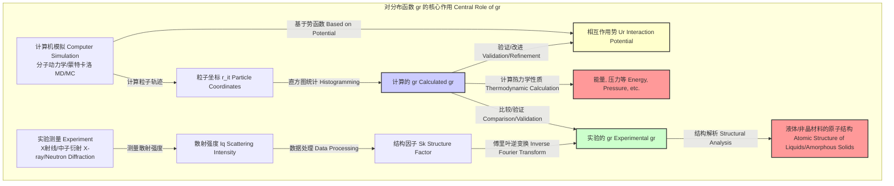

## 对分布函数 (pair distribution function)

对分布函数，通常表示为 $g(r)$，在统计力学和凝聚态物理中是一个核心概念。它描述了在一个给定粒子周围，距离为 $r$ 的地方找到另一个粒子的概率密度，并与系统的平均数密度进行了归一化。因此，它提供了关于物质（特别是液体和非晶态固体）微观结构的宝贵信息。它在文献中也常被称为**对关联函数 (pair correlation function)**。

### 1. 核心概念与数学基础

从根本上说，$g(r)$ 量化了系统中的粒子相对于完全随机分布（理想气体）的偏离程度。

#### 数学定义

在一个包含 $N$ 个粒子的系统中，其体积为 $V$，总势能为 $U(\mathbf{r}^N) = U(\mathbf{r}_1, \mathbf{r}_2, \dots, \mathbf{r}_N)$，两体分布函数 $n^{(2)}(\mathbf{r}_1, \mathbf{r}_2)$ 定义为在位置 $\mathbf{r}_1$ 和 $\mathbf{r}_2$ 同时找到两个粒子的概率密度。在正则系综中，它可以表示为：
$$ n^{(2)}(\mathbf{r}_1, \mathbf{r}_2) = \frac{N(N-1)}{Z_N} \int \dots \int e^{-\beta U(\mathbf{r}^N)} d\mathbf{r}_3 \dots d\mathbf{r}_N $$
其中：
*   $N$: 系统中的粒子总数。
*   $Z_N = \int \dots \int e^{-\beta U(\mathbf{r}^N)} d\mathbf{r}_1 \dots d\mathbf{r}_N$: 系统的构型积分。
*   $\beta = 1/(k_B T)$: 逆温度，其中 $k_B$ 是玻尔兹曼常数，$T$ 是绝对温度。
*   $U(\mathbf{r}^N)$: N粒子系统的总势能。
*   $\int d\mathbf{r}_i$: 对粒子 $i$ 的所有空间坐标进行积分。

对分布函数 $g(\mathbf{r}_1, \mathbf{r}_2)$ 是通过用平均数密度 $\rho = N/V$ 对 $n^{(2)}(\mathbf{r}_1, \mathbf{r}_2)$ 进行归一化得到的：
$$ g(\mathbf{r}_1, \mathbf{r}_2) = \frac{n^{(2)}(\mathbf{r}_1, \mathbf{r}_2)}{\rho^2} $$
对于均匀和各向同性的系统（如液体或气体），该函数仅依赖于两个粒子间的距离 $r = |\mathbf{r}_1 - \mathbf{r}_2|$。因此，我们得到标量函数 $g(r)$：
$$ g(r) = \frac{V}{N^2} \left\langle \sum_{i=1}^N \sum_{j \neq i} \delta(\mathbf{r} - (\mathbf{r}_i - \mathbf{r}_j)) \right\rangle $$
其中：
*   $\langle \dots \rangle$: 表示在统计系综（例如，正则系综或微正则系综）上的平均。
*   $\delta(\cdot)$: 狄拉克δ函数。
*   $\mathbf{r}_i, \mathbf{r}_j$: 粒子 $i$ 和 $j$ 的位置矢量。

从物理意义上讲，$\rho g(r)$ 代表了以一个粒子为中心，在距离 $r$ 处的局部粒子数密度。因此，$4\pi r^2 \rho g(r) dr$ 给出了在距离中心粒子 $r$ 到 $r+dr$ 的球壳内找到其他粒子的平均数目。

#### 关键行为
*   **长程行为**: 当 $r \to \infty$ 时，两个粒子之间的关联消失，因此 $g(r) \to 1$。这表示在远距离处，找到一个粒子的概率等于宏观平均密度。
*   **短程行为**: 当 $r \to 0$ 时，由于粒子间的排斥作用（特别是泡利不相容原理和库仑排斥），$g(r) \to 0$。
*   **结构峰**: 在液体或非晶固体中，$g(r)$ 在特定距离处显示出若干峰。第一个峰对应于第一配位层（最近邻），第二个峰对应于第二配位层，依此类推。峰的宽度反映了结构的无序程度。在晶体中，这些峰会变成狄拉克δ函数形式的尖锐峰，对应于晶格的精确位置。

### 2. 关键技术规格

下表总结了 $g(r)$ 的关键特征及其在不同物相中的典型表现。

| 特征 (Feature) | 描述 (Description) | 典型值 / 单位 (Typical Value / Unit) |
| :--- | :--- | :--- |
| 渐进行为 ($r \to \infty$) | 在大距离上，粒子位置不相关，局部密度趋于平均密度。 | $g(r) \to 1$ (无量纲) |
| 接触值 ($r \to 0^+$) | 由于粒子体积排斥，在粒子直径以下的距离处，函数值为零。 | $g(r) \approx 0$ for $r < \sigma$ (其中 $\sigma$ 是粒子有效直径) |
| 第一个峰的位置 ($r_1$) | 最可几的近邻粒子间距，大致对应于粒子直径。 | 约等于粒子直径。单位：埃 (Å) 或纳米 (nm)。 |
| 第一个峰的高度 ($g(r_1)$) | 反映了第一配位层的有序程度。液体中通常为 2-3。 | 无量纲。密度越高，有序性越强，峰值越高。 |
| 配位数 ($n_c$) | 对 $g(r)$ 的第一个峰进行积分，得到第一配位层中的平均粒子数。 | $n_c = 4\pi\rho \int_0^{r_{min}} r^2 g(r) dr$ (无量纲)。$r_{min}$ 是第一个谷的位置。 |

### 3. 常见用例

$g(r)$ 是连接微观原子结构和宏观材料性质的桥梁，具有广泛的应用。

*   **结构表征**:
    *   确定液体、玻璃和非晶材料的短程有序和中程有序结构。
    *   通过与X射线衍射或中子衍射实验数据进行比较，验证和精化原子结构模型。实验测量的结构因子 $S(k)$ 可通过傅里叶变换得到 $g(r)$。
*   **热力学性质计算**:
    *   **内能 (Internal Energy)**: 对于只考虑对势 $u(r)$ 的系统，总能量可以直接从 $g(r)$ 计算：
        $$ \frac{U}{N} = \frac{3}{2}k_B T + 2\pi\rho \int_0^\infty r^2 u(r) g(r) dr $$
    *   **压力 (Pressure)**: 维里压力方程将压力与 $g(r)$ 联系起来：
        $$ P = \rho k_B T - \frac{2\pi\rho^2}{3} \int_0^\infty r^3 \frac{du(r)}{dr} g(r) dr $$
        通过此方程从分子动力学模拟计算压力，其精度通常与直接计算维里（误差 < 1%）相当，并能提供更深入的物理洞察。
    *   **等温压缩系数 (Isothermal Compressibility)**:
        $$ \kappa_T = \frac{1}{\rho k_B T} \left( 1 + 4\pi\rho \int_0^\infty r^2 [g(r)-1] dr \right) $$
*   **相互作用势验证**:
    *   分子模拟中使用的力场（原子间相互作用势）的准确性可以通过比较模拟得到的 $g(r)$ 与实验得到的 $g(r)$ 来评估。

### 4. 实现考量

$g(r)$ 主要通过两种方式获得：计算机模拟和实验数据分析。

#### 计算机模拟 (MD/MC)
在分子动力学 (MD) 或蒙特卡洛 (MC) 模拟中，$g(r)$ 通过对大量粒子构型进行统计平均来计算。

*   **算法**: 直方图法 (Histogram Method)
    1.  **初始化**: 创建一个一维数组（直方图），其 bin 的宽度为 $\Delta r$。
    2.  **遍历**: 在每个模拟时间步，遍历所有粒子对 $(i, j)$。
    3.  **计算距离**: 计算粒子对之间的距离 $r_{ij} = |\mathbf{r}_i - \mathbf{r}_j|$。
    4.  **更新直方图**: 找到对应的 bin 索引 $k = \lfloor r_{ij} / \Delta r \rfloor$，并增加该 bin 的计数。
    5.  **归一化**: 在模拟结束后，对直方图进行归一化。对于 bin $k$（对应距离 $r = (k+0.5)\Delta r$），归一化公式为：
        $$ g(r) = \frac{\text{Histogram}[k]}{N_{ideal}(r)} = \frac{\text{Count}[k] / N_{steps}}{4\pi r^2 \Delta r \rho (N-1)/N} $$
        其中 $N_{ideal}(r)$ 是理想气体在相应球壳内的期望粒子数。

*   **算法复杂度**:
    *   **朴素算法**: 遍历所有 $N(N-1)/2$ 个粒子对，复杂度为 $O(N^2)$。对于大系统，计算成本非常高。
    *   **优化算法**: 使用**单元列表 (Cell Lists)**或**Verlet列表 (Verlet Lists)**等近邻搜索算法，只考虑截断半径内的粒子对。这可以将计算复杂度显著降低到 $O(N)$ 或 $O(N \log N)$。

#### 实验数据分析
在衍射实验中，测量的是与结构因子 $S(k)$ 相关的散射强度 $I(k)$。$g(r)$ 可通过傅里叶变换从 $S(k)$ 获得。
$$ g(r) = 1 + \frac{1}{2\pi^2\rho r} \int_0^\infty k[S(k)-1]\sin(kr)dk $$
*   **挑战**: 实验数据 $S(k)$ 的测量范围是有限的（$k_{min} < k < k_{max}$）。积分截断会导致傅里叶变换结果中出现非物理的涟漪（截断误差），需要进行数据平滑或外推处理。

### 5. 性能特征

由于 $g(r)$ 是一个统计量，因此其计算精度和可靠性至关重要。

*   **统计收敛性**: 从模拟中计算的 $g(r)$ 是对系综平均的估计。需要足够长的模拟时间（或足够多的独立构型）以确保其收敛到真实值。可以通过观察 $g(r)$ 随模拟时间的演化来判断是否收敛。
*   **统计误差**: $g(r)$ 的每个 bin 的值都存在统计不确定性。
    *   **块平均法 (Block Averaging)**: 这是估计统计误差的标准方法。将整个模拟轨迹分成多个数据块，为每个块计算一个 $g(r)$，然后计算这些 $g(r)$ 值的标准误差。
    *   **置信区间**: 对于每个 bin $i$ 的值 $g_i$，可以报告其均值和标准误差 $\sigma_i$，即 $g_i \pm \sigma_i$。对于 $M$ 个数据块，95% 置信区间约为 $g_i \pm 1.96 \frac{\sigma_i}{\sqrt{M}}$。
*   **系统尺寸效应**: 在模拟中，由于周期性边界条件，计算的 $g(r)$ 在距离大于模拟盒子尺寸一半 ($L/2$) 时会受到影响，变得不可靠。因此，模拟盒子必须足够大，以包含数个配位层。

### 6. 相关技术与比较

$g(r)$ 是描述系统结构的一系列相关函数和概念中的一员。

#### 径向分布函数 (Radial Distribution Function, RDF)
在某些文献中，径向分布函数 $RDF(r)$ 与 $g(r)$ 可互换使用。但一个更精确的定义是：
$$ RDF(r) = 4\pi r^2 \rho g(r) $$
$RDF(r)dr$ 直接给出了在距离中心粒子 $r$ 到 $r+dr$ 的球壳内找到其他粒子的平均数目。对 $RDF(r)$ 的第一个峰进行积分可以直接得到配位数。

#### 结构因子 (Structure Factor, S(k))
结构因子 $S(k)$ 是 $g(r)$ 在傅里叶空间（或倒易空间）中的对应物，是中子或X射线散射实验直接测量的物理量。
它们通过以下傅里叶变换对相关联：
$$ S(k) = 1 + 4\pi\rho \int_0^\infty r^2 [g(r)-1] \frac{\sin(kr)}{kr} dr $$
$$ g(r) - 1 = \frac{1}{2\pi^2\rho} \int_0^\infty k^2 [S(k)-1] \frac{\sin(kr)}{kr} dk $$
其中 $k$ 是波矢的大小。$S(k)$ 描述了系统在不同空间尺度上的密度涨落。

#### 高阶关联函数
$g(r)$ 是两体关联函数。还可以定义更高阶的函数，如**三体关联函数** $g^{(3)}(\mathbf{r}_1, \mathbf{r}_2, \mathbf{r}_3)$，它描述了在三个位置同时找到粒子的概率。这些高阶函数包含有关角度相关性和更复杂局部环境的信息，但计算和分析的难度要大得多。

#### Mermaid 关系图

下面的图表展示了对分布函数 $g(r)$ 在连接理论、模拟和实验中的核心作用。

### 7. 参考文献 (References)

*   Hansen, J. P., & McDonald, I. R. (2013). *Theory of Simple Liquids* (4th ed.). Academic Press. (这是关于液体理论的权威和全面的参考书).
*   Allen, M. P., & Tildesley, D. J. (2017). *Computer Simulation of Liquids* (2nd ed.). Oxford University Press. (这是关于分子模拟技术及其理论基础的经典教材). DOI: [10.1093/oso/9780198803195.001.0001](https://doi.org/10.1093/oso/9780198803195.001.0001)
*   Yarnell, J. L., Katz, M. J., Wenzel, R. G., & Koenig, S. H. (1973). Structure Factor and Radial Distribution Function for Liquid Argon at 85 °K. *Physical Review A*, 7(6), 2130–2144. DOI: [10.1103/PhysRevA.7.2130](https://doi.org/10.1103/PhysRevA.7.2130) (这是一篇结合了精确中子衍射实验和理论计算的经典论文).