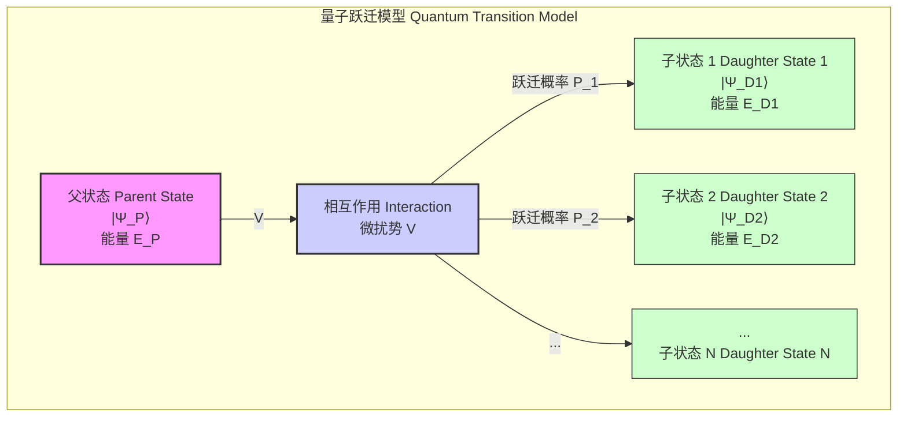
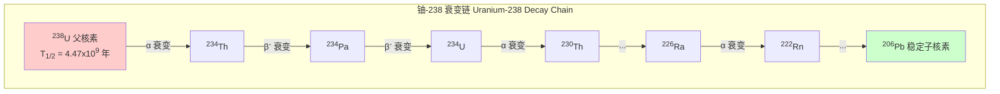
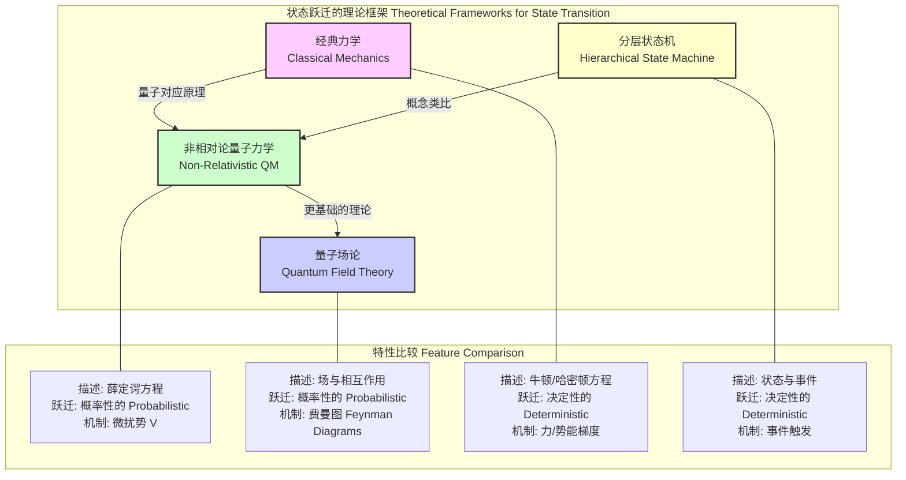

## 父状态 (Parent State)

在量子物理学和动力系统中，“父状态”是一个基础概念，用于描述一个系统在发生跃迁、衰变或演化之前的初始量子态或宏观状态。该状态包含系统演化成一个或多个“子状态”所需的所有信息。本文档将以科学和数学的严谨性，对父状态的核心概念、技术规格、应用和理论基础进行详尽阐述。

### 核心概念与数学基础

在量子力学框架下，一个物理系统的状态由希尔伯特空间（Hilbert Space） $\mathcal{H}$ 中的一个态矢量（state vector）$|\Psi\rangle$ 来描述。父状态，记作 $|\Psi_P\rangle$，特指系统在初始时刻 $t_0$ 的状态。系统的动力学演化由哈密顿算符（Hamiltonian Operator） $H$ 决定。

系统的演化遵循含时薛定谔方程（Time-Dependent Schrödinger Equation）：
$$
i\hbar \frac{\partial}{\partial t} |\Psi(t)\rangle = H |\Psi(t)\rangle
$$
其中：
*   $|\Psi(t)\rangle$ 是系统在时间 $t$ 的态矢量。
*   $i$ 是虚数单位。
*   $\hbar$ 是约化普朗克常数，其值为 $1.054 \times 10^{-34}$ J·s。
*   $H$ 是系统的总哈密顿算符。

通常，哈密顿算符可以分解为两部分：
$$
H = H_0 + V
$$
*   $H_0$ 是未受微扰的哈密顿量，其本征态 $\{|\phi_n\rangle\}$ 是稳定态（或定态），满足 $H_0 |\phi_n\rangle = E_n |\phi_n\rangle$。
*   $V$ 是相互作用微扰势，它引起不同本征态之间的跃迁，即从父状态 $|\Psi_P\rangle$ 到一个或多个子状态 $|\Psi_{D_i}\rangle$ 的跃迁。

如果父状态 $|\Psi_P\rangle$ 是一个不稳定的激发态，它将随时间演化并衰变。其存活概率 $P(t)$（即在时间 $t$ 仍处于父状态的概率）通常遵循指数衰减定律：
$$
P(t) = |\langle \Psi_P | \Psi(t) \rangle|^2 = e^{-\lambda t}
$$
*   $\lambda$ 是衰变常数，表示单位时间内发生衰变的概率。

下图展示了父状态在微扰作用下向多个子状态跃迁的概念模型。

### 关键技术规格

描述父状态衰变特性的关键参数具有精确的物理意义和单位。这些参数在实验物理和理论分析中至关重要。

| 参数 (Parameter) | 符号 (Symbol) | 定义 (Definition) | 数学关系 (Formula) | 单位 (Unit) |
| :--- | :---: | :--- | :--- | :---: |
| 衰变常数 (Decay Constant) | $\lambda$ | 单位时间内父状态发生衰变的概率。 | $\lambda = \sum_i \lambda_i$ | s⁻¹ |
| 平均寿命 (Mean Lifetime) | $\tau$ | 父状态在衰变前存在的平均时间。 | $\tau = \frac{1}{\lambda}$ | s |
| 半衰期 (Half-Life) | $T_{1/2}$ | 初始数量的父状态衰变掉一半所需的时间。 | $T_{1/2} = \frac{\ln(2)}{\lambda} \approx 0.693 \tau$ | s |
| 衰变宽度 (Decay Width) | $\Gamma$ | 与寿命相关的能量不确定性。 | $\Gamma = \frac{\hbar}{\tau} = \hbar \lambda$ | eV, MeV, GeV |
| 分支比 (Branching Ratio) | $BR_i$ | 父状态衰变到特定子状态 $i$ 的概率。 | $BR_i = \frac{\lambda_i}{\lambda_{total}} = \frac{\Gamma_i}{\Gamma_{total}}$ | 无量纲 |

### 常见用例与量化指标

父状态的概念广泛应用于多个物理学分支，每个应用场景都有明确的量化性能指标。

*   **粒子物理学 (Particle Physics):**
    *   **用例:** 自由中子（父状态）的 β 衰变，衰变为质子、电子和反电中微子。
        $$ n \rightarrow p + e^- + \bar{\nu}_e $$
    *   **量化指标:**
        *   平均寿命 ($\tau$): $879.6 \pm 0.8$ s
        *   衰变能量 (Q-value): $0.782$ MeV

*   **核物理学 (Nuclear Physics):**
    *   **用例:** 碳-14 ($^{14}C$) 的放射性衰变，用于放射性碳定年法。$^{14}C$ 是父核素。
        $$ {}^{14}_{6}\text{C} \rightarrow {}^{14}_{7}\text{N} + e^- + \bar{\nu}_e $$
    *   **量化指标:**
        *   半衰期 ($T_{1/2}$): $5730 \pm 40$ 年
        *   分支比 (BR): $\approx 100\%$ 到 $^{14}N$

*   **原子与分子物理学 (Atomic and Molecular Physics):**
    *   **用例:** 氢原子中处于 $2p$ 激发态（父状态）的电子通过自发辐射跃迁到 $1s$ 基态（子状态）。
    *   **量化指标:**
        *   平均寿命 ($\tau$): $1.6 \times 10^{-9}$ s
        *   衰变宽度 ($\Gamma$): $4.1 \times 10^{-7}$ eV
        *   发射光子能量: $10.2$ eV (Lyman-alpha)

下图展示了典型的核素衰变链，其中一个衰变的子核素成为下一个衰变的父核素。

### 实现考量与算法分析

在计算和模拟中，处理父状态的演化有多种方法。

*   **微扰理论 (Perturbation Theory):**
    对于由弱相互作用 $V$ 引起的跃迁，可以使用费米黄金定则（Fermi's Golden Rule）来计算从初始父状态 $|i\rangle$ 到一组能量连续的末态 $|f\rangle$ 的跃迁速率 $\lambda_{i \to f}$。
    $$
    \lambda_{i \to f} = \frac{2\pi}{\hbar} |\langle f | V | i \rangle|^2 \rho(E_f)
    $$
    其中：
    *   $|i\rangle$ 是初始父状态 $|\Psi_P\rangle$。
    *   $|f\rangle$ 是最终子状态 $|\Psi_D\rangle$。
    *   $\langle f | V | i \rangle$ 是跃迁矩阵元，表示由微扰 $V$ 连接初末态的振幅。
    *   $\rho(E_f)$ 是末态的态密度（Density of States），表示在能量 $E_f$ 附近单位能量间隔内的量子态数量。能量守恒要求 $E_f \approx E_i$。

*   **蒙特卡洛模拟 (Monte Carlo Simulation):**
    这是一种强大的数值方法，用于模拟大量父状态的随机衰变过程。
    *   **算法:**
        1.  初始化：在 $t=0$ 时，有 $N_0$ 个父状态粒子。
        2.  时间步进：将时间划分为极小的时间步 $\Delta t$。
        3.  衰变判断：在每个 $\Delta t$ 内，单个粒子发生衰变的概率为 $p = 1 - e^{-\lambda \Delta t} \approx \lambda \Delta t$。
        4.  随机抽样：为每个粒子生成一个在 $[0, 1]$ 区间内均匀分布的随机数 $r$。
        5.  更新状态：如果 $r < p$，则该粒子衰变，将其从父状态集合中移除。
        6.  迭代：重复步骤 3-5，直到所有粒子衰变或达到模拟终止时间。
    *   **算法复杂度:** 对于 $N$ 个粒子和 $T$ 个时间步，该算法的计算复杂度为 $O(N \cdot T/\Delta t)$。

### 性能特征与统计度量

由于量子衰变的内在随机性，对父状态寿命和衰变产物的测量本质上是统计性的。

*   **泊松分布 (Poisson Distribution):** 在给定的时间间隔 $\Delta t$ 内，观测到的衰变次数 $k$ 服从泊松分布，前提是 $\Delta t \ll \tau$ 且粒子数 $N$ 很大。
    $$
    P(k; \mu) = \frac{\mu^k e^{-\mu}}{k!}
    $$
    其中，期望衰变次数 $\mu = N(t) \lambda \Delta t$。

*   **测量不确定性 (Measurement Uncertainty):** 对平均寿命 $\tau$ 的测量精度受信子计数统计的限制。如果总共观测到 $N_{dec}$ 个衰变事件，则寿命测量的相对统计不确定度近似为：
    $$
    \frac{\sigma_\tau}{\tau} \approx \frac{1}{\sqrt{N_{dec}}}
    $$
    例如，要将测量不确定度降低到 1%，需要观测到约 $10,000$ 个衰变事件。

*   **置信区间 (Confidence Interval):** 寿命测量结果通常以置信区间的形式给出。例如，一个 95% 的置信区间（对应于 $1.96\sigma$）为：
    $$
    \hat{\tau} \in \left[ \bar{\tau} - 1.96 \frac{\bar{\tau}}{\sqrt{N_{dec}}}, \bar{\tau} + 1.96 \frac{\bar{\tau}}{\sqrt{N_{dec}}} \right]
    $$
    其中 $\bar{\tau}$ 是测量的平均值。

### 相关技术与比较模型

父状态的概念不仅存在于标准量子力学中，也在更深层的理论和不同的学科领域中有所体现。

*   **量子场论 (Quantum Field Theory, QFT):**
    QFT 是描述基本粒子及其相互作用的更基本框架。在 QFT 中，衰变过程被看作是量子场的相互作用。父状态粒子（一个场的激发）湮灭，同时产生子状态粒子（其他场的激发）。计算跃迁振幅（S矩阵元）通常使用费曼图技术，这比非相对论量子力学中的微扰势方法更为普适和精确。

*   **经典力学 (Classical Mechanics):**
    在经典力学中，系统状态由广义坐标和动量 $(q, p)$ 定义。其演化是完全决定性的，由哈密顿或拉格朗日方程描述。不存在内在的概率性跃迁；系统的未来状态完全由其初始状态（父状态）唯一确定。

*   **分层状态机 (Hierarchical State Machines, HSM):**
    在计算机科学中，HSM 中的父状态是一个包含子状态的抽象概念。与量子系统不同，HSM 中的状态跃迁是确定性的，由预定义的事件触发。父状态可以为其所有子状态提供共享的上下文、数据或行为，这在概念上类似于物理系统中守恒量（如能量、动量）的继承。

### 参考文献 (References)

1.  Griffiths, D. J. (2018). *Introduction to Quantum Mechanics* (3rd ed.). Cambridge University Press.
2.  Fermi, E. (1934). Versuch einer Theorie der β-Strahlen. I. *Zeitschrift für Physik*, 88(3-4), 161–177. DOI: [10.1007/BF01351864](https://doi.org/10.1007/BF01351864)
3.  Particle Data Group, Workman, R. L., et al. (2022). Review of Particle Physics. *Progress of Theoretical and Experimental Physics*, 2022(8), 083C01. DOI: [10.1093/ptep/ptac097](https://doi.org/10.1093/ptep/ptac097)