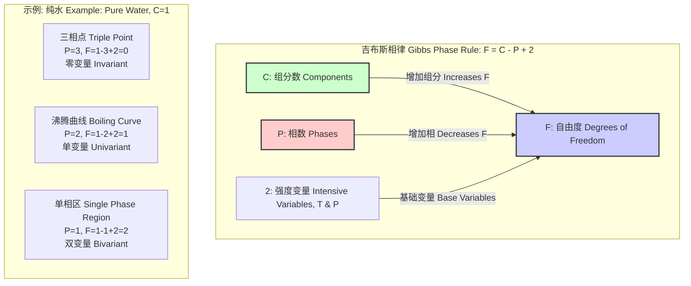
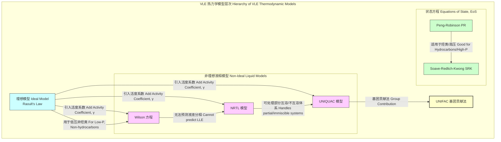

## 相平衡 (Phase Equilibrium)

相平衡是热力学的一个核心分支，研究在特定条件下，由一个或多个组分构成的多相体系中，各相之间达到宏观性质不随时间变化的稳定状态。在平衡状态下，尽管微观粒子（分子、原子）仍在不停地跨越相界，但宏观上物质在各相间的净迁移速率为零。该领域的理解对于化学工程、材料科学、地质学和物理学等众多科学与工程领域至关重要。

### 核心概念与数学基础

#### 1. 热力学判据与化学势 (Thermodynamic Criterion and Chemical Potential)

在恒定温度 ($T$) 和压力 ($P$) 的封闭体系中，系统达到平衡的充分必要条件是其**吉布斯自由能 (Gibbs Free Energy, $G$)** 达到最小值。吉布斯自由能定义为：

$$ G = H - TS = U + PV - TS $$

其中：
*   $G$ 是吉布斯自由能 (J)
*   $H$ 是焓 (J)
*   $T$ 是绝对温度 (K)
*   $S$ 是熵 (J/K)
*   $U$ 是内能 (J)
*   $P$ 是压力 (Pa)
*   $V$ 是体积 (m³)

对于一个多组分、多相体系，平衡的条件可以通过**化学势 (Chemical Potential, $\mu$)** 来表述。组分 $i$ 的化学势定义为在恒温恒压下，向体系中加入1摩尔组分 $i$ 所引起的吉布斯自由能的变化：

$$ \mu_i = \left( \frac{\partial G}{\partial n_i} \right)_{T, P, n_{j \neq i}} $$

其中：
*   $\mu_i$ 是组分 $i$ 的化学势 (J/mol)
*   $n_i$ 是组分 $i$ 的摩尔数 (mol)
*   $n_{j \neq i}$ 表示除组分 $i$ 外，所有其他组分的摩尔数保持恒定

**相平衡的基本准则**是：在平衡状态下，对于体系中的任意一个组分 $i$，其在所有共存的相（$\alpha, \beta, \gamma, ...$）中的化学势必须相等。

$$ \mu_i^\alpha = \mu_i^\beta = \mu_i^\gamma = \dots $$

这个条件确保了没有驱动力促使任何组分从一个相净迁移到另一个相。

#### 2. 吉布斯相律 (Gibbs Phase Rule)

吉布斯相律是一个简洁而强大的工具，用于确定非反应体系在平衡时独立变量（自由度）的数量。

$$ F = C - P + 2 $$

其中：
*   $F$ 是**自由度 (Degrees of Freedom)** 或称**方差 (Variance)**，表示在不改变相数的情况下，可以独立改变的密集变量（如温度、压力、组分浓度）的数量。
*   $C$ 是体系的**组分数 (Number of Components)**，即能够独立改变浓度的化学物质的最小数量。
*   $P$ 是体系中的**相数 (Number of Phases)**。
*   常数 `2` 代表两个独立的密集变量：温度 ($T$) 和压力 ($P$)。如果某个变量被固定（例如，恒压过程），则该常数减小。

#### 3. 克拉佩龙方程 (Clapeyron Equation)

克拉佩龙方程描述了单组分体系中两相平衡线的斜率，即压力随温度的变化率，精确地关联了相变过程中的热力学性质。

$$ \frac{dP}{dT} = \frac{\Delta H_m}{T \Delta V_m} = \frac{L}{T \Delta V_m} $$

其中：
*   $\frac{dP}{dT}$ 是相平衡线上压力随温度的变化率 (Pa/K)。
*   $\Delta H_m$ 是摩尔相变焓，也称为摩尔潜热 $L$ (J/mol)，例如摩尔熔化焓或摩尔汽化焓。
*   $T$ 是发生相变的绝对温度 (K)。
*   $\Delta V_m$ 是相变过程中的摩尔体积变化 ($V_{m, \text{final}} - V_{m, \text{initial}}$) (m³/mol)。

#### 4. 克劳修斯-克拉佩龙方程 (Clausius-Clapeyron Equation)

该方程是克拉佩龙方程在特定条件下的一个近似形式，主要适用于固-气和液-气平衡。其推导基于两个关键假设：
1.  气相体积远大于凝聚相（液相或固相）的体积，即 $\Delta V_m \approx V_{m, \text{gas}}$。
2.  气相可视为理想气体，即 $V_{m, \text{gas}} = RT/P$。

积分形式的克劳修斯-克拉佩龙方程非常实用：

$$ \ln\left(\frac{P_2}{P_1}\right) = -\frac{\Delta H_{\text{vap},m}}{R} \left(\frac{1}{T_2} - \frac{1}{T_1}\right) $$

其中：
*   $P_1, P_2$ 是在温度 $T_1, T_2$ 时的平衡蒸气压。
*   $\Delta H_{\text{vap},m}$ 是摩尔汽化焓 (J/mol)，在一个小的温度范围内可视为常数。
*   $R$ 是理想气体常数 (8.314 J/(mol·K))。

### 关键技术规格

下表列出了一些常见物质在相平衡研究中的关键物理化学常数。

**表1: 常见物质的三相点与临界点**

| 物质 (Substance) | 三相点温度 (Triple Point T) | 三相点压力 (Triple Point P) | 临界温度 (Critical T) | 临界压力 (Critical P) |
| :--- | :--- | :--- | :--- | :--- |
| 水 (H₂O) | 273.16 K (0.01 °C) | 611.657 Pa | 647.096 K | 22.064 MPa |
| 二氧化碳 (CO₂) | 216.592 K (-56.56 °C) | 518.5 kPa | 304.128 K | 7.3773 MPa |
| 氮 (N₂) | 63.151 K (-210.00 °C) | 12.523 kPa | 126.21 K | 3.3958 MPa |
| 氩 (Ar) | 83.8058 K (-189.34 °C) | 68.95 kPa | 150.687 K | 4.863 MPa |

**表2: 常见物质的标准摩尔相变焓 (在标准沸点下)**

| 物质 (Substance) | 摩尔熔化焓 ($\Delta H_{\text{fus},m}$) | 摩尔汽化焓 ($\Delta H_{\text{vap},m}$) |
| :--- | :--- | :--- |
| 水 (H₂O) | 6.01 kJ/mol (at 0 °C) | 40.66 kJ/mol (at 100 °C) |
| 苯 (C₆H₆) | 9.87 kJ/mol (at 5.5 °C) | 30.72 kJ/mol (at 80.1 °C) |
| 氨 (NH₃) | 5.66 kJ/mol (at -77.7 °C) | 23.33 kJ/mol (at -33.3 °C) |
| 乙醇 (C₂H₅OH) | 4.9 kJ/mol (at -114.1 °C) | 38.56 kJ/mol (at 78.4 °C) |

### 常见用例

#### 1. 蒸馏 (Distillation)

*   **原理**: 利用液-气平衡 (Vapor-Liquid Equilibrium, VLE) 中组分挥发度的差异进行分离。对于理想溶液，**拉乌尔定律 (Raoult's Law)** 描述了组分 $i$ 的分压 $p_i$ 与其在液相中的摩尔分数 $x_i$ 和纯组分饱和蒸气压 $P_i^{\text{sat}}$ 的关系：
    $$ p_i = x_i P_i^{\text{sat}} $$
    对于非理想溶液，需引入**活度系数 ($\gamma_i$)** 进行修正：
    $$ p_i = \gamma_i x_i P_i^{\text{sat}} $$
*   **应用**: 石油炼制、酒精提纯、空气分离。
*   **性能指标**: **分离效率 (Separation Efficiency)** 或 **相对挥发度 ($\alpha_{ij}$)**。例如，在乙醇-水体系的分离中，目标是使塔顶乙醇纯度达到 95.6% (wt) 的共沸点或通过变压蒸馏/萃取蒸馏进一步提纯。

#### 2. 超临界流体萃取 (Supercritical Fluid Extraction, SFE)

*   **原理**: 利用物质在超临界状态下（温度和压力均高于其临界点）独特的溶解能力。超临界流体兼具液体的密度和气体的低粘度、高扩散系数，其溶解能力可通过调节压力和温度来精确控制。
*   **应用**: 咖啡豆的脱咖啡因（使用超临界CO₂）、天然产物提取、聚合物加工。
*   **性能指标**: **萃取效率 (Extraction Efficiency)**。例如，使用超临界CO₂进行咖啡因萃取，通常可实现 >97% 的咖啡因去除率，同时保留咖啡豆原有的风味物质。

### 实现考量：闪蒸计算

在化学工程模拟中，**闪蒸计算 (Flash Calculation)** 是一个基础且核心的算法，用于确定一个已知组分 ($z_i$)、温度 ($T$) 和压力 ($P$) 的料液，在进入闪蒸罐后达到气液平衡时，气相和液相的量和组成。

#### Rachford-Rice 算法

该算法用于求解等温等压（T-P）闪蒸问题。核心是求解 **Rachford-Rice 方程**：

$$ f(\psi) = \sum_{i=1}^{C} \frac{z_i (K_i - 1)}{1 + \psi (K_i - 1)} = 0 $$

其中：
*   $\psi$ 是气化率 ($V/F$)，即气相摩尔流量与进料摩尔流量之比，取值范围为 [0, 1]。
*   $z_i$ 是组分 $i$ 在进料中的总摩尔分数。
*   $K_i$ 是组分 $i$ 的**相平衡常数** ($y_i/x_i$)，其中 $y_i$ 和 $x_i$ 分别是组分 $i$ 在气相和液相中的摩尔分数。$K_i$ 本身是温度、压力和组成的函数。

**算法步骤**:
1.  **初始化**: 给定进料组成 $z_i$、温度 $T$ 和压力 $P$。
2.  **估算 K 值**: 使用适当的模型估算所有组分的 $K_i$ 值。例如，对于理想体系，$K_i = P_i^{\text{sat}}(T) / P$。对于非理想体系，则需要更复杂的模型（如活度系数模型和状态方程）。
3.  **求解 $\psi$**: 使用数值方法（如牛顿-拉夫逊法或二分法）求解 Rachford-Rice 方程，找到满足 $f(\psi) = 0$ 的根 $\psi$。
4.  **计算相组成**:
    $$ x_i = \frac{z_i}{1 + \psi(K_i - 1)} $$
    $$ y_i = K_i x_i $$
5.  **归一化与收敛**: 检查 $\sum x_i = 1$ 和 $\sum y_i = 1$。如果体系是非理想的，可能需要基于计算出的 $x_i, y_i$ 更新 $K_i$ 值，并迭代步骤 3-5 直至收敛。

**算法复杂度**:
Rachford-Rice 方程的求解是算法的核心。对于牛顿法，其收敛速度是二次的。每次迭代的计算复杂度主要取决于计算 $f(\psi)$ 和其导数，这与组分数 $C$ 成正比，即 **$O(C)$**。总的计算时间取决于迭代次数，而迭代次数与体系的非理想程度和初始猜测的准确性有关。

### 性能特征

在相平衡建模中，模型的性能通过其预测值与高精度实验数据的符合程度来衡量。

*   **平均绝对偏差 (Average Absolute Deviation, AAD)**:
    $$ \text{AAD}_{\text{P}} (\%) = \frac{100}{N} \sum_{j=1}^{N} \left| \frac{P_{j, \text{exp}} - P_{j, \text{calc}}}{P_{j, \text{exp}}} \right| $$
    其中 $N$ 是数据点数量，exp 和 calc 分别代表实验值和计算值。此公式用于压力，也可类似地用于温度或摩尔分数。

*   **均方根误差 (Root Mean Square Error, RMSE)**:
    $$ \text{RMSE}_y = \sqrt{\frac{1}{N} \sum_{j=1}^{N} (y_{j, \text{exp}} - y_{j, \text{calc}})^2} $$
    此公式常用于评估气相或液相摩尔分数的预测精度。

**性能示例**: 对于常压下的乙醇-水 VLE 体系，使用 **NRTL (Non-Random Two-Liquid)** 活度系数模型，通常可以达到：
*   压力 AAD < 1%
*   气相摩尔分数 RMSE < 0.01
*   置信区间：在 95% 的置信水平下，模型预测的泡点温度与实验值的偏差通常在 ±0.5 K 以内。

### 相关技术与模型比较

描述相平衡行为，特别是 VLE，需要一系列热力学模型，其复杂性和适用性各不相同。

*   **活度系数模型 (Activity Coefficient Models)**: 主要用于修正液相的非理想性，通常与理想气体假设结合用于低压 VLE。
    *   **Wilson**: 参数较少，对极性体系拟合效果好，但不能描述液-液分相。
    *   **NRTL**: 更灵活，使用局部组成概念，能处理部分互溶和不互溶体系。
    *   **UNIQUAC**: 理论基础更强，将活度系数分为分子大小差异（组合项）和相互作用能（残余项）。
    *   **UNIFAC**: 是一个基团贡献法，无需混合物的实验数据，只需知道构成组分的官能团及其相互作用参数，具有强大的预测能力。

*   **状态方程 (Equation of State, EoS)**: 一个方程同时描述气相和液相的 P-V-T 关系和热力学性质。特别适用于高压系统和烃类物质。
    *   **Peng-Robinson (PR-EoS)**: 一个应用广泛的立方型状态方程，对非极性物质的气液平衡和密度预测有很高的精度，尤其是在临界区附近。
        $$ P = \frac{RT}{V_m - b} - \frac{a(T)}{V_m(V_m+b) + b(V_m-b)} $$
        其中参数 $a(T)$ 和 $b$ 与物质的临界性质和偏心因子有关。
    *   **Soave-Redlich-Kwong (SRK-EoS)**: 另一个流行的立方型状态方程，结构与 PR 类似，在许多应用中与 PR 性能相当。

### 参考文献

1.  Gibbs, J. W. (1876). On the Equilibrium of Heterogeneous Substances. *Transactions of the Connecticut Academy of Arts and Sciences*, 3, 108–248. (This foundational work established the principles of chemical thermodynamics and the phase rule).
2.  Renon, H., & Prausnitz, J. M. (1968). Local Compositions in Thermodynamic Excess Functions for Liquid Mixtures. *AIChE Journal*, 14(1), 135–144. DOI: [10.1002/aic.690140124](https://doi.org/10.1002/aic.690140124) (The seminal paper introducing the NRTL model).
3.  Peng, D. Y., & Robinson, D. B. (1976). A New Two-Constant Equation of State. *Industrial & Engineering Chemistry Fundamentals*, 15(1), 59–64. DOI: [10.1021/i160057a011](https://doi.org/10.1021/i160057a011) (The original paper for the Peng-Robinson equation of state).
4.  Poling, B. E., Prausnitz, J. M., & O'Connell, J. P. (2001). *The Properties of Gases and Liquids* (5th ed.). McGraw-Hill. (A comprehensive reference for phase equilibrium models and data).