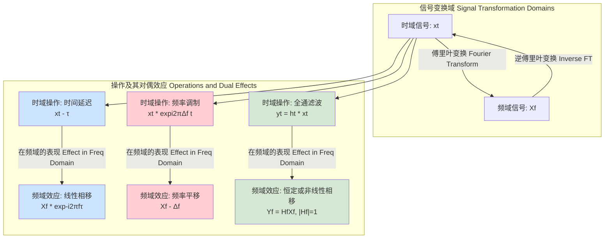

## 相位移 (Phase Shift)

相位移，或简称相移，是一个基础而关键的概念，广泛应用于物理学、工程学、数学以及众多科学技术领域。它描述了一个周期性函数（如波）相对于一个参考位置的横向位移。这种位移不是在空间坐标上的移动，而是在其自身周期内的位置变化，通常以角度（弧度或度）或时间单位来量化。

### 1. 核心概念与数学基础

从数学角度看，一个简单的正弦波可以表示为：

$$
y(t) = A \sin(\omega t + \phi_0)
$$

其中：
*   $y(t)$ 是波在时间 $t$ 的瞬时振幅。
*   $A$ 是振幅（Amplitude），即波动的最大值。
*   $\omega$ 是角频率（Angular Frequency），单位为弧度/秒 (rad/s)，它与频率 $f$ (Hz) 的关系是 $\omega = 2\pi f$。
*   $t$ 是时间（Time）。
*   $\phi_0$ 是初始相位（Initial Phase），表示在 $t=0$ 时刻波的起始位置。

**相位移** ($\Delta\phi$) 是指在初始相位 $\phi_0$ 上的一个增量。引入相位移后，波的方程变为：

$$
y'(t) = A \sin(\omega t + \phi_0 + \Delta\phi)
$$

这个 $\Delta\phi$ 项导致整个波形在时间轴上发生平移。
*   **相位超前 (Phase Lead)**: 如果 $\Delta\phi > 0$，波形向左平移。
*   **相位滞后 (Phase Lag)**: 如果 $\Delta\phi < 0$，波形向右平移。

相位移 $\Delta\phi$ 与时间延迟 $\tau$ 之间存在直接关系。一个大小为 $\tau$ 的时间延迟等效于一个频率相关的相位移：

$$
\Delta\phi = -\omega \tau = -2\pi f \tau
$$

负号表示时间上的延迟（$t$ 增加）对应于相位上的滞后。

在复数表示法中，波可以写为 $A e^{i(\omega t + \phi_0)}$。施加一个相位移 $\Delta\phi$ 等效于乘以一个复数因子 $e^{i\Delta\phi}$：

$$
A e^{i(\omega t + \phi_0)} \cdot e^{i\Delta\phi} = A e^{i(\omega t + \phi_0 + \Delta\phi)}
$$

这种表示法在信号处理和量子力学中尤其有用，因为它将相移简化为复数乘法。

### 2. 关键技术规格

下表总结了与相位移相关的关键参数及其技术规格。

| 参数 (Parameter) | 符号 (Symbol) | 定义 (Definition) | 标准单位 (SI Units) | 典型值范围 (Typical Range) |
| :--- | :---: | :--- | :--- | :--- |
| 相位移 (Phase Shift) | $\Delta\phi$ | 波形在其周期内的角度位移 | 弧度 (rad), 度 (°) | $-\pi$ 到 $\pi$ rad, 或 $0$ 到 $2\pi$ rad |
| 角频率 (Angular Frequency) | $\omega$ | 相位变化率 | 弧度/秒 (rad/s) | $10^2$ (电力) - $10^{16}$ (光学) |
| 频率 (Frequency) | $f$ | 每秒的周期数 | 赫兹 (Hz) | $50/60$ Hz - PHz |
| 时间延迟 (Time Delay) | $\tau$ | 波形在时间轴上的平移量 | 秒 (s) | $10^{-12}$ (ps) - $10^{-3}$ (ms) |
| 插入损耗 (Insertion Loss) | $L_i$ | 相移器引入的信号功率衰减 | 分贝 (dB) | $0.1$ dB - $10$ dB |
| 相位噪声 (Phase Noise) | $\mathcal{L}(f_m)$ | 信号相位中随机波动的功率谱密度 | dBc/Hz | $-90$ dBc/Hz @ 10 kHz (普通) 到 $-140$ dBc/Hz (高精度) |
| 带宽 (Bandwidth) | $BW$ | 相移器能有效工作的频率范围 | 赫兹 (Hz) | MHz, GHz |
| 分辨率 (Resolution) | $\delta\phi$ | 可实现的最小相位增量（数字相移器） | 度 (°), 比特 (bits) | $0.1°$ - $22.5°$ (4-bit) |

### 3. 常见用例与性能指标

相位移是许多现代技术的核心。

*   **通信系统：相移键控 (PSK)**
    *   **描述**: 一种数字调制技术，通过改变载波信号的相位来编码数据。例如，二进制相移键控 (BPSK) 使用两个相位（如 $0°$ 和 $180°$）来表示二进制的 '0' 和 '1'。正交相移键控 (QPSK) 使用四个相位（如 $45°, 135°, 225°, 315°$）来编码两位数据。
    *   **性能指标**: 误码率 (Bit Error Rate, BER)。在加性高斯白噪声 (AWGN) 信道中，QPSK 的理论误码率由 Q-函数 给出：
        $$ P_b = Q\left(\sqrt{\frac{2E_b}{N_0}}\right) = \frac{1}{2} \text{erfc}\left(\sqrt{\frac{E_b}{N_0}}\right) $$
        其中 $E_b/N_0$ 是每比特能量与噪声功率谱密度的比值。要达到 $10^{-5}$ 的 BER，通常需要 $E_b/N_0 \approx 9.6$ dB。

*   **波的干涉 (Wave Interference)**
    *   **描述**: 当两个或多个具有相同频率的波在空间中相遇时，它们的振幅会根据其相位关系进行叠加。
    *   **性能指标**: 干涉条纹可见度 (Fringe Visibility, $V$)
        $$ V = \frac{I_{max} - I_{min}}{I_{max} + I_{min}} $$
        *   **相长干涉 (Constructive Interference)**: 当相位差 $\Delta\phi = 2n\pi$ ($n$ 为整数) 时，振幅最大化，$I_{max}$ 出现。
        *   **相消干涉 (Destructive Interference)**: 当相位差 $\Delta\phi = (2n+1)\pi$ 时，振幅最小化，$I_{min}$ 出现。

*   **相控阵天线 (Phased Array Antennas)**
    *   **描述**: 通过精确控制天线阵列中每个单元的信号相位，可以动态地改变辐射波束的方向，而无需物理移动天线。这被广泛用于雷达和现代无线通信（如5G）。
    *   **性能指标**: 波束指向精度和方向图增益。波束指向角 $\theta$ 与单元间相位差 $\Delta\phi$ 的关系为：
        $$ \Delta\phi = \frac{2\pi d}{\lambda} \sin(\theta) $$
        其中 $d$ 是天线单元间距，$\lambda$ 是波长。

*   **量子力学：阿哈罗诺夫-玻姆效应 (Aharonov-Bohm Effect)**
    *   **描述**: 一个带电粒子（如电子）在穿过一个无磁场 ($B=0$) 但有磁矢量势 ($A \neq 0$) 的区域时，其波函数会获得一个额外的相位移。
    *   **性能指标**: 相位移的大小。该相位移 $\Delta\phi_{AB}$ 由沿粒子路径的磁矢量势的环路积分决定：
        $$ \Delta\phi_{AB} = \frac{q}{\hbar} \oint \mathbf{A} \cdot d\mathbf{l} = \frac{q\Phi_B}{\hbar} $$
        其中 $q$ 是粒子电荷，$\hbar$ 是约化普朗克常数，$\Phi_B$ 是穿过路径环路的磁通量。这个效应证明了电磁势在量子力学中的物理实在性，而不仅仅是数学工具。

### 4. 实现考量

相位移可以通过模拟电路或数字算法实现。

*   **模拟实现**
    *   **RC/RLC 网络**: 简单的电阻-电容 (RC) 或电阻-电感-电容 (RLC) 电路可以引入频率相关的相位移。例如，一个简单的 RC 低通滤波器，其相位移为 $\phi(f) = -\arctan(2\pi f RC)$。
    *   **全通滤波器 (All-Pass Filter)**: 这种滤波器在所有频率上具有平坦的幅度响应，但会引入一个可控的、频率相关的相位移。它常用于相位均衡。
    *   **矢量调制器 (Vector Modulator)**: 通过将信号分解为同相 (I) 和正交 (Q) 两个分量，然后用可变增益放大器分别调整它们的幅度，最后再合成为具有任意相位和幅度的信号。

*   **数字实现**
    *   **有限冲激响应 (FIR) 滤波器**: 通过设计滤波器的系数，可以实现特定的相位响应。一个具有对称系数的 FIR 滤波器具有线性相位响应，这对应于一个固定的群延迟。
        *   **算法复杂度**: 对于一个有 $N$ 个抽头的 FIR 滤波器，计算每个输出样本需要 $N$ 次乘法和 $N-1$ 次加法。因此，其计算复杂度为 $O(N)$。
    *   **CORDIC 算法 (Coordinate Rotation Digital Computer)**: 一种高效的迭代算法，用于计算三角函数和矢量旋转。它可以仅使用加、减和位移运算来生成具有精确相位的正弦/余弦波形，非常适合在 FPGA 和 ASIC 中实现。
        *   **算法复杂度**: 对于 $b$ 位的精度，CORDIC 算法通常需要大约 $b$ 次迭代，因此其复杂度为 $O(b)$。

### 5. 性能特征

理想的相移器只改变相位，但实际设备会引入其他不希望有的效应。

*   **相位噪声 (Phase Noise)**: 信号相位的短期随机波动。它在频域中表现为信号载波周围的噪声边带。
    *   **统计度量**: 通常用单边带功率谱密度 $\mathcal{L}(f_m)$ 来衡量，单位为 dBc/Hz，表示在距离载波 $f_m$ 处、1 Hz 带宽内的噪声功率与载波总功率的比值。
*   **相位误差 (Phase Error)**: 实际输出相位与期望相位之间的偏差。
    *   **统计度量**: 均方根 (RMS) 相位误差 $\sigma_{\phi}$，通常以度或弧度为单位。对于一个高斯分布的相位误差，其标准差即为 RMS 值。例如，一个相移器的 RMS 相位误差可能为 $1.5° \pm 0.2°$ (置信区间 95%)。
*   **插入损耗 (Insertion Loss)**: 信号通过相移器时发生的功率损失。这是一个关键参数，尤其是在级联系统中。
*   **幅度变化 (Amplitude Variation)**: 在调整相位时，输出信号的幅度可能会发生不希望有的变化。理想情况下，此变化应为零。

### 6. 相关技术与比较

相位移与其他信号变换密切相关。理解它们的区别与联系至关重要。

*   **与时间延迟 (Time Delay) 的关系**
    *   **数学模型**: 时间延迟 $\tau$ 会导致一个与频率 $f$ 成正比的线性相位移 $\Delta\phi(f) = -2\pi f \tau$。
    *   **区别**: 一个纯时间延迟器对所有频率分量施加相同的延迟时间，从而导致高频分量比低频分量有更大的相位移。而一个理想的（与频率无关的）相移器对所有频率分量施加相同的相位移，这意味着不同频率分量经历的时间延迟是不同的 ($\tau = -\Delta\phi / (2\pi f)$)。

*   **与频率偏移 (Frequency Shift) 的关系**
    *   **数学模型**: 一个恒定的频率偏移 $\Delta f$ 等效于一个随时间线性增长的相位移 $\Delta\phi(t) = 2\pi \Delta f \cdot t$。这可以通过将信号乘以一个复指数 $e^{i2\pi \Delta f t}$ 来实现。
    *   **区别**: 相位移是一个固定的相位偏移量，而频率偏移是相位随时间持续变化的变化率。

### 7. 参考文献

*   Aharonov, Y., & Bohm, D. (1959). Significance of Electromagnetic Potentials in the Quantum Theory. *Physical Review*, 115(3), 485–491. DOI: [10.1103/PhysRev.115.485](https://doi.org/10.1103/PhysRev.115.485)
*   Viterbi, A. J. (1966). *Principles of Coherent Communication*. McGraw-Hill. (This is a classic text that provides a rigorous mathematical foundation for phase-locked loops and coherent demodulation).
*   Proakis, J. G., & Salehi, M. (2008). *Digital Communications* (5th ed.). McGraw-Hill. (Provides detailed analysis of PSK and other digital modulation schemes, including performance metrics like BER). DOI: [10.1002/0471749338.ch6](https://doi.org/10.1002/0471749338.ch6) (Link to a related book chapter)
*   Mailloux, R. J. (2005). *Phased Array Antenna Handbook* (2nd ed.). Artech House. (A comprehensive resource on the theory and practice of phased arrays, where phase shift is the core operational principle).