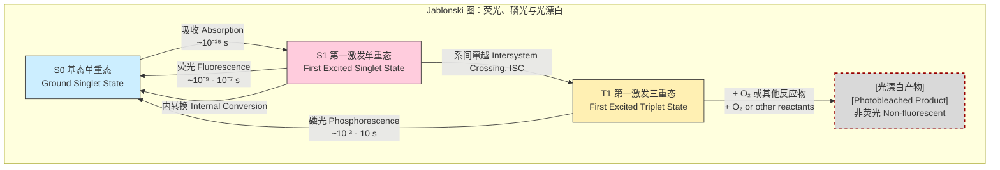
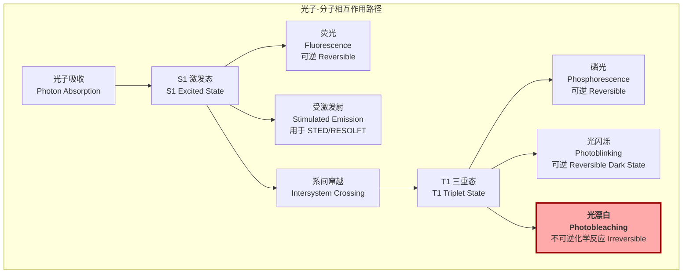

## 光漂白 (Photobleaching)

光漂白是指荧光分子在激发光照射下发生不可逆的光化学反应，从而永久丧失其发射荧光能力的现象。这一过程是荧光显微镜，特别是活细胞长时间成像中的一个主要限制因素。然而，通过精确控制，光漂白现象也被发展为多种强大的生物物理学研究技术，如FRAP和FLIP。

### 核心概念与数学基础

光漂白的核心机制涉及荧光分子的激发态化学。该过程通常通过Jablonski图来描述，它展示了分子吸收和释放能量的各种路径。

1.  **激发 (Excitation):** 分子从基态 ($S_0$) 吸收一个光子，跃迁到激发单重态 ($S_1$)。
2.  **荧光发射 (Fluorescence):** 分子从 $S_1$ 态快速回到 $S_0$ 态，并以光子的形式释放能量。这是我们期望的信号。
3.  **系间窜越 (Intersystem Crossing, ISC):** 分子有一定概率从 $S_1$ 态通过系间窜越进入寿命更长的激发三重态 ($T_1$)。$T_1$ 态的寿命（微秒到秒级）远长于 $S_1$ 态（纳秒级）。
4.  **光化学反应 (Photochemical Reaction):** 处于长寿命 $T_1$ 态的分子具有很高的化学反应活性。它极易与周围环境中的分子（最常见的是分子氧 O₂）发生反应，导致其化学结构被永久性破坏，形成非荧光产物。这一步是不可逆的，即为光漂白。

#### 数学模型

光漂白过程通常可以被建模为一级动力学过程。假设光漂白速率与瞬时未漂白的荧光分子数量和激发光强度成正比。

荧光分子数量随时间的变化可以表示为：
$$
\frac{dN(t)}{dt} = -k_{pb} N(t)
$$
对此微分方程求解，得到：
$$
N(t) = N_0 e^{-k_{pb}t}
$$
由于荧光强度 $I_f(t)$ 正比于未漂白的荧光分子数量 $N(t)$，因此荧光强度的衰减遵循相同的指数关系：
$$
I_f(t) = I_0 e^{-k_{pb}t}
$$
其中：
*   $N(t)$: 在时间 $t$ 时未漂白的荧光分子数量。
*   $N_0$: 初始的荧光分子数量 ($t=0$)。
*   $I_f(t)$: 在时间 $t$ 时的荧光强度。
*   $I_0$: 初始荧光强度 ($t=0$)。
*   $t$: 曝光时间 (s)。
*   $k_{pb}$: 光漂白速率常数 (s⁻¹)。

光漂白速率常数 $k_{pb}$ 本身取决于多个物理参数：
$$
k_{pb} = \frac{\sigma \cdot I_{exc} \cdot \Phi_{pb}}{E_{photon}} = \frac{\sigma \cdot I_{exc} \cdot \lambda_{exc} \cdot \Phi_{pb}}{h \cdot c}
$$
其中：
*   $\sigma$: 分子的吸收截面 (m²)，即分子捕获光子的有效面积。
*   $I_{exc}$: 激发光的辐照度 (W/m²)。
*   $\Phi_{pb}$: 光漂白量子产率 (无量纲)，表示一个被激发的分子发生光漂白的概率。它是系间窜越量子产率与三重态发生化学反应概率的乘积。
*   $E_{photon}$: 单个激发光子的能量 (J)，$E_{photon} = h\nu = hc/\lambda_{exc}$。
*   $h$: 普朗克常数 ($6.626 \times 10^{-34}$ J·s)。
*   $c$: 真空中的光速 ($3.0 \times 10^8$ m/s)。
*   $\lambda_{exc}$: 激发光的波长 (m)。

### 关键技术规格

不同荧光团的光稳定性差异巨大。一个关键的衡量指标是**“总发射光子数” (Total Emitted Photons)**，它表示一个荧光分子在被漂白前平均可以发射的光子总数，其值约等于 $\Phi_f / \Phi_{pb}$（荧光量子产率 / 光漂白量子产率）。

下表列出了一些常用荧光探针的典型光物理参数。

| 荧光团 (Fluorophore) | 激发/发射峰值 (nm) | 吸收截面 at $\lambda_{max}$ ($\sigma$) (cm²) | 荧光量子产率 ($\Phi_f$) | 光漂白量子产率 ($\Phi_{pb}$) | 漂白前可发射光子总数 ($\approx \Phi_f / \Phi_{pb}$) |
| :--- | :--- | :--- | :--- | :--- | :--- |
| Fluorescein (FITC) | 494 / 518 | $3.2 \times 10^{-16}$ | 0.92 | $\sim 3 \times 10^{-5}$ | $\sim 3 \times 10^4$ |
| Rhodamine B | 555 / 580 | $4.1 \times 10^{-16}$ | 0.31 | $\sim 5 \times 10^{-6}$ | $\sim 6 \times 10^4$ |
| EGFP | 488 / 507 | $2.5 \times 10^{-16}$ | 0.60 | $\sim 1 \times 10^{-6}$ | $\sim 6 \times 10^5$ |
| Alexa Fluor 488 | 495 / 519 | $3.0 \times 10^{-16}$ | 0.92 | $\sim 2 \times 10^{-6}$ | $\sim 5 \times 10^5$ |
| Cy5 | 649 / 670 | $1.5 \times 10^{-16}$ | 0.28 | $\sim 1 \times 10^{-5}$ | $\sim 3 \times 10^4$ |

*注意：$\Phi_{pb}$ 值高度依赖于环境因素，如氧气浓度、pH值和抗氧化剂的存在。*

### 常见用例与性能指标

#### 荧光漂白恢复技术 (FRAP)

FRAP (Fluorescence Recovery After Photobleaching) 是一种用于测量活细胞中荧光标记分子迁移率（如扩散、转运）的技术。

*   **过程:**
    1.  **前漂白 (Pre-bleach):** 拍摄一张或多张图像以确定初始荧光强度。
    2.  **漂白 (Bleach):** 使用高强度激光快速、不可逆地漂白一个小的感兴趣区域 (ROI)。
    3.  **后漂白 (Post-bleach):** 在较低的激发光强度下，连续拍摄图像，监测周围未漂白的荧光分子扩散进入ROI，导致该区域荧光强度恢复。
*   **定量性能指标:**
    *   **扩散系数 (Diffusion Coefficient, $D$):** 描述分子扩散快慢的参数。对于二维扩散，恢复曲线可以通过以下模型拟合：
        $$
        F(t) = F(\infty) \left( 1 - \frac{w^2}{w^2 + 4\pi Dt} \right)
        $$
        其中 $F(t)$ 是时间 $t$ 的荧光强度，$F(\infty)$ 是恢复平台期强度，$w$ 是漂白区域的半径。
    *   **可动组分 (Mobile Fraction, $M_f$):** 表示能够自由移动并参与荧光恢复的分子比例。
        $$
        M_f = \frac{I_{\infty} - I_{post}}{I_{pre} - I_{post}}
        $$
        其中 $I_{pre}$ 是漂白前强度，$I_{post}$ 是漂白后瞬间的强度，$I_{\infty}$ 是恢复平台期强度。

#### 荧光漂白丢失技术 (FLIP)

FLIP (Fluorescence Loss in Photobleaching) 用于研究不同细胞区域之间的连通性。

*   **过程:** 对一个区域进行反复的、持续的漂白，同时监测其他区域的荧光强度变化。如果其他区域的荧光强度随时间下降，则表明分子在这些区域与被漂白的区域之间存在交换。
*   **定量性能指标:** 远端区域荧光信号的**衰减速率**，该速率反映了分子从监测区域运输到漂白区域的动力学。

### 实现考量与算法分析

FRAP数据的分析通常涉及非线性曲线拟合，以从恢复曲线中提取物理参数。

*   **FRAP曲线拟合算法:**
    *   **算法:** 通常使用非线性最小二乘法 (Non-linear Least Squares, NLLS)，如Levenberg-Marquardt算法。
    *   **步骤:**
        1.  **数据预处理:** 背景扣除、因采集过程中的光漂白而进行的全局强度校正、归一化。
        2.  **模型选择:** 根据实验几何（如点漂白、条带漂白）和扩散模式（如正常扩散、异常扩散）选择合适的数学模型。
        3.  **参数初始化:** 为待拟合参数（如 $D$ 和 $M_f$）提供合理的初始猜测值。
        4.  **迭代拟合:** 算法迭代地调整参数，以最小化实验数据点与模型预测值之间的残差平方和 ($\chi^2$)。
*   **算法复杂度:**
    Levenberg-Marquardt算法单次迭代的计算复杂度约为 $O(np^2 + p^3)$，其中 $n$ 是数据点数量， $p$ 是参数数量。对于典型的FRAP分析（$p$ 通常为2或3），复杂度主要由 $O(n)$ 主导。总复杂度取决于达到收敛所需的迭代次数。

### 性能特征与统计度量

*   **光漂白速率 ($k_{pb}$):**
    *   **测量:** 通过将荧光强度随时间的衰减数据拟合到指数衰减模型 $I_f(t) = A e^{-k_{pb}t} + C$ 来实验性地确定。
    *   **统计度量:** 拟合得到的 $k_{pb}$ 值应报告其**标准误差 (Standard Error, SE)** 或 **95%置信区间 (95% Confidence Interval, CI)**。拟合优度可以通过**决定系数 ($R^2$)** 或**约化卡方 ($\chi^2_\nu$)** 来评估。一个接近1的 $R^2$ 值表示模型能很好地解释数据的变化。

*   **信噪比 (Signal-to-Noise Ratio, SNR):**
    *   **影响:** 光漂白会随时间降低图像的SNR。初始信号强，SNR高；随着信号 $I_f(t)$ 衰减，逐渐接近噪声基线，导致SNR恶化。
    *   **定义:** $SNR(t) = \frac{I_f(t) - I_{bg}}{\sigma_{noise}}$，其中 $I_{bg}$ 是背景信号均值，$\sigma_{noise}$ 是背景噪声的标准差。

### 相关技术与比较模型

光漂白与其他光物理现象密切相关，理解它们的区别至关重要。

*   **光闪烁 (Photoblinking):**
    *   **描述:** 荧光分子在荧光“开”态和一个非荧光“暗”态之间进行的可逆转换。暗态通常是三重态或自由基离子态。与光漂白不同，分子可以自发地从暗态恢复到能够发射荧光的状态。
    *   **数学模型:** 通常用一个至少包含三个状态（基态 $S_0$、激发态 $S_1$、暗态 $D$）的马尔可夫模型来描述。状态之间的转换速率（$k_{on}$, $k_{off}$）决定了荧光信号的间歇性。
    *   **与光漂白比较:** 光闪烁是一个可逆的循环过程，而光漂白是从激发态（通常是三重态）出发的终结性、不可逆的化学破坏。

*   **饱和激发 (Saturated Excitation):**
    *   **描述:** 用于超分辨率显微技术（如STED, RESOLFT）的原理。它使用第二束（损耗）激光，通过受激发射过程，主动地将处于激发态 $S_1$ 的分子强制送回基态 $S_0$，从而在空间上选择性地“关闭”荧光，而不是让它们自发荧光或进入三重态。
    *   **数学模型:** 描述分子布居数的速率方程必须包含受激发射项。有效荧光率变为 $\frac{k_{fl}}{1 + I_{STED}/I_{sat}}$，其中 $I_{STED}$ 是损耗光强，$I_{sat}$ 是饱和光强。
    *   **与光漂白比较:** 饱和激发技术主动地管理激发态，以阻止荧光发射和后续的ISC过程，从而有效避免光漂白。其目标是*绕过*导致光漂白的路径，而光漂白本身是一个不受控制的破坏过程。

### 参考文献

1.  Axelrod, D., Koppel, D. E., Schlessinger, J., Elson, E., & Webb, W. W. (1976). Mobility measurement by analysis of fluorescence photobleaching recovery kinetics. *Biophysical Journal*, 16(9), 1055–1069. DOI: [10.1016/S0006-3495(76)85755-4](https://doi.org/10.1016/S0006-3495(76)85755-4)
2.  Tsien, R. Y., & Waggoner, A. (1995). Fluorophores for confocal microscopy: photophysics and photochemistry. In J. B. Pawley (Ed.), *Handbook of Biological Confocal Microscopy* (pp. 267-279). Plenum Press.
3.  Cranfill, P. J., et al. (2016). Quantitative assessment of fluorescent proteins. *Nature Methods*, 13(7), 557–562. DOI: [10.1038/nmeth.3891](https://doi.org/10.1038/nmeth.3891)
4.  Song, L., Hennink, E. J., Young, I. T., & Tanke, H. J. (1995). Photobleaching kinetics of fluorescein in quantitative fluorescence microscopy. *Biophysical Journal*, 68(6), 2588–2600. DOI: [10.1016/S0006-3495(95)80442-X](https://doi.org/10.1016/S0006-3495(95)80442-X)