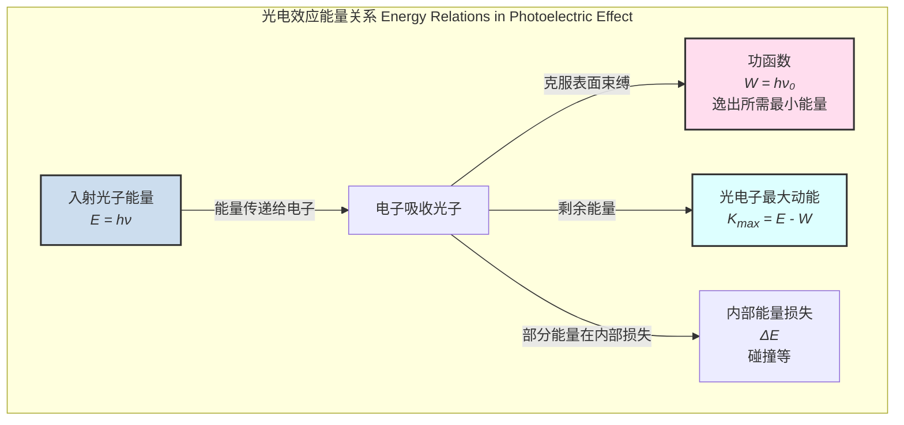
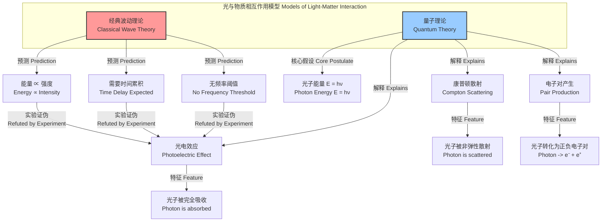

## 光电效应

光电效应（Photoelectric Effect）是一种量子现象，指当光（通常是紫外线或可见光）照射到某些物质上时，会引起物质表面的电子被激发并逸出，这些逸出的电子被称为“光电子”。对该现象的解释在量子力学的建立过程中起到了关键性的作用。

### 1. 核心概念与数学基础

经典电磁理论无法解释光电效应的几个关键实验观测结果。根据经典波动理论，光的能量与光的强度（振幅的平方）成正比，而与频率无关。这导致了与实验不符的几个预测：

*   **经典预测 vs. 实验事实**:
    *   **动能**: 经典理论预测，增加入射光强度会增加电磁场的振幅，从而将更多能量传递给电子，使得逸出光电子的最大动能增加。然而，实验表明，光电子的最大动能仅与入射光的频率有关，与强度无关。
    *   **时间延迟**: 经典理论预测，当入射光强度很弱时，电子需要一段时间来累积足够的能量才能逸出。实验表明，只要光的频率高于阈值，无论强度多弱，电子的逸出几乎是瞬时的（延迟小于 $10^{-9}$ 秒）。
    *   **频率阈值**: 经典理论预测，只要照射时间足够长，任何频率的光都应该能使电子逸出。实验表明，对于每种材料，都存在一个特征性的“截止频率”（或称阈值频率），只有当入射光的频率高于此阈值时，才会发生光电效应。

阿尔伯特·爱因斯坦在1905年提出了革命性的解释，他假设光的能量不是连续分布的，而是由一份份不连续的能量子组成的，这些能量子被称为“光子”（photon）。每个光子的能量 $E$ 与其频率 $\nu$ 成正比。

$$
E = h\nu
$$

其中：
*   $E$ 是单个光子的能量，单位是焦耳 (J) 或电子伏特 (eV)。
*   $h$ 是普朗克常数，一个基本物理常数。
*   $\nu$ 是入射光的频率，单位是赫兹 (Hz)。

基于光子假说，爱因斯坦提出了光电效应方程，完美地解释了所有实验现象：

$$
K_{max} = h\nu - W
$$

其中：
*   $K_{max}$ 是逸出光电子的最大动能。电子在逸出过程中可能会因与材料内部其他粒子碰撞而损失能量，因此我们关注其最大可能动能。
*   $h\nu$ 是单个入射光子的能量。
*   $W$ 是材料的**功函数**（Work Function），表示将一个电子从材料表面移出到真空中所需的最小能量。这是材料的固有属性。

此方程揭示了：
1.  **动能与频率的关系**: $K_{max}$ 与频率 $\nu$ 呈线性关系。光的强度（单位时间内光子数量）只影响逸出光电子的数量，而不影响单个光电子的最大动能。
2.  **瞬时性**: 单个光子与单个电子发生相互作用，能量传递是瞬时完成的，无需累积时间。
3.  **截止频率**: 只有当光子能量 $h\nu$ 大于或等于功函数 $W$ 时，电子才能逸出。因此，存在一个最小频率，即**截止频率** $\nu_0$。
    $$
    h\nu_0 = W \quad \implies \quad \nu_0 = \frac{W}{h}
    $$
    当 $\nu < \nu_0$ 时，无论光多强，都不会发生光电效应。

该方程也可以用波长 $\lambda$ 和**遏止电压** $V_s$ 来表示。遏止电压是在光电管实验中，为使最快的光电子恰好无法到达阳极而施加的反向电压。此时，光电子的动能完全被电场力做功所抵消。

$$
K_{max} = e V_s
$$

结合爱因斯坦方程，我们得到：

$$
e V_s = h\nu - W
$$

或者使用波长 $\lambda$ ($c = \nu\lambda$)：

$$
K_{max} = \frac{hc}{\lambda} - W
$$

其中：
*   $e$ 是基本电荷。
*   $V_s$ 是遏止电压，单位是伏特 (V)。
*   $c$ 是真空中的光速。
*   $\lambda$ 是入射光的波长，单位是米 (m)。

#### 能量关系图

下面的Mermaid图展示了光电效应中的能量转换关系。

### 2. 关键技术规格

下表列出了与光电效应相关的一些基本常数和典型材料参数。

| 参数 (Parameter) | 符号 (Symbol) | 值 (Value) | 单位 (Unit) |
| :--- | :---: | :--- | :--- |
| 普朗克常数 (Planck's Constant) | $h$ | $6.62607015 \times 10^{-34}$ | J·s |
| | | $4.135667696 \times 10^{-15}$ | eV·s |
| 基本电荷 (Elementary Charge) | $e$ | $1.602176634 \times 10^{-19}$ | C |
| 真空光速 (Speed of Light) | $c$ | $2.99792458 \times 10^8$ | m/s |
| 钠 (Sodium) 功函数 | $W_{Na}$ | ~2.36 | eV |
| 铜 (Copper) 功函数 | $W_{Cu}$ | ~4.7 | eV |
| 铂 (Platinum) 功函数 | $W_{Pt}$ | ~6.35 | eV |
| 铯 (Cesium) 功函数 | $W_{Cs}$ | ~2.14 | eV |

### 3. 常见应用案例

光电效应是许多现代技术的基础，其性能指标直接影响设备的应用范围和精度。

*   **光电倍增管 (Photomultiplier Tubes, PMTs)**
    *   **应用**: 用于探测极微弱的光信号，如天文学、粒子物理和医疗诊断。
    *   **性能指标**:
        *   **量子效率 (Quantum Efficiency, QE)**: 10% - 40% @ 峰值波长。
        *   **增益 (Gain)**: $10^5$ 至 $10^8$。
        *   **暗电流 (Dark Current)**: < 1 nA @ 25°C。
        *   **响应时间 (Response Time)**: 0.5 - 2 ns。

*   **电荷耦合器件 (Charge-Coupled Devices, CCDs) / CMOS图像传感器**
    *   **应用**: 数码相机、天文望远镜、光谱仪。
    *   **性能指标**:
        *   **量子效率 (QE)**: 背照式CCD可达 > 95%。
        *   **读出噪声 (Read Noise)**: < 2 e⁻ rms (均方根)。
        *   **动态范围 (Dynamic Range)**: > 90 dB。
        *   **像素尺寸 (Pixel Size)**: 1.0 - 15 µm。

*   **X射线光电子能谱 (X-ray Photoelectron Spectroscopy, XPS)**
    *   **应用**: 材料表面化学成分、元素价态和电子态的分析。
    *   **性能指标**:
        *   **能量分辨率 (Energy Resolution)**: < 0.4 eV (使用单色化X射线源)。
        *   **探测极限 (Detection Limit)**: ~0.1 原子百分比。
        *   **分析深度 (Analysis Depth)**: 1 - 10 nm。

### 4. 实现考量

在计算物理学中，可以通过蒙特卡洛方法对光电效应过程进行建模和仿真。

#### 蒙特卡洛仿真算法

1.  **初始化**: 定义材料参数（功函数 $W$、量子效率 $\eta(\nu)$）和光源参数（光子通量 $\Phi$、能量谱 $P(h\nu)$）。
2.  **时间步进**: 在每个时间步 $\Delta t$ 内，根据泊松分布生成入射光子数 $N_{ph}$，其均值为 $\bar{N}_{ph} = \Phi \cdot A \cdot \Delta t$ (A为受照面积)。
3.  **光子交互**: 对每个入射光子：
    a. 从能量谱 $P(h\nu)$ 中随机抽样其能量 $E_{ph} = h\nu$。
    b. 判断是否发生光电效应：生成一个 [0, 1] 之间的随机数 $r$。如果 $E_{ph} > W$ 且 $r < \eta(\nu)$，则一个光电子被激发。
4.  **电子动能计算**: 如果发生激发，计算光电子的最大初始动能 $K_{max} = E_{ph} - W$。
5.  **输运过程 (可选)**: 模拟光电子在材料内部的输运，考虑非弹性散射，得到最终逸出电子的能量分布和角分布。
6.  **统计与输出**: 记录逸出光电子的数量、能量分布等信息，进行统计分析。

#### 算法复杂度分析

该仿真算法的计算复杂度主要取决于模拟的光子总数 $N_{total}$。对于每个光子，交互和计算的步骤是常数时间操作（或取决于输运模型的复杂度）。因此，整个仿真的时间复杂度为：

$$
O(N_{total})
$$

这表明仿真时间与所需模拟的光子数量成线性关系，这对于规划大规模计算资源至关重要。

### 5. 性能特征

光电子的发射是一个随机过程，其统计特性对探测器的信噪比（SNR）有决定性影响。

#### 光电子统计 (Photoelectron Statistics)

光子的到达和光电子的发射遵循**泊松分布**。在给定的时间间隔 $\tau$ 内，探测到 $n$ 个光电子的概率为：

$$
P(n; \lambda_e) = \frac{e^{-\lambda_e} \lambda_e^n}{n!}
$$

其中，$\lambda_e$ 是在该时间间隔内期望探测到的平均光电子数。
$$
\lambda_e = \bar{n}_e = \eta \cdot \bar{n}_{ph} = \eta \cdot \frac{P_{in}}{h\nu} \cdot \tau
$$
*   $\eta$ 是量子效率。
*   $\bar{n}_{ph}$ 是平均入射光子数。
*   $P_{in}$ 是入射光功率。

这种固有的统计涨落称为**散粒噪声**（Shot Noise），其标准差为 $\sigma_{shot} = \sqrt{\bar{n}_e}$。

#### 信噪比 (Signal-to-Noise Ratio, SNR)

对于一个理想的、仅受散粒噪声限制的光电探测器，其信噪比为：

$$
\text{SNR} = \frac{\text{Signal}}{\text{Noise}} = \frac{\bar{n}_e}{\sqrt{\bar{n}_e}} = \sqrt{\bar{n}_e}
$$

在实际应用中，总噪声还包括暗电流噪声 ($N_{dark}$) 和读出噪声 ($\sigma_{read}$)。因此，更完整的SNR公式为：

$$
\text{SNR} = \frac{N_e}{\sqrt{N_e + N_{dark} + \sigma_{read}^2}}
$$

其中 $N_e$ 是信号电子数，$N_{dark}$ 是暗电流电子数，$\sigma_{read}^2$ 是读出噪声的方差。

### 6. 相关技术

光电效应是光与物质相互作用的一种基本形式。理解它需要与其它理论和效应进行对比。

#### 对比分析

*   **经典波动理论 (Classical Wave Theory)**
    *   **数学模型**: 电磁波能量流密度由坡印亭矢量 $\vec{S} = \frac{1}{\mu_0} \vec{E} \times \vec{B}$ 描述，其平均值（强度）$I \propto E_0^2$。
    *   **失败之处**: 无法解释光电子动能对强度的独立性、瞬时发射和截止频率的存在。

*   **康普顿散射 (Compton Scattering)**
    *   **数学模型**: 描述高能光子（如X射线）与自由或弱束缚电子的非弹性散射。动量和能量守恒。波长变化公式为：
        $$
        \lambda' - \lambda = \frac{h}{m_e c}(1 - \cos\theta)
        $$
        其中 $\lambda'$ 是散射后波长，$m_e$ 是电子静止质量，$\theta$ 是散射角。
    *   **与光电效应区别**: 在康普顿散射中，光子被散射，能量部分转移给电子；在光电效应中，光子被完全吸收，能量全部转移。

*   **光伏效应 (Photovoltaic Effect)**
    *   **机制**: 发生在半导体p-n结中。光子在结区产生电子-空穴对，内建电场将它们分离，从而在开路时产生电压。
    *   **数学模型**: 光照下的二极管伏安特性方程：
        $$
        I = I_0 \left( e^{\frac{qV}{nk_B T}} - 1 \right) - I_L
        $$
        其中 $I_L$ 是光生电流，与入射光功率成正比。
    *   **与光电效应区别**: 光伏效应是在材料内部产生载流子并形成电压/电流，电子不逸出材料；光电效应是电子从材料表面逸出到真空中。

### 7. 参考文献

1.  Einstein, A. (1905). Über einen die Erzeugung und Verwandlung des Lichtes betreffenden heuristischen Gesichtspunkt. *Annalen der Physik*, 322(6), 132-148.
    *   **DOI**: [10.1002/andp.19053220607](https://doi.org/10.1002/andp.19053220607)
    *   **简介**: 爱因斯坦提出光量子假说并解释光电效应的开创性论文。

2.  Millikan, R. A. (1916). A Direct Photoelectric Determination of Planck's "h". *Physical Review*, 7(3), 355-388.
    *   **DOI**: [10.1103/PhysRev.7.355](https://doi.org/10.1103/PhysRev.7.355)
    *   **简介**: 通过精密的实验验证了爱因斯坦的光电效应方程，并精确测定了普朗克常数h的值。

3.  Seitz, F. (1940). The Modern Theory of Solids. McGraw-Hill. (Reprinted by Dover Publications).
    *   **简介**: 这本经典的固态物理教科书详细讨论了金属的功函数和光电发射的理论基础。