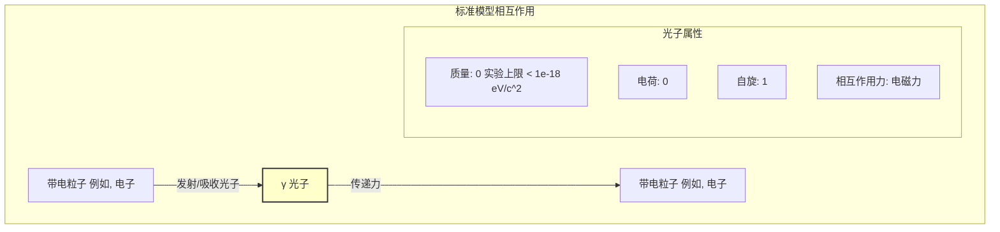
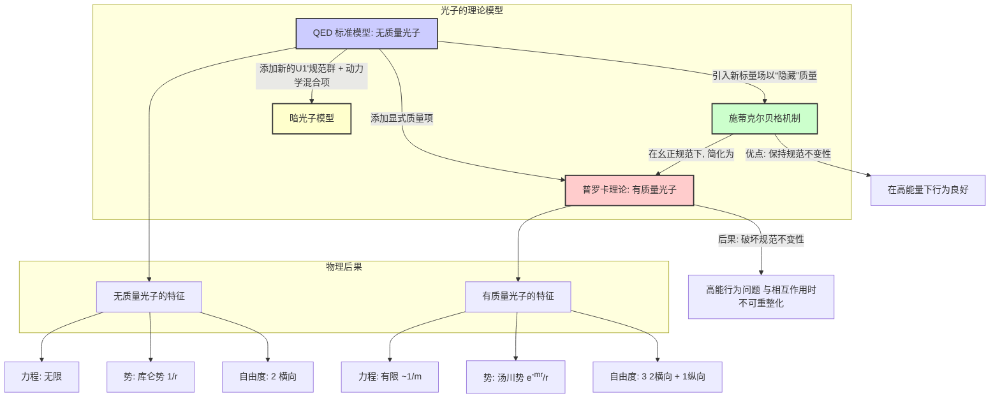

## 光子 (photon)

### 核心概念与数学基础

光子是负责电磁现象的基本粒子。它是电磁场的量子，包括光和无线电波等电磁辐射，并且是电磁力的力载体。

#### 波粒二象性
光子同时表现出波和粒子的特性。

- **粒子性**: 通过光电效应得到证明，其中能量以离散的包裹（即量子）形式传递。单个光子的能量与其频率成正比。
  $$ E = h\nu = \hbar\omega $$
  其中：
  *   $E$ 是光子能量。
  *   $h$ 是普朗克常数 ($6.626 \times 10^{-34} \text{ J}\cdot\text{s}$)。
  *   $\nu$ 是电磁波的频率。
  *   $\hbar = h/(2\pi)$ 是约化普朗克常数。
  *   $\omega = 2\pi\nu$ 是角频率。

- **波动性**: 由麦克斯韦方程组描述，光子以电磁波的形式传播。光子的动量与其波长有关。
  $$ p = \frac{h}{\lambda} = \hbar k $$
  其中：
  *   $p$ 是光子动量。
  *   $\lambda$ 是波长。
  *   $k = 2\pi/\lambda$ 是波数。

对于无质量粒子，相对论的能量-动量关系 $E^2 = (pc)^2 + (m_0c^2)^2$ 简化为：
$$ E = pc $$
这与关系式 $E=\hbar\omega$ 和 $p=\hbar k$ 以及波动关系 $\omega = ck$ 是一致的。

#### 电磁场的量子化
在量子电动力学 (QED) 中，电磁场是量子化的。矢量势 $A^\mu(x)$ 被提升为场算符。在库仑规范 ($\nabla \cdot \vec{A} = 0$) 下，矢量势算符 $\hat{\vec{A}}(\vec{r}, t)$ 可以用产生算符 ($\hat{a}_{\vec{k},\lambda}^\dagger$) 和湮没算符 ($\hat{a}_{\vec{k},\lambda}$) 进行展开：
$$ \hat{\vec{A}}(\vec{r}, t) = \sum_{\vec{k},\lambda} \sqrt{\frac{\hbar}{2\epsilon_0 V \omega_k}} \left( \vec{\epsilon}_{\vec{k},\lambda} \hat{a}_{\vec{k},\lambda} e^{i(\vec{k}\cdot\vec{r} - \omega_k t)} + \vec{\epsilon}_{\vec{k},\lambda}^* \hat{a}_{\vec{k},\lambda}^\dagger e^{-i(\vec{k}\cdot\vec{r} - \omega_k t)} \right) $$
其中：
*   $V$ 是量子化体积。
*   $\epsilon_0$ 是真空介电常数。
*   $\vec{k}$ 是波矢。
*   $\omega_k = c|\vec{k}|$ 是角频率。
*   $\lambda$ 标记了两种可能的偏振（与 $\vec{k}$ 横向）。
*   $\vec{\epsilon}_{\vec{k},\lambda}$ 是偏振矢量。
*   $\hat{a}_{\vec{k},\lambda}$ 湮没一个动量为 $\hbar\vec{k}$、偏振为 $\lambda$ 的光子。
*   $\hat{a}_{\vec{k},\lambda}^\dagger$ 产生一个动量为 $\hbar\vec{k}$、偏振为 $\lambda$ 的光子。

这些算符遵循玻色子对易关系：
$$ [\hat{a}_{\vec{k},\lambda}, \hat{a}_{\vec{k}',\lambda'}^\dagger] = \delta_{\vec{k},\vec{k}'} \delta_{\lambda,\lambda'} $$
$$ [\hat{a}_{\vec{k},\lambda}, \hat{a}_{\vec{k}',\lambda'}] = [\hat{a}_{\vec{k},\lambda}^\dagger, \hat{a}_{\vec{k}',\lambda'}^\dagger] = 0 $$

自由电磁场的哈密顿量则为：
$$ \hat{H} = \sum_{\vec{k},\lambda} \hbar\omega_k \left( \hat{a}_{\vec{k},\lambda}^\dagger \hat{a}_{\vec{k},\lambda} + \frac{1}{2} \right) $$
项 $\hat{N}_{\vec{k},\lambda} = \hat{a}_{\vec{k},\lambda}^\dagger \hat{a}_{\vec{k},\lambda}$ 是粒子数算符，其本征值为整数 $n=0, 1, 2, ...$，代表该模式中的光子数量。$\frac{1}{2}\hbar\omega_k$ 项代表真空的零点能。

#### 在标准模型中的角色
光子 ($\gamma$) 是粒子物理标准模型中的一个基本粒子。
*   **分类**: 它是无质量、电中性的规范玻色子。
*   **自旋**: 它的自旋为1，因此被归类为玻色子。然而，由于其无质量的特性，它只有两个自旋投影（螺旋度态），+1和-1，分别对应于左旋和右旋圆偏振。纵向偏振态不存在。
*   **相互作用**: 它是电磁力的媒介。它与任何带电荷的粒子耦合。这种耦合的强度由基本电荷 $e$ 决定。

### 关键技术规格

光子的性质由基本理论定义，并受到高精度实验的约束。

| 属性 | 值 / 上限 | 单位 | 备注 |
| --- | --- | --- | --- |
| 质量 ($m_\gamma$) | $< 1 \times 10^{-18}$ | eV/c² | 理论值为0。实验上限在90%置信水平 (PDG 2022)。 |
| 电荷 ($q$) | $< 1 \times 10^{-35}$ | $e$ (基本电荷) | 理论值为0。实验上限。 |
| 自旋 ($J$) | 1 | $\hbar$ | 整数自旋使其成为玻色子。 |
| 寿命 ($\tau$) | 稳定 | s | 作为无质量粒子，它不能衰变。 |
| 真空中的速度 ($c$) | 299,792,458 | m/s | 根据米的定义，此为精确值。 |
| 螺旋度态 | $\pm 1$ | | 对应于两个横向偏振态。 |

### 常见用例与性能指标

*   **电信（光纤）**: 光子是信息载体。
    *   **波长**: 通常为 1310 nm 或 1550 nm。
    *   **性能指标**: 衰减。对于SMF-28光纤，在1550 nm处的衰减通常 < 0.2 dB/km。
    *   **性能指标**: 色散。在1550 nm处，色散约为 +17 ps/(nm·km)。使用色散位移光纤来最小化此效应。

*   **激光（受激辐射光放大）**: 光子的相干源。
    *   **性能指标**: 相干长度。对于氦氖激光器，可以 > 100 m。对于二极管激光器，可以从毫米到米。
    *   **性能指标**: 功率/能量。从毫瓦（激光笔）到拍瓦（研究激光器）。
    *   **性能指标**: 单色性。对于稳频激光器，线宽可以 < 1 MHz。

*   **量子信息科学**: 光子被用作“飞行量子比特”。
    *   **编码**: 量子比特信息可以编码在偏振、时间戳或路径中。
    *   **性能指标**: 单光子纯度。通过二阶相干函数 $g^{(2)}(0)$ 测量。对于完美的单光子源，$g^{(2)}(0) = 0$。实际的源目标是 $g^{(2)}(0) < 0.1$。
    *   **性能指标**: 纠缠保真度。对于纠缠光子对，用于贝尔测试或量子密码学的保真度应 > 90%。

*   **医学成像 (PET/X射线)**: 高能光子用于诊断。
    *   **PET（正电子发射断层扫描）**: 检测来自电子-正电子湮没的一对 511 keV 伽马光子。
    *   **性能指标**: 空间分辨率。现代PET扫描仪可实现约4-5 mm的分辨率。
    *   **X射线/CT**: 使用能量在20-150 keV范围内的光子。
    *   **性能指标**: 图像对比度和信噪比 (SNR)。

### 理论模型考量

在理论物理中，光子的“实现”是在量子场论（主要是QED）框架内的描述。此框架内计算的复杂性是一个关键考量。

*   **微扰理论**: 相互作用通过费曼图计算，这些图代表了精细结构常数 $\alpha \approx 1/137$ 的微扰展开中的项。
    *   **树图级别**: 最简单的图，没有闭合圈。计算复杂度低。
    *   **圈图级别**: 带有一个或多个闭合圈的图代表量子修正。其复杂度随着圈数和外线粒子数的增加而阶乘式增长。
    *   **算法复杂度**: 一个具有 $N$ 个外线粒子和 $L$ 个圈的过程的费曼图数量呈超指数增长。计算由此产生的多圈积分是一项重大的计算挑战，通常需要复杂的蒙特卡洛积分技术（如VEGAS算法）和符号代数。

*   **格点QED**: 一种非微扰方法，将时空离散化为一个格点。
    *   **复杂度**: 计算成本与格点体积 ($L^4$) 成正比，并与格点间距 ($a$) 的某个高次幂成反比。例如，成本 $\propto (L/a)^d \times (\text{迭代次数})$，其中 $d \approx 5-6$。这使得在连续极限 ($a \to 0$) 和大体积 ($L \to \infty$) 下的模拟极其耗费资源。

### 性能特征与统计测量

探测到的光子的统计分布揭示了光源的性质。

*   **光子计数统计**: 在时间间隔 $\Delta t$ 内探测到的光子数 $n$ 遵循特定的概率分布 $P(n)$。
    *   **相干光（例如，理想激光器）**: 遵循泊松分布。
      $$ P(n) = \frac{\langle n \rangle^n e^{-\langle n \rangle}}{n!} $$
      方差等于均值：$\sigma_n^2 = \langle n \rangle$。这导致了**散粒噪声**，这是光学探测中的一个基本噪声源，其中噪声电流与平均信号电流的平方根成正比。
    *   **热光（例如，灯泡）**: 遵循玻色-爱因斯坦分布。它表现出“光子聚束”效应。
    *   **福克态（例如，理想单光子源）**: 具有确定的光子数 $n=N$。$P(n) = \delta_{n,N}$。

*   **二阶相干函数 ($g^{(2)}(\tau)$)**: 光子统计的一个关键度量，它描述了在时间 $t$ 探测到一个光子后，在时间 $t+\tau$ 再次探测到一个光子的概率。
  $$ g^{(2)}(\tau) = \frac{\langle \hat{E}^\dagger(t) \hat{E}^\dagger(t+\tau) \hat{E}(t+\tau) \hat{E}(t) \rangle}{\langle \hat{E}^\dagger(t) \hat{E}(t) \rangle^2} $$
  对于光强 $I(t)$，它简化为 $g^{(2)}(\tau) = \frac{\langle I(t)I(t+\tau) \rangle}{\langle I(t) \rangle^2}$。
    *   **$g^{(2)}(0) = 1$**: 相干光 (泊松统计)。
    *   **$g^{(2)}(0) > 1$**: 热光/混沌光 (聚束, 超泊松统计)。对于热光，$g^{(2)}(0) = 2$。
    *   **$g^{(2)}(0) < 1$**: 非经典光 (反聚束, 亚泊松统计)。对于单光子福克态 $|1\rangle$，$g^{(2)}(0) = 0$。

### 相关技术与比较模型

标准模型中的光子是无质量的。然而，探索有质量光子的理论模型也存在，主要是出于历史原因或在超越标准模型的物理学背景下。

#### 无质量光子 (QED) vs. 有质量光子 (普罗卡理论)

*   **QED (无质量光子)**: 该理论由标准的QED拉格朗日量描述，该拉氏量在 $U(1)$ 规范变换 ($A_\mu \to A_\mu - \partial_\mu \alpha(x)$) 下保持不变。
    $$ \mathcal{L}_{\text{QED}} = -\frac{1}{4}F_{\mu\nu}F^{\mu\nu} $$
    其中 $F_{\mu\nu} = \partial_\mu A_\nu - \partial_\nu A_\mu$ 是电磁场张量。这导致了静电荷的库仑势：
    $$ V(r) \propto \frac{1}{r} $$
    一个无质量的自旋-1粒子有2个自由度（两个横向偏振）。

*   **普罗卡理论 (有质量光子)**: 该理论通过在拉格朗日量中添加一个质量项来破坏规范不变性。
    $$ \mathcal{L}_{\text{Proca}} = -\frac{1}{4}F_{\mu\nu}F^{\mu\nu} + \frac{1}{2}m_\gamma^2 A_\mu A^\mu $$
    其中 $m_\gamma$ 是光子质量。这导致了一个修正的场方程 $(\Box + m_\gamma^2)A_\mu = j_\mu$ (在适当单位下)。静态势变为**汤川势**:
    $$ V(r) \propto \frac{e^{-m_\gamma c r / \hbar}}{r} $$
    指数项使得力的作用范围有限，约为 $\sim \hbar/(m_\gamma c)$。一个有质量的自旋-1粒子有3个自由度（两个横向偏振和一个纵向偏振）。对 $m_\gamma$ 的实验限制来自于寻找电磁力对 $1/r^2$ 定律的偏离。

### 参考文献
*   Einstein, A. (1905). Über einen die Erzeugung und Verwandlung des Lichtes betreffenden heuristischen Gesichtspunkt. *Annalen der Physik*, 322(6), 132–148. DOI: [10.1002/andp.19053220607](https://doi.org/10.1002/andp.19053220607) (关于光电效应的论文)。
*   Feynman, R. P. (1949). The Theory of Positrons. *Physical Review*, 76(6), 749–759. DOI: [10.1103/PhysRev.76.749](https://doi.org/10.1103/PhysRev.76.749) (QED的一篇奠基性论文)。
*   Workman, R. L., et al. (Particle Data Group). (2022). Review of Particle Physics. *Progress of Theoretical and Experimental Physics*, 2022(8), 083C01. DOI: [10.1093/ptep/ptac097](https://doi.org/10.1093/ptep/ptac097) (粒子属性的权威来源，包括光子质量限制)。
*   Proca, A. (1936). Sur la théorie ondulatoire des électrons positifs et négatifs. *Le Journal de Physique et le Radium*, 7(8), 347-353. DOI: [10.1051/jphysrad:0193600708034700](https://doi.org/10.1051/jphysrad:0193600708034700) (关于有质量矢量玻色子场的原始论文)。