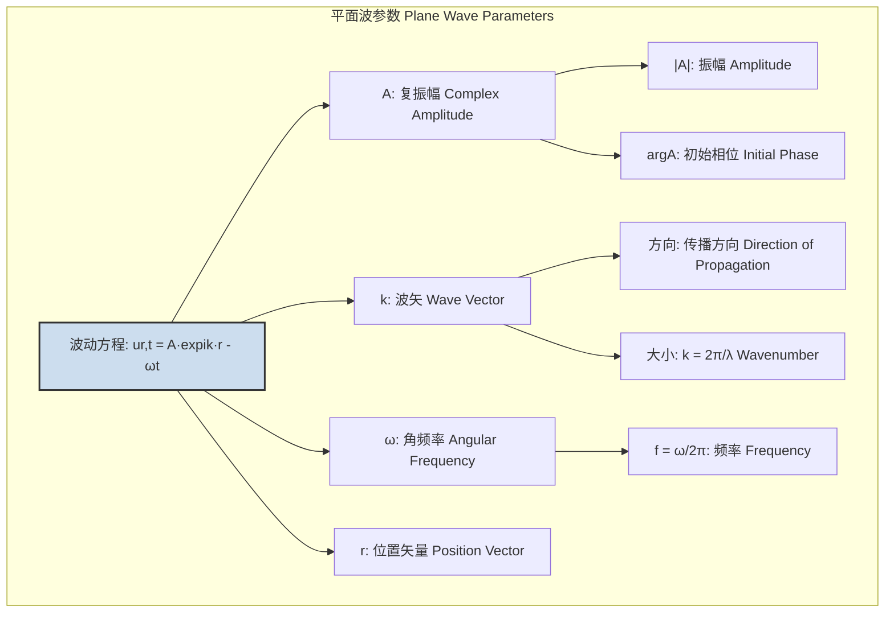
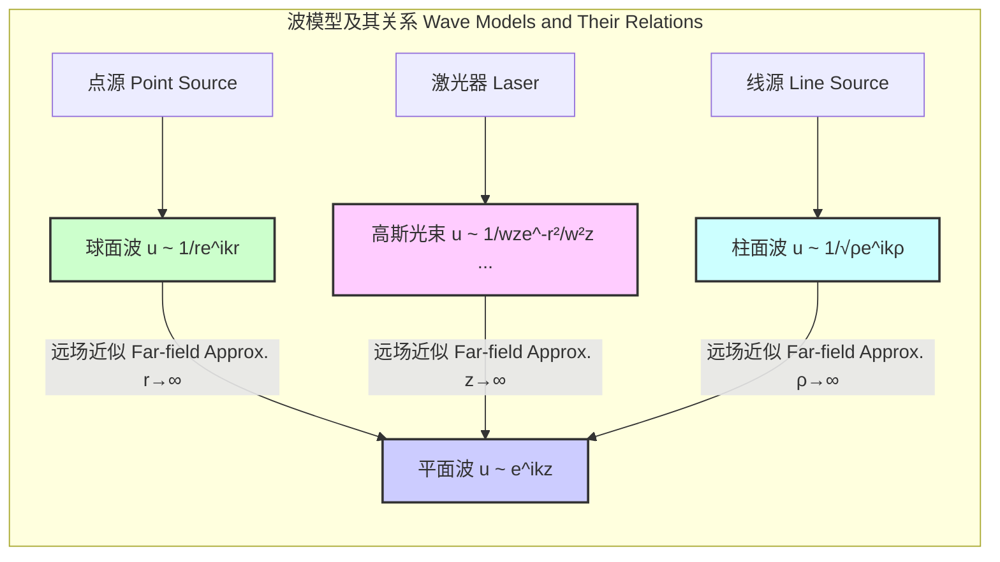

## 平面波

平面波是一种理想化的波模型，其波前（即相位恒定的所有点的集合）是无限大的平行平面。尽管在物理现实中不存在完美的平面波，但它是一个极其有用的数学构造和近似，广泛应用于物理学和工程学的多个领域，用以描述在远离波源的区域中的波传播行为。

### 核心概念与数学基础

平面波是亥姆霍兹方程或标量波动方程在特定假设下的解。

#### 标量波动方程

在无源、均匀、线性和各向同性的介质中，波的传播由以下标量波动方程描述：

$$ \nabla^2 u - \frac{1}{v^2} \frac{\partial^2 u}{\partial t^2} = 0 $$

其中：
*   $u(\mathbf{r}, t)$ 是波函数，表示在空间位置 $\mathbf{r}$ 和时间 $t$ 的波扰动（例如，声压、电场的一个分量）。
*   $\nabla^2$ 是拉普拉斯算子，表示空间二阶导数。
*   $v$ 是波在介质中的相速度。

#### 平面波解

对于平面波，我们寻找形如 $u(\mathbf{r}, t) = f(\mathbf{k} \cdot \mathbf{r} - \omega t)$ 的解。这种形式的函数描述了一个沿着波矢 $\mathbf{k}$ 方向传播的、形状不发生改变的扰动。其中，$\mathbf{k} \cdot \mathbf{r} = \text{const}$ 定义了一个平面，这个平面垂直于向量 $\mathbf{k}$。

在物理学中，最常用且最方便的解是简谐平面波，其复数表示形式为：

$$ u(\mathbf{r}, t) = A e^{i(\mathbf{k} \cdot \mathbf{r} - \omega t)} $$

其物理量通常取其实部：$\text{Re}[u(\mathbf{r}, t)] = |A| \cos(\mathbf{k} \cdot \mathbf{r} - \omega t + \phi)$。

**方程参数详解:**

*   $A$: 复振幅 (Complex Amplitude)。它是一个复数，$A = |A|e^{i\phi}$，其中 $|A|$ 是波的振幅，$\phi$ 是初始相位。
*   $i$: 虚数单位，$i^2 = -1$。
*   $\mathbf{k}$: 波矢 (Wave Vector)。其方向指向波的传播方向。其大小 $k = |\mathbf{k}|$ 称为波数 (wavenumber)，与波长 $\lambda$ 的关系为 $k = 2\pi / \lambda$。
*   $\mathbf{r}$: 位置矢量 (Position Vector)，从坐标原点指向空间中的某一点。
*   $\omega$: 角频率 (Angular Frequency)，与频率 $f$ 的关系为 $\omega = 2\pi f$。
*   $t$: 时间 (Time)。
*   $(\mathbf{k} \cdot \mathbf{r} - \omega t)$: 相位 (Phase)。相位恒定的面 $\mathbf{k} \cdot \mathbf{r} = \text{const}$ 即为波前。

将该解代入波动方程，可得色散关系 (dispersion relation)：

$$ |\mathbf{k}|^2 = k^2 = \frac{\omega^2}{v^2} $$

这表明相速度 $v = \omega/k$。

#### 横波与纵波

根据波的振动方向与传播方向的关系，平面波可分为：
*   **横波 (Transverse Waves):** 振动方向垂直于传播方向 $\mathbf{k}$。例如，电磁波在自由空间中是横波，电场 $\mathbf{E}$ 和磁场 $\mathbf{B}$ 均垂直于 $\mathbf{k}$。
*   **纵波 (Longitudinal Waves):** 振动方向平行于传播方向 $\mathbf{k}$。例如，在流体（如空气）中传播的声波是纵波。

### 关键技术规格

下表总结了描述平面波的关键物理量及其单位。

| 参数 (Parameter) | 符号 (Symbol) | 定义 (Definition) | 国际单位 (SI Unit) | 典型值示例 (Typical Value Example) |
| :--- | :---: | :--- | :---: | :--- |
| 波长 (Wavelength) | $\lambda$ | 波前上两个相邻同相点之间的距离 | 米 (m) | 可见光 (绿光): ~550 nm |
| 波数 (Wavenumber) | $k$ | 每 $2\pi$ 单位长度内的波周期数, $k=2\pi/\lambda$ | 弧度/米 (rad/m) | 可见光 (绿光): ~$1.14 \times 10^7$ rad/m |
| 频率 (Frequency) | $f$ | 单位时间内的波周期数 | 赫兹 (Hz) | 可见光 (绿光): ~$5.45 \times 10^{14}$ Hz |
| 角频率 (Angular Freq.) | $\omega$ | 相位变化率, $\omega=2\pi f$ | 弧度/秒 (rad/s) | 可见光 (绿光): ~$3.42 \times 10^{15}$ rad/s |
| 相速度 (Phase Velocity) | $v_p$ | 波相位传播的速度, $v_p=\omega/k$ | 米/秒 (m/s) | 真空中的光速: $c \approx 2.998 \times 10^8$ m/s |
| 振幅 (Amplitude) | $|A|$ | 波扰动的最大值 | 取决于波的类型 | 电场: V/m, 声压: Pa |
| 强度 (Intensity) | $I$ | 单位面积上波携带的功率, $I \propto |A|^2$ | 瓦特/平方米 (W/m²) | 晴天太阳辐射: ~1000 W/m² |

### 常见用例与性能指标

平面波模型在多个领域中作为一种有效的近似方法。

| 应用领域 (Use Case) | 描述 (Description) | 定量性能指标 (Quantitative Performance Metric) |
| :--- | :--- | :--- |
| **光学 (Optics)** | 夫琅禾费衍射区的远场近似。当观察距离 $R$ 远大于衍射孔径尺寸 $D$ 时 ($R \gg D^2/\lambda$)，从孔径出射的波可近似为平面波。 | **远场条件 (Far-field Condition):** $R > 2D^2/\lambda$。满足此条件时，波前曲率半径极大，可视为平面。 |
| **天线理论 (Antenna Theory)** | 在距离天线足够远的区域（远场区），天线辐射的电磁波可以局部地近似为平面波，用于计算天线增益和方向图。 | **自由空间路径损耗 (FSPL):** $FSPL = (4\pi d f / c)^2$。该公式基于球面波衰减，但在局部区域，波阵面是平的。 |
| **声学 (Acoustics)** | 在消声室或开阔空间中，远离声源的声波传播。用于校准麦克风和测量材料的吸声系数。 | **声压级 (SPL) 衰减:** 理想平面波SPL不随距离衰减。实际中，球面波SPL衰减为 $20 \log_{10}(r_1/r_2)$ dB。平面波近似的有效性取决于与 $1/r$ 衰减的偏差。 |
| **量子力学 (Quantum Mechanics)** | 自由粒子（不受势场作用的粒子）的波函数是薛定谔方程的平面波解，$\Psi(\mathbf{r}, t) = A e^{i(\mathbf{p}\cdot\mathbf{r} - Et)/\hbar}$。 | **德布罗意关系 (de Broglie Relations):** 动量 $\mathbf{p} = \hbar\mathbf{k}$，能量 $E = \hbar\omega$。平面波解对应具有确定动量和能量的粒子态。 |

### 实现考量

在数值模拟中（如FDTD或FEM），生成和处理平面波需要特定的技术。

*   **源实现 (Source Implementation):**
    *   **TF/SF (Total-Field/Scattered-Field) 方法:** 这是最常见的方法。模拟区域被划分为总场区和散射场区。一个虚拟的平面边界（TF/SF边界）被定义出来。在该边界上，根据平面波的解析表达式 $u(\mathbf{r}, t) = A e^{i(\mathbf{k} \cdot \mathbf{r} - \omega t)}$ 计算场值，并将其注入到总场区。这样，总场区包含了入射平面波和任何由物体产生的散射波，而散射场区只包含散射波。
*   **边界条件 (Boundary Conditions):**
    *   **周期性边界条件 (Periodic Boundary Conditions, PBC):** 如果要模拟一个平面波与周期性结构的相互作用，可以在波矢 $\mathbf{k}$ 垂直的两个方向上使用PBC。
    *   **吸收边界条件 (Absorbing Boundary Conditions, ABC):** 为了在一个有限的计算域中模拟无限延伸的平面波，必须在计算域的边界上使用ABC（如完全匹配层, PML）来吸收向外传播的波，防止产生非物理的反射。
*   **算法复杂度分析 (Algorithmic Complexity Analysis):**
    *   在一个 $N \times N \times N$ 的三维网格中进行FDTD模拟，更新整个计算域的场需要 $O(N^3)$ 的计算量。
    *   使用TF/SF方法注入一个平面波源，每时间步需要在 $N \times N$ 的注入平面上计算场值，其复杂度为 $O(N^2)$。因此，源注入的开销远小于场更新的开销。

### 性能特征

理想平面波是数学抽象，实际波束总会偏离这个理想模型。

*   **波前畸变 (Wavefront Distortion):**
    *   **来源:** 介质不均匀、非线性效应、湍流等。
    *   **度量:** 波前误差 (Wavefront Error)，通常用与理想平面的均方根 (RMS) 偏差来量化，单位常为波长 $\lambda$ 的分数（例如，$\lambda/20$）。高质量光学系统的RMS波前误差通常小于 $\lambda/14$。
*   **光束发散 (Beam Divergence):**
    *   **来源:** 衍射效应。任何有限尺寸的光源产生的波束都会发散。
    *   **度量:** 发散角 $\theta$。对于一个高斯光束（对激光束的良好近似），其远场半发散角为 $\theta \approx \lambda / (\pi w_0)$，其中 $w_0$ 是束腰半径。一个理想的平面波发散角为零。
*   **相干性 (Coherence):**
    *   **描述:** 理想平面波在空间和时间上都是完全相干的。
    *   **度量:**
        *   **相干时间 ($\tau_c$):** 波保持可预测相位的时间。与谱线宽度 $\Delta\nu$ 成反比，$\tau_c \approx 1/\Delta\nu$。
        *   **相干长度 ($L_c$):** 波在传播方向上保持相干的距离，$L_c = c \cdot \tau_c$。
        *   对于一个带宽为 $\Delta\lambda$ 的光源，相干长度近似为 $L_c \approx \lambda^2 / \Delta\lambda$。

### 相关技术与比较数学模型

平面波是波的多种数学模型之一，其他模型在不同场景下更为适用。

*   **球面波 (Spherical Wave):**
    *   **来源:** 各向同性点源。
    *   **数学模型:** $u(r, t) = \frac{A}{r} e^{i(kr - \omega t)}$
    *   **特征:** 波前是同心球面，振幅随距离成 $1/r$ 衰减，强度随距离成 $1/r^2$ 衰减，这符合能量守恒定律。
*   **柱面波 (Cylindrical Wave):**
    *   **来源:** 无限长线源。
    *   **数学模型 (远场):** $u(\rho, t) \approx \frac{A}{\sqrt{\rho}} e^{i(k\rho - \omega t)}$ (由汉克尔函数渐近展开得到)
    *   **特征:** 波前是同轴柱面，振幅随径向距离 $\rho$ 成 $1/\sqrt{\rho}$ 衰减。
*   **高斯光束 (Gaussian Beam):**
    *   **来源:** 激光谐振腔的基模输出。
    *   **数学模型 (傍轴近似):** $$ E(r, z) = E_0 \frac{w_0}{w(z)} \exp\left(-\frac{r^2}{w(z)^2}\right) \exp\left(-ikz - ik\frac{r^2}{2R(z)} + i\zeta(z)\right) $$
    *   **特征:** 这是对激光束更精确的描述，它内在地包含了衍射效应。其强度分布呈高斯形态。$w(z)$ 是随传播距离 $z$ 变化的束腰半径，$R(z)$ 是波前曲率半径，$\zeta(z)$ 是古依相移 (Gouy phase)。在束腰处 ($z=0$)，波前是平的，但光束尺寸有限。在远场，它发散成一个球面波，但其角向强度分布是高斯型的。

### 参考文献

1.  Jackson, J. D. (1998). *Classical Electrodynamics* (3rd ed.). Wiley. (This is a foundational textbook covering electromagnetic waves in great detail).
2.  Berenger, J.-P. (1994). A perfectly matched layer for the absorption of electromagnetic waves. *Journal of Computational Physics*, 114(2), 185-200. DOI: [10.1006/jcph.1994.1159](https://doi.org/10.1006/jcph.1994.1159)
3.  Goodman, J. W. (2005). *Introduction to Fourier Optics* (3rd ed.). Roberts and Company Publishers. (This book provides a rigorous treatment of diffraction theory and the plane wave spectrum).