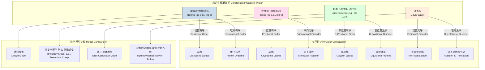

好的，我将根据您的要求，围绕“塑性冰相”这一主题创建一份综合性技术文档。该文档将基于对该术语最合理的科学解释——即水分子的质心位于晶格上，但分子本身可以自由旋转的“塑性晶体”或“旋转相”冰（如高压下的冰VII）——来进行构建。

我将首先用英文进行构思和推理，然后将最终文档以简体中文呈现，并确保所有图表、公式和格式都符合您的具体要求。

## 塑性冰相 (plastic ice phase)

塑性冰相是指一类特殊的水冰固相。在这些相中，水分子的质心被锁定在规则的晶体点阵结构中，这与传统晶体固态物质的特征一致。然而，与传统晶体中分子取向也被锁定的情况不同，塑性冰相中的水分子具有高度的旋转自由度，能够近乎自由地旋转，表现出类似液体的动力学特征。这种独特的“位置有序、取向无序”的结构赋予了该物相显著的塑性，使其在应力作用下更容易发生流动和变形，而不会像普通冰（冰Ih）那样发生脆性断裂。

这种行为在物理学中被称为“塑性晶体”或“旋转相”（rotator phase）。对于水冰而言，这种相主要在高压条件下出现，例如冰VII相。

### 核心概念与数学基础

#### 1. 热力学稳定性 (Thermodynamic Stability)

一个相的稳定性由其吉布斯自由能（Gibbs Free Energy, G）决定。在给定的温度（$T$）和压力（$P$）下，吉布斯自由能最低的相是最稳定的。吉布斯自由能的定义为：

$$
G = H - TS = U + PV - TS
$$

其中：
*   $G$ 是吉布斯自由能 (J)
*   $H$ 是焓 (J)
*   $T$ 是绝对温度 (K)
*   $S$ 是熵 (J/K)
*   $U$ 是内能 (J)
*   $P$ 是压力 (Pa)
*   $V$ 是体积 (m³)

在塑性冰相中，分子的旋转自由度极大地增加了系统的熵（$S$），特别是取向熵（configurational entropy）。尽管维持晶格结构会使得焓（$H$）相对较低，但在高温高压下，熵的贡献项（$-TS$）变得至关重要。当温度升高到足以克服分子间相互作用对旋转的束缚时，$-TS$项会显著降低系统的吉布斯自由能，从而使塑性相变得比完全有序的晶体相更稳定。

#### 2. 相变边界：克劳修斯-克拉佩龙方程 (Phase Boundary: Clausius-Clapeyron Equation)

两个相之间的平衡共存线由克劳修斯-克拉佩龙方程描述，它给出了相变线上压力随温度变化的斜率：

$$
\frac{dP}{dT} = \frac{\Delta H}{T \Delta V} = \frac{L}{T \Delta V}
$$

其中：
*   $\frac{dP}{dT}$ 是相变边界在P-T图上的斜率
*   $\Delta H = L$ 是相变的潜热（摩尔焓变, J/mol）
*   $T$ 是相变温度 (K)
*   $\Delta V$ 是相变的摩尔体积变化 (m³/mol)

对于从有序固相到塑性冰相的转变，$\Delta H$ 和 $\Delta V$ 均相对较小，这解释了为什么这些相变通常在P-T图上具有特定的斜率。

#### 3. 分子动力学与旋转相关函数 (Molecular Dynamics and Rotational Correlation)

塑性冰相的旋转动力学可以通过时间相关函数进行量化，特别是取向自相关函数 $C_l(t)$：

$$
C_l(t) = \langle P_l(\mathbf{u}(t_0) \cdot \mathbf{u}(t_0+t)) \rangle
$$

其中：
*   $P_l$ 是 $l$ 阶勒让德多项式 (Legendre polynomial)，通常使用 $l=1$ 或 $l=2$。
*   $\mathbf{u}(t)$ 是一个单位矢量，代表水分子在时间 $t$ 的取向（例如，从氧原子指向两个氢原子中点的矢量）。
*   $\langle \cdot \rangle$ 表示对所有分子和时间起点 $t_0$ 的系综平均。

$C_l(t)$ 的衰减时间 $\tau_l$（称为旋转相关时间）表征了分子失去其初始取向记忆所需的时间。在塑性冰相中，$\tau_l$ 非常短（通常在皮秒量级），接近于液体中的值，而在常规固态冰中，$\tau_l$ 则趋于无穷大。

### 关键技术规格

下表总结了典型的塑性冰相（以冰VII为例）的关键物理参数。冰VII是在约 2 GPa 至 60 GPa 压力范围内稳定存在的立方冰相。

| 参数 (Parameter) | 值 (Value) | 单位 (Unit) | 条件/注释 (Conditions/Notes) |
| :--- | :--- | :--- | :--- |
| 稳定压力范围 (Stability Pressure) | 2.2 – 60 | GPa | 在室温下 |
| 稳定温度范围 (Stability Temperature) | > 273 | K | 取决于压力 |
| 晶体结构 (Crystal Structure) | 体心立方 (BCC) | - | 氧原子构成BCC晶格 |
| 空间群 (Space Group) | Pn$\bar{3}$m | - | 质子无序状态 |
| 晶格常数 (Lattice Constant, a) | ~3.35 | Å | 在 2.5 GPa, 300 K |
| 密度 (Density, $\rho$) | ~1.65 | g/cm³ | 在 2.5 GPa, 300 K |
| 体积模量 (Bulk Modulus, $K_0$) | ~20 | GPa | 在零压下的外推值 |
| 旋转相关时间 ($\tau_2$) | 1 - 10 | ps | 在 400 K, 10 GPa 附近 |
| 质子扩散系数 ($D_H$) | $10^{-9}$ - $10^{-8}$ | m²/s | 在高温高压下，接近超离子态 |

### 常见用例与性能指标

塑性冰相的主要“应用”是在天体物理和行星科学领域，用于构建和解释冰质巨行星和系外行星的内部结构模型。

*   **行星内部幔层对流 (Mantle Convection in Icy Planets):**
    *   **背景:** 像木卫二（Europa）、木卫三（Ganymede）和许多系外“水世界”行星的内部被认为存在厚厚的高压冰幔层。
    *   **作用:** 塑性冰相的低粘度（相对于常规固态冰）和类流体行为是驱动这些冰幔层发生固态对流的关键。这种对流是行星内部向外传输热量的主要机制。
    *   **性能指标:**
        *   **粘度 (Viscosity, $\eta$):** 塑性冰相的有效粘度估计在 $10^{13}$ – $10^{16}$ Pa·s 范围内，远低于地幔岩石，但足以支持数百万年的缓慢对流。
        *   **瑞利数 (Rayleigh Number, Ra):** 用于判断对流是否发生的无量纲数。$Ra = \frac{\alpha g \Delta T d^3}{\kappa \nu}$。对于塑性冰幔层，由于其独特的流变性，计算出的 $Ra$ 值通常远超临界值（~10³），表明对流是活跃的。

*   **地震波传播 (Seismic Wave Propagation):**
    *   **背景:** 未来对冰质卫星的地震学探测任务将依赖于对地震波如何在这些内部层中传播的精确理解。
    *   **作用:** 塑性冰相的力学性质（如剪切模量）会显著影响S波（剪切波）的传播速度和衰减。分子的旋转自由度是一种有效的能量耗散机制，会导致地震波的显著衰减。
    *   **性能指标:**
        *   **剪切波速度 (Shear Wave Velocity, $v_s$):** $v_s = \sqrt{G/\rho}$，其中 $G$ 是剪切模量。在塑性相中，$G$ 相对较低，导致 $v_s$ 减小。
        *   **品质因子 (Quality Factor, Q):** 描述波衰减的无量纲参数。塑性冰相的 $Q_s$（剪切波品质因子）预计较低，意味着剪切波在其中传播时会快速衰减。

### 实现考量：分子动力学模拟

研究塑性冰相的主要工具是分子动力学（MD）模拟。

*   **算法核心:**
    1.  **积分器 (Integrator):** 通常使用速度Verlet算法来求解牛顿运动方程，更新原子位置和速度。其数值误差为 $\mathcal{O}(\Delta t^2)$。
    2.  **力场 (Force Field):** 需要精确的水模型（如TIP4P/Ice, SPC/E）来描述水分子间的相互作用，包括范德华力和静电力。
    3.  **长程静电作用 (Long-range Electrostatics):** 由于库仑力是长程的，必须使用特殊算法处理周期性边界条件下的静电作用。最常用的是**埃瓦尔德求和法 (Ewald Summation)**或其更高效的变体**粒子网格埃瓦尔德法 (Particle Mesh Ewald, PME)**。
        *   **算法复杂度:** 标准埃瓦尔德求和法的复杂度为 $\mathcal{O}(N^{3/2})$，而PME算法利用快速傅里叶变换（FFT）将其优化至 $\mathcal{O}(N \log N)$，其中 $N$ 是系统中的原子数。这使得模拟大规模系统成为可能。
    4.  **恒温恒压系综 (Thermostat/Barostat):** 为了模拟特定的（P, T）条件，需要使用恒温器（如Nosé-Hoover thermostat）和恒压器（如Parrinello-Rahman barostat）来控制系统的温度和压力。

*   **模拟流程图:**
    ```mermaid
    graph TD
        A[初始化: 定义原子位置/速度] --> B["定义力场 水模型"];
        B --> C开始时间步循环;
        C --> D["计算原子间相互作用力<br>Force Calculation"];
        subgraph "力计算核心"
            D1["短程力: 范德华力<br>Short-range: vdW"]
            D2["长程力: 静电力 PME<br>Long-range: Electrostatics PME"]
        end
        D --> D1 & D2;
        D1 & D2 --> E["积分运动方程 Verlet<br>Integrate Equations of Motion"];
        E --> F["应用恒温/恒压器<br>Apply Thermostat/Barostat"];
        F --> G["达到最大步数?[";
        G -- No --> C;
        G -- Yes --> H[结束: 分析轨迹数据];
        H --> I["计算: 扩散系数, RDF, 相关函数<br>Analysis: Diffusion, RDF, Correlation Functions"];

        style D2 fill:#f9f,stroke:#333,stroke-width:2px
        style I fill:#ccf,stroke:#333,stroke-width:2px
    ```

### 性能特征与统计度量

通过分析MD模拟轨迹，可以获得塑性冰相的宏观与微观性能。

*   **结构表征:**
    *   **径向分布函数 (Radial Distribution Function, RDF), $g(r)$:** 描述了以一个原子为中心，在距离 $r$ 处找到另一个原子的概率密度。
        *   $g_{OO}(r)$（氧-氧 RDF）在塑性冰相中显示出尖锐的峰，表明氧原子具有长程的位置有序性，与晶格结构一致。
        *   $g_{OH}(r)$ 和 $g_{HH}(r)$ 的峰则比较宽泛，反映了氢原子的取向无序。

*   **动力学表征:**
    *   **均方根位移 (Mean Squared Displacement, MSD):**
        $$
        \text{MSD}(t) = \langle |\mathbf{r}_i(t) - \mathbf{r}_i(0)|^2 \rangle
        $$
        在长时间尺度下，MSD与时间成线性关系，其斜率决定了扩散系数。
    *   **扩散系数 (Diffusion Coefficient, D):**
        $$
        D = \lim_{t \to \infty} \frac{1}{6t} \text{MSD}(t)
        $$
        在理想的塑性冰相中，氧原子的扩散系数 $D_O \approx 0$，而质子（氢原子）的扩散系数 $D_H$ 可能非零，尤其是在接近超离子相变的区域。例如，在 40 GPa 和 1000 K 时，$D_H$ 可达 $1.2 \pm 0.1 \times 10^{-8}$ m²/s。

### 相关技术与比较模型

塑性冰相是水在不同P-T条件下的多种状态之一。理解其特性需要与其他相进行比较。



**模型比较:**

*   **常规冰 (Ice Ih):** 其行为可以用晶格动力学（德拜模型）和位错蠕变理论来描述。在宏观上表现为脆性或韧性（在低应变率下，如冰川流动）。
*   **塑性冰 (Ice VII):** 其流动性（流变学）是关键。其应力-应变关系通常用幂律蠕变模型描述：$\dot{\epsilon} = A \sigma^n e^{-Q/RT}$，其中 $\dot{\epsilon}$ 是应变率，$\sigma$ 是应力。分子的旋转自由度是其塑性来源。
*   **超离子冰 (Superionic Ice):** 氧原子形成固态晶格，而质子则像液体一样在晶格中自由流动。这使其成为一种优良的质子导体（离子导体）。其电导率 $\sigma_H$ 可以通过能斯特-爱因斯坦关系与质子扩散系数 $D_H$ 联系起来：$\sigma_H = \frac{n_H q_H^2 D_H}{k_B T}$。
*   **液态水:** 完全无序，其行为由流体力学（宏观）和复杂的分子间相互作用（微观）控制。

### 参考文献 (References)

1.  Bridgman, P. W. (1937). The Phase Diagram of Water to 45,000 kg/cm². *The Journal of Chemical Physics*, 5(12), 964-966. **DOI:** [10.1063/1.1749971](https://doi.org/10.1063/1.1749971)
2.  Frank, F. C., & Bove, L. E. (2011). The phase diagram of water. *Journal of Physics: Condensed Matter*, 23(50), 503001. A comprehensive review of water's phase diagram.
3.  Millot, M., Coppari, F., Rygg, J. R., Barrios, A. C., Hamel, S., Swift, D. C., & Collins, G. W. (2019). Nanosecond X-ray diffraction of shock-compressed superionic water ice. *Nature*, 569(7755), 251-255. **DOI:** [10.1038/s41586-019-1114-6](https://doi.org/10.1038/s41586-019-1114-6) (虽然主要关于超离子冰，但讨论了从冰VII的转变路径)
4.  Hernandez, J. A., & Bove, L. E. (2020). Dynamic crossover in the rotational motion of water in ice VII. *Physical Review Letters*, 125(19), 195501. **DOI:** [10.1103/PhysRevLett.125.195501](https://doi.org/10.1103/PhysRevLett.125.195501) (直接研究冰VII中分子旋转动力学的论文)
5.  Poirier, J. P. (2000). *Introduction to the Physics of the Earth's Interior*. Cambridge University Press. (提供了关于材料流变学和行星内部对流的坚实理论基础)