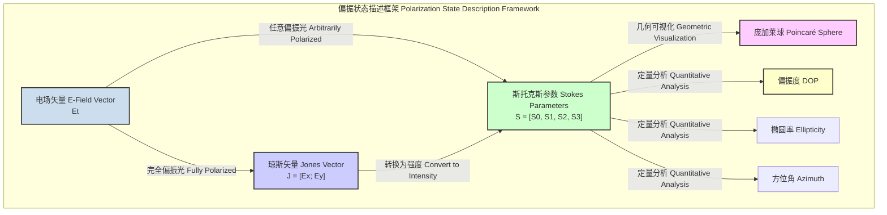
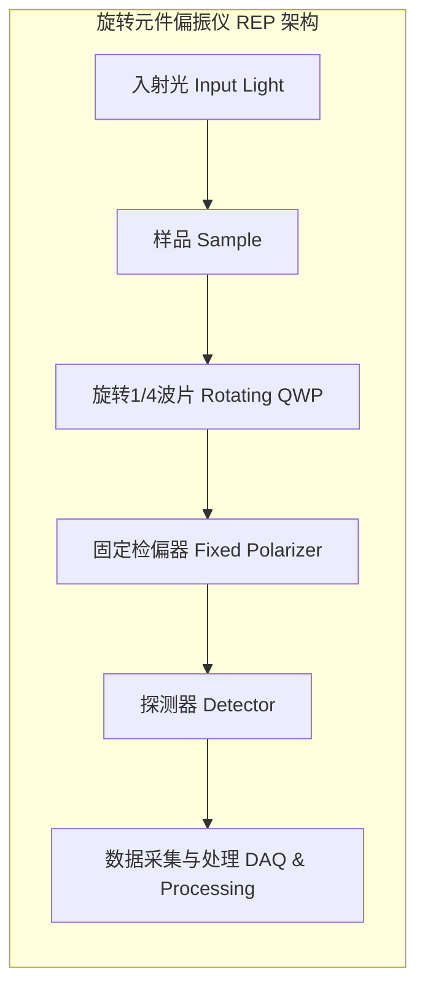
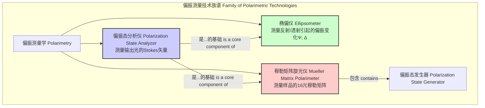

## 偏振分析仪

偏振分析仪是一种精密的光学仪器，用于测量入射电磁波（通常是光）的偏振状态。通过定量分析光的偏振特性，该仪器能够在科学研究和工业应用中提供关键信息。其核心功能是确定描述偏振状态的斯托克斯参数（Stokes Parameters）。

### 1. 核心概念与数学基础

光的偏振描述了其电场矢量在传播过程中振荡的轨迹方向。对偏振状态的完整描述需要严谨的数学框架。

#### 1.1 琼斯矢量 (Jones Vector)

对于完全偏振光，其状态可以用一个二维复数矢量，即琼斯矢量 $\mathbf{J}$ 来描述。它表示在垂直于传播方向的平面（x-y平面）上电场的分量。

$$
\mathbf{J} = \begin{pmatrix} E_x \\ E_y \end{pmatrix} = \begin{pmatrix} |E_x| e^{i\phi_x} \\ |E_y| e^{i\phi_y} \end{pmatrix}
$$

其中：
*   $E_x$ 和 $E_y$ 是电场在x和y方向上的复振幅。
*   $|E_x|$ 和 $|E_y|$ 是电场分量的振幅。
*   $\phi_x$ 和 $\phi_y$ 是电场分量的相位。

相对相位差 $\Delta\phi = \phi_y - \phi_x$ 决定了偏振的类型（线性、圆形或椭圆形）。

#### 1.2 斯托克斯参数 (Stokes Parameters)

对于部分偏振或非偏振光，琼斯矢量不足以完全描述其状态。斯托克斯参数提供了一个更通用的框架，它由四个实数组成，可以直接通过强度测量得到。

$$
\mathbf{S} = \begin{pmatrix} S_0 \\ S_1 \\ S_2 \\ S_3 \end{pmatrix} = \begin{pmatrix} I \\ Q \\ U \\ V \end{pmatrix}
$$

这些参数的物理意义和数学定义如下：

*   $S_0$ (或 $I$): **总光强**。它与光的总能量通量成正比。
    $$ S_0 = \langle |E_x|^2 + |E_y|^2 \rangle = I_H + I_V = I_{45} + I_{135} $$
    其中 $I_H, I_V, I_{45}, I_{135}$ 分别是通过水平、垂直、+45°和-45°方向偏振片的光强。尖括号 $\langle \cdot \rangle$ 表示时间平均。

*   $S_1$ (或 $Q$): **水平与垂直线性偏振分量的光强差**。正值表示水平偏振占优，负值表示垂直偏振占优。
    $$ S_1 = \langle |E_x|^2 - |E_y|^2 \rangle = I_H - I_V $$

*   $S_2$ (或 $U$): **+45°与-45°线性偏振分量的光强差**。正值表示+45°偏振占优，负值表示-45°偏振占优。
    $$ S_2 = \langle 2 \text{Re}(E_x^* E_y) \rangle = I_{45} - I_{135} $$

*   $S_3$ (或 $V$): **右旋与左旋圆偏振分量的光强差**。正值表示右旋圆偏振占优，负值表示左旋圆偏振占优。
    $$ S_3 = \langle 2 \text{Im}(E_x^* E_y) \rangle = I_{RHC} - I_{LHC} $$

对于一个给定的光束，斯托克斯参数必须满足以下关系：
$$
S_0^2 \ge S_1^2 + S_2^2 + S_3^2
$$
等号成立时，光是完全偏振的。

#### 1.3 偏振度 (Degree of Polarization, DOP)

偏振度（DOP）是衡量光束中偏振光分量占总光强比例的物理量。

$$
\text{DOP} = \frac{\sqrt{S_1^2 + S_2^2 + S_3^2}}{S_0}
$$

DOP的取值范围为 $0 \le \text{DOP} \le 1$。
*   $\text{DOP} = 1$: 完全偏振光。
*   $\text{DOP} = 0$: 完全非偏振光。
*   $0 < \text{DOP} < 1$: 部分偏振光。

#### 1.4 庞加莱球 (Poincaré Sphere)

庞加莱球提供了一种将偏振状态可视化的几何方法。在一个三维球坐标系中，一个偏振态可以由一个点表示，其笛卡尔坐标为 $(S_1, S_2, S_3)$。球的半径为 $S_0 \times \text{DOP}$。对于归一化强度 ($S_0=1$) 的完全偏振光，所有状态都位于单位球的表面。



### 2. 关键技术规格

偏振分析仪的性能由一系列技术规格定义，这些规格决定了其在特定应用中的适用性和测量精度。

| 规格参数 (Specification) | 典型值 (Typical Value) | 单位 (Unit) | 描述 (Description) |
| :--- | :--- | :--- | :--- |
| 工作波长范围 (Wavelength Range) | 400 - 1700 | nm | 仪器可以有效工作的光谱范围 |
| 斯托克斯参数准确度 (Stokes Parameter Accuracy) | ±0.5 (S1, S2, S3) | % | 测量得到的S1, S2, S3参数与真值的偏差 |
| 偏振度准确度 (DOP Accuracy) | ±0.5 | % | 测量得到的DOP与真值的偏差 |
| 测量速度 (Measurement Speed) | 10 - 1,000,000 | S/s (样本/秒) | 仪器每秒可以完成完整斯托克斯矢量测量的次数 |
| 角度分辨率 (Azimuth/Ellipticity Resolution) | 0.01 | 度 (deg) | 能够分辨的最小偏振方位角或椭圆率角变化 |
| 重复性 (Repeatability) | ±0.1 | % | 在相同条件下重复测量同一信号时，结果的一致性 |
| 输入功率范围 (Input Power Range) | -70 to +10 | dBm | 仪器可以接受并精确测量的光功率范围 |
| 输入接口 (Input Connector) | FC/APC, Free-space | - | 光信号输入方式，如光纤接头或自由空间光路 |
| 消光比 (Extinction Ratio) | > 30 | dB | 仪器内部偏振光学元件的性能指标 |

### 3. 常见用例

偏振分析仪在多个领域中具有不可替代的作用。

*   **光纤通信**:
    *   **偏振模色散 (PMD) 测量**: PMD是高速光纤通信的主要限制因素之一。偏振分析仪用于表征光纤和器件的PMD。性能指标：差分群时延 (DGD) 测量精度 < 1 fs。
    *   **偏振相关损耗 (PDL) 测量**: PDL会导致信号功率波动。偏振分析仪用于精确量化光器件的PDL。性能指标：PDL测量范围 0 - 40 dB，精度 ±0.02 dB。

*   **材料科学**:
    *   **应力双折射分析**: 通过测量透明材料（如玻璃、塑料）在应力作用下的偏振变化，可以分析其内部应力分布。依据光弹效应（Stress-optic law）：$\Delta n = C \sigma$，其中 $\Delta n$ 是折射率差，$\sigma$ 是应力，$C$ 是光弹常数。

*   **遥感与成像**:
    *   **激光雷达 (LIDAR)**: 通过分析后向散射光的偏振状态变化（如退偏振比），可以区分人造目标和自然背景，或识别云层中的水滴和冰晶。性能指标：退偏振比测量精度 < 1%。
    *   **生物医学成像**: 偏振敏感光学相干层析成像 (PS-OCT) 利用偏振信息增强对胶原纤维、神经纤维等具有双折射特性生物组织的衬度。

*   **量子光学**:
    *   **量子态表征**: 在量子密钥分发 (QKD) 和量子计算中，用于精确测量单光子或纠缠光子对的偏振态，以确定量子态的保真度。性能指标：量子态保真度测量 > 99.5%。

### 4. 实现方式

偏振分析仪的实现架构主要分为几类，各有其优缺点。

#### 4.1 旋转元件偏振仪 (Rotating-Element Polarimeter, REP)

这是最经典和最精确的方法之一。它通常包含一个或多个旋转的偏振光学元件（如波片或偏振片），后跟一个固定的检偏器和探测器。



**数学模型**:
当一个四分之一波片（QWP）以角速度 $\omega$ 旋转时，其旋转角为 $\theta = \omega t$。探测器接收到的光强 $I(\theta)$ 是旋转角的函数。通过对 $I(\theta)$ 进行傅里叶分析，可以求解斯托克斯参数。对于一个旋转QWP后跟一个水平检偏器的系统，光强信号可以表示为：
$$
I(\theta) = c_0 + c_1 \cos(2\theta) + c_2 \sin(2\theta) + c_3 \cos(4\theta) + c_4 \sin(4\theta)
$$
通过测量并拟合得到傅里叶系数 $c_i$，可以计算出归一化的斯托克斯参数 $(s_1, s_2, s_3) = (S_1/S_0, S_2/S_0, S_3/S_0)$。具体关系取决于系统的精确校准矩阵，但通常是这些系数的线性组合。例如，在一个理想系统中：
$$
S_0 \propto c_0, \quad S_1 \propto c_3, \quad S_2 \propto c_4, \quad S_3 \propto c_2
$$
**算法复杂度**:
为了获得精确的傅里叶系数，需要在旋转一圈内采集 $N$ 个数据点。数据采集的时间复杂度为 $O(N)$。后续使用快速傅里叶变换 (FFT) 计算系数的复杂度为 $O(N \log N)$。因此，总的计算复杂度由FFT主导。

#### 4.2 焦平面分光型偏振仪 (Division-of-Focal-Plane, DoFP)

DoFP偏振仪或偏振相机采用了一种“快照”式测量方法，没有移动部件。它在图像传感器（如CMOS或CCD）的焦平面上集成了一个微偏振片阵列。

```mermaid
graph TD
    subgraph "焦平面分光型 DoFP 架构"
        ObjectiveLens["物镜 Objective Lens"] --> MicroPolarizerArray["微偏振片阵列 Micropolarizer Array"]
        MicroPolarizerArray --> FPA["焦平面阵列 Focal Plane Array"]
        FPA --> Readout["读出电路 Readout Electronics"]

        subgraph "微偏振片阵列细节 Micropolarizer Array Detail"
            P0["0°"] -- P45["45°"]
            P90["90°"] -- P135["135°"]
            P0 -- P90
            P45 -- P135
        end
        style MicroPolarizerArray fill:#f9f, stroke:#333, stroke-width:2px
    end
```

**数学模型**:
一个典型的DoFP传感器将像素分组为2x2的“超级像素”，每个像素上覆盖一个不同方向的偏振片（0°, 45°, 90°, 135°）。通过读取这四个像素的强度值 $I_0, I_{45}, I_{90}, I_{135}$，可以计算出前三个斯托克斯参数：
$$
\begin{aligned}
S_0 &= I_0 + I_{90} \\
S_1 &= I_0 - I_{90} \\
S_2 &= I_{45} - I_{135}
\end{aligned}
$$
**注意**: 这种基本配置无法测量 $S_3$（圆偏振分量）。测量 $S_3$ 需要在微偏振片阵列前增加一层微波片阵列，这在技术上更具挑战性。
**算法复杂度**:
对于一个 $W \times H$ 像素的图像，计算斯托克斯参数的复杂度为 $O(W \times H)$，因为每个超级像素的计算是独立的。这使得实时偏振成像成为可能。

### 5. 性能特征

#### 5.1 准确度与精密度

*   **准确度 (Accuracy)**: 测量结果与真实值的接近程度。它主要受**系统误差**影响，如光学元件的校准不准、波片的相位延迟误差、热漂移等。
*   **精密度 (Precision/Repeatability)**: 多次重复测量的结果之间的一致性。它主要受**随机误差**影响，如探测器的散粒噪声、热噪声和读出噪声。

#### 5.2 误差分析与统计度量

测量结果通常表示为最佳估计值加上一个不确定度，并注明置信区间。例如，一个DOP测量结果可以报告为：
$$ \text{DOP} = 0.952 \pm 0.005 \quad (95\% \text{ C.I.}) $$
这表示我们有95%的信心认为真实的DOP值落在区间 $[0.947, 0.957]$ 内。

不确定度 $\delta S_i$ 的来源可以通过误差传播理论进行分析。例如，在REP中，斯托克斯参数的不确定度取决于傅里叶系数的不确定度，而后者又与探测器信号的信噪比 (SNR) 直接相关。对于散粒噪声主导的系统，噪声标准差与信号平方根成正比，即 $\sigma_{noise} \propto \sqrt{I}$。

### 6. 相关技术

偏振分析仪是更广泛的偏振测量技术家族中的一员。



*   **椭偏仪 (Ellipsometer)**:
    这是一种专门用于表征薄膜和表面的高精度偏振分析仪。它测量光在样品表面反射或透射后偏振态的变化，通常用两个参数 $\Psi$ 和 $\Delta$ 来描述。
    $$ \rho = \frac{r_p}{r_s} = \tan(\Psi) e^{i\Delta} $$
    其中，$r_p$ 和 $r_s$ 分别是平行和垂直于入射面的p偏振和s偏振光的复数反射系数。椭偏仪能够以亚纳米级的精度确定薄膜厚度和光学常数。

*   **穆勒矩阵旋光仪 (Mueller Matrix Polarimeter)**:
    这是功能最全面的偏振测量仪器。它不仅分析输出光的偏振态，还能表征样品本身如何改变任意输入偏振态。它通过测量样品的4x4穆勒矩阵 $\mathbf{M}$ 来实现这一点。测量过程需要一个偏振态发生器 (PSG) 来产生一系列已知的输入偏振态，以及一个偏振态分析仪 (PSA) 来测量每个对应的输出偏振态。
    $$ \mathbf{S}_{out} = \mathbf{M} \cdot \mathbf{S}_{in} $$
    穆勒矩阵提供了关于样品所有偏振特性的完整信息，包括双折射、二向色性、退偏振能力等。

### 7. 参考文献

1.  Goldstein, D. H. (2017). *Polarized Light, Third Edition*. CRC Press. (这是一本关于偏振光的经典综合性教科书).
2.  Tyo, J. S., Goldstein, D. L., Chenault, D. B., & Shaw, J. A. (2006). Review of passive imaging polarimetry for remote sensing applications. *Applied Optics*, 45(22), 5453-5469. **DOI**: [10.1364/AO.45.005453](https://doi.org/10.1364/AO.45.005453)
3.  Azzam, R. M. A. (1982). Arrangement of four photodetectors for measuring the state of polarization of light. *Optics Letters*, 7(2), 80-82. **DOI**: [10.1364/OL.7.000080](https://doi.org/10.1364/OL.7.000080)
4.  Compain, E., Poirier, S., & Drevillon, B. (1999). General and self-consistent method for the calibration of rotating-element ellipsometers. *Applied Optics*, 38(16), 3490-3502. **DOI**: [10.1364/AO.38.003490](https://doi.org/10.1364/AO.38.003490)