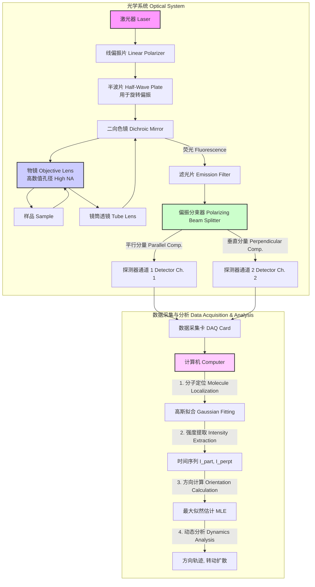
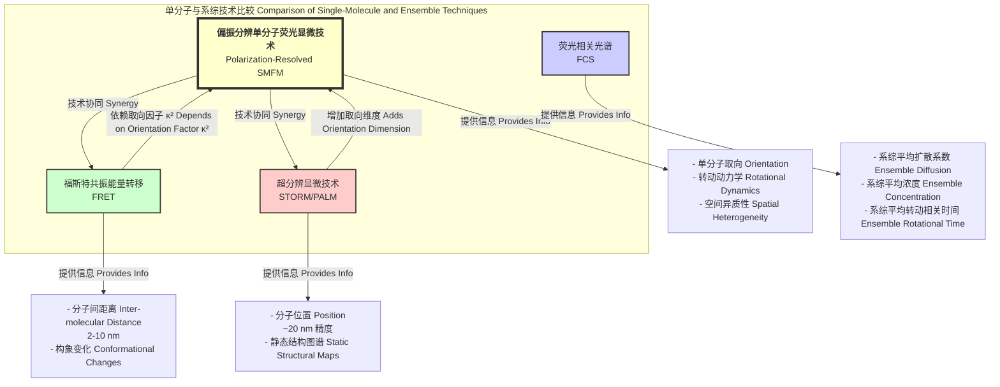

## 偏振分辨单分子荧光显微技术

偏振分辨单分子荧光显微技术（Polarization Resolved Single Molecule Fluorescence Microscopy）是一种先进的光学成像方法，它通过分析单个荧光分子发射光的偏振特性，来精确测定分子的空间取向及其动态变化。该技术结合了单分子探测的极致灵敏度和偏振光学的分析能力，为在分子尺度上研究结构、动力学和相互作用提供了独特的视角。

### 1. 核心概念与数学基础

#### 1.1 单分子荧光
在单分子水平上，荧光基团的吸收和发射过程可以用一个简化的三能级系统（Jablonski图）来描述：基态 ($S_0$)、第一电子激发单重态 ($S_1$) 和第一电子激发三重态 ($T_1$)。
*   **吸收 (Absorption)**: 分子吸收一个光子，从 $S_0$ 跃迁到 $S_1$ 的某个振动能级。此过程的概率与激发光的偏振方向和分子吸收偶极矩的取向密切相关。
*   **内转换与振动弛豫 (Internal Conversion & Vibrational Relaxation)**: 分子在 $S_1$ 能级内快速（皮秒量级）弛豫到最低振动能级，此过程不发光。
*   **荧光发射 (Fluorescence)**: 分子从 $S_1$ 的最低振动能级跃迁回 $S_0$ 的某个振动能级，并辐射出一个光子。发射光的偏振由分子的发射偶极矩决定。
*   **系间窜越与光漂白 (Intersystem Crossing & Photobleaching)**: 分子有一定概率通过系间窜越进入长寿命的暗态（如三重态 $T_1$），或发生不可逆的化学反应（光漂白），导致荧光淬灭。

#### 1.2 荧光偶极子模型
荧光分子的吸收和发射过程可以被建模为电偶极子跃迁。分子的取向由其在实验室坐标系 (X, Y, Z) 中的吸收偶极矩 $\vec{\mu}_a$ 和发射偶极矩 $\vec{\mu}_e$ 来描述。在大多数荧光染料中，$\vec{\mu}_a$ 和 $\vec{\mu}_e$ 近似共线，因此我们可以用一个单一的偶极子 $\vec{\mu}$ 来描述。

该偶极子的空间取向通常用球坐标中的两个角度来定义：
*   **极角 $\theta$**: 偶极子与Z轴（通常是光轴）的夹角。
*   **方位角 $\phi$**: 偶极子在XY平面上的投影与X轴的夹角。

#### 1.3 偏振相关的吸收与发射
**吸收概率**:
当使用偏振方向为 $\vec{E}$ 的线偏振光激发样品时，分子吸收光子的概率 $P_{abs}$ 正比于激发光电场矢量与吸收偶极矩的点积的平方：
$$ P_{abs} \propto |\vec{E} \cdot \vec{\mu}_a|^2 $$
如果激发光沿X轴偏振，$\vec{E} = (E_0, 0, 0)$，则：
$$ P_{abs} \propto (\mu \sin\theta \cos\phi)^2 $$
其中 $\mu = |\vec{\mu}_a|$。

**发射强度分布**:
被激发的分子发射的荧光在空间中呈偶极辐射模式。在远场条件下，通过一个偏振方向为 $\vec{p}$ 的检偏器所探测到的荧光强度 $I_{em}$ 为：
$$ I_{em} \propto |\vec{p} \cdot \vec{\mu}_e|^2 $$
在一个典型的全内反射荧光显微镜（TIRF）设置中，我们在XY平面上探测荧光。通过一个偏振分束器（PBS），可以将荧光分为平行于X轴 ($I_\parallel$) 和垂直于X轴 ($I_\perp$) 的两个分量：
$$ I_\parallel = I_x \propto \sin^2\theta \cos^2\phi $$
$$ I_\perp = I_y \propto \sin^2\theta \sin^2\phi $$
总的平面内强度 $I_{total} = I_\parallel + I_\perp \propto \sin^2\theta$。

#### 1.4 取向参数的计算
通过测量 $I_\parallel$ 和 $I_\perp$，我们可以计算出描述分子平面内取向的方位角 $\phi$：
$$ \phi = \arctan\left(\sqrt{\frac{I_\perp}{I_\parallel}}\right) $$
为了确定极角 $\theta$，需要额外的信息。一种常用的方法是调制激发光的偏振（例如，在X和Y方向之间切换或旋转偏振），或者利用散焦成像来分析分子的三维偶极辐射模式。

另一个关键参数是 **偏振度 (Degree of Polarization, P)** 或 **荧光各向异性 (Fluorescence Anisotropy, r)**：
$$ P = \frac{I_\parallel - G \cdot I_\perp}{I_\parallel + G \cdot I_\perp} $$
$$ r = \frac{I_\parallel - G \cdot I_\perp}{I_\parallel + 2G \cdot I_\perp} $$
*   $I_\parallel$: 平行于激发光偏振方向的荧光强度。
*   $I_\perp$: 垂直于激发光偏振方向的荧光强度。
*   $G$: G因子（G-factor），是一个仪器校正系数，用于补偿两个偏振通道之间不同的探测效率。$G = \frac{\int I_{\perp, cal}(\lambda) d\lambda}{\int I_{\parallel, cal}(\lambda) d\lambda}$，通常使用非偏振光源（如荧光素溶液）进行校准。

对于一个固定的偶极子，其方位角 $\phi$ 可以通过 $P$ 或 $r$ 计算得出：
$$ P = \frac{\cos^2\phi - \sin^2\phi}{\cos^2\phi + \sin^2\phi} = \cos(2\phi) $$
因此，$\phi = \frac{1}{2} \arccos(P)$。

### 2. 关键技术规格

下表列出了偏振分辨单分子荧光显微镜系统的典型技术规格。

| 参数 (Parameter) | 典型值/范围 (Typical Value/Range) | 单位 (Unit) | 说明 (Description) |
| :--- | :--- | :--- | :--- |
| 激光波长 (Laser Wavelength) | 488, 532, 564, 640 | nm | 需匹配荧光探针的吸收光谱 |
| 激光功率 (Laser Power at Sample) | 0.1 - 5 | kW/cm² | 在保证信噪比和避免快速光漂白之间权衡 |
| 物镜数值孔径 (Objective NA) | > 1.4 | - | 高NA物镜以实现TIRF照明并高效收集荧光 |
| 探测器类型 (Detector Type) | EMCCD, sCMOS | - | 需要高量子效率和低读出噪声 |
| 量子效率 (Quantum Efficiency) | > 90% | % | 在可见光范围内 |
| 时间分辨率 (Temporal Resolution) | 1 - 100 | ms | 受限于信噪比和相机帧率 |
| 偏振消光比 (Polarization Extinction Ratio) | > 500:1 | - | 高质量偏振光学元件是精确测量的关键 |
| 取向精度 (Orientation Precision) | 1 - 10 | 度 (degrees) | 依赖于收集的光子数和分子取向 |
| 空间定位精度 (Spatial Localization Precision) | 10 - 40 | nm | 与标准单分子定位显微镜相当 |

### 3. 常见用例与性能指标

*   **生物大分子构象动力学**:
    *   **应用**: 研究酶在催化循环中的构象变化、DNA聚合酶的运动、马达蛋白的行走机制。
    *   **性能指标**: 能够探测到角度变化 $\Delta\phi$ 和 $\Delta\theta$ 大于5°的事件。时间分辨率可达毫秒级，能够捕捉到关键的中间态。
*   **生物膜物理学**:
    *   **应用**: 探测膜蛋白在细胞膜中的旋转扩散，以及脂筏等微区域中脂质分子的有序性。
    *   **性能指标**: 通过测量荧光各向异性衰减来计算旋转相关时间 $\tau_r$（范围从纳秒到秒）。通过测量系综分子的取向分布，计算序参数 $S = \langle P_2(\cos\theta) \rangle = \frac{1}{2}\langle 3\cos^2\theta - 1 \rangle$，其中 $S=0$ 表示各向同性，$S=1$ 表示完美有序。
*   **高分子物理与材料科学**:
    *   **应用**: 表征聚合物薄膜中单根链的取向和弛豫动力学，研究有机半导体材料中分子的排列。
    *   **性能指标**: 获得大量单分子的方位角 $\phi$ 的分布直方图 $P(\phi)$，以揭示材料的宏观各向异性。
*   **淀粉样纤维自组装**:
    *   **应用**: 实时观察单个肽单体如何结合到正在生长的淀粉样纤维上，并确定其相对于纤维轴的最终取向。
    *   **性能指标**: 测量新结合的单体偶极子与纤维轴之间的夹角，精度约为 ±5°，揭示了组装的分子机制。

### 4. 实现考量

#### 4.1 光路设计与系统架构

一个典型的偏振分辨单分子显微镜系统架构如下所示：

#### 4.2 算法与数据分析

数据分析流程通常包括以下步骤：
1.  **单分子定位**: 在图像序列中识别单个荧光点。通常使用二维高斯函数拟合每个点扩散函数（PSF）来获得亚像素精度的位置。
    *   **算法复杂度**: 对于一幅 $M \times M$ 像素的图像，初始筛选的复杂度为 $O(M^2)$。对于 $N_{mol}$ 个分子，每个分子在一个 $k \times k$ 的区域内进行拟合，复杂度约为 $O(N_{mol} \cdot k^2 \cdot N_{iter})$，其中 $N_{iter}$ 是迭代次数。
2.  **强度提取**: 对每个定位的分子，在两个偏振通道的相应位置提取其荧光强度时间序列 $I_\parallel(t)$ 和 $I_\perp(t)$。
3.  **取向计算**: 使用强度数据计算每个时间点的分子取向 $(\theta, \phi)$。由于光子计数的泊松噪声特性，最大似然估计（MLE）是一种稳健的方法。对于给定的观测光子数 $n_\parallel$ 和 $n_\perp$，似然函数 $L$ 为：
    $$ L(\theta, \phi | n_\parallel, n_\perp) = \text{Poisson}(n_\parallel | I_\parallel(\theta, \phi)) \cdot \text{Poisson}(n_\perp | I_\perp(\theta, \phi)) $$
    $$ \text{Poisson}(k | \lambda) = \frac{\lambda^k e^{-\lambda}}{k!} $$
    通过数值优化方法找到使 $L$ 最大化的 $(\theta, \phi)$。
    *   **算法复杂度**: 对于 $N_{mol}$ 个分子和 $T$ 个时间点，此步骤的复杂度约为 $O(N_{mol} \cdot T \cdot N_{opt\_iter})$，其中 $N_{opt\_iter}$ 是优化算法的迭代次数。

### 5. 性能特征

*   **取向精度 (Orientation Precision)**: 取向测量的精度主要受限于探测到的总光子数 $N = N_\parallel + N_\perp$。对于方位角 $\phi$ 的测量不确定度 $\sigma_\phi$ 可以近似为：
    $$ \sigma_\phi \approx \frac{1}{2 \sqrt{N} |\sin(2\phi)| \sin\theta} = \frac{1}{\sqrt{N} P \sin\theta} $$
    其中 $P$ 是偏振度。可见，当分子接近平行或垂直于检偏器轴时（$|\sin(2\phi)| \to 0$），或当分子接近光轴时（$\sin\theta \to 0$），精度会显著下降。在最佳条件下，收集约1000个光子可以实现约3-5°的角精度。
*   **信噪比 (Signal-to-Noise Ratio, SNR)**: 高信噪比是精确测量的基础。SNR主要由信号强度、背景荧光和探测器噪声决定：
    $$ \text{SNR} = \frac{I_{signal}}{\sqrt{I_{signal} + I_{bg} + \sigma_{read}^2}} $$
    其中 $I_{signal}$ 是信号光子数，$I_{bg}$ 是背景光子数，$\sigma_{read}$ 是探测器的读出噪声。TIRF照明是降低背景的有效手段。
*   **光稳定性 (Photostability)**: 单个荧光分子在光漂白前能发射的光子总数是有限的（通常为 $10^5 - 10^7$）。这直接限制了观测时长和可达到的时间分辨率与取向精度的乘积。使用抗光漂白剂和低激发功率可以延长观测时间。

### 6. 相关技术比较

偏振分辨单分子显微技术在分子研究工具箱中占据了独特的位置。

#### 6.1 与FRET的比较与结合
单分子FRET技术通过测量能量转移效率来推断分子间的距离。其效率 $E$ 表达式为：
$$ E = \frac{1}{1 + (R/R_0)^6} $$
其中 $R_0$ 是福斯特半径，它依赖于供体-受体对的取向因子 $\kappa^2$：
$$ R_0^6 \propto \kappa^2 $$
$$ \kappa^2 = (\cos\theta_{DA} - 3\cos\theta_D\cos\theta_A)^2 $$
*   $\theta_{DA}$: 供体和受体偶极矩之间的夹角。
*   $\theta_D, \theta_A$: 供体和受体偶极矩分别与供体-受体连线的夹角。

传统FRET实验通常假设 $\kappa^2 = 2/3$（快速随机转动平均值），但这可能导致距离测量的巨大误差。将偏振分辨技术与FRET结合，可以直接测量供体和/或受体的取向，从而精确确定 $\kappa^2$，分离距离变化和取向变化对FRET效率的贡献，极大地提高了FRET测距的准确性。

#### 6.2 与超分辨显微技术的结合
STORM/PALM等超分辨技术通过对单个分子进行精确定位和图像重构，实现了纳米级的空间分辨率。将偏振分辨分析与这些技术结合（有时被称为Super-resolution Orientation Microscopy），可以在一张超分辨图像中为每个定位的分子赋予一个取向信息。这使得研究人员能够绘制出复杂的分子组件（如肌动蛋白网络、细胞粘附斑）中每个蛋白分子的位置和取向图谱，提供了前所未有的结构细节。

### 7. 参考文献
*   Ha, T., Enderle, T., Chemla, D. S., Selvin, P. R., & Weiss, S. (1996). Single Molecule Dynamics Studied by Polarization Modulation. *Physical Review Letters*, 77(19), 3979–3982. DOI: [10.1103/PhysRevLett.77.3979](https://doi.org/10.1103/PhysRevLett.77.3979)
*   Forkey, J. N., Quinlan, M. E., & Goldman, Y. E. (2003). Protein structural dynamics by single-molecule fluorescence polarization. *Progress in Biophysics and Molecular Biology*, 82(1-3), 201-221. DOI: [10.1016/s0079-6107(03)00043-x](https://doi.org/10.1016/s0079-6107(03)00043-x)
*   Fourkas, J. T. (2001). Rapid Determination of the Three-Dimensional Orientation of Single Molecules. *Optics Letters*, 26(4), 211-213. DOI: [10.1364/OL.26.000211](https://doi.org/10.1364/OL.26.000211)
*   Gryczynski, I., Gryczynski, Z., & Lakowicz, J. R. (1999). Fluorescence-polarization-resolved spectroscopy. *Analytical Biochemistry*, 273(2), 193-203. DOI: [10.1006/abio.1999.4217](https://doi.org/10.1006/abio.1999.4217)
*   Backer, A. S., & Moerner, W. E. (2014). Extending single-molecule microscopy using optical traps. *The Journal of Physical Chemistry B*, 118(28), 8313–8329. DOI: [10.1021/jp501778z](https://doi.org/10.1021/jp501778z)