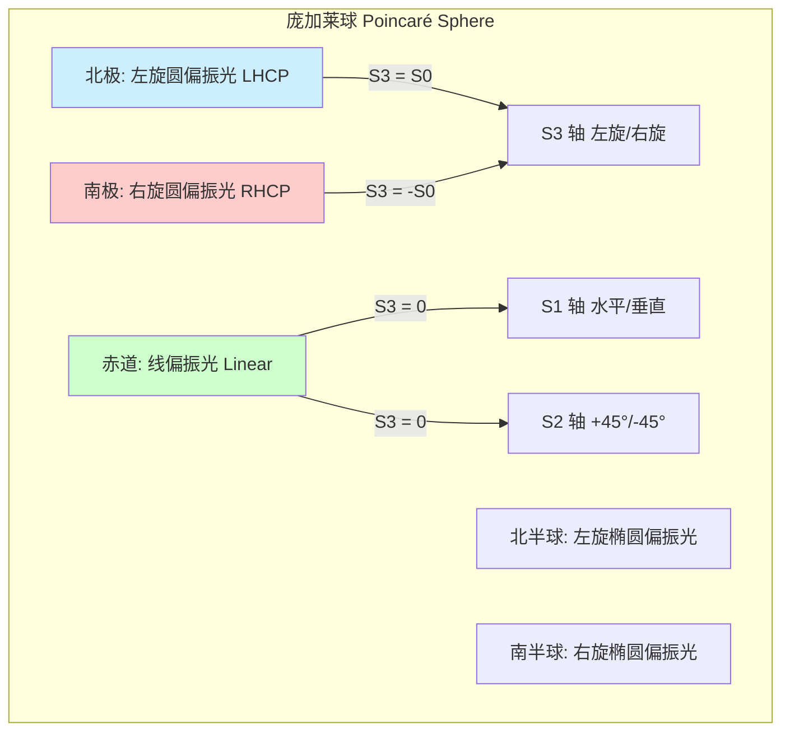
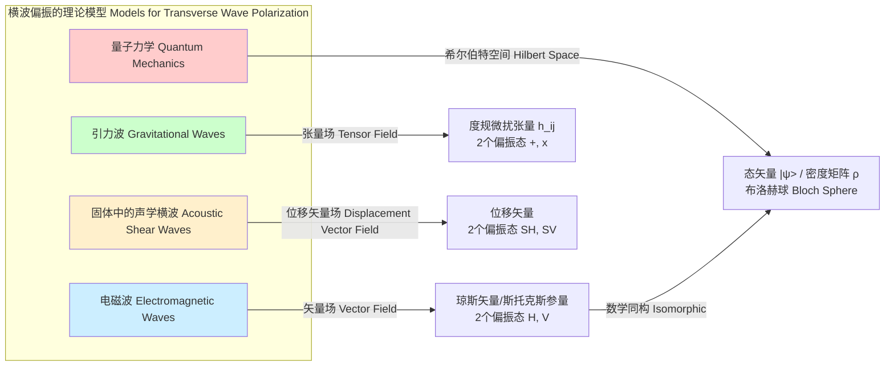

## 偏振态

偏振态（Polarization State）是描述横波（特别是电磁波，如光波）的电场矢量在垂直于传播方向的平面内振动方向和轨迹的属性。这是一个基本而关键的物理量，在光学、通信、遥感和量子信息等领域具有核心重要性。

### 1. 核心概念与数学基础

电磁波是横波，其电场矢量 $\vec{E}$ 和磁场矢量 $\vec{B}$ 的振动方向均垂直于波的传播方向。通常，我们用电场矢量 $\vec{E}$ 来描述偏振态，因为它与物质的相互作用更强。

#### 1.1. 数学描述：琼斯矢量 (Jones Vector)

对于一束沿 z 轴传播的单色平面波，其电场矢量可以分解为两个相互正交的分量（例如，沿 x 和 y 轴）：

$$
\vec{E}(z, t) = \begin{pmatrix} E_x(z, t) \\ E_y(z, t) \end{pmatrix} = \begin{pmatrix} E_{0x} \cos(kz - \omega t + \delta_x) \\ E_{0y} \cos(kz - \omega t + \delta_y) \end{pmatrix}
$$

其中：
*   $E_{0x}, E_{0y}$ 是电场分量在 x 和 y 方向上的振幅。
*   $k$ 是波数 ($k = 2\pi/\lambda$)。
*   $\omega$ 是角频率 ($\omega = 2\pi f$)。
*   $\delta_x, \delta_y$ 是两个分量的初始相位。

偏振态由两个分量的相对振幅 ($E_{0y}/E_{0x}$) 和相对相位差 ($\delta = \delta_y - \delta_x$) 共同决定。为了更简洁地表示完全偏振光，我们引入**琼斯矢量**，它是一个复数二维列矢量：

$$
\vec{J} = \begin{pmatrix} E_{0x} e^{i\delta_x} \\ E_{0y} e^{i\delta_y} \end{pmatrix}
$$

通常，我们会对琼斯矢量进行归一化，并提取一个公共相位因子，使其形式更简化。例如，令 $\delta_x = 0$，则：

$$
\vec{J} = E_{0x} \begin{pmatrix} 1 \\ (E_{0y}/E_{0x}) e^{i\delta} \end{pmatrix}
$$

*   **线偏振 (Linear Polarization)**：当相位差 $\delta = 0$ 或 $\delta = \pi$ 时，电场矢量在一个固定方向上振动。
    *   水平偏振: $$ \vec{J} = \begin{pmatrix} 1 \\ 0 \end{pmatrix} $$
    *   垂直偏振: $$ \vec{J} = \begin{pmatrix} 0 \\ 1 \end{pmatrix} $$
    *   +45° 偏振 ($\delta=0, E_{0x}=E_{0y}$): $$ \vec{J} = \frac{1}{\sqrt{2}} \begin{pmatrix} 1 \\ 1 \end{pmatrix} $$

*   **圆偏振 (Circular Polarization)**：当相位差 $\delta = \pm \pi/2$ 且振幅相等 $E_{0x} = E_{0y}$ 时，电场矢量端点轨迹为一个圆。
    *   右旋圆偏振 (RHCP, $\delta = -\pi/2$): $$ \vec{J} = \frac{1}{\sqrt{2}} \begin{pmatrix} 1 \\ -i \end{pmatrix} $$
    *   左旋圆偏振 (LHCP, $\delta = +\pi/2$): $$ \vec{J} = \frac{1}{\sqrt{2}} \begin{pmatrix} 1 \\ i \end{pmatrix} $$

*   **椭圆偏振 (Elliptical Polarization)**：除上述情况外的所有其他情况。电场矢量端点轨迹为一个椭圆，这是最普遍的偏振形式。

#### 1.2. 统计描述：斯托克斯参量 (Stokes Parameters)

琼斯矢量只能描述完全偏振光。对于非偏振光或部分偏振光，需要采用统计方法。**斯托克斯参量**是一组由四个实数 $(S_0, S_1, S_2, S_3)$ 构成，可以通过强度测量来确定，适用于任何偏振态的光。

$$
\begin{aligned}
S_0 &= I_{\text{total}} = \langle E_{0x}^2 \rangle + \langle E_{0y}^2 \rangle \\
S_1 &= I_H - I_V = \langle E_{0x}^2 \rangle - \langle E_{0y}^2 \rangle \\
S_2 &= I_{+45} - I_{-45} = 2 \langle E_{0x} E_{0y} \cos\delta \rangle \\
S_3 &= I_{R} - I_{L} = 2 \langle E_{0x} E_{0y} \sin\delta \rangle
\end{aligned}
$$

其中：
*   $S_0$ 是总光强。
*   $S_1$ 是水平偏振分量与垂直偏振分量的光强差。
*   $S_2$ 是+45°线偏振分量与-45°线偏振分量的光强差。
*   $S_3$ 是右旋圆偏振分量与左旋圆偏振分量的光强差。
*   $\langle \cdot \rangle$ 表示时间平均。

对于完全偏振光，有 $S_0^2 = S_1^2 + S_2^2 + S_3^2$。对于部分偏振光或非偏振光，则为 $S_0^2 > S_1^2 + S_2^2 + S_3^2$。

**偏振度 (Degree of Polarization, DOP)** 定义为偏振光分量强度与总光强的比值：

$$
P = \frac{\sqrt{S_1^2 + S_2^2 + S_3^2}}{S_0} \quad (0 \le P \le 1)
$$

*   $P=1$ 表示完全偏振光。
*   $P=0$ 表示完全非偏振光。
*   $0 < P < 1$ 表示部分偏振光。

#### 1.3. 几何表示：庞加莱球 (Poincaré Sphere)

庞加莱球提供了一种将所有偏振态可视化的几何工具。它是一个单位球，其球坐标与斯托克斯参量直接相关：
*   球的半径为 $S_0$ (对于归一化斯托克斯参量，半径为1)。
*   球面上点的笛卡尔坐标为 $(S_1, S_2, S_3)$。

#### 1.4. 相干矩阵 (Coherence Matrix)

相干矩阵（或密度矩阵）是描述偏振态最通用的方法，它将琼斯矢量的统计特性和斯托克斯参量联系起来。

$$
\mathbf{\Psi} = \langle \vec{J} \vec{J}^\dagger \rangle = \begin{pmatrix} \langle E_x E_x^* \rangle & \langle E_x E_y^* \rangle \\ \langle E_y E_x^* \rangle & \langle E_y E_y^* \rangle \end{pmatrix} = \begin{pmatrix} J_{xx} & J_{xy} \\ J_{yx} & J_{yy} \end{pmatrix}
$$

其中 $\vec{J}^\dagger$ 是琼斯矢量的共轭转置。相干矩阵的元素与斯托克斯参量有如下关系：

$$
\begin{aligned}
S_0 &= J_{xx} + J_{yy} \\
S_1 &= J_{xx} - J_{yy} \\
S_2 &= J_{xy} + J_{yx} \\
S_3 &= i(J_{yx} - J_{xy})
\end{aligned}
$$

### 2. 关键技术规格

在实际应用中，通常使用以下参数来量化偏振态及其相关特性。

| 参数 (Parameter) | 符号 | 描述 | 典型值范围 | 单位 |
| :--- | :--- | :--- | :--- | :--- |
| **偏振度 (Degree of Polarization)** | $P$ | 光束中偏振光分量所占的比例。 | $0 \dots 1$ | 无量纲 |
| **消光比 (Extinction Ratio)** | ER | 对于线偏振光，最大功率与最小功率之比。 | $>20$ dB (高质量) | dB |
| **椭圆度 (Ellipticity)** | $\epsilon$ | 偏振椭圆的短轴与长轴之比。 | $-1 \dots +1$ | 无量纲 |
| **方位角 (Azimuth)** | $\psi$ | 偏振椭圆长轴相对于参考轴（如x轴）的角度。 | $0 \dots \pi$ | 弧度 (rad) 或 度 (°) |
| **偏振相关损耗 (Polarization Dependent Loss)** | PDL | 器件对不同偏振态的最大和最小透射率（或损耗）之差。 | $< 0.1$ dB (通信器件) | dB |
| **偏振模色散 (Polarization Mode Dispersion)** | PMD | 不同偏振态在介质中传播速度不同导致的脉冲展宽。 | $< 0.05$ ps/√km (现代光纤) | ps/√km |

### 3. 常见用例

| 应用领域 | 关键指标 | 定量性能度量 |
| :--- | :--- | :--- |
| **光纤通信** | 偏振复用 (PDM-QPSK) | **PMD**: < 0.1 ps/√km; **PDL**: < 0.2 dB; **OSNR Penalty**: < 1.5 dB @ 10⁻³ BER |
| **材料科学** | 椭偏仪 (Ellipsometry) | **$\Psi$ 和 $\Delta$ 角**: 测量精度 < 0.01°，用于计算薄膜厚度和光学常数 |
| **遥感** | 极化合成孔径雷达 (PolSAR) | **散射矩阵 [S]**: HH, HV, VH, VV通道的幅度和相位，用于地物分类，精度 > 90% |
| **量子信息** | 光子量子比特 (Qubit) | **保真度 (Fidelity)**: > 99.9%; **量子比特误码率 (QBER)**: < 1% |
| **生物医学成像** | 偏振敏感OCT (PS-OCT) | **相位延迟 (Retardance)**: 0-180°, 精度 ~1°，用于检测组织双折射特性 |

### 4. 实现与测量

#### 4.1. 偏振态的产生
特定的偏振态可以通过组合使用线偏振器和波片（相位延迟器）来产生。这些光学元件可以用琼斯矩阵来描述。

*   **线偏振器 (水平)**: $$ \mathbf{M}_{LP,H} = \begin{pmatrix} 1 & 0 \\ 0 & 0 \end{pmatrix} $$
*   **四分之一波片 (快轴在x轴)**: $$ \mathbf{M}_{\lambda/4} = e^{-i\pi/4} \begin{pmatrix} 1 & 0 \\ 0 & i \end{pmatrix} $$
*   **二分之一波片 (快轴与x轴成$\theta$角)**: $$ \mathbf{M}_{\lambda/2}(\theta) = \begin{pmatrix} \cos(2\theta) & \sin(2\theta) \\ \sin(2\theta) & -\cos(2\theta) \end{pmatrix} $$

出射光的琼斯矢量 $\vec{J}_{out}$ 是入射光琼斯矢量 $\vec{J}_{in}$ 与元件矩阵相乘的结果：$\vec{J}_{out} = \mathbf{M} \vec{J}_{in}$。

#### 4.2. 偏振态的测量 (Polarimetry)
测量斯托克斯参量是表征偏振态的标准方法。一种常见的实现是**旋转延迟器偏振测量仪**。

**算法**:
1.  让光束依次通过一个可旋转的四分之一波片和一个固定的线偏振器。
2.  在波片的多个旋转角度 $\theta_j$ (至少4个) 下测量通过整个系统的光强 $I_j$。
3.  测得的光强 $I(\theta)$ 可以表示为斯托克斯参量的线性组合，并带有傅里叶级数的形式：
    $$ I(\theta) = \frac{1}{2} [S_0 + S_1 \cos^2(2\theta) + S_2 \cos(2\theta)\sin(2\theta) + S_3 \sin(2\theta)] $$
4.  通过对测量数据 $(I_j, \theta_j)$进行傅里叶分析或矩阵求逆，可以解出 $S_0, S_1, S_2, S_3$。

**算法复杂度**:
对于单点测量，数据采集后的计算复杂度为 $O(1)$，因为它是一个固定大小（通常是4x4）的线性系统求解。对于成像式偏振测量，复杂度为 $O(N \times M)$，其中 N 和 M 是图像的像素维度。

### 5. 性能特征与统计度量

#### 5.1. 偏振态稳定性
在实际系统中，偏振态可能由于温度变化、机械应力或光纤非线性效应而发生漂移。其稳定性可以通过长时间监测斯托克斯参量的统计方差 $\sigma_{S_i}^2$ 或在庞加莱球上的轨迹来评估。

$$
\sigma_{S_i}^2 = \frac{1}{N-1} \sum_{k=1}^{N} (S_{i,k} - \bar{S}_i)^2
$$

#### 5.2. 测量不确定度
偏振态的测量精度受信噪比（如散粒噪声、热噪声）的限制。强度测量的不确定度 $\sigma_I$ 会传播到斯托克斯参量的计算中。

假设四次测量的强度分别为 $I_H, I_V, I_{P}, I_{R}$（P代表+45°, R代表RHCP），并且它们的测量噪声是独立且相同的（$\sigma_I$），则：
*   $S_1 = I_H - I_V \implies \sigma_{S_1}^2 = \sigma_{I_H}^2 + \sigma_{I_V}^2 = 2\sigma_I^2$
*   $S_0 = I_H + I_V \implies \sigma_{S_0}^2 = \sigma_{I_H}^2 + \sigma_{I_V}^2 = 2\sigma_I^2$

偏振度 $P$ 的不确定度 $\sigma_P$ 可以通过误差传播公式导出，其表达式较为复杂，但通常与 $1/S_0$ 和 $\sigma_{S_i}$ 成正比。在低光强或低偏振度下，不确定性会显著增加。一个典型的测量系统可能会报告 $P = 0.95 \pm 0.01$ (置信水平95%)。

### 6. 相关技术与比较模型

#### 6.1. 量子力学：布洛赫球 (Bloch Sphere)
光子的偏振态是实现量子比特的常用物理系统。描述量子比特的布洛赫球在数学上与描述偏振态的庞加莱球是同构的。
*   **庞加莱球**: 斯托克斯矢量 $(S_1, S_2, S_3)$
*   **布洛赫球**: 布洛赫矢量 $(u, v, w)$
一个量子比特的密度矩阵 $\rho$ 与光的相干矩阵 $\mathbf{\Psi}$ 具有相似的数学形式，都与泡利矩阵有关：
$$
\mathbf{\Psi} = \frac{S_0}{2} \left( I + \frac{1}{S_0} \sum_{i=1}^3 S_i \sigma_i \right) \quad \longleftrightarrow \quad \rho = \frac{1}{2} (I + \vec{r} \cdot \vec{\sigma})
$$
其中 $\sigma_i$ 是泡利矩阵，$\vec{r}$ 是布洛赫矢量。

#### 6.2. 引力波 (Gravitational Waves)
引力波是时空度规的扰动，是一种张量波，而非矢量波。虽然也是横波，但其偏振特性不同。
*   **电磁波**: 2个矢量偏振态（如水平H和垂直V）。
*   **引力波**: 2个张量偏振态，称为“+” (plus) 和 “×” (cross) 偏振。它们描述了时空在垂直于传播方向的平面上如何拉伸和压缩。
    *   **Plus Polarization ($h_+$)**: $$ h_{ij}^+ = h_+ \begin{pmatrix} 1 & 0 \\ 0 & -1 \end{pmatrix} $$
    *   **Cross Polarization ($h_\times$)**: $$ h_{ij}^\times = h_\times \begin{pmatrix} 0 & 1 \\ 1 & 0 \end{pmatrix} $$

#### 6.3. 声学波 (Acoustic Waves)
*   在流体（气体、液体）中，声波是纵波，没有偏振。
*   在固体中，声波可以以横波（剪切波，S-wave）形式存在，因此可以被偏振。其偏振由介质质点的位移矢量描述，类似于电磁波的电场矢量。例如，在地震学中，S波可以被分为水平剪切波（SH）和垂直剪切波（SV）。

### 7. 参考文献

*   Born, M., & Wolf, E. (1999). *Principles of Optics* (7th ed.). Cambridge University Press. (光学领域的经典权威著作).
*   Goldstein, D. (2017). *Polarized Light* (3rd ed.). CRC Press. DOI: 10.1201/9781315118548. (一本侧重于偏振测量和应用的综合性书籍).
*   Abbott, B. P., et al. (LIGO Scientific Collaboration and Virgo Collaboration). (2016). Observation of Gravitational Waves from a Binary Black Hole Merger. *Physical Review Letters*, 116(6), 061102. DOI: 10.1103/PhysRevLett.116.061102. (首次直接探测到引力波的论文，其中讨论了其偏振特性).
*   Kaminow, I. P., Li, T., & Willner, A. E. (Eds.). (2013). *Optical Fiber Telecommunications VI*. Academic Press. DOI: 10.1016/C2011-0-05251-8. (包含关于光纤通信中偏振效应的深入章节).