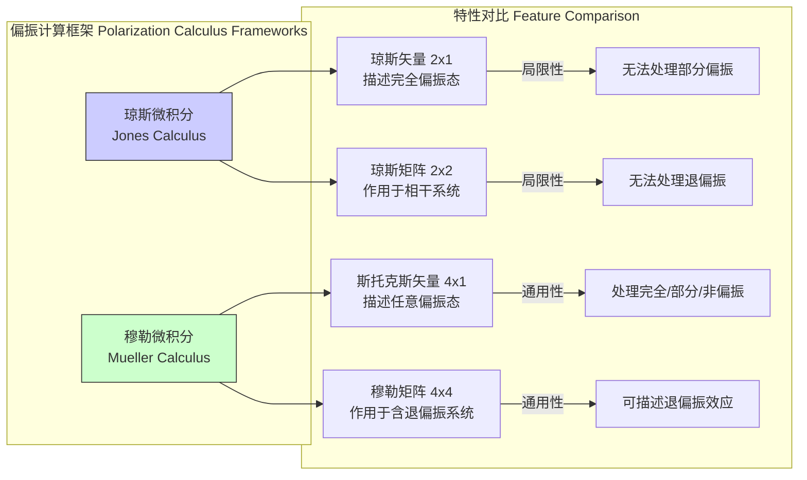
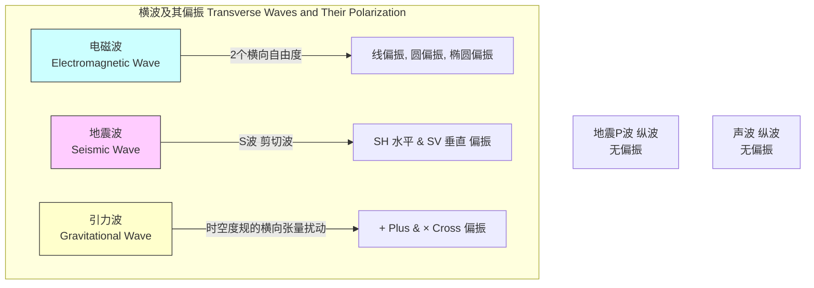

## 偏振 (Polarization)

偏振是横波的一个基本属性，它描述了波的振荡方向与传播方向所形成平面的几何轨迹。虽然偏振可见于所有类型的横波（如地震中的S波、引力波），但在本技术文档中，我们将主要聚焦于电磁波（特别是光）的偏振，因其在科学和技术领域中具有极其广泛的应用。

### 1. 核心概念与数学基础

电磁波由相互垂直振荡的电场 $\vec{E}$ 和磁场 $\vec{B}$ 组成，两者均垂直于波的传播方向。根据惯例，电磁波的偏振态由电场矢量 $\vec{E}$ 的行为来定义。

对于沿 z 轴传播的单色平面波，其电场可以表示为：

$$
\vec{E}(z, t) = \text{Re} \left[ \vec{E}_0 e^{i(kz - \omega t)} \right]
$$

其中：
*   $\vec{E}(z, t)$ 是在位置 $z$ 和时间 $t$ 的瞬时电场矢量。
*   $\vec{E}_0$ 是复振幅矢量，可以分解为在x和y方向上的分量：$\vec{E}_0 = E_{0x} \hat{x} + E_{0y} \hat{y}$。
*   $E_{0x} = A_x e^{i\delta_x}$ 和 $E_{0y} = A_y e^{i\delta_y}$ 是电场在x和y方向上的复振幅，其中 $A_x$ 和 $A_y$ 是实振幅，$\delta_x$ 和 $\delta_y$ 是初始相位。
*   $k$ 是波数 ($k = 2\pi/\lambda$)。
*   $\omega$ 是角频率 ($\omega = 2\pi f$)。
*   $i$ 是虚数单位。

电场矢量的末端在垂直于传播方向的平面（x-y平面）上描绘的轨迹图形，决定了光的偏振类型。

```mermaid
graph TD
    subgraph "偏振态分类 Polarization State Classification"
        GeneralWave["通用波<br>Ez,t = Ax*coskz-ωt+δx + Ay*coskz-ωt+δy"] -->|相位差 Δδ = δy - δx| StateDecision["Δδ = ?["
        StateDecision -- "Δδ = mπ" --> Linear["线偏振 Linear Polarization"]
        StateDecision -- "Δδ = ±π/2 且 Ax = Ay" --> Circular["圆偏振 Circular Polarization"]
        StateDecision -- "其他情况" --> Elliptical["椭圆偏振 Elliptical Polarization"]

        Circular -- "Δδ = +π/2" --> RHC["右旋圆偏振 Right-Hand Circular"]
        Circular -- "Δδ = -π/2" --> LHC["左旋圆偏振 Left-Hand Circular"]
        Elliptical -- "最普遍形式" --> GeneralCase["General Case"]
    end

    style Linear fill:#ccf,stroke:#333,stroke-width:2px
    style Circular fill:#cfc,stroke:#333,stroke-width:2px
    style Elliptical fill:#fcf,stroke:#333,stroke-width:2px
```

#### 1.1 线偏振 (Linear Polarization)
当x和y分量之间的相位差 $\Delta\delta = \delta_y - \delta_x$ 是 $\pi$ 的整数倍（$\Delta\delta = m\pi, m \in \mathbb{Z}$）时，电场矢量始终沿一个固定方向振荡。

*   **数学描述**:
    $$
    \vec{E}(z, t) = \left[ \hat{x} A_x + \hat{y} A_y \cos(m\pi) \right] \cos(kz - \omega t + \delta_x)
    $$
    电场振荡方向与x轴的夹角 $\alpha$ 为 $\tan(\alpha) = \frac{(-1)^m A_y}{A_x}$。

#### 1.2 圆偏振 (Circular Polarization)
当x和y分量的振幅相等（$A_x = A_y = A$）且相位差为 $\Delta\delta = \pm \pi/2$ 时，电场矢量的末端会描绘一个圆形。

*   **数学描述**:
    *   **右旋圆偏振 (RHCP, $\Delta\delta = -\pi/2$)**:
        $$
        \vec{E}(z, t) = A \left[ \hat{x} \cos(kz - \omega t) + \hat{y} \sin(kz - \omega t) \right]
        $$
    *   **左旋圆偏振 (LHCP, $\Delta\delta = +\pi/2$)**:
        $$
        \vec{E}(z, t) = A \left[ \hat{x} \cos(kz - \omega t) - \hat{y} \sin(kz - \omega t) \right]
        $$
    *注：此处遵循物理学惯例（从光源看去）。在工程学中，定义可能相反。*

#### 1.3 椭圆偏振 (Elliptical Polarization)
这是最普遍的偏振形式，发生在振幅和相位关系不满足线偏振或圆偏振的特定条件时。电场矢量末端描绘一个椭圆。

#### 1.4 数学形式化：琼斯微积分 (Jones Calculus)
琼斯微积分是一种用于描述完全偏振光的数学工具，它使用2x1的复数矢量（琼斯矢量）来表示偏振态，并使用2x2的复数矩阵（琼斯矩阵）来表示光学元件对偏振态的影响。

*   **琼斯矢量 (Jones Vector)**:
    $$
    \vec{J} = \begin{pmatrix} E_{0x} \\ E_{0y} \end{pmatrix} = \begin{pmatrix} A_x e^{i\delta_x} \\ A_y e^{i\delta_y} \end{pmatrix}
    $$
    常见的琼斯矢量（归一化后）：
    *   水平线偏振: $\begin{pmatrix} 1 \\ 0 \end{pmatrix}$
    *   垂直线偏振: $\begin{pmatrix} 0 \\ 1 \end{pmatrix}$
    *   +45°线偏振: $\frac{1}{\sqrt{2}}\begin{pmatrix} 1 \\ 1 \end{pmatrix}$
    *   右旋圆偏振: $\frac{1}{\sqrt{2}}\begin{pmatrix} 1 \\ -i \end{pmatrix}$
    *   左旋圆偏振: $\frac{1}{\sqrt{2}}\begin{pmatrix} 1 \\ i \end{pmatrix}$

*   **琼斯矩阵 (Jones Matrix)**:
    如果一束光 $\vec{J}_{in}$ 通过一个光学元件，出射光的琼斯矢量为 $\vec{J}_{out} = \mathbf{M} \vec{J}_{in}$，其中 $\mathbf{M}$ 是该元件的琼斯矩阵。
    *   水平偏振片: $\mathbf{M} = \begin{pmatrix} 1 & 0 \\ 0 & 0 \end{pmatrix}$
    *   快轴在x方向的四分之一波片: $\mathbf{M} = e^{-i\pi/4} \begin{pmatrix} 1 & 0 \\ 0 & i \end{pmatrix}$

#### 1.5 数学形式化：斯托克斯参量 (Stokes Parameters)
斯托克斯参量提供了一种更通用的描述方法，它不仅能描述完全偏振光，还能描述部分偏振光和非偏振光。它由四个实数 $(S_0, S_1, S_2, S_3)$ 组成。

$$
\begin{aligned}
S_0 &= A_x^2 + A_y^2 = \langle E_x^2 \rangle + \langle E_y^2 \rangle \\
S_1 &= A_x^2 - A_y^2 = \langle E_x^2 \rangle - \langle E_y^2 \rangle \\
S_2 &= 2 A_x A_y \cos(\Delta\delta) = 2 \langle E_x E_y \cos(\Delta\delta) \rangle \\
S_3 &= 2 A_x A_y \sin(\Delta\delta) = 2 \langle E_x E_y \sin(\Delta\delta) \rangle
\end{aligned}
$$

*   $S_0$: 总光强。
*   $S_1$: 水平偏振分量与垂直偏振分量之间的光强差。
*   $S_2$: +45°偏振分量与-45°（135°）偏振分量之间的光强差。
*   $S_3$: 右旋圆偏振分量与左旋圆偏振分量之间的光强差。
*   $\langle \cdot \rangle$ 表示时间平均，这对于处理非单色或部分偏振光至关重要。

对于完全偏振光，它们满足关系 $S_0^2 = S_1^2 + S_2^2 + S_3^2$。对于部分偏振光，则为 $S_0^2 > S_1^2 + S_2^2 + S_3^2$。

### 2. 关键技术规格

偏振相关元件和系统的性能由一系列精确的参数来衡量。

| 参数 (Parameter) | 符号 (Symbol) | 定义 (Definition) | 典型值 (Typical Values) | 单位 (Unit) |
| :--- | :--- | :--- | :--- | :--- |
| **偏振度 (Degree of Polarization)** | DOP 或 P | 偏振光强度占总光强的比例。 $P = \frac{\sqrt{S_1^2+S_2^2+S_3^2}}{S_0}$ | 0 (非偏振) 到 1 (完全偏振) | 无量纲 |
| **消光比 (Extinction Ratio)** | ER | 偏振器件在允许轴和阻挡轴方向上透射光强的比率。 $ER = 10 \log_{10}(T_{max}/T_{min})$ | > 30 dB (高质量偏振片) | 分贝 (dB) |
| **相位延迟 (Retardance)** | $\Gamma$ | 波片使正交偏振分量之间产生的相位差。 | $\pi/2$ (四分之一波片), $\pi$ (半波片) | 弧度 (rad) 或 度 (°) |
| **椭圆率 (Ellipticity)** | $\epsilon$ | 偏振椭圆的短轴与长轴之比。 $\tan(\chi) = \epsilon$, 其中 $\sin(2\chi) = S_3/S_p$，$S_p=\sqrt{S_1^2+S_2^2+S_3^2}$ | -1 (LHC) 到 +1 (RHC) | 无量纲 |
| **方位角 (Azimuth)** | $\psi$ | 偏振椭圆长轴与参考轴（通常是x轴）的夹角。 $\tan(2\psi) = S_2/S_1$ | 0 到 $\pi$ | 弧度 (rad) 或 度 (°) |
| **偏振相关损耗 (Polarization Dependent Loss)** | PDL | 器件对不同偏振态光信号的最大和最小损耗之差。 $PDL = 10 \log_{10}(T_{max}/T_{min})$ | < 0.1 dB (电信级元件) | 分贝 (dB) |
| **偏振模色散 (Polarization Mode Dispersion)** | PMD | 不同偏振态在光纤中传输速度不同导致的脉冲展宽。 | < 0.05 ps/√km (现代光纤) | ps/√km |

### 3. 常见用例

| 应用领域 (Application) | 关键性能指标 (Quantitative Performance Metric) | 描述 (Description) |
| :--- | :--- | :--- |
| **液晶显示器 (LCD)** | 对比度 > 1000:1, 响应时间 < 5 ms | 利用偏振片和液晶分子的电控双折射效应来控制光的通过，从而形成图像。 |
| **3D 电影技术** | 串扰 (Crosstalk) < 2% | 使用圆偏振或线偏振光为左右眼提供不同的图像，从而产生立体视觉。低串扰是保证观看舒适度的关键。 |
| **光通信 (PDM)** | 通道串扰 < -20 dB, PMD补偿 | 偏振复用(PDM)技术在两个正交偏振态上独立加载信号，使信道容量加倍。 |
| **椭偏仪 (Ellipsometry)** | 薄膜厚度分辨率 < 0.1 Å | 通过测量材料表面反射后偏振态的变化，精确确定薄膜厚度、折射率等光学常数。 |
| **雷达遥感 (PolSAR)** | 分类精度提升 15-30% | 全极化合成孔径雷达(PolSAR)发射和接收不同偏振的电磁波，通过分析散射矩阵提高地物分类和识别能力。 |
| **化学 (旋光法)** | 旋光度测量精度 ±0.001° | 手性分子会旋转线偏振光的偏振面，通过测量旋转角度可以确定溶液浓度。 |

### 4. 实现考量

#### 4.1 偏振态的产生
*   **二向色性偏振片 (Dichroic Polarizers)**: 吸收特定方向的偏振光，让与之垂直的偏振光通过。例如，宝丽来H-片。
*   **线栅偏振片 (Wire-grid Polarizers)**: 金属细线阵列，当线间距远小于波长时，仅允许电场垂直于金属线的偏振光通过。
*   **反射式偏振片 (Brewster's Angle Polarizers)**: 当非偏振光以布鲁斯特角入射到电介质表面时，反射光为完全线偏振光。
*   **双折射晶体 (Birefringent Crystals)**: 如方解石，将入射光分为两个偏振方向正交的光束（寻常光o-ray和非寻常光e-ray）。
*   **波片 (Waveplates)**: 利用双折射材料，在两个正交偏振分量之间引入特定的相位延迟，可将线偏振转换为圆偏振或椭圆偏振。

#### 4.2 偏振态的测量 (偏振测量法)
测量斯托克斯参量是表征偏振态的标准方法。一种常见的实现是 **旋转检偏器法 (Rotating Analyzer Method)**。

*   **算法**:
    1.  在光路中放置一个线性偏振片（检偏器）。
    2.  旋转检偏器，并记录其透射轴与参考轴（x轴）成角度 $\theta$ 时的光强 $I(\theta)$。
    3.  光强与斯托克斯参量的关系为：
        $$
        I(\theta) = \frac{1}{2} [S_0 + S_1 \cos(2\theta) + S_2 \sin(2\theta)]
        $$
    4.  通过测量至少三个不同角度 $\theta$ 的光强，可以解出 $S_0, S_1, S_2$。例如，测量 $\theta = 0^\circ, 45^\circ, 90^\circ$ 时的光强 $I_0, I_{45}, I_{90}$：
        $$
        \begin{aligned}
        S_0 &= I_0 + I_{90} \\
        S_1 &= I_0 - I_{90} \\
        S_2 &= 2 I_{45} - (I_0 + I_{90})
        \end{aligned}
        $$
    5.  为了测量 $S_3$，需要在检偏器前插入一个四分之一波片（快轴在参考轴的+45°方向），然后再次测量光强。此时测得的光强 $I'_{45}$ 与 $S_3$ 相关：$S_3 = 2 I'_{45} - (I_0 + I_{90})$。

*   **算法复杂度分析**:
    *   对于使用离散角度（如4个）的测量，计算斯托克斯参量的复杂度为 **O(1)**，因为它只涉及固定次数的算术运算。
    *   如果使用连续旋转的检偏器和锁相放大器，并通过傅里叶分析提取信号的直流、二次谐波的同相和正交分量来得到 $S_0, S_1, S_2$，其计算复杂度为 **O(N log N)**，其中 N 是采样点数。

### 5. 性能特征

#### 5.1 部分偏振光与相干矩阵
自然光（如太阳光、白炽灯光）通常是非偏振的，这意味着其电场矢量在所有方向上快速、随机地振荡。部分偏振光是完全偏振光和非偏振光的统计叠加。

*   **偏振度 (DOP)**:
    $$
    \text{DOP} = P = \frac{I_{\text{polarized}}}{I_{\text{total}}} = \frac{\sqrt{S_1^2 + S_2^2 + S_3^2}}{S_0}
    $$
    其中 $0 \le P \le 1$。$P=0$ 为非偏振光，$P=1$ 为完全偏振光，$0 < P < 1$ 为部分偏振光。

*   **相干矩阵 (Coherency Matrix)**:
    对于部分偏振或准单色光，使用相干矩阵 $\mathbf{J}$（也称偏振矩阵）进行描述更为严谨。
    $$
    \mathbf{J} = \begin{pmatrix} \langle E_x E_x^* \rangle & \langle E_x E_y^* \rangle \\ \langle E_y E_x^* \rangle & \langle E_y E_y^* \rangle \end{pmatrix} = \begin{pmatrix} J_{xx} & J_{xy} \\ J_{yx} & J_{yy} \end{pmatrix}
    $$
    其中 $\langle \cdot \rangle$ 表示时间平均。相干矩阵与斯托克斯参量的关系为：
    $$
    \begin{aligned}
    S_0 &= J_{xx} + J_{yy} \\
    S_1 &= J_{xx} - J_{yy} \\
    S_2 &= J_{xy} + J_{yx} \\
    S_3 &= i(J_{yx} - J_{xy})
    \end{aligned}
    $$
    光的偏振度也可以通过相干矩阵的行列式和迹计算：
    $$
    P = \sqrt{1 - \frac{4 \det(\mathbf{J})}{(\text{tr}(\mathbf{J}))^2}}
    $$
    当 $\det(\mathbf{J}) = 0$ 时，$P=1$，光是完全偏振的。

### 6. 相关技术

#### 6.1 琼斯微积分 vs. 穆勒微积分

*   **琼斯微积分 (Jones Calculus)**:
    *   处理对象：完全偏振光。
    *   数学工具：2x1 琼斯矢量和 2x2 琼斯矩阵。
    *   基础：基于电场的复振幅，保留相位信息。
    *   适用范围：相干光学系统，如干涉仪、激光系统。不适用于描述退偏振或部分偏振光。

*   **穆勒微积分 (Mueller Calculus)**:
    *   处理对象：任意偏振态的光（完全、部分、非偏振）。
    *   数学工具：4x1 斯托克斯矢量和 4x4 穆勒矩阵。
    *   基础：基于可测量的光强，不直接处理相位。
    *   适用范围：通用性强，能描述散射、退偏振等非相干过程。是实验偏振测量的标准框架。

#### 6.2 其他物理领域的偏振
偏振是所有横波的共性。



*   **地震S波 (Shear Waves)**: S波是横波，其质点振动方向垂直于波的传播方向。它们可以被分解为水平偏振（SH波）和垂直偏振（SV波）。
*   **引力波 (Gravitational Waves)**: 根据广义相对论，引力波是时空度规的涟漪。它们是横向张量波，具有两个独立的偏振模式，称为“+”模式（plus polarization）和“×”模式（cross polarization）。对于沿z轴传播的引力波，其度规扰动 $h_{ij}$ 在时空坐标的横向-无迹规范下可以写为：
    $$
    h_{ij}(t,z) = \begin{pmatrix} h_+ & h_\times \\ h_\times & -h_+ \end{pmatrix} \cos(\omega(t-z/c))
    $$
    其中 $h_+$ 和 $h_\times$ 分别是两种偏振模式的振幅。这两种模式使自由粒子组成的圆环分别呈现沿x-y轴和沿45°对角线方向的交替拉伸和压缩。

### 7. 参考文献

1.  Stokes, G. G. (1852). On the composition and resolution of streams of polarized light from different sources. *Transactions of the Cambridge Philosophical Society, 9*, 399-416. (This is the foundational paper for Stokes parameters).
2.  Azzam, R. M. A., & Bashara, N. M. (1987). *Ellipsometry and Polarized Light*. North-Holland. (A comprehensive textbook on the subject). DOI: [10.1016/C2009-0-22244-4](https://doi.org/10.1016/C2009-0-22244-4)
3.  Kikuchi, K. (2008). Polarization-division multiplexing. In *Optical Fiber Telecommunications V A: Components and Subsystems* (pp. 235-274). Academic Press. DOI: [10.1016/B978-012374171-4.50010-0](https://doi.org/10.1016/B978-012374171-4.50010-0)
4.  Goldstein, D. (2017). *Polarized Light, Third Edition*. CRC Press. DOI: [10.1201/9781315118746](https://doi.org/10.1201/9781315118746)