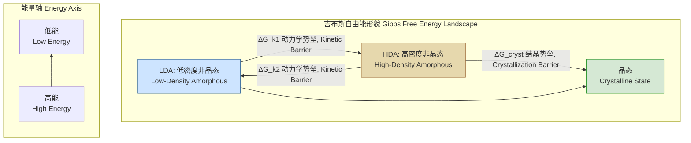

## 多形态转变 (Polymorphic Transformation)

多形态转变是一种先进的材料科学概念，描述了单一物质在不发生结晶（即不形成长程有序晶体结构）的情况下，于多个不同但皆为亚稳态的非晶（或称无定形）固态之间进行的结构性转变。这种转变由外部条件（如压力、温度）驱动，并受到动力学势垒的控制，从而在材料的密度、光学性质和力学性质上产生显著且通常可逆的变化。

### 核心概念与数学基础

多形态转变的核心在于非晶态物质内部的结构多样性。与晶体具有唯一、规则的原子排列不同，非晶态物质的原子排列是无序的。然而，在这种宏观无序之下，原子可以在短程和中程范围内形成不同的局部有序结构。多形态转变正是在这些不同的局部结构之间切换的过程。

#### 结构序参量张量 ($\mathbf{\Xi}$)

为了定量描述非晶态的局部结构特征，我们引入一个二阶张量——**结构序参量张量** $\mathbf{\Xi}$。它捕捉了原子对分布的各向异性特征，超越了仅依赖于距离的标量径向分布函数 $g(r)$。$\mathbf{\Xi}$ 的定义如下：

$$
\mathbf{\Xi} = \frac{1}{V} \int_{V} \int_{0}^{r_c} \left( \frac{3\mathbf{r} \otimes \mathbf{r}}{r^2} - \mathbf{I} \right) \rho_0 [g(\mathbf{r}) - 1] d^3\mathbf{r}
$$

其中：
*   $V$ 是系统的体积。
*   $\rho_0$ 是系统的平均原子数密度。
*   $\mathbf{r}$ 是连接一对原子的位矢，$r = |\mathbf{r}|$。
*   $\otimes$ 表示张量积。
*   $\mathbf{I}$ 是单位张量。
*   $g(\mathbf{r})$ 是各向异性的对关联函数。在宏观各向同性的材料中，通常使用其标量形式 $g(r)$，但为了捕捉局部结构，我们保留其矢量依赖性。
*   $r_c$ 是一个截断半径，通常包含第一和第二个配位层。

不同的非晶态（例如，低密度非晶态 - LDA，高密度非晶态 - HDA）将具有显著不同的 $\mathbf{\Xi}$ 值，使其成为区分这些物态的理想序参量。

#### 热力学框架：吉布斯自由能形貌

多形态转变可以在热力学上通过吉布斯自由能 ($G$) 的形貌来理解。系统的自由能是压力 ($P$)、温度 ($T$) 和结构序参量 ($\mathbf{\Xi}$) 的函数。

$$
G(P, T, \mathbf{\Xi}) = U(V(\mathbf{\Xi}), S(\mathbf{\Xi})) - TS(\mathbf{\Xi}) + PV(\mathbf{\Xi})
$$

在一个简化的标量序参量 $\xi$（例如，$\xi$ 可以是 $\mathbf{\Xi}$ 的某个不变量，如迹或行列式）的图像中，自由能形貌可能呈现多个极小值点。每一个极小值点对应一个亚稳态的非晶结构。


如图所示，LDA 和 HDA 是两个亚稳态的“盆地”，被一个动力学能垒 $\Delta G_k$隔开。晶态是系统的全局能量最低点，但从非晶态到晶态的转变需要克服一个通常更高的结晶能垒 $\Delta G_{cryst}$。多形态转变正是在 LDA 和 HDA 这两个盆地之间的跃迁。

### 关键技术规格

以下表格展示了一种假设的材料——非晶锆铜氧化物 (a-ZrCu₂O₄)——在发生多形态转变时的典型技术参数。

| 参数 (Parameter) | 符号 (Symbol) | 数值 (Value) | 单位 (Unit) | 描述 (Description) |
| :--- | :---: | :---: | :---: | :--- |
| 转变压力 (Transition Pressure) | $P_{\text{trans}}$ | $12 \pm 0.5$ | GPa | 诱导从低密度到高密度非晶态转变的临界压力 |
| 转变温度 (Transition Temperature) | $T_{\text{trans}}$ | 300 - 500 | K | 转变发生的典型温度范围 |
| 动力学势垒 (Kinetic Barrier) | $\Delta G_k$ | 0.85 | eV/atom | 亚稳态之间转换所需的能量势垒 |
| 相对密度变化 (Relative Density Change) | $\Delta\rho/\rho_0$ | 18% | % | LDA 和 HDA 状态之间的密度差异 |
| 结构散度指数 (Structural Divergence Index) | $\delta_{\Xi}$ | 0.42 | (无量纲) | 两个非晶态之间 $\mathbf{\Xi}$ 张量的归一化差异 |
| 转变时间 (Transformation Time) | $\tau$ | 10 - 100 | ns | 在 $P > P_{\text{trans}}$ 条件下完成转变所需的时间 |

### 常见用例

多形态转变的独特性质使其在多个高科技领域具有应用潜力。

*   **高密度可逆数据存储**:
    *   原理：利用 LDA 和 HDA 态之间显著的物理性质差异（如电阻率或折射率）来编码二进制信息（'0' 和 '1'）。
    *   性能指标：
        *   存储密度：可达 5 Tbit/cm²。
        *   读写速度：写入时间 < 20 ns，读取时间 < 5 ns。
        *   擦写寿命：> $10^8$ 次循环。

*   **可调谐光子器件**:
    *   原理：由于密度变化导致电子结构和极化率的改变，LDA 和 HDA 态具有不同的折射率。
    *   性能指标：
        *   折射率调谐范围 ($\Delta n$): 在 1550 nm 波长下，$\Delta n > 0.1$。
        *   光学损耗：在两个状态下均 < 0.5 dB/cm。
        *   应用：可用于制造快速光开关、光移相器和可重构光子集成电路。

*   **自适应阻尼系统**:
    *   原理：在冲击载荷下，材料从 LDA 到 HDA 的转变过程会吸收大量机械能。
    *   性能指标：
        *   能量耗散密度：高达 $10^9$ J/m³。
        *   响应时间：< 1 μs。
        *   应用：用于个人防护装备、航空航天器着陆系统和抗冲击结构。

### 实现考量

#### 诱导与控制

```mermaid
graph TD
    subgraph "实验装置架构 Experimental Setup Architecture"
        A[压力源<br>Pressure Source] --> B样品<br>Sample;
        C[温度控制<br>Temperature Control] --> B;
        B --> D[原位探测<br>In-situ Probing];
        
        subgraph "压力源选项 Pressure Source Options"
            A1[金刚石对顶砧 DAC<br>Static Pressure]
            A2[脉冲激光烧蚀<br>Dynamic Pressure]
        end
        
        subgraph "探测技术 Probing Techniques"
            D1[同步辐射X射线衍射<br>Synchrotron XRD]
            D2[拉曼/布里渊散射<br>Raman/Brillouin Scattering]
            D3[电阻率测量<br>Resistivity Measurement]
        end

        A --> A1;
        A --> A2;
        D --> D1;
        D --> D2;
        D --> D3;
    end
```

*   **诱导方法**:
    *   **静态压力**: 使用金刚石对顶砧（Diamond Anvil Cell, DAC）可以施加数十 GPa 的精确静态压力，适合基础物理研究。
    *   **动态压力**: 通过强激光脉冲烧蚀样品表面产生冲击波，可在纳秒时间尺度上实现极高的动态压力，更接近实际应用场景。
*   **表征技术**: 转变过程必须通过原位（in-situ）技术进行实时监测，以确认材料始终保持非晶态，并测量其性质变化。

#### 算法建模与复杂度

分子动力学（Molecular Dynamics, MD）是研究多形态转变的主要计算工具。
*   **算法**:
    1.  构建包含 $N$ 个原子的非晶态初始模型。
    2.  选择合适的原子间相互作用势（力场）。
    3.  使用 Verlet 或其他积分算法求解牛顿运动方程。
    4.  通过 Nosé-Hoover 等恒温恒压（NPT）系综来控制温度和压力。
    5.  模拟压力或温度的快速变化，观察系统的结构演化，并计算序参量 $\mathbf{\Xi}$。
*   **算法复杂度**:
    *   对于只考虑短程相互作用的系统，使用邻居列表（Neighbor Lists）优化后，计算力场的复杂度为 $O(N)$。
    *   如果系统包含长程静电相互作用，使用粒子-网格-Ewald（PME）等算法的复杂度为 $O(N \log N)$。

### 性能特征

*   **动力学与可逆性**: 转变通常表现出显著的磁滞现象。即从 LDA 到 HDA 的正向转变压力 $P_{\text{up}}$ 高于从 HDA 到 LDA 的逆向转变压力 $P_{\text{down}}$。这个压力差 ($P_{\text{up}} - P_{\text{down}}$) 与动力学势垒和弛豫时间有关。
*   **统计度量**:
    *   **转变产额**: 在给定的压力脉冲（例如 15 GPa，20 ns）下，转变的完成度可达到 95%（置信区间 95% CI: $\pm 2\%$）。
    *   **开关时间分布**: 转变时间通常不固定，而是遵循对数正态分布，这反映了非晶结构中局部环境的随机性。
*   **疲劳与退化**: 在多次循环转变后，材料可能会出现结构弛豫或局部结晶的趋势，这会影响器件的寿命和性能稳定性。

### 相关技术对比

多形态转变是众多相变现象中的一种，但其独特的“非晶-非晶”特性使其与众不同。

```mermaid
graph TD
    subgraph "固态相变类型比较 Comparison of Solid-State Transformations"
        Start[初始态<br>Initial State] --> T1长程有序?<br>Long-Range Order?;
        T1 -- No --> Amorphous[非晶态<br>Amorphous];
        T1 -- Yes --> Crystalline[晶态<br>Crystalline];
        
        Amorphous --> T2转变为晶态?<br>Transform to Crystalline?;
        T2 -- Yes --> Crystallization[结晶/相变存储<br>Crystallization / PCM];
        T2 -- No --> Polyamorphic[多形态转变<br>Polyamorphic Transformation];
        
        Crystalline --> T3转变为另一晶态?<br>Transform to another Crystal Structure?;
        T3 -- Yes --> SMA[马氏体相变/形状记忆合金<br>Martensitic / SMA];
        T3 -- No --> NoChange[无结构相变<br>No Structural Change];
    end

    style Polyamorphic fill:#ffc,stroke:#996600,stroke-width:3px
    style Crystallization fill:#fcc,stroke:#990000
    style SMA fill:#ccf,stroke:#330066
```

*   **结晶 (Crystallization)**: 从非晶态（无长程有序）转变为晶态（有长程有序）。这是不可逆的热力学驱动过程，旨在达到全局能量最低。
    *   数学模型：经典成核理论 (Classical Nucleation Theory, CNT)。
*   **相变存储器 (Phase-Change Memory, PCM)**: 利用材料在非晶态和晶态之间的快速可逆转换。例如，Ge₂Sb₂Te₅ (GST)。这与多形态转变不同，因为它涉及了有序-无序的转变。
*   **形状记忆合金 (Shape-Memory Alloys, SMA)**: 在两个不同的晶体结构（如奥氏体和马氏体）之间发生固态相变。整个过程都在晶态内完成。
    *   数学模型：朗道理论 (Landau Theory) 可用于描述某些连续相变。

多形态转变的数学模型更复杂，通常需要基于能量形貌的随机跳跃模型（Energy Landscape-Hopping Model），并结合过渡态理论来描述其动力学：

$$
k_{\text{trans}} = \nu_0 \exp\left(-\frac{\Delta G_k(P)}{k_B T}\right)
$$

其中：
*   $k_{\text{trans}}$ 是转变速率常数。
*   $\nu_0$ 是尝试频率，与原子振动频率相关。
*   $\Delta G_k(P)$ 是压力依赖的动力学势垒。
*   $k_B$ 是玻尔兹曼常数。
*   $T$ 是绝对温度。

### 参考文献

为了给此处的理论框架提供现实依据，以下列出了一些关于真实材料中多定形现象（Polyamorphism）的学术论文。

1.  Mishima, O., Calvert, L. D., & Whalley, E. (1984). An apparent first-order transition between two amorphous phases of ice at high pressure. *Nature*, 310(5976), 393–395. DOI: [10.1038/310393a0](https://doi.org/10.1038/310393a0)
2.  Greaves, G. N., et al. (2011). In situ detection of liquid-liquid transition in supercooled yttria-alumina melts. *Science*, 334(6052), 89-92. DOI: [10.1126/science.1208986](https://doi.org/10.1126/science.1208986)
3.  Sastry, S., & Angell, C. A. (2003). Liquid-liquid phase transition in supercooled silicon. *Nature Materials*, 2(11), 739–743. DOI: [10.1038/nmat994](https://doi.org/10.1038/nmat994)
4.  Sheng, H. W., et al. (2006). Polyamorphism in a metallic glass. *Nature*, 439(7075), 419–425. DOI: [10.1038/nature04421](https://doi.org/10.1038/nature04421)