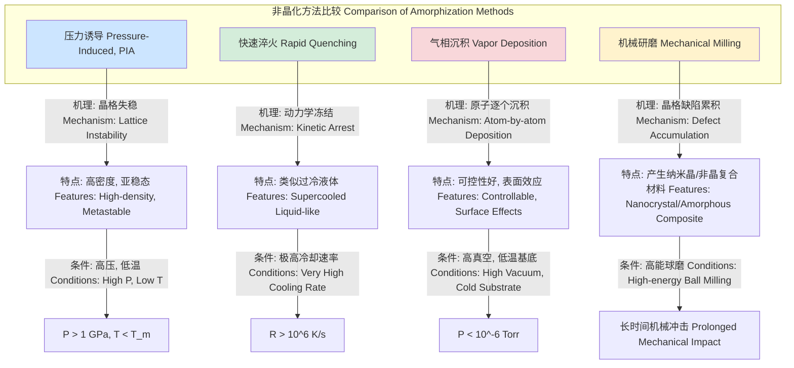

## 压力诱导非晶化 (Pressure Induced Amorphization)

压力诱导非晶化（PIA）是一种固态相变过程，其中晶体材料在高压作用下转变为非晶态（或称玻璃态），而无需经过熔融的液相。这一过程通常在低于材料熔点的温度下发生，代表了晶体在热力学或机械不稳定性下的坍塌。PIA是高压物理和材料科学中的一个重要现象，揭示了物质在极端条件下的新行为。

### 核心概念与数学基础

#### 1. 热力学驱动力
PIA的发生可以从吉布斯自由能（Gibbs Free Energy）的角度来理解。一个系统在恒定温度（T）和压力（P）下会趋向于具有最低吉布斯自由能（G）的状态。吉布斯自由能的定义为：

$$ G = U + PV - TS $$

其中：
*   $G$ 是吉布斯自由能
*   $U$ 是系统的内能
*   $P$ 是压力
*   $V$ 是体积
*   $T$ 是绝对温度
*   $S$ 是熵

在给定的（P, T）条件下，如果非晶相的吉布斯自由能 $G_{amorph}$ 低于晶相的吉布斯自由能 $G_{cryst}$，则晶体向非晶体的转变在热力学上是有利的。然而，通常情况下，非晶相相对于晶相是亚稳态的。PIA的发生是因为施加的压力极大地改变了 $PV$ 项，可能导致晶相的 $G$ 曲线与亚稳态非晶相的 $G$ 曲线相交。

一个关键概念是“虚拟熔化”。在低温下，晶体的熔化曲线可以外推到其平衡熔点以下。如果对晶体施加的压力超过了这条外推熔化曲线上的压力值，晶体就会变得相对于（过冷的）液相不稳定，从而可能转变为能量上更接近液相的非晶态。对于像水（冰）这样熔化曲线斜率为负的物质，加压可以降低熔点，更容易实现PIA。

描述相边界斜率的克劳修斯-克拉佩龙方程（Clausius-Clapeyron equation）至关重要：

$$ \frac{dP}{dT} = \frac{\Delta H_{trs}}{T \Delta V_{trs}} = \frac{L}{T \Delta V_{trs}} $$

其中：
*   $\frac{dP}{dT}$ 是相边界在P-T图上的斜率
*   $\Delta H_{trs}$ (或 $L$) 是相变的潜热（焓变）
*   $T$ 是相变温度
*   $\Delta V_{trs}$ 是相变过程中的体积变化

对于冰Ih相，$\Delta V_{trs} = V_{liquid} - V_{solid} < 0$，因此其熔化曲线斜率为负。

#### 2. 机械不稳定性
除了热力学驱动，PIA也可以由晶格的机械不稳定性触发。当压力增加时，晶格的弹性常数会发生变化。如果某个剪切弹性模量（Shear Modulus, C'）趋近于零，晶格将无法抵抗剪切形变，从而导致结构坍塌成无序状态。这被称为“玻恩不稳定性判据”（Born stability criteria）的破坏。

对于一个立方晶体，其稳定性要求弹性常数满足：
*   $C_{11} - C_{12} > 0$
*   $C_{44} > 0$
*   $C_{11} + 2C_{12} > 0$ (等同于体积模量 $K > 0$)

当压力导致其中一个条件（通常是 $C_{44}$ 或 $C_{11} - C_{12}$）不再满足时，晶格就会失稳并发生非晶化。

#### 3. 动力学因素
PIA是一个动力学过程。即使在热力学上有利，从晶体到非晶的转变也需要克服一个能量势垒。在极低的温度下，原子迁移率非常低，转变可能被“动力学冻结”，即使压力已经超过了转变压力。因此，PIA的发生通常局限在一个特定的温度窗口内。

```mermaid
graph TD
    subgraph "物质相图 P-T Phase Diagram"
        A[晶体相, Crystalline Phase] -- "熔化 Melting" --> B[液相, Liquid Phase];
        B -- "凝固 Freezing" --> A;
        A -- "升华 Sublimation" --> C[气相, Gas Phase];
        B -- "蒸发 Vaporization" --> C;
        D亚稳态过冷液体, Metastable Supercooled Liquid
        E[非晶相, Amorphous Phase]

        B -- "玻璃化转变 Glass Transition" --> E;
        subgraph "PIA 路径 PIA Pathway"
            A -- "加压 @ 低温 Compression at Low T" --> E;
        end
    end

    MeltingCurve熔化曲线, Melting Curve
    ExtrapolatedCurve["外推熔化曲线 Extrapolated Melting Curve["

    B -- "沿熔化曲线" --> MeltingCurve;
    A -- "跨越外推熔化曲线" --> ExtrapolatedCurve;
    ExtrapolatedCurve --> E;

    style A fill:#ccf,stroke:#333
    style E fill:#fcc,stroke:#333
    style B fill:#cff,stroke:#333
```

### 关键技术参数

下表列出了一些典型材料发生PIA的转变压力和条件。

| 材料 (Material) | 初始晶相 (Initial Crystal Phase) | 转变压力 (Transition Pressure) | 温度 (Temperature) | 密度变化 (Density Change) |
| :--- | :--- | :--- | :--- | :--- |
| 冰 (H₂O) | Ih (Hexagonal Ice) | ~1.0 GPa | 77 K | ~+22% (形成HDA) |
| 硅 (Si) | Diamond Cubic (dc) | ~12-15 GPa | 300 K | ~+20% (形成高密度非晶硅) |
| 锗 (Ge) | Diamond Cubic (dc) | ~10-12 GPa | 300 K | ~+25% |
| 石英 (α-SiO₂) | Trigonal | ~25-35 GPa | 300 K | ~+21% |
| 磷化铟 (InP) | Zincblende | ~10.4 GPa | 300 K | ~+18% |

*HDA: High-Density Amorphous ice (高密度非晶冰)*

### 常见应用案例

| 应用领域 (Use Case) | 描述 (Description) | 定量性能指标 (Quantitative Metrics) |
| :--- | :--- | :--- |
| **新材料合成** | 通过PIA制备传统方法难以获得的高密度非晶材料。例如，高密度非晶冰（HDA）是研究水反常性质的关键。 | **产物密度:** HDA ~1.17 g/cm³ (77 K, 1 atm) |
| | | **硬度:** 非晶硅的维氏硬度可达 ~11 GPa，高于晶体硅 (~10 GPa) |
| **地球与行星科学** | 解释含冰卫星（如木卫二Europa）内部可能存在的非晶冰层。撞击事件产生的高压可导致地壳岩石的非晶化。 | **模型预测:** 木卫二冰壳下层压力可达 >100 MPa，足以影响冰的相态。 |
| | | **撞击证据:** 陨石坑中发现的石英非晶化（击变石）是超高压事件的证据。 |
| **半导体工业** | 研究离子注入引起的非晶化，这是一种局部高压效应。了解其机理有助于控制和优化半导体器件的制造过程。 | **非晶层厚度:** 100 keV Si⁺ 注入Si，可产生~150 nm厚的非晶层。 |
| | | **掺杂激活效率:** 非晶化后再结晶可以提高掺杂原子的电激活率至 >90%。 |

### 实现考量

#### 1. 实验实现
PIA通常使用金刚石对顶砧（Diamond Anvil Cell, DAC）在静态高压下实现。
*   **装置**: 两颗精密切割的金刚石相对放置，通过机械装置施加压力。样品被置于两砧面之间的一个金属垫片的小孔中。
*   **压力标定**: 通过已知物态方程的材料（如红宝石、金）的光谱位移或X射线衍射来标定压力。
*   **原位表征**: 结合X射线衍射（XRD）、拉曼光谱、布里渊散射等技术，实时监测样品在加压过程中的结构和性质变化。

```mermaid
graph LR
    subgraph "金刚石对顶砧 Diamond Anvil Cell"
        F1[施加的力, Applied Force] --> D1[金刚石砧, Diamond Anvil 1];
        F2[施加的力, Applied Force] --> D2[金刚石砧, Diamond Anvil 2];
        
        D1 -- "压缩 Compresses" --> G[金属垫片, Gasket];
        D2 -- "压缩 Compresses" --> G;

        G -- "包含 Contains" --> S[样品室, Sample Chamber];
        S -- "填充 Filled with" --> PTM[传压介质, Pressure Transmitting Medium];
        S -- "包含 Contains" -- > Sample[样品, Sample];
        S -- "包含 Contains" -- > Ruby[红宝石压力标, Ruby Pressure Marker];

        XRay[X射线/激光, X-ray/Laser Beam] --> S;
        S --> Detector[衍射/光谱信号, Diffraction/Spectrum Signal];
    end

    style D1 fill:#e6f2ff,stroke:#004080
    style D2 fill:#e6f2ff,stroke:#004080
    style S fill:#fff0b3,stroke:#b38f00
```

#### 2. 计算模拟
分子动力学（MD）模拟是研究PIA原子尺度机理的强大工具。
*   **算法**: 通过数值求解牛顿运动方程来模拟原子体系的演化。
    $$ F_i = m_i \frac{d^2 r_i}{dt^2} = -\nabla_{r_i} U(r_1, r_2, ..., r_N) $$
    其中 $F_i, m_i, r_i$ 分别是第 $i$ 个原子的受力、质量和位置，$U$ 是体系的总势能，由原子间相互作用势函数（如Stillinger-Weber势、Tersoff势）描述。
*   **模拟过程**:
    1.  构建完美的晶体超胞。
    2.  在恒定温度和逐渐增加的压力下进行模拟（NPT系综）。
    3.  监测体系的体积、能量、径向分布函数和弹性常数等。
*   **算法复杂度**: MD模拟的计算复杂度主要取决于原子数 $N$ 和势函数的截断半径。对于短程相互作用，每次迭代的复杂度通常为 $O(N)$（使用邻居列表等优化算法）。总计算时间取决于模拟的时长和时间步长。

### 性能特征

通过PIA形成的非晶材料具有独特的结构和物理性质。

#### 1. 结构表征
*   **径向分布函数 (Radial Distribution Function, RDF)**: $g(r)$ 描述了以一个原子为中心，在距离 $r$ 处找到另一个原子的概率密度。晶体具有尖锐的长程有序峰，而非晶体只有短程有序，表现为几个宽化的峰。
    $$ g(r) = \frac{V}{N^2} \left\langle \sum_{i \neq j} \delta(r - |\mathbf{r}_i - \mathbf{r}_j|) \right\rangle $$
    其中 $N$ 是粒子数，$V$ 是体积，$\langle ... \rangle$ 表示系综平均。
*   **结构因子 (Structure Factor)**: $S(Q)$ 是 $g(r)$ 的傅里叶变换，可以通过X射线或中子衍射实验直接测量。
    $$ S(Q) = 1 + 4\pi\rho_0 \int_0^\infty [g(r) - 1] \frac{\sin(Qr)}{Qr} r^2 dr $$
    其中 $\rho_0 = N/V$ 是平均数密度，$Q$ 是散射矢量的大小。$S(Q)$ 的第一个尖锐峰（First Sharp Diffraction Peak, FSDP）是中程有序的标志。

#### 2. 统计度量
*   **密度**: PIA产物的密度通常比初始晶相高，但低于更高压力的晶相。例如，HDA的密度（~1.17 g/cm³）介于普通冰Ih（~0.92 g/cm³）和高压冰VI（~1.31 g/cm³）之间。
*   **配位数**: 非晶相的原子配位数分布是一个高斯分布，其平均值通常高于初始晶相。例如，非晶硅的平均配位数从晶体硅的4增加到~5-6。
*   **键角分布**: 晶体中键角是固定的（如金刚石结构为109.5°），而非晶相中的键角则呈现一个以某个值为中心、具有一定标准差（例如，$\sigma \approx 10-15^\circ$）的分布。

### 相关技术

PIA是获得非晶材料的多种途径之一。



#### 数学模型比较
*   **PIA vs. 快速淬火**:
    *   **PIA**: 转变由压力驱动，状态变量是压力 $P$。关键参数是临界压力 $P_c$。转变路径在P-T图上是垂直向上的。
    *   **快速淬火**: 转变由温度驱动，状态变量是温度 $T$。关键参数是临界冷却速率 $R_c$。要形成非晶，冷却速率 $R$ 必须大于 $R_c$，以避免晶核形成和长大。这可以用时间-温度-转变（TTT）图来描述。形成玻璃的条件是冷却曲线不与TTT图中的“鼻子”（最短成核时间点）相交。
    $$ R > R_c \approx \frac{T_m - T_g}{\tau_{nose}} $$
    其中 $T_m$ 是熔点，$T_g$ 是玻璃化转变温度，$\tau_{nose}$ 是TTT图中成核时间最短的“鼻尖”时间。

### 参考文献
1.  Mishima, O., Calvert, L. D., & Whalley, E. (1984). An apparently first-order transition between two amorphous phases of ice at a pressure of 1 GPa. *Nature*, 310(5976), 393–395. DOI: `10.1038/310393a0`
2.  Ponyatovsky, E. G., & Barkalov, O. I. (1992). Pressure-induced amorphization of crystalline solids. *Materials Science Reports*, 8(4), 147–191. DOI: `10.1016/0920-2307(92)90005-X`
3.  Deb, S. K., Wilding, M., Somayazulu, M., & McMillan, P. F. (2001). Pressure-induced amorphization and ordering in crystalline and amorphous silicon. *Nature*, 414(6863), 528–531. DOI: `10.1038/35107036`
4.  Richet, P., & Gillet, P. (1997). Pressure-induced amorphization of minerals: a review. *European Journal of Mineralogy*, 9(5), 907–933. DOI: `10.1127/ejm/9/5/0907`
5.  Stillinger, F. H., & Weber, T. A. (1985). Computer simulation of local order in condensed phases of silicon. *Physical Review B*, 31(8), 5262–5271. DOI: `10.1103/PhysRevB.31.5262`