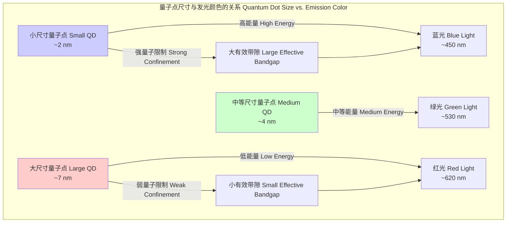
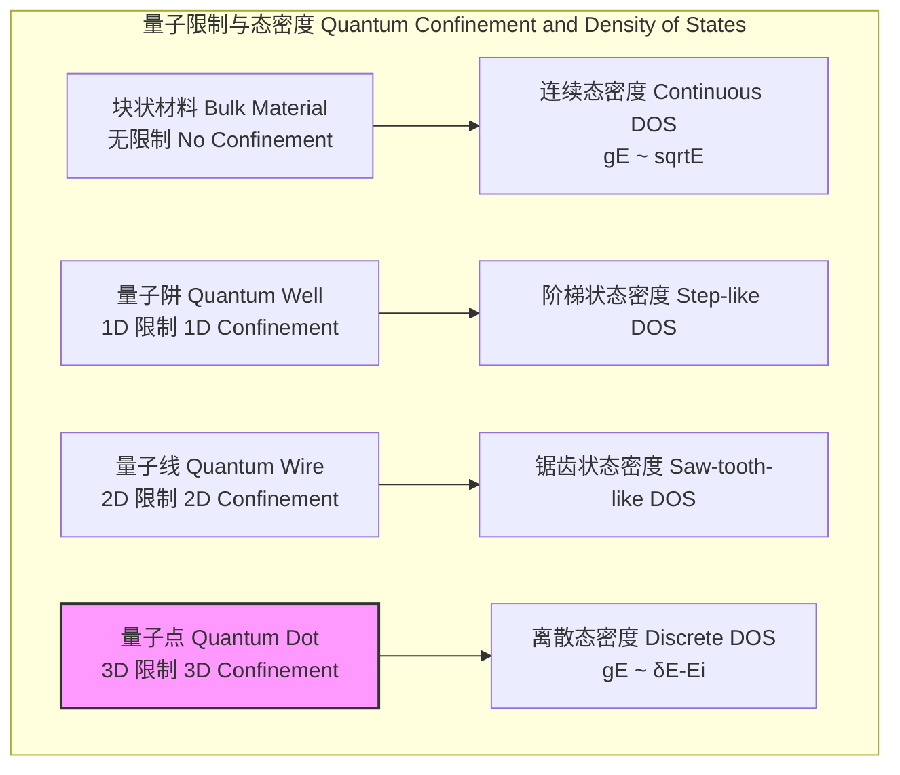

## 量子点

量子点（Quantum Dots, QDs）是半导体纳米晶体，其尺寸非常小（通常为2-10纳米），以至于其内部的电子和空穴在所有三个空间维度上都受到量子限制。这种限制导致其电子能级结构从连续的能带变为离散的、原子般的能级。这一特性使得量子点的光学和电学性质（尤其是其发射光的颜色）可以通过精确控制其尺寸和成分来调节。

### 核心概念与数学基础

量子点的物理核心是**量子限制效应（Quantum Confinement Effect）**。当半导体晶体的尺寸接近或小于其材料的**激子玻尔半径（Exciton Bohr Radius）**时，这种效应变得显著。激子是电子和空穴通过库仑力相互吸引形成的束缚对。

#### 激子玻尔半径

激子玻尔半径 $a_B^*$ 是描述激子中电子和空穴平均距离的特征长度，其定义为：
$$ a_B^* = a_B \frac{\epsilon_r}{\mu/m_e} = \frac{4\pi\epsilon_0\epsilon_r\hbar^2}{\mu e^2} $$
其中：
*   $a_B$ 是氢原子的玻尔半径（约0.053 nm）。
*   $\epsilon_0$ 是真空介电常数。
*   $\epsilon_r$ 是半导体材料的相对介电常数。
*   $\hbar$ 是约化普朗克常数。
*   $e$ 是基本电荷。
*   $\mu$ 是激子的约化质量，定义为 $\mu = \frac{m_e^* m_h^*}{m_e^* + m_h^*}$，其中 $m_e^*$ 和 $m_h^*$ 分别是电子和空穴在晶体中的有效质量。
*   $m_e$ 是电子的静止质量。

当量子点的半径 $R < a_B^*$ 时，强限制区域开始，量子效应主导其性质。

#### “无限深势阱”模型（Particle in a Box）

理解量子限制最简单的模型是三维无限深势阱。在这个模型中，载流子（电子或空穴）被限制在一个边长为 $L$ 的立方体盒子内，盒子外的势能为无穷大。其定态薛定谔方程为：
$$ H\psi = \left( -\frac{\hbar^2}{2m^*} \nabla^2 + V(\mathbf{r}) \right) \psi(\mathbf{r}) = E\psi(\mathbf{r}) $$
其中 $V(\mathbf{r})$ 是势能函数，在盒子内为0，盒子外为无穷大。解此方程得到的离散能级为：
$$ E_{n_x, n_y, n_z} = \frac{\hbar^2 \pi^2}{2m^* L^2} (n_x^2 + n_y^2 + n_z^2) $$
其中：
*   $m^*$ 是载流子（电子或空穴）的有效质量。
*   $L$ 是盒子的边长（代表量子点的尺寸）。
*   $n_x, n_y, n_z$ 是主量子数，取值为1, 2, 3, ...

这个公式清晰地表明，能量 $E$ 与尺寸 $L$ 的平方成反比（$E \propto 1/L^2$）。这意味着**尺寸越小的量子点，其能级间隔越大**。

#### 布鲁斯方程（Brus Equation）

一个更精确的模型考虑了激子的库仑相互作用，由布鲁斯方程描述量子点的有效带隙 $E_{QD}$：
$$ E_{QD}(R) \approx E_{bulk} + \frac{\hbar^2 \pi^2}{2R^2} \left( \frac{1}{m_e^*} + \frac{1}{m_h^*} \right) - \frac{1.8e^2}{4\pi\epsilon_0\epsilon_r R} $$
其中：
*   $E_{QD}(R)$ 是半径为 $R$ 的量子点的有效带隙能量。
*   $E_{bulk}$ 是对应块状半导体材料的带隙能量。
*   第一项是块状材料的带隙。
*   第二项是**量子限制能**，它总是正值，并随着半径 $R$ 的减小而急剧增大。
*   第三项是**激子库仑吸引能**，它总是负值，表示电子-空穴对的束缚能。

该方程定量地解释了量子点的尺寸依赖性发光：较小的量子点（$R$ 减小）具有更大的 $E_{QD}$，因此在光致发光时会发射能量更高（波长更短）的光子，例如蓝色或绿色光。较大的量子点则发射能量较低（波长更长）的光，例如橙色或红色光。



#### 态密度（Density of States, DOS）

量子限制彻底改变了材料的态密度函数 $g(E)$，即单位能量区间内的量子态数量。

*   **块状材料 (3D)**: $g_{3D}(E) \propto \sqrt{E}$，是连续的。
*   **量子阱 (2D)**: $g_{2D}(E) \propto \sum_n \Theta(E-E_n)$，是阶梯状的。
*   **量子线 (1D)**: $g_{1D}(E) \propto \sum_n (E-E_n)^{-1/2}$，呈现锯齿状。
*   **量子点 (0D)**: $g_{0D}(E) = 2 \sum_{i} \delta(E-E_i)$，是离散的狄拉克δ函数。

这种原子般的离散态密度是量子点具有窄带、对称发射光谱的根本原因。



### 关键技术规格

下表列出了典型胶体量子点的关键技术参数。

| 参数 (Parameter) | 典型值 (Typical Value) | 单位 (Unit) | 描述 (Description) |
| :--- | :--- | :--- | :--- |
| 材料 (Material) | CdSe/ZnS, InP/ZnS, PbS, CsPbX₃ | - | 核心/壳层结构可提高稳定性和量子产率 |
| 直径 (Diameter) | 2 - 10 | nm | 直接决定光学特性 |
| 发射波长峰值 ($\lambda_{peak}$) | 400 - 2000+ | nm | 覆盖可见光到近红外光谱范围 |
| **量子产率 (Quantum Yield, QY)** | **50 - 99.5** | % | 发射光子数与吸收光子数的比率 |
| **光谱半峰全宽 (FWHM)** | **20 - 40** | nm | 发射光谱的宽度，值越小颜色越纯 |
| 荧光寿命 ($\tau_f$) | 10 - 100 | ns | 激子复合发光的特征时间 |
| 吸收截面 ($\sigma_{abs}$) | 10⁵ - 10⁷ | cm²/mol | 在特定波长下吸收光的能力 |
| 稳定性 (Stability) | 数千小时 | hours | 在操作条件下（光、热）保持性能的能力 |

### 常见用例与性能指标

| 应用领域 (Use Case) | 关键性能指标 (Key Performance Metric) | 定量值 (Quantitative Value) |
| :--- | :--- | :--- |
| **显示技术 (QLED Displays)** | 色域覆盖率 (Color Gamut Coverage) | > 95% Rec. 2020 |
| | 峰值亮度 (Peak Brightness) | > 1500 cd/m² |
| **生物成像 (Bio-imaging)** | 光稳定性 (Photostability) | > 1 小时连续激发 |
| | 信噪比 (Signal-to-Noise Ratio) | > 20 |
| **太阳能电池 (Solar Cells)** | 功率转换效率 (PCE) | 认证效率 > 18% |
| | 多激子产生 (MEG) 阈值 | 2-3 倍带隙能量 ($E_g$) |
| **固态照明 (Lighting)** | 显色指数 (Color Rendering Index, CRI) | > 95 |
| | 发光效率 (Luminous Efficacy) | > 150 lm/W |
| **量子计算 (Quantum Computing)** | 电子自旋相干时间 ($T_2^*$) | > 100 ns |

### 实现考量

#### 合成方法

最常见的量子点合成方法是**胶体化学合成法**，特别是热注射法。

```mermaid
graph TD
    subgraph "热注射胶体合成流程 Hot-Injection Colloidal Synthesis"
        A["1. 溶剂与配体加热 Heat Solvent & Ligands"] --> B["2. 高温下快速注入前驱体 Inject Precursors at High Temp"];
        B --> C["成核 Nucleation<br>短时间内形成大量晶核[";
        C --> D["生长 Growth<br>单体在晶核表面缓慢沉积"];
        D -- "奥斯特瓦尔德熟化 Ostwald Ripening" --> D;
        D --> E["4. 降温终止反应 Quench Reaction by Cooling"];
        E --> F["5. 纯化与尺寸选择 Purification & Size Selection"];
    end
```

该过程的“算法复杂性”体现在对物理参数的精确控制上。晶核的形成和生长阶段对温度、浓度和时间的敏感性极高。量子点最终的尺寸分布通常服从对数正态分布或高斯分布。一个关键的工艺目标是最小化尺寸分布的标准差 $\sigma$，以获得均匀的光学特性。

#### 性能表征

量子点的性能通过一系列光谱和统计测量来表征。

*   **光致发光（Photoluminescence, PL）**: 测量发射光谱，得到 $\lambda_{peak}$ 和 FWHM。
*   **量子产率（Quantum Yield, QY）**:
    $$ \Phi_{QY} = \frac{N_{emitted}}{N_{absorbed}} = \frac{k_r}{k_r + k_{nr}} $$
    其中 $k_r$ 是辐射复合速率，$k_{nr}$ 是非辐射复合速率（如声子发射、表面缺陷俘获）。高质量量子点的 $k_r \gg k_{nr}$，因此 $\Phi_{QY}$ 接近100%。测量值通常表示为平均值和置信区间，例如 $98\% \pm 1.5\%$ (95% CI)。
*   **光稳定性与闪烁（Blinking）**: 量子点在连续激发下会表现出荧光强度在“开”（亮）态和“关”（暗）态之间的随机切换，这种现象称为“闪烁”。“开”和“关”态的持续时间 $t_{on/off}$ 分布通常遵循幂律：
    $$ P(t_{on/off}) \propto t_{on/off}^{-\alpha} $$
    其中指数 $\alpha$ 通常在1到2之间。减少闪烁是量子点应用中的一个重要研究方向。

### 相关技术比较

| 技术 (Technology) | 核心物理模型 (Core Physical Model) | 优点 (Pros) | 缺点 (Cons) |
| :--- | :--- | :--- | :--- |
| **量子点 (Quantum Dots)** | **量子限制效应 (Brus方程)** | 尺寸可调谐、窄发射峰 (FWHM < 30nm)、高QY、高光稳定性 | 潜在毒性 (Cd基)、闪烁效应、成本较高 |
| **有机荧光染料 (Organic Dyes)** | **$\pi$-$\pi^*$ 电子跃迁 (雅布隆斯基图)** | 吸收截面大、成本低、生物相容性好 | 光漂白严重、宽发射峰、斯托克斯位移小 |
| **稀土荧光粉 (Phosphors)** | **离子内 f-d 或 f-f 跃迁 (晶体场理论)** | 极其稳定、成本低、高效率 | 发射峰宽、颜色可调性差、响应速度慢 |
| **钙钛矿量子点 (Perovskite QDs)** | **量子限制效应 (与传统QD类似)** | 极高的QY、极窄的FWHM (< 20nm)、缺陷容忍度高 | 稳定性差（对水、氧敏感） |

#### 数学模型比较

*   **量子点**: 其能量主要由量子限制项 $\frac{\hbar^2 \pi^2}{2R^2} (\frac{1}{m_e^*} + \frac{1}{m_h^*})$ 决定，与尺寸 $R$ 强相关。
*   **有机染料**: 其能量由分子轨道（HOMO-LUMO）间隙决定，主要通过改变共轭体系的化学结构来调节，调谐不连续。
*   **荧光粉**: 其能量由掺杂离子（如Ce³⁺, Eu²⁺）的能级和主晶格的晶体场劈裂决定，几乎与颗粒尺寸无关。

### 参考文献

1.  Brus, L. E. (1984). Electron–electron and electron-hole interactions in small semiconductor crystallites: The size dependence of the lowest excited electronic state. *The Journal of Chemical Physics*, 80(9), 4403-4409. DOI: [10.1063/1.447218](https://doi.org/10.1063/1.447218)
2.  Alivisatos, A. P. (1996). Semiconductor clusters, nanocrystals, and quantum dots. *Science*, 271(5251), 933-937. DOI: [10.1126/science.271.5251.933](https://doi.org/10.1126/science.271.5251.933)
3.  Kovalenko, M. V., Protesescu, L., & Bodnarchuk, M. I. (2017). Properties and potential optoelectronic applications of lead halide perovskite nanocrystals. *Science*, 358(6364), 745-750. DOI: [10.1126/science.aam7093](https://doi.org/10.1126/science.aam7093)