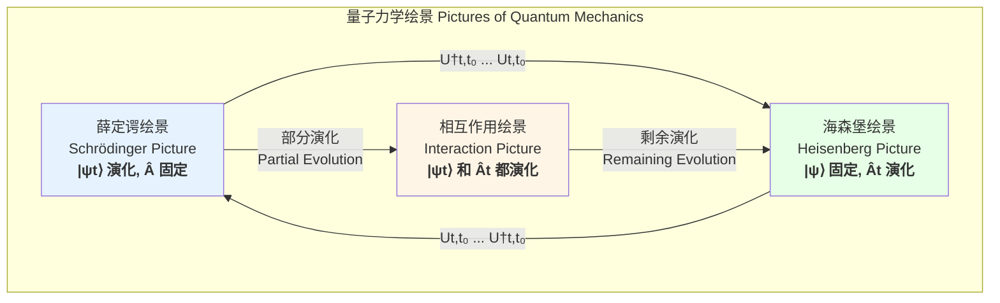

好的，我将根据您的要求，创建一份关于“量子力学过程”的综合性技术文档。文档将严格遵循科学和数学的严谨性，仅基于标题进行阐述，并以简体中文呈现。

## 量子力学过程

量子力学过程描述了一个量子系统如何随时间演化。与经典物理学中由确定的轨迹描述的过程不同，量子过程本质上是概率性的，并由波函数的演化来支配。该过程的核心框架包括量子态的制备、其在哈密顿量控制下的幺正演化，以及最终通过测量来提取系统信息。

### 核心概念与数学基础

#### 量子态与希尔伯特空间 (Quantum State and Hilbert Space)
一个孤立量子系统的状态在任意时刻 $t$ 都可以由一个定义在复数向量空间（称为希尔伯特空间 $\mathcal{H}$）中的态矢量 $|\psi(t)\rangle$ 来完全描述。这个态矢量包含了系统所有可被测量的物理信息。

*   **叠加原理 (Superposition Principle):** 如果 $|\psi_1\rangle$ 和 $|\psi_2\rangle$ 是系统可能的状态，那么它们的线性组合 $c_1|\psi_1\rangle + c_2|\psi_2\rangle$ (其中 $c_1, c_2$ 是复数) 也是一个有效的状态。这使得量子比特（qubit）可以同时处于 $|0\rangle$ 和 $|1\rangle$ 的叠加态。
*   **归一化 (Normalization):** 态矢量必须被归一化，即其内积为1：$\langle\psi|\psi\rangle = 1$。这反映了在整个可能的结果空间中找到该粒子的总概率为1。

#### 可观测量与厄米算符 (Observables and Hermitian Operators)
在量子力学中，每一个物理可观测量（如位置、动量、能量）都与一个线性厄米算符（Hermitian Operator）$\hat{A}$ 相关联。

*   **厄米算符:** 一个算符 $\hat{A}$ 如果满足 $\hat{A} = \hat{A}^\dagger$（其中 $\hat{A}^\dagger$ 是其共轭转置），则为厄米算符。厄米算符的本征值是实数，对应于物理测量的可能结果。
*   **本征值方程:** 算符 $\hat{A}$ 的本征矢量 $|\phi_n\rangle$ 和对应的本征值 $a_n$ 满足以下方程：
    $$ \hat{A}|\phi_n\rangle = a_n|\phi_n\rangle $$
    其中，$a_n$ 是测量可观测量 $A$ 时可能得到的具体数值。这些本征矢量 $\{|\phi_n\rangle\}$ 通常构成希尔伯特空间的一组完备正交基。

#### 时间演化：薛定谔方程 (Time Evolution: The Schrödinger Equation)
量子态随时间的演化过程由含时薛定谔方程支配。这是量子力学中最核心的动力学方程。

$$ i\hbar \frac{\partial}{\partial t}|\psi(t)\rangle = \hat{H}(t)|\psi(t)\rangle $$

参数说明：
*   $|\psi(t)\rangle$: 系统在时间 $t$ 的态矢量。
*   $i$: 虚数单位，$i^2 = -1$。
*   $\hbar$: 约化普朗克常数，$\hbar = h / (2\pi)$。
*   $\hat{H}(t)$: 系统的哈密顿算符，代表系统的总能量。它可以是含时的。

如果哈密顿量不随时间变化（$\hat{H}(t) = \hat{H}$），则存在定态解，这引出不含时薛定谔方程：
$$ \hat{H}|\phi_n\rangle = E_n|\phi_n\rangle $$
其中 $E_n$ 是系统的能量本征值（能级），$|\phi_n\rangle$ 是对应的能量本征态。

#### 幺正演化 (Unitary Evolution)
从初始时刻 $t_0$ 到任意时刻 $t$ 的量子过程可以通过一个时间演化算符 $\hat{U}(t, t_0)$ 来描述：

$$ |\psi(t)\rangle = \hat{U}(t, t_0)|\psi(t_0)\rangle $$

这个演化算符是幺正的，即满足 $\hat{U}^\dagger(t, t_0)\hat{U}(t, t_0) = \hat{U}(t, t_0)\hat{U}^\dagger(t, t_0) = \hat{I}$（其中 $\hat{I}$ 是单位算符）。幺正性保证了态矢量的范数在演化过程中保持不变，即概率守恒。

对于不含时哈密顿量 $\hat{H}$，演化算符的形式为：
$$ \hat{U}(t, t_0) = e^{-i\hat{H}(t-t_0)/\hbar} $$

#### 量子测量 (Quantum Measurement)
测量是一个将量子信息提取到经典世界的不可逆过程。

*   **玻恩定则 (Born Rule):** 对于处于状态 $|\psi\rangle$ 的系统，测量可观测量 $A$ 得到结果 $a_n$ 的概率 $P(a_n)$ 为：
    $$ P(a_n) = |\langle\phi_n|\psi\rangle|^2 $$
    其中 $|\phi_n\rangle$ 是对应于本征值 $a_n$ 的归一化本征矢量。$|\langle\phi_n|\psi\rangle|$ 是态 $|\psi\rangle$ 在基矢 $|\phi_n\rangle$ 上的概率幅。
*   **波函数坍缩 (Wave Function Collapse):** 如果测量结果为 $a_n$，系统状态会瞬间“坍缩”到对应的本征态 $|\phi_n\rangle$。

下面的Mermaid图展示了量子力学过程的基本流程。

```mermaid
graph TD
    subgraph "量子力学过程 Quantum Mechanical Process"
        A[1. 态制备<br>State Preparation<br><i>e.g., |ψt₀⟩</i>] --> B2. 幺正演化<br>Unitary Evolution<br><i> governed by Ĥ</i>;
        B -- "薛定谔方程<br>Schrödinger Eq." --> C[演化后的态<br>Evolved State<br><i>|ψt⟩ = Ut,t₀|ψt₀⟩</i>];
        C --> D[3. 量子测量<br>Quantum Measurement<br><i>on observable Â</i>];
        D -- "玻恩定则<br>Born Rule" --> E[测量结果<br>Measurement Outcome<br><i>Eigenvalue aₙ with probability Paₙ</i>];
        D -- "波函数坍缩<br>Wave Function Collapse" --> F[坍缩后的态<br>Post-measurement State<br><i>|ϕₙ⟩</i>];
    end

    style A fill:#cde4ff,stroke:#333,stroke-width:2px
    style B fill:#fff2cc,stroke:#333,stroke-width:2px
    style D fill:#ffd9cc,stroke:#333,stroke-width:2px
    style F fill:#e5ccff,stroke:#333,stroke-width:2px
```

### 关键技术规格

量子过程由自然界的基本常数所支配。这些常数的精确值决定了量子效应的尺度和强度。

| 常数名称 | 符号 | 数值 (SI 单位) | 物理意义 |
| :--- | :---: | :--- | :--- |
| 普朗克常数 | $h$ | $6.62607015 \times 10^{-34}$ J·s | 量子化的基本尺度，定义了能量与频率的关系 ($E=h\nu$) |
| 约化普朗克常数 | $\hbar$ | $1.054571817 \times 10^{-34}$ J·s | 在量子力学方程中更常用，与角动量和不确定性原理相关 |
| 真空中的光速 | $c$ | $299,792,458$ m/s | 相对论与电磁学的核心常数，连接能量和质量 ($E=mc^2$) |
| 基本电荷 | $e$ | $1.602176634 \times 10^{-19}$ C | 电荷的最小单位，决定了电磁相互作用的强度 |
| 电子静止质量 | $m_e$ | $9.1093837015 \times 10^{-31}$ kg | 决定了电子在原子和分子中的动力学行为 |
| 玻尔半径 | $a_0$ | $5.29177210903 \times 10^{-11}$ m | 氢原子基态中电子轨道的特征半径 |

### 常见用例与性能指标

量子过程在多个物理和技术领域中都有体现。

| 用例 | 描述 | 关键性能指标 | 典型值/公式 |
| :--- | :--- | :--- | :--- |
| **量子隧穿**<br>(Quantum Tunneling) | 粒子穿过一个其能量不足以经典地越过的势垒。 | **隧穿概率 (T)** | 对于高度为 $V_0$、宽度为 $L$ 的矩形势垒，当 $E < V_0$ 时， $T \approx e^{-2\kappa L}$，其中 $\kappa = \sqrt{2m(V_0-E)}/\hbar$ |
| **量子计算**<br>(Quantum Computing) | 利用量子叠加和纠缠进行信息处理。 | **相干时间 ($T_2$)**<br>**门保真度 (Fidelity)** | 超导量子比特: $T_2 \sim 100-500$ μs<br>离子阱: $T_2 > 10$ s<br>单/双量子比特门保真度: $99.5\% - 99.99\%$ |
| **原子跃迁**<br>(Atomic Transitions) | 电子在原子能级之间通过吸收或发射光子进行跃迁。 | **跃迁速率 (Γ)**<br>**激发态寿命 (τ)** | 由费米黄金定则给出，$\Gamma \propto |\langle f|\hat{V}|i \rangle|^2$。<br>$\tau = 1/\Gamma$。例如，氢原子2p态的寿命约为 $1.6$ ns。 |

### 实现考量与算法复杂度

在经典计算机上模拟量子力学过程是一项巨大的挑战，因为所需的计算资源随系统规模呈指数增长。

*   **状态空间维度:** 对于一个由 $N$ 个双能级系统（量子比特）组成的系统，其希尔伯特空间的维度为 $2^N$。存储其状态矢量需要 $O(2^N)$ 的复数内存。
*   **演化模拟:** 模拟时间演化算符 $\hat{U} = e^{-i\hat{H}t/\hbar}$ 的作用也极其耗时。如果哈密顿量 $\hat{H}$ 可以分解为多个不互相对易的项之和，例如 $\hat{H} = \sum_k \hat{H}_k$，则通常使用 **Trotter-Suzuki 分解** 进行近似。
    *   **一阶 Trotter 分解:**
        $$ e^{-i(\hat{H}_1+\hat{H}_2)t/\hbar} \approx \left( e^{-i\hat{H}_1\Delta t/\hbar} e^{-i\hat{H}_2\Delta t/\hbar} \right)^n $$
        其中 $\Delta t = t/n$。该近似的误差为 $O(\Delta t^2)$。
    *   **算法复杂度:** 模拟一个含 $N$ 个量子比特的系统演化时间 $t$，精度为 $\epsilon$，所需的门操作数量通常是 $\text{poly}(N, t, 1/\epsilon)$ 的多项式级别。然而，由于 $N$ 上的指数依赖性隐藏在状态表示中，整个经典模拟的复杂度仍然是指数级的。这正是量子计算机相对于经典计算机具有潜在优势的核心原因。

### 性能特征与统计度量

由于量子测量的概率性，描述量子过程的性能需要借助统计工具。

| 统计度量 | 数学表达式 | 解释 |
| :--- | :--- | :--- |
| **期望值**<br>(Expectation Value) | $\langle \hat{A} \rangle = \langle\psi|\hat{A}|\psi\rangle$ | 对处于状态 $|\psi\rangle$ 的系统进行大量重复测量，所得结果的平均值。 |
| **方差**<br>(Variance) | $\sigma_A^2 = \langle (\hat{A} - \langle \hat{A} \rangle)^2 \rangle = \langle \hat{A}^2 \rangle - \langle \hat{A} \rangle^2$ | 测量结果围绕期望值的离散程度。 |
| **标准差**<br>(Standard Deviation) | $\sigma_A = \sqrt{\sigma_A^2}$ | 方差的平方根，表示测量结果的不确定度。 |

这些统计量受制于 **海森堡不确定性原理 (Heisenberg's Uncertainty Principle)**。对于任意两个可观测量 $\hat{A}$ 和 $\hat{B}$，其测量不确定度满足：

$$ \sigma_A \sigma_B \ge \frac{1}{2} |\langle[\hat{A}, \hat{B}]\rangle| $$

其中 $[\hat{A}, \hat{B}] = \hat{A}\hat{B} - \hat{B}\hat{A}$ 是对易子。如果两个算符不对易（$[\hat{A}, \hat{B}] \neq 0$），则无法同时精确测量它们对应的物理量。最著名的例子是位置 $(\hat{x})$ 和动量 $(\hat{p}_x)$，其对易子为 $[\hat{x}, \hat{p}_x] = i\hbar$，导致 $\sigma_x \sigma_{p_x} \ge \hbar/2$。

### 相关技术与比较模型

量子力学过程的描述并非唯一，存在多种等价的数学表述（“绘景”），并且它与经典力学有着深刻的联系。

#### 量子力学与经典力学的联系
**埃伦费斯特定理 (Ehrenfest Theorem)** 构建了量子力学期望值与经典力学运动方程之间的桥梁：

$$ \frac{d\langle \hat{x} \rangle}{dt} = \frac{\langle \hat{p} \rangle}{m} $$
$$ \frac{d\langle \hat{p} \rangle}{dt} = \langle -\nabla V(\hat{x}) \rangle \approx -\nabla V(\langle \hat{x} \rangle) $$

这表明，可观测量的期望值演化在宏观尺度下（当波包足够局域时）近似遵循牛顿运动定律。

#### 量子力学绘景 (Pictures of Quantum Mechanics)
描述量子演化的方式有多种，它们在数学上是等价的，但在解决不同问题时各有优势。



*   **薛定谔绘景 (Schrödinger Picture):** 默认绘景。态矢量随时间演化，算符固定。
*   **海森堡绘景 (Heisenberg Picture):** 态矢量固定，算符随时间演化：$\hat{A}(t) = \hat{U}^\dagger(t, t_0)\hat{A}(t_0)\hat{U}(t, t_0)$。
*   **相互作用绘景 (Interaction/Dirac Picture):** 当哈密顿量可分为 $\hat{H} = \hat{H}_0 + \hat{V}$ 时使用。态矢量的演化由相互作用项 $\hat{V}$ 决定，而算符的演化由自由项 $\hat{H}_0$ 决定。这在处理微扰理论时非常有用。

#### 路径积分表述 (Path Integral Formulation)
由理查德·费曼提出，这是对量子过程的另一种深刻见解。它认为，一个粒子从点 $A$ 到点 $B$ 的总概率幅，是所有可能路径的概率幅的相干叠加（积分）。

$$ K(B, A) = \int_{A}^{B} \mathcal{D}[x(t)] e^{iS[x(t)]/\hbar} $$

参数说明：
*   $K(B, A)$: 从状态 $A$ 传播到状态 $B$ 的传播子或概率幅。
*   $\mathcal{D}[x(t)]$: 对所有连接 $A$ 和 $B$ 的路径进行积分的“路径测度”。
*   $S[x(t)]$: 经典作用量，是路径 $x(t)$ 的泛函，通常 $S = \int (T-V) dt$。

该表述强调了量子过程的非局域性和干涉效应，并在量子场论和统计力学中有广泛应用。

## 参考文献

1.  Schrödinger, E. (1926). An Undulatory Theory of the Mechanics of Atoms and Molecules. *Physical Review*, 28(6), 1049–1070. DOI: [10.1103/PhysRev.28.1049](https://doi.org/10.1103/PhysRev.28.1049)
2.  Heisenberg, W. (1927). Über den anschaulichen Inhalt der quantentheoretischen Kinematik und Mechanik. *Zeitschrift für Physik*, 43(3-4), 172–198. DOI: [10.1007/BF01397280](https://doi.org/10.1007/BF01397280)
3.  Dirac, P. A. M. (1930). *The Principles of Quantum Mechanics*. Oxford University Press.
4.  Feynman, R. P. (1948). Space-Time Approach to Non-Relativistic Quantum Mechanics. *Reviews of Modern Physics*, 20(2), 367–387. DOI: [10.1103/RevModPhys.20.367](https://doi.org/10.1103/RevModPhys.20.367)