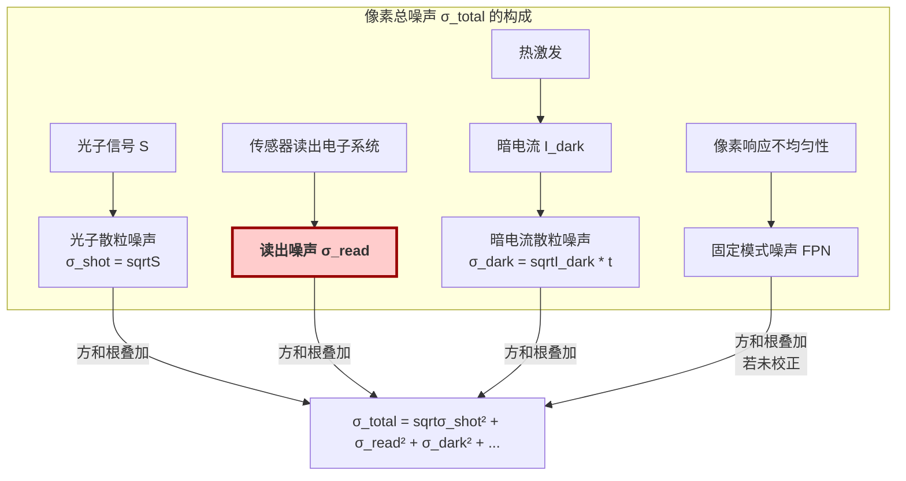
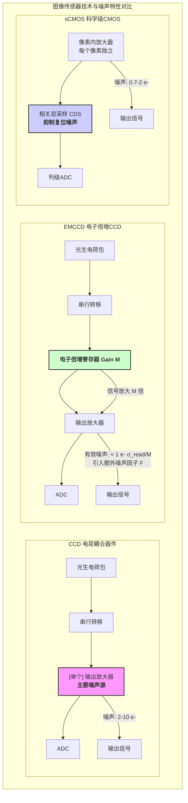

## 读出噪声

读出噪声（Read Noise），在科学成像和光电探测领域中，是一个关键的性能指标。它指的是在没有任何光信号输入（即零曝光）的情况下，对图像传感器单个像素进行读出操作时，由电子系统引入的固有随机噪声。这种噪声从根本上限制了传感器探测微弱信号的能力。它是一种加性噪声，其大小与信号强度无关。

### 核心概念与数学基础

读出噪声主要来源于传感器读出电路中的多个环节，包括像素内的源极跟随器放大器、列级放大器、以及最终的模数转换器（ADC）。这些电子元件的热噪声（约翰逊-奈奎斯特噪声）和1/f噪声是读出噪声的主要物理来源。

在数学上，读出噪声通常被建模为一个均值为零（或一个固定的偏置电平）的高斯随机过程。其核心参数是标准差，记为 $\sigma_{read}$，这个值本身就是读出噪声的量度。一个像素的最终输出值 $V_{out}$ 可以表示为：

$$ V_{out} = G \cdot (S + I_{dark} \cdot t) + V_{bias} + N_{read} $$

其中：
*   $V_{out}$ 是像素的最终输出值，通常以数字单位（ADU, Analog-to-Digital Unit）表示。
*   $G$ 是系统增益（Gain），单位为 ADU/$e^-$。它表示每单个光电子被转换成多少个数字单位。
*   $S$ 是由光子产生的信号电荷（光电子数），单位为 $e^-$。
*   $I_{dark}$ 是暗电流率，单位为 $e^-$/(pixel·s)。
*   $t$ 是积分时间（曝光时间），单位为 s。
*   $V_{bias}$ 是一个固定的直流偏置（Offset），用于确保即使在没有信号的情况下，ADC的输入也处于其有效工作范围内。
*   $N_{read}$ 是代表读出噪声的随机变量，它服从高斯分布 $N(0, \sigma_{read, ADU}^2)$，其中 $\sigma_{read, ADU}$ 是以ADU为单位的读出噪声。

读出噪声的最终单位通常用“电子数方均根”（$e^-_{rms}$）表示，它与ADU单位的转换关系为：

$$ \sigma_{read, e^-} = \sigma_{read, ADU} \cdot g $$

其中 $g$ 是增益的倒数，即系统转换因子，单位为 $e^-$/ADU。

总像素噪声 $\sigma_{total}$ 是由多个独立噪声源通过方和根（Quadrature Sum）叠加而成：

$$ \sigma_{total} = \sqrt{\sigma_{shot}^2 + \sigma_{dark\_shot}^2 + \sigma_{read}^2 + \sigma_{FPN}^2} $$

其中：
*   $\sigma_{shot} = \sqrt{S}$ 是光子散粒噪声，遵循泊松分布。
*   $\sigma_{dark\_shot} = \sqrt{I_{dark} \cdot t}$ 是暗电流散粒噪声。
*   $\sigma_{read}$ 是读出噪声。
*   $\sigma_{FPN}$ 是固定模式噪声（Fixed-Pattern Noise），通常可以通过校准去除。

下图展示了像素总噪声的构成，其中读出噪声是关键的信号无关成分。

## 主要技术规格

读出噪声是评估科学级相机的核心参数之一，它与其他几个关键规格密切相关。

| 参数 (Specification) | 典型值 (Typical Value) | 单位 (Unit) | 描述 (Description) |
| :--- | :--- | :--- | :--- |
| **读出噪声 (Read Noise)** | 0.5 ~ 10 | $e^-_{rms}$ | 衡量读出电路引入的噪声水平，是微弱信号探测的根本限制。 |
| **系统增益 (Gain)** | 0.1 ~ 5 | $e^-$/ADU | 将ADU单位转换为绝对电子数的转换因子。 |
| **动态范围 (Dynamic Range)** | 60 ~ 95 | dB | 传感器能同时记录的最亮和最暗信号的比值，受限于满阱容量和读出噪声。 |
| **读出速率 (Readout Speed)** | 100 kHz ~ 500 MHz | pixel/s | 像素数据从传感器读出的速度。通常，更高的速度会导致更高的读出噪声。 |
| **偏置电平 (Bias/Offset)** | 100 ~ 1000 | ADU | 为防止信号为零时ADC裁切而人为引入的直流基线。 |

动态范围与读出噪声的直接数学关系为：

$$ DR_{dB} = 20 \log_{10} \left( \frac{\text{Full Well Capacity}_{e^-}}{\sigma_{read, e^-}} \right) $$

## 典型应用场景

读出噪声的水平直接决定了传感器在特定应用中的性能，尤其是在信噪比（SNR）至关重要的领域。

*   **天文学**：在对暗弱天体（如遥远星系、系外行星）进行长曝光成像时，信号光子通量极低，读出噪声是主要限制因素。
*   **荧光显微镜**：在单分子成像或TIRF等技术中，荧光信号非常微弱，低读出噪声是实现高对比度成像和精确定位的先决条件。
*   **量子光学**：在探测纠缠光子对或进行光子计数实验时，需要能够以高置信度分辨单个光子事件，这要求读出噪声远小于单个光子产生的信号。

### 定量性能指标：信噪比 (SNR)

信噪比是衡量图像质量的最重要指标。对于一个理想的光电探测器，其SNR由下式给出：

$$ SNR = \frac{S_{signal}}{\sigma_{total}} = \frac{S}{\sqrt{S + (I_{dark} \cdot t) + \sigma_{read}^2}} $$

其中所有与信号和噪声相关的项都以电子数（$e^-$）为单位。

根据上式，我们可以定义两个工作区：
1.  **读出噪声主导区 (Read-Noise-Limited Regime)**：当信号 $S$ 非常微弱，以至于 $S \ll \sigma_{read}^2$ 时，SNR近似为：
    $$ SNR \approx \frac{S}{\sigma_{read}} $$
    在此区域，降低读出噪声是提升探测能力的唯一途径。例如，要以 $SNR=5$ 的水平探测一个 $10 e^-$ 的信号，读出噪声必须满足 $\sigma_{read} \le 10/5 = 2 e^-$。

2.  **散粒噪声主导区 (Shot-Noise-Limited Regime)**：当信号 $S$ 足够强，以至于 $S \gg \sigma_{read}^2$ 且 $S \gg I_{dark} \cdot t$ 时，SNR近似为：
    $$ SNR \approx \frac{S}{\sqrt{S}} = \sqrt{S} $$
    这是物理极限下的最佳性能，SNR仅由信号本身的光子统计性质决定。

## 实现与测量

读出噪声的精确测量是传感器标定的关键步骤。最常用的方法是**双偏置帧法（Dual Bias Frame Method）**。

### 测量算法
1.  **数据采集**：在完全黑暗的环境下，设置相机为最短曝光时间（通常为0），连续采集两帧图像，称为偏置帧 $B_1$ 和 $B_2$。
2.  **图像相减**：计算两帧图像的差值图像 $D = B_1 - B_2$。此操作可以消除所有像素共有的时间无关噪声，如固定模式噪声（FPN）和偏置电平本身。
3.  **方差计算**：由于 $B_1$ 和 $B_2$ 的噪声是独立的，差值图像 $D$ 的方差是两者方差之和。假设两帧的读出噪声相同（$\sigma_{read, ADU}$），则：
    $$ \text{Var}(D) = \text{Var}(B_1 - B_2) = \text{Var}(B_1) + \text{Var}(B_2) = 2 \cdot \sigma_{read, ADU}^2 $$
4.  **读出噪声计算**：计算差值图像 $D$ 中所有像素值的标准差 $\text{StDev}(D)$。则以ADU为单位的读出噪声为：
    $$ \sigma_{read, ADU} = \frac{\text{StDev}(D)}{\sqrt{2}} $$
5.  **单位转换**：将ADU单位的读出噪声乘以系统增益 $g$（$e^-$/ADU），得到以电子数表示的最终值：
    $$ \sigma_{read, e^-} = \sigma_{read, ADU} \cdot g $$

### 算法复杂度分析
对于一个大小为 $N \times M$ 的图像：
*   图像相减操作的复杂度为 $O(N \cdot M)$。
*   计算标准差通常需要两次遍历图像（一次计算均值，一次计算方差），复杂度为 $O(N \cdot M)$。
因此，整个测量算法的计算复杂度与图像的像素总数成线性关系。

## 性能特征

对读出噪声的全面评估不仅包括其数值大小，还涉及其统计特性。

*   **高斯性 (Gaussianity)**：读出噪声的像素值直方图应符合高斯分布。可以通过卡方检验（Chi-squared test）或柯尔莫哥洛夫-斯米尔诺夫检验（Kolmogorov-Smirnov test）来定量评估其与理想高斯分布的拟合优度。
*   **空间均匀性 (Spatial Uniformity)**：理想情况下，传感器上每个像素的读出噪声应该相同。实际上可能存在微小差异，可以通过绘制读出噪声图（Read Noise Map）来可视化其空间分布。
*   **时间稳定性 (Temporal Stability)**：读出噪声应不随时间或设备工作温度发生显著变化。长时间或不同温度下的重复测量可用于评估其稳定性。
*   **测量置信区间 (Confidence Interval)**：由于测量是在有限像素样本（$n = N \times M$）上进行的，得到的 $\sigma_{read}$ 是一个估计值。其真实值的置信区间可以利用卡方分布构建。对于样本方差 $s_D^2 = \text{StDev}(D)^2$，其真实方差 $\sigma_D^2$ 的 $(1-\alpha)$ 置信区间为：
    $$ \left( \frac{(n-1)s_D^2}{\chi^2_{\alpha/2, n-1}}, \frac{(n-1)s_D^2}{\chi^2_{1-\alpha/2, n-1}} \right) $$
    其中 $\chi^2$ 是卡方分布的临界值。由此可以推导出 $\sigma_{read}$ 的置信区间。

## 相关技术对比

不同类型的图像传感器技术在读出噪声的抑制方面采用了不同的策略，导致其性能特征各异。

### 1. CCD (Charge-Coupled Device)
*   **结构**: 电荷在像素阵列中串行转移，最终由位于芯片一角的一个高灵敏度输出放大器统一读出。
*   **噪声模型**: 读出噪声主要由这个单一的输出放大器决定。传统科学级CCD的读出噪声通常在 **2-10 $e^-_{rms}$** 范围。
*   **优点**: 像素填充因子高，均匀性好。
*   **缺点**: 串行读出速度慢，且读出噪声相对较高。

### 2. EMCCD (Electron-Multiplying CCD)
*   **结构**: 在传统CCD的串行寄存器和输出放大器之间，增加了一个“电子倍增寄存器”。信号电荷在此区域通过雪崩倍增效应被放大数百至数千倍。
*   **噪声模型**: 信号在到达读出放大器之前被放大，从而有效地将读出噪声的影响降低了M倍（M为倍增增益）。其有效读出噪声 $\sigma_{eff\_read}$ 可以低于 **1 $e^-_{rms}$**。
    $$ \sigma_{eff\_read} = \frac{\sigma_{read}}{M} $$
    然而，倍增过程本身不是无噪声的，它会引入一个“额外噪声因子”（Excess Noise Factor, F），通常约为1.2-1.4，这使得信号的散粒噪声分量增加。
    $$ \sigma_{total, EMCCD} = \sqrt{(F^2 \cdot S) + (F^2 \cdot I_{dark} \cdot t) + \left(\frac{\sigma_{read}}{M}\right)^2} $$
*   **应用**: 极限微光探测，如单分子跟踪。

### 3. sCMOS (Scientific CMOS)
*   **结构**: 每个像素都包含自己的放大器和读出电路（像素内放大），并采用大规模并行读出架构。
*   **噪声模型**: 通过复杂的像素设计（如4T/5T像素结构）和**相关双采样（Correlated Double Sampling, CDS）**技术，sCMOS能够有效抑制像素复位时引入的kTC噪声，从而将读出噪声降至极低水平，通常在 **0.7-2 $e^-_{rms}$**。
*   **优点**: 极低的读出噪声、极高的读出速度和高动态范围的结合。
*   **缺点**: 像素间的增益和噪声可能存在不均匀性（固定模式噪声），需要精确的数字校正。

## 参考文献

1.  Janesick, J. R. (2007). Photon transfer DN→λ. *SPIE Press*. DOI: [10.1117/3.725073](https://doi.org/10.1117/3.725073). (这本书的第5章详细介绍了光子转移曲线法，是测量读出噪声和增益的标准方法。)
2.  Hirsch, M., Ware, M., & Myers, K. J. (2013). A stochastic model for electron-multiplying CCD cameras. *IEEE Transactions on Image Processing*, 22(11), 4255-4266. DOI: [10.1109/TIP.2013.2262198](https://doi.org/10.1109/TIP.2013.2262198). (提供了EMCCD噪声的精确随机模型，包括额外噪声因子的推导。)
3.  Fossum, E. R. (1997). CMOS image sensors: electronic camera-on-a-chip. *IEEE Transactions on Electron Devices*, 44(10), 1689-1698. DOI: [10.1109/16.628824](https://doi.org/10.1109/16.628824). (关于CMOS图像传感器基础的经典论文，讨论了其噪声来源和早期抑制技术。)