## 红移 (red shifted)

红移（Redshift）是指电磁辐射（例如光）的波长增加，其频率相应降低的现象。在可见光光谱中，这一现象表现为光谱特征（如吸收线或发射线）向红色端移动，因此得名“红移”。红移是天体物理学和宇宙学中一个至关重要的观测现象，它为我们理解宇宙的运动、结构和演化提供了核心证据。

红移的大小通常用无量纲参数 $z$ 来量化。

### 核心概念与数学基础

红移现象主要由三种物理机制引起：多普勒效应、引力效应和宇宙膨胀。

#### 1. 红移参数的定义

红移参数 $z$ 定义为观测到的波长 $\lambda_{\text{obs}}$ 与辐射源在静止参考系下发出的波长 $\lambda_{\text{emit}}$ 之间的相对差异：

$$
z = \frac{\lambda_{\text{obs}} - \lambda_{\text{emit}}}{\lambda_{\text{emit}}}
$$

同样，它也可以用频率 $f$ 来表示：

$$
z = \frac{f_{\text{emit}} - f_{\text{obs}}}{f_{\text{obs}}}
$$

其中：
*   $z$ 是红移参数，无量纲。如果 $z > 0$，则为红移；如果 $z < 0$，则为蓝移（blueshift）。
*   $\lambda_{\text{obs}}$ 是观测者测量的电磁波波长。
*   $\lambda_{\text{emit}}$ 是辐射源在其自身静止参考系中发出的电磁波波长（实验室波长）。
*   $f_{\text{obs}}$ 是观测者测量的电磁波频率。
*   $f_{\text{emit}}$ 是辐射源在其自身静止参考系中发出的电磁波频率。

#### 2. 多普勒红移 (Doppler Redshift)

当光源相对于观测者退行时，会产生多普勒红移。这是由相对运动引起的波长变化。

*   **非相对论情况**：当光源的退行速度 $v$ 远小于光速 $c$ 时 ($v \ll c$)，红移近似为：
    $$
    z \approx \frac{v}{c}
    $$
*   **相对论情况**：当速度 $v$ 接近光速 $c$ 时，必须使用狭义相对论的完整公式。对于纯径向运动：
    $$
    1 + z = \sqrt{\frac{1 + v/c}{1 - v/c}}
    $$
    其中 $v$ 是光源相对于观测者的径向速度，$c$ 是光速。

#### 3. 引力红移 (Gravitational Redshift)

根据广义相对论，当光子从强引力场（如恒星或黑洞）中向外传播时，会损失能量，导致其频率降低，波长增加。这种现象被称为引力红移或爱因斯坦位移。

对于一个不旋转、不带电的球对称质量体（由史瓦西度规描述），引力红移由下式给出：

$$
1 + z = \frac{1}{\sqrt{1 - \frac{2GM}{rc^2}}} = \frac{1}{\sqrt{1 - \frac{R_S}{r}}}
$$

其中：
*   $G$ 是万有引力常数。
*   $M$ 是产生引力场的天体质量。
*   $r$ 是光子发出点到天体中心的距离。
*   $c$ 是光速。
*   $R_S = 2GM/c^2$ 是该天体的史瓦西半径。

#### 4. 宇宙学红移 (Cosmological Redshift)

对于遥远星系，其红移的主要来源是宇宙的膨胀。在宇宙膨胀的过程中，空间本身被拉伸，穿行于其中的光子波长也随之被拉长。

宇宙学红移与宇宙尺度因子 $a(t)$ 直接相关：

$$
1 + z = \frac{a(t_{\text{obs}})}{a(t_{\text{emit}})}
$$

其中：
*   $a(t_{\text{obs}})$ 是在观测时刻 $t_{\text{obs}}$ 的宇宙尺度因子（通常设定为 $a(t_0) = 1$，其中 $t_0$ 为当前宇宙年龄）。
*   $a(t_{\text{emit}})$ 是在光子发出时刻 $t_{\text{emit}}$ 的宇宙尺度因子。

由于宇宙在膨胀，$a(t_{\text{obs}}) > a(t_{\text{emit}})$，因此对于遥远天体，$z$ 总是大于零。

```mermaid
graph TD
    subgraph "红移的物理机制 Physical Mechanisms of Redshift"
        A["电磁波 Electromagnetic Wave"] --> B["波长增加? Wavelength Increase?[";
        B -- "是 Yes" --> C["红移 Redshift z > 0"];
        C --> D["多普勒红移 Doppler Redshift<br>源与观测者相对运动 Relative Motion"];
        C --> E["引力红移 Gravitational Redshift<br>光子逃离引力势阱 Photon Escapes Gravity Well"];
        C --> F["宇宙学红移 Cosmological Redshift<br>空间自身的膨胀 Expansion of Space"];
    end
    style C fill:#ffcccc,stroke:#990000
    style D fill:#ccf,stroke:#333
    style E fill:#cfc,stroke:#333
    style F fill:#cff,stroke:#333
```

### 关键技术规格

下表列出了与红移相关的关键参数和典型值。

| 参数 (Parameter) | 符号 (Symbol) | 定义/值 (Definition/Value) | 单位 (Unit) |
| :--- | :--- | :--- | :--- |
| 红移参数 (Redshift Parameter) | $z$ | $z = (\lambda_{\text{obs}} - \lambda_{\text{emit}})/\lambda_{\text{emit}}$ | 无量纲 (Dimensionless) |
| 哈勃常数 (Hubble Constant) | $H_0$ | $\approx 73.0 \pm 1.0$ (基于超新星和造父变星) 或 $\approx 67.4 \pm 0.5$ (基于宇宙微波背景) | km/s/Mpc |
| 宇宙微波背景 (CMB) 红移 | $z_{\text{CMB}}$ | $\approx 1089$ | 无量纲 (Dimensionless) |
| 已确认最远星系红移 | $z_{\text{max}}$ | $\approx 13.2$ (JADES-GS-z13-0) | 无量纲 (Dimensionless) |
| 太阳引力红移 (在地球观测) | $z_{\text{sun}}$ | $\approx 2.1 \times 10^{-6}$ | 无量纲 (Dimensionless) |

### 常见用例与性能指标

*   **宇宙距离测量 (Cosmic Distance Measurement)**
    *   **描述**: 对于宇宙学距离上的天体，其红移主要由宇宙膨胀引起。根据哈勃-勒梅特定律，对于近邻宇宙 ($z \ll 1$)，天体的退行速度 $v$ 与其距离 $D$ 成正比：$v \approx cz = H_0 D$。对于更远的距离，需要使用包含宇宙学参数（如 $\Omega_M$, $\Omega_\Lambda$）的完整弗里德曼方程来计算光度距离 $D_L$：
    $$ D_L(z) = \frac{c(1+z)}{H_0} \int_0^z \frac{dz'}{\sqrt{\Omega_{M,0}(1+z')^3 + \Omega_{k,0}(1+z')^2 + \Omega_{\Lambda,0}}} $$
    *   **性能指标**: 距离测量的精度受限于哈勃常数 $H_0$ 的不确定性（目前约为1-2%）以及天体本动速度（Peculiar Velocity）引入的噪声。

*   **系外行星探测 (Exoplanet Detection)**
    *   **描述**: 径向速度法通过探测恒星光谱的周期性多普勒位移来发现系外行星。行星的引力使其宿主恒星发生微小的晃动，从而产生可测量的红移和蓝移。
    *   **性能指标**: 现代高精度摄谱仪（如 HARPS, ESPRESSO）的径向速度测量精度可达 $10 \text{ cm/s}$ 量级，足以探测到类地行星。

*   **星系动力学与质量估计 (Galaxy Dynamics and Mass Estimation)**
    *   **描述**: 通过测量盘状星系不同位置的红移，可以绘制出其旋转曲线（速度 vs. 半径）。旋转曲线的形态揭示了星系内物质（包括暗物质）的分布。
    *   **性能指标**: 典型摄谱仪的速度分辨率约为几 km/s，足以解析大多数星系的内部运动。

*   **广义相对论检验 (Tests of General Relativity)**
    *   **描述**: 在强引力场天体（如白矮星、中子星、黑洞周围）附近精确测量引力红移，可以对广义相对论的预言进行严格检验。
    *   **性能指标**: 庞德-雷布卡实验（Pound-Rebka experiment）在地面上以约1%的精度验证了引力红移。对天狼星B（一颗白矮星）的观测也与理论预测高度一致。

### 实现考量与算法分析

光谱红移的测量是一个多步骤的过程，涉及复杂的信号处理算法。

#### 测量流程

```mermaid
graph TD
    subgraph "光谱红移测量流程 Spectroscopic Redshift Measurement Workflow"
        Telescope["望远镜收集星光 Telescope Collects Starlight"] --> Spectrograph["摄谱仪分光 Spectrograph Disperses Light"];
        Spectrograph --> RawSpectrum["原始二维光谱 Raw 2D Spectrum"];
        RawSpectrum --> Extraction["光谱提取 Spectral Extraction"] --> OneDSpectrum["一维光谱 Fλ 1D Spectrum Fλ"];
        OneDSpectrum --> WavelengthCalib["波长定标 Wavelength Calibration"];
        WavelengthCalib --> FluxCalib["流量定标 Flux Calibration"];
        FluxCalib --> CalibratedSpectrum["已定标光谱 Calibrated Spectrum"];
        Template["模板光谱 Template Spectrum"] --> CrossCorrelation["交叉相关分析 Cross-correlation Analysis"];
        CalibratedSpectrum --> CrossCorrelation;
        CrossCorrelation --> RedshiftValue["红移值 z Redshift Value z"];
    end
    style RedshiftValue fill:#ccffcc,stroke:#006600,stroke-width:2px
```



#### 算法：交叉相关 (Cross-Correlation)

确定红移最常用的算法是交叉相关法。其核心思想是将观测到的光谱与一个已知红移为零的模板光谱进行比较。

1.  选择一个合适的模板光谱 $T(\lambda)$，该模板应包含与观测目标相似的谱线特征。
2.  在一个预设的红移 $z_{trial}$ 范围内进行迭代。
3.  在每个迭代步中，将模板光谱的波长进行移位：$\lambda' = \lambda(1+z_{trial})$。
4.  计算移位后的模板 $T(\lambda(1+z_{trial}))$ 与观测光谱 $O(\lambda)$ 的交叉相关函数 (CCF)。
5.  CCF 取得峰值所对应的 $z_{trial}$ 即为目标的最佳红移估计值。

#### 算法复杂度分析

直接计算离散信号的交叉相关复杂度为 $O(N \cdot M)$，其中 $N$ 和 $M$ 分别是观测光谱和模板光谱的数据点数。为了提高效率，通常使用基于快速傅里叶变换 (FFT) 的方法。根据卷积定理，两个函数交叉相关操作的傅里叶变换等于它们傅里叶变换的乘积（其中一个取复共轭）。

$$
\text{corr}(O, T) = \mathcal{F}^{-1} \{ \mathcal{F}\{O\}^* \cdot \mathcal{F}\{T\} \}
$$

其中 $\mathcal{F}$ 表示傅里叶变换，$\mathcal{F}^{-1}$ 表示逆傅里叶变换，* 表示复共轭。由于FFT的算法复杂度为 $O(N \log N)$，整个交叉相关过程的复杂度也降低到 $O(N \log N)$，极大地提升了计算效率。

### 性能特征与统计度量

红移测量的准确性至关重要，其性能由精度、可靠性和误差来源共同定义。

*   **测量精度 (Precision)**:
    *   **光谱红移 (Spectroscopic Redshift, spec-z)**: 精度非常高。典型的随机误差为 $\sigma_z \approx 10^{-4}$，或 $\sigma_v \approx 30 \text{ km/s}$。精度主要受信噪比 (S/N)、摄谱仪分辨率和谱线宽度的限制。
    *   **光度红移 (Photometric Redshift, photo-z)**: 精度较低。误差通常表示为 $\sigma_z / (1+z) \approx 0.02 - 0.05$。虽然效率高，但存在“灾难性失败”（catastrophic outliers）的风险，即少数天体的估计值与真实值偏差极大。

*   **误差来源 (Sources of Error)**:
    *   **统计误差 (Statistical Errors)**: 主要来源于光子散粒噪声，与信号的信噪比成反比。
    *   **系统误差 (Systematic Errors)**:
        *   **波长定标不确定性**: 摄谱仪波长解的微小偏差。
        *   **模板失配**: 使用的模板光谱与目标天体的真实光谱不完全匹配。
        *   **本动速度**: 星系相对于哈勃流的自身运动会引入一个多普勒分量，对于近邻宇宙，该效应不可忽略，通常为几百 km/s。

*   **置信区间 (Confidence Intervals)**:
    *   红移测量结果通常会附带一个统计不确定度，表示为 $1\sigma$ (68.3%) 或 $2\sigma$ (95.4%) 的置信区间。例如，一个测量结果可能报告为 $z = 3.142 \pm 0.001$ (1$\sigma$)。

### 相关技术与模型比较

#### 蓝移 (Blueshift)

蓝移是红移的相反现象，指电磁波的波长变短、频率增高 ($z < 0$)。这通常发生在光源向观测者靠近时（多普勒蓝移），或光子进入更强的引力场时（引力蓝移）。例如，仙女座星系相对于银河系正在靠近，其光谱呈现出约 $-0.001$ 的蓝移。

#### 光谱红移 vs. 光度红移

| 特征 (Feature) | 光谱红移 (Spectroscopic Redshift) | 光度红移 (Photometric Redshift) |
| :--- | :--- | :--- |
| **方法 (Method)** | 分析高分辨率光谱中的原子发射线或吸收线特征。 | 基于多个宽带滤波器的测光数据，通过模板拟合或机器学习方法估计光谱能量分布 (SED) 来推断红移。 |
| **数学模型 (Math Model)** | 直接测量：$z = \lambda_{\text{obs}}/\lambda_{\text{emit}} - 1$ | 模板拟合最小化卡方：$\chi^2(z) = \sum_{i} \frac{(F_{\text{obs},i} - A \cdot T_{i}(z))^2}{\sigma_i^2}$ |
| **精度 (Precision)** | 非常高, $\sigma_z/(1+z) \sim 10^{-4}$ | 较低, $\sigma_z/(1+z) \sim 0.02-0.05$ |
| **资源消耗 (Resource Cost)** | 高，需要大型望远镜和较长的曝光时间。 | 低，可高效应用于大规模巡天项目（如LSST, DES）。 |
| **可靠性 (Reliability)** | 非常高，结果明确。 | 存在灾难性失败的风险，需要通过光谱样本进行验证和校准。 |

### 参考文献 (References)

1.  Hubble, E. (1929). A relation between distance and radial velocity among extra-galactic nebulae. *Proceedings of the National Academy of Sciences*, 15(3), 168-173. DOI: [10.1073/pnas.15.3.168](https://doi.org/10.1073/pnas.15.3.168)
2.  Penzias, A. A., & Wilson, R. W. (1965). A Measurement of Excess Antenna Temperature at 4080 Mc/s. *The Astrophysical Journal*, 142, 419-421. DOI: [10.1086/148307](https://doi.org/10.1086/148307)
3.  Riess, A. G., et al. (Supernova Search Team). (1998). Observational Evidence from Supernovae for an Accelerating Universe and a Cosmological Constant. *The Astronomical Journal*, 116(3), 1009-1038. DOI: [10.1086/300499](https://doi.org/10.1086/300499)
4.  Perlmutter, S., et al. (The Supernova Cosmology Project). (1999). Measurements of Ω and Λ from 42 High-Redshift Supernovae. *The Astrophysical Journal*, 517(2), 565-586. DOI: [10.1086/307221](https://doi.org/10.1086/307221)