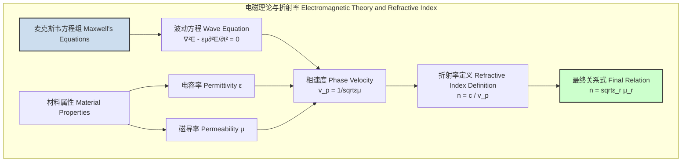
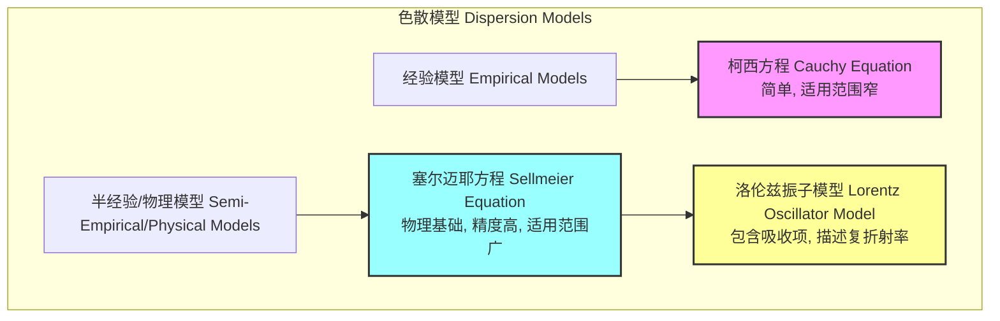
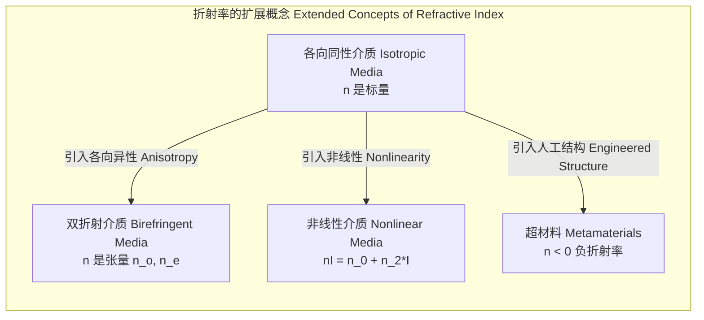

## 折射率

折射率（refractive index 或 index of refraction）是光学中的一个核心无量纲物理量，用于描述光在特定介质中传播速度的减慢程度。它不仅是几何光学的基石，也在电磁理论、材料科学和量子光学等领域扮演着至关重要的角色。

### 1. 核心概念与数学基础

从物理本质上讲，折射率源于光（电磁波）与介质中带电粒子（电子、离子）的相互作用。这种相互作用导致了电磁波在介质中相速度的改变。

#### 1.1 宏观定义

绝对折射率 $n$ 定义为光在真空中的速度 $c$ 与光在介质中的相速度 $v_p$ 之比：

$$
n = \frac{c}{v_p}
$$

其中：
*   $c$ 是真空中的光速，其精确值为 $299,792,458$ 米/秒。
*   $v_p$ 是光在介质中的相速度（phase velocity）。

由于在任何介质中 $v_p \le c$，因此 $n \ge 1$（对于常规材料）。$n=1$ 对应于真空。

#### 1.2 电磁理论基础

根据麦克斯韦方程组，电磁波在无源、均匀、各向同性的线性介质中传播时，其相速度 $v_p$ 由介质的电容率 $\epsilon$ 和磁导率 $\mu$ 决定：

$$
v_p = \frac{1}{\sqrt{\epsilon \mu}}
$$

将此表达式代入折射率的定义，我们得到：

$$
n = \frac{c}{1/\sqrt{\epsilon \mu}} = c\sqrt{\epsilon \mu} = \sqrt{\frac{\epsilon \mu}{\epsilon_0 \mu_0}} = \sqrt{\epsilon_r \mu_r}
$$

其中：
*   $\epsilon_0$ 是真空电容率。
*   $\mu_0$ 是真空磁导率。
*   $\epsilon_r = \epsilon / \epsilon_0$ 是介质的相对电容率（或介电常数）。
*   $\mu_r = \mu / \mu_0$ 是介质的相对磁导率。

对于大多数光学频率下的非磁性透明介质（如玻璃、水），$\mu_r \approx 1$，因此折射率可以近似为：

$$
n \approx \sqrt{\epsilon_r}
$$

这个关系式将宏观光学参数（折射率）与材料的微观电学性质（电容率）直接联系起来。

#### 1.3 复折射率

当光在吸收性介质中传播时，其振幅会衰减。为了描述这种吸收效应，引入了复折射率 $\tilde{n}$：

$$
\tilde{n} = n + i\kappa
$$

其中：
*   $n$ 是常规的折射率，决定相速度。
*   $\kappa$ (kappa) 是消光系数（extinction coefficient），描述了电磁波在介质中传播时的振幅衰减。它是一个无量纲量。
*   $i$ 是虚数单位。

电磁波在介质中传播的电场分量 $E$ 可以表示为：

$$
E(z, t) = E_0 e^{i(k z - \omega t)}
$$

其中波数 $k$ 与复折射率的关系为 $k = \tilde{n} \frac{\omega}{c}$。代入后得到：

$$
E(z, t) = E_0 e^{i((n+i\kappa) \frac{\omega}{c} z - \omega t)} = E_0 e^{-\frac{\omega\kappa}{c}z} e^{i(\frac{\omega n}{c}z - \omega t)}
$$

光强 $I$ 与电场振幅的平方成正比 ($I \propto |E|^2$)，因此光强随传播距离 $z$ 的衰减遵循比尔-朗伯定律：

$$
I(z) = I_0 e^{-\alpha z}
$$

其中吸收系数 $\alpha$ 与消光系数 $\kappa$ 的关系为：

$$
\alpha = \frac{2\omega\kappa}{c} = \frac{4\pi\kappa}{\lambda_0}
$$

*   $\lambda_0$ 是光在真空中的波长。

### 2. 关键技术规格

不同材料的折射率在不同波长下具有不同的值。以下是一些常见材料在标准条件下的参考折射率。

| 物质 (Material) | 波长 (Wavelength) | 折射率 (n) | 温度 (Temperature) | 压力 (Pressure) |
| :--- | :--- | :--- | :--- | :--- |
| 真空 (Vacuum) | - | 1 (定义值) | - | - |
| 空气 (Air) | 589.3 nm (Na D-line) | 1.000293 | 0 °C | 1 atm |
| 水 (Water) | 589.3 nm | 1.3330 | 20 °C | 1 atm |
| 熔融石英 (Fused Silica) | 587.6 nm (He d-line) | 1.4585 | 20 °C | - |
| BK7 玻璃 (BK7 Glass) | 587.6 nm | 1.5168 | 20 °C | - |
| 蓝宝石 (Sapphire, o-ray) | 632.8 nm (He-Ne) | 1.7659 | 20 °C | - |
| 金刚石 (Diamond) | 589.3 nm | 2.417 | 20 °C | - |

**注意**: 折射率对温度、压力和波长高度敏感，尤其是在气体和某些液体中。精密光学应用必须考虑这些依赖性。

### 3. 常见用例

折射率是设计和分析几乎所有光学系统的基础。

*   **透镜与成像系统 (Lenses and Imaging Systems)**
    *   **原理**: 斯涅尔定律（Snell's Law）描述了光在两种不同折射率介质界面上的行为。
        $$ n_1 \sin\theta_1 = n_2 \sin\theta_2 $$
        其中 $n_1, n_2$ 是介质1和2的折射率，$\theta_1, \theta_2$ 是入射角和折射角。
    *   **性能指标**: 透镜的焦距 $f$ 由其表面曲率半径 $R_1, R_2$、厚度 $d$ 以及透镜材料和周围介质的折射率 $n_{lens}, n_{medium}$ 决定（透镜制造者公式）：
        $$ \frac{1}{f} = (n_{lens} - n_{medium}) \left[ \frac{1}{R_1} - \frac{1}{R_2} + \frac{(n_{lens}-n_{medium})d}{n_{lens}R_1 R_2} \right] $$
        定量地，将玻璃从 BK7 ($n \approx 1.52$) 更换为 S-LAH64 ($n \approx 1.79$)，在相同曲率下，焦距会显著缩短约 34%。

*   **光纤通信 (Optical Fiber Communication)**
    *   **原理**: 基于全内反射（Total Internal Reflection, TIR）。当光从高折射率介质 ($n_{core}$) 入射到低折射率介质 ($n_{cladding}$) 时，若入射角大于临界角 $\theta_c$，光将被完全反射。
        $$ \theta_c = \arcsin\left(\frac{n_{cladding}}{n_{core}}\right) $$
    *   **性能指标**: 数值孔径（Numerical Aperture, NA）衡量光纤的集光能力。
        $$ NA = \sqrt{n_{core}^2 - n_{cladding}^2} $$
        典型单模光纤 (SMF) 的 NA 约为 0.12-0.14，而多模光纤 (MMF) 的 NA 可达 0.20-0.29。

*   **增透膜 (Antireflection Coatings)**
    *   **原理**: 利用薄膜干涉。通过在基底上镀上一层特定折射率和厚度的薄膜，使从空气-薄膜界面和薄膜-基底界面反射的光波相互抵消。
    *   **性能指标**: 对于单层增透膜，理想的薄膜折射率 $n_c$ 和厚度 $d$ 为：
        $$ n_c = \sqrt{n_0 n_s} \quad \text{and} \quad d = \frac{\lambda}{4n_c} $$
        其中 $n_0$ 是入射介质（如空气）的折射率，$n_s$ 是基底（如玻璃）的折射率。这可以在中心波长 $\lambda$ 处将反射率降至接近 0%。

### 4. 实现考量：色散模型

在实际应用中，折射率随波长变化的现象——色散（dispersion）——至关重要。必须使用精确的色散模型来描述 $n(\lambda)$ 的关系。

*   **柯西方程 (Cauchy's Equation)**
    这是一个经验公式，形式简单，在可见光范围内对许多透明材料有较好的拟合。
    $$ n(\lambda) = A + \frac{B}{\lambda^2} + \frac{C}{\lambda^4} + \dots $$
    其中 $A, B, C$ 是通过实验数据拟合得到的柯西系数。
    *   **算法复杂度**: 对于给定的波长 $\lambda$，计算 $n(\lambda)$ 的复杂度是 $O(k)$，其中 $k$ 是方程的项数。这通常是一个很小的常数，因此计算成本极低，为 $O(1)$。

*   **塞尔迈耶方程 (Sellmeier Equation)**
    这是一个基于物理（谐振子模型）的半经验公式，在远离吸收峰的宽波长范围内具有非常高的精度。
    $$ n^2(\lambda) = 1 + \sum_{i=1}^{k} \frac{B_i \lambda^2}{\lambda^2 - C_i} $$
    其中：
    *   $B_i$ 是第 $i$ 个振子的强度。
    *   $C_i = \lambda_i^2$ 是第 $i$ 个共振波长的平方。
    *   $k$ 是模型中振子的数量（通常为2或3）。
    *   **算法复杂度**: 类似于柯西方程，计算复杂度为 $O(k)$，即 $O(1)$。

### 5. 性能特征

折射率的波长依赖性（色散）直接影响光学系统的性能，尤其是在宽带应用中。

*   **材料色散 (Material Dispersion)**
    在光纤通信中，不同波长的光以不同的速度传播，导致光脉冲展宽。
    *   **性能指标**: 色散参数 $D(\lambda)$ 用于量化这种效应。
        $$ D(\lambda) = \frac{1}{L} \frac{d\tau_g}{d\lambda} = -\frac{\lambda}{c} \frac{d^2n}{d\lambda^2} $$
        其中 $\tau_g$ 是群延迟。$D(\lambda)$ 的单位通常是 ps/(nm·km)。
    *   **统计影响**: 一个初始光谱宽度为 $\Delta\lambda$ 的光脉冲，在传输了长度为 $L$ 的光纤后，其时间展宽 $\Delta\tau$ 近似为：
        $$ \Delta\tau \approx |D(\lambda)| \cdot L \cdot \Delta\lambda $$
        例如，对于标准单模光纤（SMF-28），在 1550 nm 处 $D \approx +17$ ps/(nm·km)。如果一个光谱宽度为 0.1 nm 的激光脉冲在 100 km 的光纤中传输，其脉冲展宽约为 $\Delta\tau \approx 17 \times 100 \times 0.1 = 170$ ps。这个展宽限制了系统的最大比特率。

### 6. 相关技术

折射率的概念可以扩展到更复杂的介质和现象中。

*   **双折射 (Birefringence)**
    在晶体等各向异性材料中，折射率依赖于光的偏振方向和传播方向。
    *   **数学模型**: 对于单轴晶体，存在两个主折射率：寻常光折射率 $n_o$ (ordinary) 和非常光折射率 $n_e$ (extraordinary)。一束非偏振光入射后会分裂为两束偏振方向正交的光，它们遵循不同的折射率。

*   **非线性光学 (Nonlinear Optics)**
    在高光强下，材料的响应变得非线性，导致折射率依赖于光强 $I$。
    *   **数学模型**: 光学克尔效应（Optical Kerr Effect）是三阶非线性效应的体现。
        $$ n(I) = n_0 + n_2 I $$
        其中 $n_0$ 是线性折射率，$n_2$ 是非线性折射率系数。这种效应是自聚焦、自相位调制等现象的基础。

*   **负折射率材料 (Negative-Index Materials)**
    这些是人工设计的超材料（Metamaterials），它们在特定频率下同时具有负的电容率 ($\epsilon < 0$) 和负的磁导率 ($\mu < 0$)。
    *   **数学模型**: 此时，折射率的平方根需要取负值。
        $$ n = -\sqrt{\epsilon_r \mu_r} $$
        这导致了反常的光学现象，如负折射（光线在界面处折向法线的同一侧）和完美透镜（理论上可以克服衍射极限）。

### 7. 参考文献

1.  Saleh, B. E. A., & Teich, M. C. (2019). *Fundamentals of Photonics* (3rd ed.). Wiley.
2.  Griffiths, D. J. (2017). *Introduction to Electrodynamics* (4th ed.). Cambridge University Press.
3.  Pendry, J. B. (2000). Negative Refraction Makes a Perfect Lens. *Physical Review Letters*, 85(18), 3966–3969. DOI: `10.1103/PhysRevLett.85.3966`
4.  Malitson, I. H. (1965). Interspecimen Comparison of the Refractive Index of Fused Silica. *Journal of the Optical Society of America*, 55(10), 1205-1209. DOI: `10.1364/JOSA.55.001205`