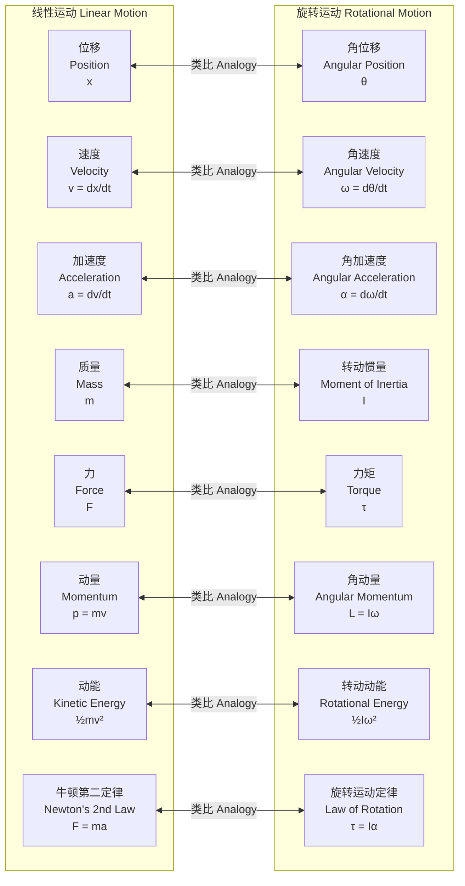

## 旋转动力学 (Rotational Dynamics)

旋转动力学是经典力学的一个分支，专门研究物体绕固定轴或固定点的旋转运动。它描述了力矩、转动惯量和角加速度之间的关系，是理解从行星轨道到工程机械等各种现象的基础。本文档旨在提供关于旋转动力学的全面技术性概述，重点关注其科学和数学的严谨性。

### 核心概念及其数学基础

旋转动力学的理论框架建立在一系列与线性动力学相对应的核心概念之上。

#### 1. 旋转运动学 (Rotational Kinematics)
旋转运动学描述了旋转运动的几何特征，而不考虑引起运动的力。

*   **角位移 (Angular Displacement, $\theta$)**: 描述物体或点绕轴旋转过的角度。它是一个伪标量，单位是弧度 (rad)。
*   **角速度 (Angular Velocity, $\omega$)**: 角位移对时间的变化率。它是一个伪矢量，其方向由右手定则确定，沿着旋转轴。
    $$ \vec{\omega} = \frac{d\vec{\theta}}{dt} $$
    对于绕固定轴的旋转，可以简化为标量形式：$\omega = \frac{d\theta}{dt}$。单位是弧度/秒 (rad/s)。
*   **角加速度 (Angular Acceleration, $\alpha$)**: 角速度对时间的变化率。它也是一个伪矢量，方向与角速度变化量的方向一致。
    $$ \vec{\alpha} = \frac{d\vec{\omega}}{dt} = \frac{d^2\vec{\theta}}{dt^2} $$
    单位是弧度/秒² (rad/s²)。

#### 2. 力矩 (Torque, $\tau$)
力矩是力的旋转等效量，是导致物体角加速度改变的原因。它被定义为力矢量 $\vec{F}$ 和从旋转轴到力的作用点的位矢 $\vec{r}$ 的叉积。
$$ \vec{\tau} = \vec{r} \times \vec{F} $$
其大小为：
$$ \tau = |\vec{r}| |\vec{F}| \sin(\phi) = rF_{\perp} $$
*   $\vec{\tau}$: 力矩矢量 (N·m)
*   $\vec{r}$: 从转轴到力作用点的位矢 (m)
*   $\vec{F}$: 作用力 (N)
*   $\phi$: $\vec{r}$ 和 $\vec{F}$ 之间的夹角 (rad)
*   $F_{\perp}$: 力的垂直于 $\vec{r}$ 的分量 (N)

#### 3. 转动惯量 (Moment of Inertia, $I$)
转动惯量是物体对角加速度的阻抗，是质量的旋转等效量。它取决于物体的质量分布和旋转轴的位置。
*   对于一个质量为 $m$ 的质点，距离旋转轴为 $r$：
    $$ I = mr^2 $$
*   对于一个由多个离散质点组成的系统：
    $$ I = \sum_{i} m_i r_i^2 $$
*   对于一个连续质量分布的刚体：
    $$ I = \int r^2 dm = \int_V \rho(\vec{r}) r^2 dV $$
*   $I$: 转动惯量 (kg·m²)
*   $m$: 质量 (kg)
*   $r$: 到旋转轴的垂直距离 (m)
*   $\rho(\vec{r})$: 在位置 $\vec{r}$ 处的密度 (kg/m³)
*   $dV$: 体积元 (m³)

#### 4. 旋转运动的牛顿第二定律 (Newton's Second Law for Rotation)
施加在刚体上的净外力矩等于其转动惯量与角加速度的乘积。这是旋转动力学的核心方程。
$$ \sum \vec{\tau}_{\text{ext}} = I \vec{\alpha} $$
这个方程也可以表示为角动量的变化率：
$$ \sum \vec{\tau}_{\text{ext}} = \frac{d\vec{L}}{dt} $$

#### 5. 角动量 (Angular Momentum, $\vec{L}$)
角动量是线性动量的旋转等效量。
*   对于一个质点，其角动量 $\vec{L}$ 定义为位矢 $\vec{r}$ 与线性动量 $\vec{p} = m\vec{v}$ 的叉积：
    $$ \vec{L} = \vec{r} \times \vec{p} $$
*   对于绕固定主轴旋转的刚体，角动量可以简化为：
    $$ \vec{L} = I \vec{\omega} $$
    **角动量守恒原理**: 如果作用在系统上的净外力矩为零，则系统的总角动量保持恒定。
    $$ \text{若} \sum \vec{\tau}_{\text{ext}} = 0, \quad \text{则} \frac{d\vec{L}}{dt} = 0 \implies \vec{L} = \text{常量} $$

#### 6. 旋转动能与功 (Rotational Kinetic Energy and Work)
*   **旋转动能 ($K_{\text{rot}}$)**: 物体因旋转而具有的能量。
    $$ K_{\text{rot}} = \frac{1}{2} I \omega^2 $$
    单位是焦耳 (J)。
*   **旋转功-能定理**: 作用在刚体上的净功等于其旋转动能的变化量。由力矩所做的功为：
    $$ W = \int_{\theta_1}^{\theta_2} \tau \, d\theta $$
    功-能定理指出：
    $$ W_{\text{net}} = \Delta K_{\text{rot}} = \frac{1}{2} I \omega_f^2 - \frac{1}{2} I \omega_i^2 $$

```mermaid
graph TD
    subgraph "旋转动力学核心概念 Core Concepts in Rotational Dynamics"
        A[力矩<br>Torque<br>τ = r x F] --> B角加速度<br>Angular Acceleration<br>α;
        C[转动惯量<br>Moment of Inertia<br>I = ∫r²dm] --> B;
        B -- "积分 Integrate" --> D[角速度<br>Angular Velocity<br>ω];
        D -- "积分 Integrate" --> E[角位移<br>Angular Displacement<br>θ];
        
        A -- "改变 Changes" --> F[角动量<br>Angular Momentum<br>L = Iω];
        C --> F;
        D --> F;

        C --> G[转动动能<br>Rotational Kinetic Energy<br>K = ½Iω²];
        D --> G;

        B -- "牛顿第二定律 Newton's 2nd Law" --> A;
    end

    style A fill:#f9f,stroke:#333,stroke-width:2px
    style C fill:#ccf,stroke:#333,stroke-width:2px
    style F fill:#9cf,stroke:#333,stroke-width:2px
    style G fill:#cfc,stroke:#333,stroke-width:2px
```

### 关键技术规格

不同形状的刚体绕特定轴的转动惯量是工程和物理计算中的关键参数。

| 物体 (Object) | 旋转轴 (Axis of Rotation) | 转动惯量公式 (Formula for I) |
| :--- | :--- | :--- |
| 细棒 (Thin Rod) | 穿过中心，垂直于棒长 | $$ I = \frac{1}{12} M L^2 $$ |
| 细棒 (Thin Rod) | 穿过一端，垂直于棒长 | $$ I = \frac{1}{3} M L^2 $$ |
| 实心圆柱/圆盘 (Solid Cylinder/Disk) | 中心对称轴 | $$ I = \frac{1}{2} M R^2 $$ |
| 空心圆柱/圆环 (Hollow Cylinder/Ring) | 中心对称轴 | $$ I = M R^2 $$ |
| 薄壁空心球 (Thin-walled Hollow Sphere) | 穿过球心 | $$ I = \frac{2}{3} M R^2 $$ |
| 实心球 (Solid Sphere) | 穿过球心 | $$ I = \frac{2}{5} M R^2 $$ |
| 矩形平板 (Rectangular Plate) | 穿过中心，垂直于平面 | $$ I = \frac{1}{12} M (a^2 + b^2) $$ |

**参数定义**:
*   $M$: 物体总质量 (kg)
*   $L$: 棒的长度 (m)
*   $R$: 圆柱/球体的半径 (m)
*   $a, b$: 矩形平板的边长 (m)

### 常见应用案例

#### 1. 飞轮储能系统 (Flywheel Energy Storage Systems, FESS)
飞轮通过高速旋转一个大质量的转子来储存能量，其形式为旋转动能。
*   **原理**: $K_{\text{rot}} = \frac{1}{2} I \omega^2$。能量与角速度的平方成正比。
*   **性能指标**:
    *   **能量密度**: 典型值为 10-30 Wh/kg (或 3.6×10⁴ - 1.08×10⁵ J/kg)。先进的碳纤维复合材料飞轮可达到 > 100 Wh/kg。
    *   **功率密度**: 非常高，可达 5,000-10,000 W/kg。
    *   **循环寿命**: > 10⁵ 次循环，远超化学电池。
    *   **效率**: 充放电往返效率通常在 85% 到 95% 之间。

#### 2. 陀螺仪与惯性导航 (Gyroscopes and Inertial Navigation)
陀螺仪利用角动量守恒原理来维持其旋转轴的方向。
*   **原理**: 在没有外力矩的情况下 ($\sum \vec{\tau}_{\text{ext}} = 0$)，角动量 $\vec{L} = I\vec{\omega}$ 保持恒定。高速旋转的陀螺仪的旋转轴会抵抗方向的改变。
*   **性能指标**:
    *   **漂移率 (Drift Rate)**: 衡量陀螺仪轴向随时间偏离其初始方向的速率。
        *   消费级MEMS陀螺仪: 1-10 °/s
        *   战术级陀螺仪: 0.1-10 °/hr
        *   导航级/战略级陀螺仪 (如环形激光陀螺仪): < 0.001 °/hr
    *   **进动 (Precession)**: 当一个外力矩作用于旋转的陀螺仪时，其旋转轴会发生进动，而不是立即倾倒。进动角速度 $\Omega_p$ 为：
        $$ \Omega_p = \frac{\tau}{L_s} = \frac{\tau}{I\omega_s} $$
        其中 $\omega_s$ 是自转角速度。

#### 3. 行星轨道力学 (Planetary Orbital Mechanics)
行星绕太阳的运动遵循角动量守恒。
*   **原理**: 行星受到的引力始终指向太阳（中心），因此引力相对于太阳产生的力矩为零 ($\vec{\tau} = \vec{r} \times \vec{F} = 0$，因为 $\vec{r}$ 和 $\vec{F}$ 平行)。这导致行星的角动量守恒。
*   **定量结果**: 开普勒第二定律（面积定律）是角动量守恒的直接结果。行星在相等时间内扫过的面积相等。这意味着行星在近日点时速度最快，在远日点时速度最慢。
    $$ \frac{dA}{dt} = \frac{L}{2m} = \text{常量} $$
    *   $A$: 轨道面积
    *   $L$: 行星的角动量
    *   $m$: 行星的质量

### 实现考量

#### 刚体运动的数值模拟
为了预测复杂系统（如航天器姿态控制或机器人动力学）的行为，通常需要对旋转动力学方程进行数值求解。

*   **算法**:
    1.  **欧拉法 (Euler Method)**: 最简单的一阶积分器。
        $$ \omega_{n+1} = \omega_n + \alpha_n \Delta t = \omega_n + \frac{\tau_n}{I} \Delta t $$
        $$ \theta_{n+1} = \theta_n + \omega_n \Delta t $$
    2.  **四阶龙格-库塔法 (RK4)**: 一种更精确和稳定（对于给定的步长）的四阶方法，广泛用于科学计算。

*   **算法复杂度**:
    *   对于单个刚体，模拟 $N$ 个时间步长的复杂度为 $O(N)$，因为每一步的计算量是恒定的。
    *   对于 $k$ 个相互作用的刚体（N体问题），计算力/力矩的复杂度可能高达 $O(k^2)$，导致总复杂度为 $O(N k^2)$。可以使用树形码等高级算法将其优化至 $O(N k \log k)$。

*   **注意事项**:
    *   **稳定性**: 欧拉法在数值上可能不稳定，需要非常小的时间步长 $\Delta t$。RK4在更大的步长下仍能保持稳定。
    *   **姿态表示**: 对于三维旋转，使用欧拉角会导致万向节死锁（gimbal lock）问题。使用**四元数 (Quaternions)** 是更常用和稳健的方法来表示和积分旋转状态。

### 性能特征

#### 陀螺进动与章动
*   **进动 (Precession)**: 如前所述，是旋转轴对外部力矩的稳定响应。
*   **章动 (Nutation)**: 是进动运动中的一种更高频率的“点头”或“摆动”现象。它通常会因阻尼而衰减。
*   **统计测量**:
    *   **艾伦方差 (Allan Variance, AVAR)**: 一种用于表征陀螺仪和其他振荡器频率稳定性的统计工具。通过分析不同平均时间 $\tau$ 下的频率波动，可以识别不同类型的噪声源（如量化噪声、随机游走、闪烁噪声、速率斜坡）。
        $$ \sigma_y^2(\tau) = \frac{1}{2(M-1)} \sum_{i=1}^{M-1} (\bar{y}_{i+1} - \bar{y}_i)^2 $$
    *   $\sigma_y^2(\tau)$: 艾伦方差
    *   $\tau$: 平均时间
    *   $\bar{y}_i$: 第 $i$ 个频率数据的平均值

### 相关技术

#### 线性动力学与旋转动力学的类比
理解旋转动力学的一个有效方法是将其与更直观的线性动力学进行类比。



#### 刚体动力学 vs. 流体动力学
*   **刚体动力学 (Rigid Body Dynamics)**: 处理的对象是形状和大小不发生变化的理想刚体。系统的自由度是有限的（通常是6个：3个平动，3个转动）。其控制方程是欧拉运动方程。
*   **流体动力学 (Fluid Dynamics)**: 处理的对象是流体（液体或气体），其形状可以随容器和外力而改变。系统具有无限的自由度，因为需要描述空间中每一点的流体属性（速度、压力、密度）。其控制方程是纳维-斯托克斯方程（Navier-Stokes equations），这是更为复杂的偏微分方程。
    $$ \rho \left( \frac{\partial \mathbf{v}}{\partial t} + \mathbf{v} \cdot \nabla \mathbf{v} \right) = -\nabla p + \nabla \cdot \mathbf{T} + \mathbf{f} $$
    这与刚体动力学的 $\vec{\tau} = I\vec{\alpha}$ 在数学形式和求解复杂度上都有着本质的区别。

### 参考文献

1.  Goldstein, H., Poole, C. P., & Safko, J. L. (2002). *Classical Mechanics* (3rd ed.). Addison Wesley.
    *   这是经典力学领域的权威研究生教材，对拉格朗日和哈密顿形式下的刚体动力学有深入的数学论述。

2.  Arbab, A. I. (2009). The analogy between mechanics and electromagnetism. *Progress In Electromagnetics Research B*, 15, 185-207.
    *   DOI: `10.2528/PIERB09041503`
    *   这篇论文探讨了力学（包括旋转动力学）和电磁学之间的深刻数学类比，为跨学科理解提供了见解。

3.  Amiryar, M., & Pullen, K. R. (2017). A review of flywheel energy storage system technologies and their applications. *Applied Sciences*, 7(3), 286.
    *   DOI: `10.3390/app7030286`
    *   这篇综述文章详细介绍了飞轮储能系统的技术、材料、性能指标和应用，是理解旋转动力学在现代工程中应用的一个极好案例。