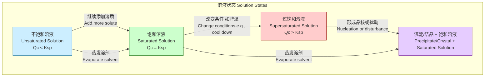
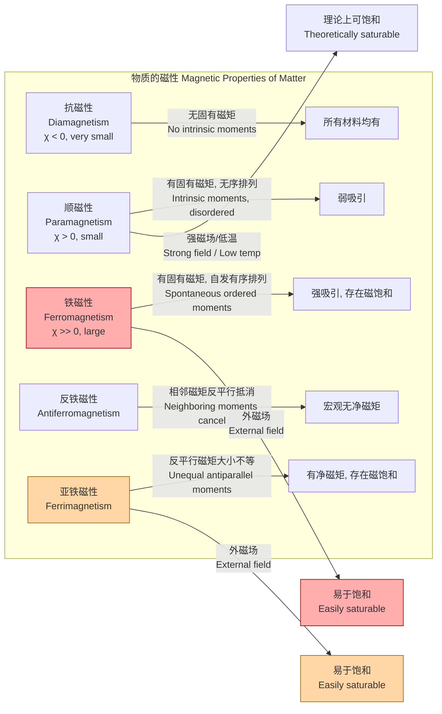
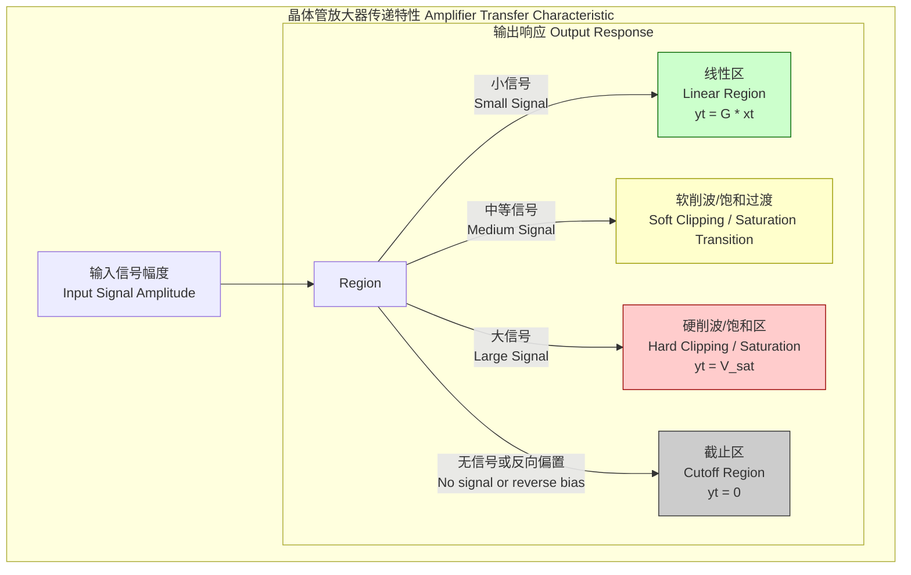

## 饱和 (Saturation)

饱和是一个在多个科学和工程领域中描述系统达到其最大容量或极限状态的基本概念。当一个系统无法再吸收、溶解、响应或容纳更多的输入、物质或能量时，即称其达到了饱和状态。本技术文档将从化学、物理学、电子学和色彩理论等多个角度，以科学和数学的严谨性，对“饱和”进行全面的阐述。

### 1. 化学中的饱和 (Saturation in Chemistry)

在化学中，饱和通常指溶液的饱和状态。当溶剂在特定温度和压力下无法再溶解更多的溶质时，该溶液即为饱和溶液。

#### 1.1 核心概念与数学基础

饱和溶液是一个动态平衡系统，其中溶质溶解的速率等于溶质从溶液中结晶析出的速率。这个平衡可以用溶度积常数 ($K_{sp}$) 来定量描述，特别适用于微溶于水的离子化合物。

对于一个通式为 $A_mB_n$ 的盐，其在水中的溶解平衡可以表示为：
$$ A_mB_n(s) \rightleftharpoons m A^{n+}(aq) + n B^{m-}(aq) $$

其溶度积常数 $K_{sp}$ 的表达式为：
$$ K_{sp} = [A^{n+}]^m [B^{m-}]^n $$
其中：
*   $[A^{n+}]$ 是阳离子 $A^{n+}$ 在饱和溶液中的摩尔浓度 (mol/L)。
*   $[B^{m-}]$ 是阴离子 $B^{m-}$ 在饱和溶液中的摩尔浓度 (mol/L)。
*   $m$ 和 $n$ 是化学计量系数。

$K_{sp}$ 的值仅与温度有关。当离子浓度乘积（离子积 $Q_c$）小于 $K_{sp}$ 时，溶液为不饱和溶液，可以继续溶解溶质。当 $Q_c = K_{sp}$ 时，溶液达到饱和。当 $Q_c > K_{sp}$ 时，溶液为过饱和溶液，会析出沉淀直至达到新的平衡。

#### 1.2 关键技术规格

下表列出了一些常见盐在特定温度下于水中的溶解度。溶解度是制备饱和溶液的关键参数。

| 化合物 (Compound) | 化学式 (Formula) | 温度 (°C) | 溶解度 (g / 100 mL H₂O) | 对应的 $K_{sp}$ (25 °C) |
| :--- | :--- | :--- | :--- | :--- |
| 氯化钠 (Sodium Chloride) | NaCl | 20 | 35.9 | ~36 |
| 硝酸钾 (Potassium Nitrate) | KNO₃ | 20 | 31.6 | - |
| 氯化银 (Silver Chloride) | AgCl | 25 | 1.94 × 10⁻⁴ | 1.77 × 10⁻¹⁰ |
| 硫酸钡 (Barium Sulfate) | BaSO₄ | 25 | 2.45 × 10⁻⁴ | 1.08 × 10⁻¹⁰ |

#### 1.3 常见用例与定量性能指标

*   **重结晶提纯**：利用物质在不同温度下溶解度的差异，通过制备热的饱和溶液，然后降温使其结晶析出，从而提纯物质。
    *   **性能指标**：提纯产率 (%)，计算公式为 (提纯后晶体质量 / 初始粗品质量) × 100%。一个成功的重结晶操作产率通常在 70-90% 之间，具体取决于杂质含量和操作损失。
*   **化学分析**：在重量分析法中，通过加入沉淀剂使目标离子形成低溶解度的沉淀，从而定量测定其含量。确保溶液相对于该沉淀物达到饱和是完全沉淀的关键。

#### 1.4 溶液状态关系图



### 2. 物理学中的磁饱和 (Magnetic Saturation in Physics)

在磁学中，饱和是指当施加的外部磁场 ($H$) 足够强时，铁磁性或亚铁磁性材料的磁化强度 ($M$) 达到其最大值 ($M_s$) 的状态。在此状态下，材料内部所有的磁畴都已沿着外磁场方向排列。

#### 2.1 核心概念与数学基础

磁饱和是铁磁性材料的一个标志性特征。其行为可以通过磁滞回线（B-H 曲线或 M-H 曲线）来描述。在经典物理模型中，顺磁性的饱和行为可以用朗之万函数来描述，它为理解铁磁性饱和提供了理论基础。

对于包含 $N$ 个磁矩为 $\mu$ 的原子的顺磁系统，其磁化强度 $M$ 为：
$$ M = N \mu \left( \coth(x) - \frac{1}{x} \right) $$
其中 $x$ 是一个无量纲参数，定义为：
$$ x = \frac{\mu B_{app}}{k_B T} $$
各参数定义如下：
*   $M$: 宏观磁化强度 (A/m)。
*   $N$: 单位体积内的原子数 (m⁻³)。
*   $\mu$: 单个原子的磁矩 (A·m²)。
*   $B_{app}$: 施加的外部磁场强度 (T)。
*   $k_B$: 玻尔兹曼常数 (1.38 × 10⁻²³ J/K)。
*   $T$: 绝对温度 (K)。

当 $x \to \infty$（即强磁场或低温），$\coth(x) \to 1$，则 $M \to N\mu$。这个极限值就是饱和磁化强度 $M_s$。
$$ M_s = N \mu $$
对于铁磁性材料，由于存在强大的交换相互作用，其饱和行为比顺磁体显著得多，并且在室温下即可轻松达到饱和。其量子力学描述则更为复杂，需要使用布里渊函数。

#### 2.2 关键技术规格

下表为一些常见铁磁性材料的饱和磁化强度和居里温度。

| 材料 (Material) | 饱和磁化强度 $M_s$ (×10⁶ A/m) @ 20°C | 饱和磁感应强度 $B_s = \mu_0 M_s$ (T) | 居里温度 $T_c$ (°C) |
| :--- | :--- | :--- | :--- |
| 铁 (Iron) | 1.71 | 2.15 | 770 |
| 钴 (Cobalt) | 1.40 | 1.76 | 1130 |
| 镍 (Nickel) | 0.48 | 0.61 | 358 |
| 铁氧体 (Ferrite, MnZn) | 0.30 - 0.40 | 0.38 - 0.50 | 150 - 250 |
| 钕磁铁 (Nd₂Fe₁₄B) | 1.28 | 1.61 | 310 - 400 |

*注：$\mu_0$ 是真空磁导率，约为 $4\pi \times 10^{-7}$ T·m/A。*

#### 2.3 常见用例与定量性能指标

*   **变压器和电感器磁芯**：利用高饱和磁感应强度的材料来减小设备尺寸并提高功率密度。工作时必须避免磁芯饱和，否则电感量会急剧下降，导致电流失控。
    *   **性能指标**：最大磁通密度 $B_{max}$，必须小于材料的 $B_s$。
*   **磁记录介质**（如硬盘）：通过将介质的局部区域磁化到正或负饱和状态来记录二进制数据 '1' 和 '0'。
    *   **性能指标**：矫顽力 $H_c$（决定数据稳定性），剩磁 $B_r$（决定读出信号强度）。

#### 2.4 不同磁性材料的比较



### 3. 电子学与信号处理中的饱和 (Saturation in Electronics & Signal Processing)

在电子学中，饱和描述了有源器件（如晶体管或运算放大器）的一种工作状态，其中其输出信号的幅度受到电源电压的限制，无法再随输入信号线性增长。

#### 3.1 核心概念与数学基础

当输入信号过大时，放大器的输出会“削波”（Clipping），即输出波形的顶部和/或底部被削平。这就是饱和现象。

**1. 晶体管饱和区 (BJT Saturation Region)**
对于NPN型双极结型晶体管（BJT），当基极电流 ($I_B$) 足够大，使得集电极电流 ($I_C$) 达到其电路允许的最大值时，晶体管进入饱和区。此时，集电极-发射极电压 ($V_{CE}$) 下降到一个很小的稳定值，称为饱和电压 $V_{CE(sat)}$。
饱和条件为：
$$ I_C < \beta I_B $$
其中 $\beta$ 是晶体管的直流电流增益。在饱和区，晶体管不再是线性放大器，而更像一个闭合的开关。

**2. 信号削波模型 (Signal Clipping Models)**
*   **硬削波 (Hard Clipping)**：一个理想化的模型，输出信号在达到阈值 $V_{sat}$ 后被完全削平。
    $$ y(t) = \begin{cases} V_{sat} & \text{if } x(t) > V_{sat} \\ x(t) & \text{if } -V_{sat} \le x(t) \le V_{sat} \\ -V_{sat} & \text{if } x(t) < -V_{sat} \end{cases} $$
    其中 $x(t)$ 是输入信号，$y(t)$ 是输出信号。

*   **软削波 (Soft Clipping)**：一个更平滑的过渡模型，常见于电子管放大器和磁带饱和。它可以用 `tanh` (双曲正切) 函数或反正切函数来建模。
    $$ y(t) = V_{max} \cdot \tanh\left(\frac{g \cdot x(t)}{V_{max}}\right) $$
    其中 $g$ 是增益因子，$V_{max}$ 是最大输出幅度。软削波引入的谐波比硬削波更平滑，音色上更“温暖”。

#### 3.2 关键技术规格

| 参数 (Parameter) | 符号 (Symbol) | 典型值 (Typical Value) | 单位 (Unit) | 描述 (Description) |
| :--- | :--- | :--- | :--- | :--- |
| 集电极-发射极饱和电压 | $V_{CE(sat)}$ | 0.1 - 0.3 | V | BJT在饱和区的$V_{CE}$电压 |
| 基极-发射极饱和电压 | $V_{BE(sat)}$ | 0.7 - 0.9 | V | BJT在饱和区的$V_{BE}$电压 |
| 运放输出摆幅 | $V_{out\_swing}$ | $V_{supply} - (1 \text{ to } 2)$ | V | 运放输出能达到的接近电源电压的极限 |

#### 3.3 常见用例与定量性能指标

*   **数字逻辑电路**：晶体管工作在饱和区（导通，逻辑'0'）和截止区（关断，逻辑'1'），实现高速开关功能。
    *   **性能指标**：开关速度（上升/下降时间），功耗。
*   **音频效果器**（如过载、失真）：故意驱动放大电路进入饱和区，以产生丰富的谐波，创造特定的音乐音色。
    *   **性能指标**：总谐波失真 (Total Harmonic Distortion, THD)。硬削波会产生大量的奇次谐波，而软削波产生的谐波频谱衰减更快。一个正弦波经过硬削波后，其THD可能高达30-40%，而软削波则较低。

#### 3.4 实现考量与算法复杂度

在数字信号处理 (DSP) 中实现削波算法非常高效。
*   **硬削波**：对于每个采样点，这是一个简单的比较和赋值操作。
    ```
    if sample > threshold:
        sample = threshold
    elif sample < -threshold:
        sample = -threshold
    ```
    其**算法复杂度为 $O(1)$**（常数时间）/每样本。
*   **软削波**：对于每个采样点，需要进行一次乘法和一次 `tanh` 函数计算。
    ```
    sample = max_val * tanh(gain * sample / max_val)
    ```
    虽然 `tanh` 计算比比较操作慢，但在现代处理器上仍然非常快，其**算法复杂度也为 $O(1)$** /每样本。

#### 3.5 放大器工作区域



### 4. 色彩理论中的饱和度 (Saturation in Color Theory)

在色彩理论中，饱和度（Saturation）是色彩三属性（色相 Hue, 饱和度 Saturation, 亮度/明度 Value/Lightness）之一。它描述了色彩的纯度或强度。

#### 4.1 核心概念与数学基础

饱和度表示一种颜色中灰色成分的多少。
*   **高饱和度**：颜色鲜艳、纯粹，接近光谱色（如纯红色）。
*   **低饱和度**：颜色暗淡、灰暗，接近灰色。饱和度为0时，任何色相的颜色都变成灰色、白色或黑色。

在 HSL 和 HSV 色彩空间中，饱和度 'S' 是一个关键分量。

**从 RGB 到 HSV 的转换**
给定一个颜色 (R, G, B)，其中 R, G, B ∈ [0, 1]：
1.  计算最大值和最小值：
    $$ C_{max} = \max(R, G, B) $$
    $$ C_{min} = \min(R, G, B) $$
2.  计算差值（色度 Chroma）：
    $$ \Delta = C_{max} - C_{min} $$
3.  计算饱和度 (S)：
    $$ S_{HSV} = \begin{cases} 0 & \text{if } C_{max} = 0 \\ \frac{\Delta}{C_{max}} & \text{if } C_{max} \neq 0 \end{cases} $$
    明度 (V) 定义为 $V = C_{max}$。

**从 RGB 到 HSL 的转换**
亮度的计算不同，影响了饱和度的计算。
1.  亮度 (L)：
    $$ L = \frac{C_{max} + C_{min}}{2} $$
2.  饱和度 (S)：
    $$ S_{HSL} = \begin{cases} 0 & \text{if } \Delta = 0 \\ \frac{\Delta}{1 - |2L - 1|} & \text{if } \Delta \neq 0 \end{cases} $$

#### 4.2 常见用例与性能指标

*   **图像编辑与处理**：调整图像的饱和度是常见的操作，可以使照片更生动（增加饱和度）或创造特定艺术效果（如降低饱和度变为黑白照片）。
*   **用户界面 (UI) 设计**：使用不同饱和度的颜色来引导用户注意力。高饱和度的颜色通常用于需要用户关注的按钮或警告信息。
*   **数据可视化**：在图表和地图中，饱和度可以作为编码数据的一个维度，例如，用不同饱和度的蓝色表示降雨量的多少。

#### 4.3 实现考量与算法复杂度

在计算机图形学中，对图像进行饱和度调整，需要先将每个像素从 RGB 空间转换到 HSL/HSV 空间，修改 S 分量，然后再转换回 RGB 空间。
*   **算法**：
    1.  遍历图像中的每一个像素。
    2.  对每个像素执行 RGB -> HSL/HSV 转换。
    3.  $S_{new} = S_{old} \times \text{factor}$ (并限制在 [0, 1] 范围内)。
    4.  使用新的 H, S, L/V 值执行 HSL/HSV -> RGB 转换。
*   **算法复杂度**：对于一个包含 $N$ 个像素的图像，整个过程的复杂度为 **$O(N)$**，因为对每个像素的处理都是常数时间操作。

### 5. 参考文献 (References)

1.  Atkins, P., & de Paula, J. (2014). *Atkins' Physical Chemistry*. 10th ed. Oxford University Press. (Covers chemical equilibrium and solubility).
2.  Chikazumi, S. (1997). *Physics of Ferromagnetism*. Oxford University Press. DOI: [10.1093/acprof:oso/9780198517764.001.0001](https://doi.org/10.1093/acprof:oso/9780198517764.001.0001) (A classic text on magnetic phenomena, including saturation).
3.  Sedra, A. S., & Smith, K. C. (2015). *Microelectronic Circuits*. 7th ed. Oxford University Press. (Details transistor operating regions, including saturation).
4.  Smith, A. R. (1978). Color gamut transform pairs. *ACM SIGGRAPH Computer Graphics*, 12(3), 12–19. DOI: [10.1145/965139.807361](https://doi.org/10.1145/965139.807361) (A foundational paper on the HSL/HSV color spaces).
5.  Parker, R. J. (1990). *Advances in Permanent Magnetism*. John Wiley & Sons. (Provides data and theory on high-performance magnetic materials).