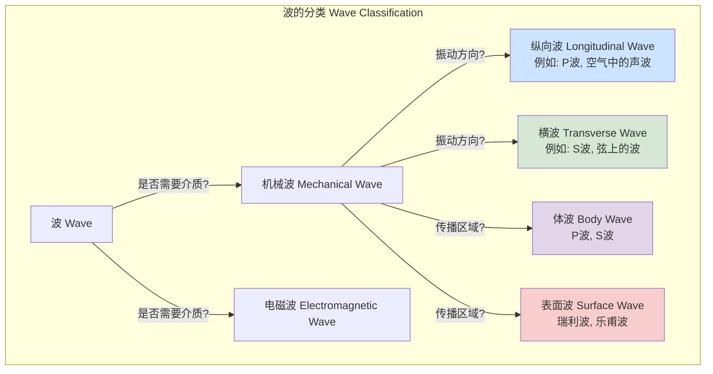
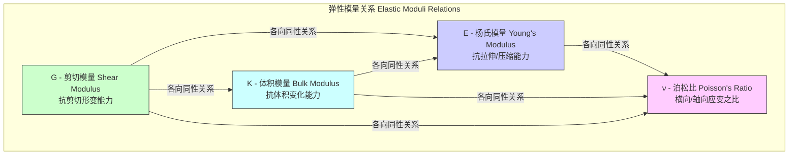

## 剪切声波

剪切声波（Shear Acoustic Wave），通常简称为剪切波（Shear Wave）或S波（S-wave），是一种机械波。其核心特征是介质中质点的振动方向与波的能量传播方向相垂直（即横向振动）。这与质点振动方向和波传播方向平行的纵向波（如空气中的声波）形成鲜明对比。

剪切波的传播涉及介质形状的改变（剪切形变），而非体积的改变（压缩或稀疏）。因此，剪切波只能在具有抵抗剪切形变能力的介质中传播，这类介质被称为具有剪切强度。固体是典型的可以支持剪切波传播的介质。理想流体（液体和气体）无法承受剪切应力，因此纯剪切波无法在其中传播。

### 核心概念与数学基础

剪切波的物理行为可以通过连续介质力学中的弹性动力学方程进行精确描述。

#### 1. 应力-应变关系 (本构方程)

对于一个均匀、各向同性的线弹性固体，其应力（stress）与应变（strain）之间的关系遵循广义胡克定律（Hooke's Law）。该关系由应力张量 $\sigma_{ij}$ 和应变张量 $\epsilon_{ij}$ 描述：

$$
\sigma_{ij} = \lambda \delta_{ij} \epsilon_{kk} + 2G \epsilon_{ij}
$$

其中：
*   $\sigma_{ij}$ 是应力张量，表示在 $i$ 方向平面上作用的 $j$ 方向的力。
*   $\epsilon_{ij}$ 是应变张量，描述了介质的形变。
*   $G$ 是**剪切模量**（Shear Modulus），也称为刚性模量（Modulus of Rigidity）或拉梅第二参数（Lamé's second parameter, $\mu$）。它量化了材料抵抗剪切形变的能力。
*   $\lambda$ 是拉梅第一参数（Lamé's first parameter），与材料的压缩性有关。
*   $\delta_{ij}$ 是克罗内克符号（Kronecker Delta），当 $i=j$ 时为1，否则为0。
*   $\epsilon_{kk} = \sum_k \epsilon_{kk} = \epsilon_{11} + \epsilon_{22} + \epsilon_{33}$ 是应变张量的迹，代表体积应变。

应变张量本身由位移矢量场 $\mathbf{u} = (u_x, u_y, u_z)$ 定义：

$$
\epsilon_{ij} = \frac{1}{2} \left( \frac{\partial u_i}{\partial x_j} + \frac{\partial u_j}{\partial x_i} \right)
$$

#### 2. 运动方程

固体中任意一点的运动遵循牛顿第二定律，其在连续介质中的形式为柯西运动方程（Cauchy's Equation of Motion）：

$$
\rho \frac{\partial^2 u_i}{\partial t^2} = \sum_j \frac{\partial \sigma_{ij}}{\partial x_j}
$$

其中：
*   $\rho$ 是介质的密度。
*   $\mathbf{u}$ 是质点的位移矢量。
*   $t$ 是时间。
*   $x_j$ 是空间坐标。

#### 3. 剪切波波动方程的推导

将本构方程代入运动方程，经过数学推导，可以得到描述弹性波在固体中传播的纳维-柯西方程（Navier-Cauchy equation）。通过亥姆霍兹分解（Helmholtz decomposition），位移矢量场 $\mathbf{u}$ 可以被分解为一个无旋度（curl-free）的标量势 $\phi$ 和一个无散度（divergence-free）的矢量势 $\mathbf{\psi}$：

$$
\mathbf{u} = \nabla\phi + \nabla \times \mathbf{\psi}, \quad \text{其中} \quad \nabla \cdot \mathbf{\psi} = 0
$$

$\nabla\phi$ 分量对应于纵向波（P波），其散度不为零（$\nabla \cdot \mathbf{u} \neq 0$），涉及体积变化。$\nabla \times \mathbf{\psi}$ 分量对应于剪切波（S波），其散度为零（$\nabla \cdot \mathbf{u} = 0$），不涉及体积变化，仅涉及形状变化。

对于纯剪切波，由于 $\nabla \cdot \mathbf{u} = 0$，体积应变 $\epsilon_{kk} = 0$。此时，纳维-柯西方程简化为：

$$
\rho \frac{\partial^2 \mathbf{u}}{\partial t^2} = G \nabla^2 \mathbf{u}
$$

这是一个标准的三维波动方程。由此可以确定剪切波的传播速度 $v_s$：

$$
v_s = \sqrt{\frac{G}{\rho}}
$$

这个公式是剪切波研究的基石，它明确指出剪切波速度仅由介质的剪切模量和密度决定。

### 关键技术规格

下表列出了一些常见材料中剪切波的关键物理参数。

| 材料 (Material) | 密度 (ρ) [kg/m³] | 剪切模量 (G) [GPa] | 剪切波速度 (v_s) [m/s] |
| :--- | :--- | :--- | :--- |
| 碳钢 (Carbon Steel) | 7850 | 80 | 3200 |
| 铝 (Aluminum) | 2700 | 26 | 3100 |
| 熔融石英 (Fused Silica) | 2200 | 31 | 3760 |
| 花岗岩 (Granite) | 2750 | 25 | 3000 |
| 聚苯乙烯 (Polystyrene) | 1050 | 1.15 | 1050 |
| 水 (Water) | 1000 | ≈ 0 | ≈ 0 |

*注意：流体（如水）的静态剪切模量为零，因此无法传播纯剪切波。*

### 常见用例与性能指标

剪切波因其独特的物理特性，在多个领域具有不可替代的应用。

*   **地震学 (Seismology)**
    *   **应用**: 地震产生的S波是分析地球内部结构的关键工具。由于S波不能在液体中传播，它们无法穿过地球的液态外核，这为“地球外核是液体”的理论提供了最直接的证据。
    *   **性能指标**:
        *   **S-P到时差**: P波（纵向波）比S波速度快，两者到达同一地震台的时间差（S-P time）可用于计算震中距。精度可达秒级。
        *   **震源机制解**: S波的偏振（振动）方向携带着断层错动的信息，用于反演地震的震源机制。

*   **无损检测 (Non-Destructive Testing, NDT)**
    *   **应用**: 在超声检测中，利用剪切波（通常通过模式转换产生）检测材料内部的缺陷，如裂纹、夹杂和气孔。剪切波对表面平行裂纹的检测灵敏度高于纵向波。
    *   **性能指标**:
        *   **检测灵敏度**: 能够可靠检测的最小缺陷尺寸。例如，使用5 MHz的剪切波探头，通常可以检测到直径为0.5毫米的平底孔。
        *   **信噪比 (SNR)**: 有效信号与背景噪声的比值，通常要求 > 15 dB 以确保可靠检测。

*   **医学成像 (Medical Imaging)**
    *   **应用**: **剪切波弹性成像 (Shear Wave Elastography, SWE)** 是一种先进的医学超声技术。它通过声辐射力脉冲（Acoustic Radiation Force Impulse, ARFI）在组织中人为地激发一个低频（50-500 Hz）的剪切波，并通过超声高速追踪该波的传播。通过公式 $G = \rho v_s^2$，测量剪切波速 $v_s$ 可以计算出组织的剪切模量 $G$，从而评估其硬度。这在肝纤维化、乳腺肿瘤和甲状腺结节的诊断中至关重要。
    *   **性能指标**:
        *   **硬度测量范围**: 通常以千帕（kPa）为单位，例如，健康肝脏的硬度约为 5-7 kPa，而严重纤维化或肝硬化的肝脏硬度可超过 15-20 kPa。
        *   **测量可重复性**: 通常用变异系数（Coefficient of Variation, CV）表示，目标是 CV < 15%。
        *   **空间分辨率**: 约 1-2 mm。

### 实现考量

#### 1. 产生与接收
*   **压电换能器**: 可以直接使用特定晶体切型（如Y切石英）的压电晶片来产生剪切波。更常见的方法是**模式转换**：使用一个带有特定角度的楔块，使纵向波以一定角度入射到待测材料表面，根据斯涅尔定律（Snell's Law）在界面处转换成剪切波。
    $$
    \frac{\sin \theta_L}{v_L} = \frac{\sin \theta_S}{v_S}
    $$
    其中 $\theta_L$ 和 $\theta_S$ 分别是纵向波和剪切波的折射角，$v_L$ 和 $v_S$ 是它们各自的速度。
*   **电磁声换能器 (EMATs)**: 无需接触即可在导电材料中直接产生剪切波。
*   **激光超声**: 利用高能激光脉冲在材料表面烧蚀或通过热弹性效应产生超声波，其中包含剪切波成分。

#### 2. 信号处理与算法复杂度
*   **飞行时间 (Time-of-Flight, ToF) 分析**:
    *   **算法**: 通过检测回波信号的峰值或使用互相关算法来精确确定波的传播时间。
    *   **复杂度**: 对于长度为 $N$ 的信号，基于FFT的互相关算法的计算复杂度为 $O(N \log N)$。
*   **剪切波弹性成像追踪算法**:
    *   **算法**: 在SWE中，需要在一个二维或三维空间内追踪剪切波的传播。这通常通过在连续的超声射频数据帧之间，对小的数据窗口（kernels）进行一维或二维互相关来实现，以计算局部组织的位移。
    *   **复杂度**: 这是一个计算密集型任务。如果图像有 $M \times K$ 个追踪点，每个点使用长度为 $N$ 的窗口进行互相关，则单帧处理的复杂度约为 $O(M \cdot K \cdot N \log N)$。

### 性能特征

*   **速度 (Velocity)**: 剪切波速 $v_s = \sqrt{G/\rho}$ 是其最重要的特性。在各向异性材料（如晶体或复合材料）中，$v_s$ 还依赖于波的传播方向和偏振方向。
*   **衰减 (Attenuation)**: 剪切波在传播过程中会因散射和吸收而损失能量。这种能量损失通常用衰减系数 $\alpha_s$ 来描述，单位为 dB/m 或 dB/(cm·MHz)。振幅随距离 $x$ 的衰减关系为：
    $$
    A(x) = A_0 e^{-\alpha_s x}
    $$
    剪切波的衰减通常大于同一材料中纵向波的衰减。
*   **频散 (Dispersion)**: 在某些介质（如粘弹性材料或波导结构）中，剪切波的速度会随频率 $f$ 变化，即 $v_s(f)$。这种现象称为频散。
*   **测量不确定性**:
    *   对 $v_s$ 的测量存在统计不确定性。在SWE中，硬度值通常报告为“均值 ± 标准差”，并附有95%置信区间（Confidence Interval）。例如，某区域的杨氏模量（$E \approx 3G$）测量结果可能为 $10.2 \pm 1.5$ kPa。

### 相关技术与比较

剪切波是弹性波家族的一员，理解其与其他波类型的关系至关重要。

#### 1. 与纵向波 (P波) 的比较
*   **振动方向**: P波是纵向的，S波是横向的。
*   **传播介质**: P波可以在固体、液体和气体中传播；S波只能在固体中传播。
*   **波速**: 在同一固体介质中，P波速度 $v_p$ 总是大于S波速度 $v_s$。
    $$
    v_p = \sqrt{\frac{K + \frac{4}{3}G}{\rho}} = \sqrt{\frac{\lambda + 2G}{\rho}}
    $$
    其中 $K$ 是体积模量。由于 $K$ 和 $G$ 均为正值，显然 $v_p > v_s$。通常，$v_p \approx 1.7 v_s$。

#### 2. 与表面声波 (SAW) 的比较
*   **传播区域**: 表面声波（如瑞利波和乐甫波）的能量被限制在固体表面附近的一个薄层内。
*   **运动模式**:
    *   **瑞利波 (Rayleigh Wave)**: 质点运动是纵向和垂直剪切运动的耦合，形成逆行的椭圆轨迹。其速度 $v_R$ 略小于 $v_s$ ($v_R \approx 0.9 v_s$)。
    *   **乐甫波 (Love Wave)**: 纯水平方向的剪切运动，只存在于具有低速薄层覆盖在高速基底上的分层结构中。
*   **数学模型**: 表面波的求解需要满足自由表面边界条件（即表面应力为零），其数学形式比体波更复杂。

#### 3. 弹性模量关系图

各种弹性模量（杨氏模量E, 剪切模量G, 体积模量K, 泊松比ν）之间通过数学关系相互关联，共同决定了材料的力学行为和波的传播特性。

### 参考文献
1.  Aki, K., & Richards, P. G. (2002). *Quantitative Seismology*. University Science Books. (这是地震学领域的经典教科书，详细介绍了P波和S波理论。)
2.  Bercoff, J., Tanter, M., & Fink, M. (2004). Supersonic shear imaging: A new technique for soft tissue elasticity mapping. *IEEE Transactions on Ultrasonics, Ferroelectrics, and Frequency Control*, 51(4), 396-409. doi:10.1109/TUFFC.2004.1295425 (这是开创剪切波弹性成像技术的关键论文之一。)
3.  Krautkrämer, J., & Krautkrämer, H. (1990). *Ultrasonic testing of materials*. Springer-Verlag. doi:10.1007/978-3-662-10680-8 (这是无损检测领域的权威著作，涵盖了剪切波在工业检测中的应用。)