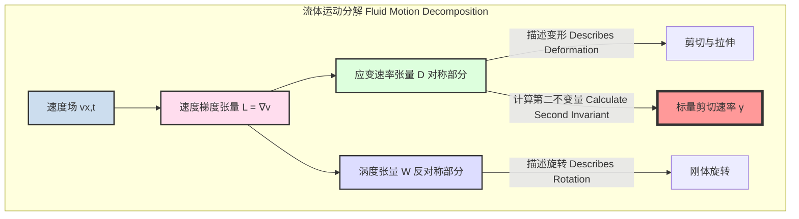
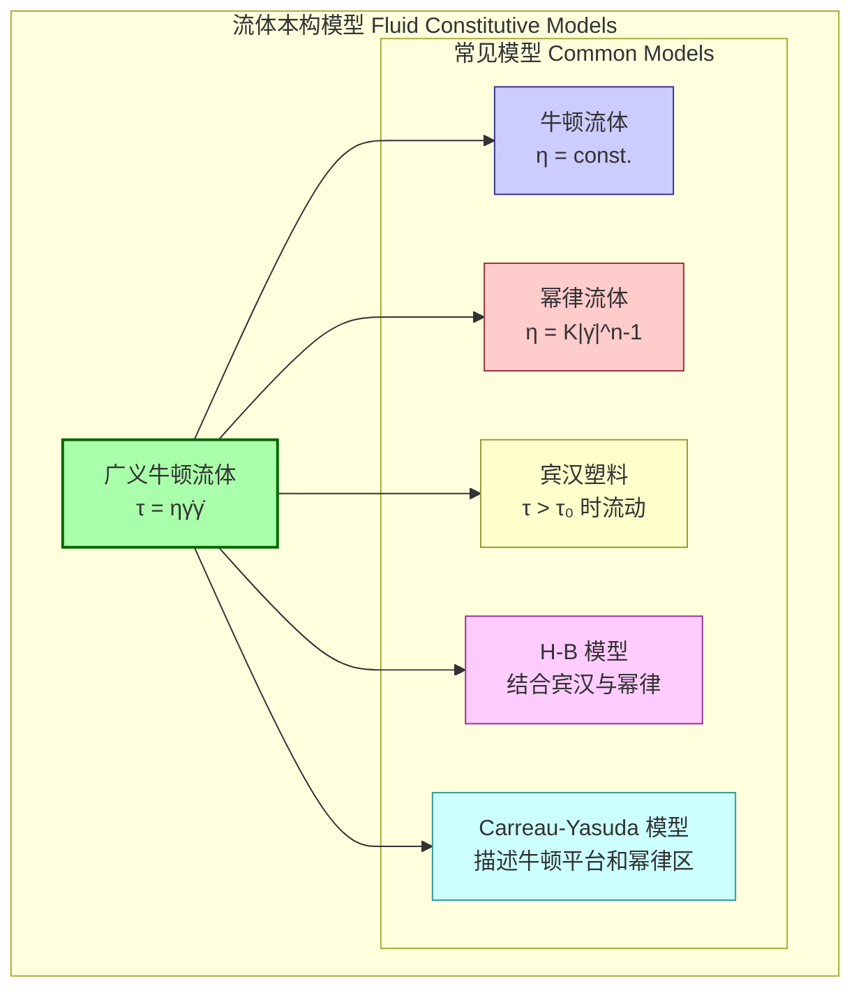

## 剪切速率

剪切速率（Shear Rate），在流变学和流体力学中，是描述流体内部一个点上变形速率的关键物理量。它量化了流体层之间相对运动的速度梯度。从根本上说，剪切速率表示材料受到剪切应变的时间变化率。其符号通常为 $\dot{\gamma}$ (gamma dot)，国际单位制（SI）单位为 reciprocal seconds (s⁻¹)。

### 1. 核心概念与数学基础

#### 简单剪切流
理解剪切速率最直观的方式是考虑一个简单剪切流（或称库爱特流，Couette flow）。想象两块无限大、平行的平板，间距为 $H$。下板固定不动，上板以恒定速度 $U$ 沿 $x$ 方向移动。假设两板之间的流体紧贴板面（无滑移边界条件），流体速度 $v_x$ 会在 $y$ 方向上（垂直于平板的方向）形成一个线性梯度。

在这种理想情况下，剪切速率 $\dot{\gamma}$ 定义为速度在垂直于流动方向上的梯度：

$$
\dot{\gamma} = \frac{dv_x}{dy} = \frac{U}{H}
$$

其中：
*   $v_x$ 是流体在 $x$ 方向的速度。
*   $y$ 是垂直于流体流动的空间坐标。
*   $U$ 是上板的移动速度。
*   $H$ 是两板之间的距离。

#### 广义三维流场
在更复杂的非均匀三维流场中，速度是一个矢量 $\mathbf{v} = (v_x, v_y, v_z)$，它随空间位置 $\mathbf{x} = (x, y, z)$ 而变化。此时，需要使用张量来描述速度梯度。速度梯度张量 $\mathbf{L}$ 定义为：

$$
\mathbf{L} = \nabla \mathbf{v} =
\begin{pmatrix}
\frac{\partial v_x}{\partial x} & \frac{\partial v_x}{\partial y} & \frac{\partial v_x}{\partial z} \\
\frac{\partial v_y}{\partial x} & \frac{\partial v_y}{\partial y} & \frac{\partial v_y}{\partial z} \\
\frac{\partial v_z}{\partial x} & \frac{\partial v_z}{\partial y} & \frac{\partial v_z}{\partial z}
\end{pmatrix}
$$

该张量可以分解为一个对称部分和一个反对称部分：
$\mathbf{L} = \mathbf{D} + \mathbf{W}$

其中：
*   **应变速率张量 (Rate-of-Strain Tensor)** $\mathbf{D}$ 是对称部分，描述流体微元的变形速率（包括拉伸和剪切）。
    $$
    \mathbf{D} = \frac{1}{2} (\nabla \mathbf{v} + (\nabla \mathbf{v})^T)
    $$
*   **涡度张量 (Vorticity Tensor)** $\mathbf{W}$ 是反对称部分，描述流体微元的刚性旋转速率。
    $$
    \mathbf{W} = \frac{1}{2} (\nabla \mathbf{v} - (\nabla \mathbf{v})^T)
    $$

广义剪切速率 $\dot{\gamma}$ 是一个标量，通常定义为应变速率张量 $\mathbf{D}$ 的第二不变量的平方根的特定倍数。这代表了变形速率的总体大小。

$$
\dot{\gamma} = \sqrt{2 \mathbf{D}:\mathbf{D}} = \sqrt{2 \sum_{i} \sum_{j} D_{ij}D_{ji}}
$$

这个定义确保了对于简单剪切流，$\dot{\gamma} = |\frac{dv_x}{dy}|$，与之前的定义相一致。

### 2. 关键技术规格

下表总结了与剪切速率直接相关的关键参数及其规格。

| 参数 (Parameter) | 符号 (Symbol) | 定义 (Definition) | 国际单位制 (SI Unit) | 典型范围 (Typical Range) |
| :--- | :--- | :--- | :--- | :--- |
| **剪切速率** (Shear Rate) | $\dot{\gamma}$ | 流体速度在垂直于流动方向上的梯度 | s⁻¹ | $10^{-3}$ (沉降) - $10^7$ (高压喷射) |
| **剪切应力** (Shear Stress) | $\tau$ | 单位面积上作用的平行于该面积的力 | 帕斯卡 (Pa) | 取决于流体和剪切速率 |
| **动力粘度** (Dynamic Viscosity) | $\eta$ | 剪切应力与剪切速率之比，$\eta = \tau / \dot{\gamma}$ | 帕斯卡秒 (Pa·s) | $10^{-3}$ (水) - $10^6$ (沥青) |
| **速度梯度** (Velocity Gradient) | $\nabla \mathbf{v}$ | 速度矢量在空间中的变化率 | s⁻¹ | 局部值，取决于流场 |
| **流性指数** (Flow Behavior Index) | $n$ | 幂律流体模型中的指数，描述非牛顿行为 | 无量纲 | $n<1$ (剪切稀化), $n=1$ (牛顿), $n>1$ (剪切增稠) |

### 3. 常见用例与量化性能指标

剪切速率是许多工业和自然过程中至关重要的参数。

*   **聚合物加工 (Polymer Processing)**
    *   **应用**: 注塑成型、挤出、吹塑。聚合物熔体在模具中经历极高的剪切速率。
    *   **量化指标**: 剪切速率范围通常在 $10^2$ s⁻¹ 到 $10^5$ s⁻¹ 之间。材料的“熔体流动指数”（MFI）与特定剪切速率和温度下的粘度成反比，是加工性能的关键指标。

*   **涂料与油墨 (Paints and Inks)**
    *   **应用**: 刷涂、滚涂、喷涂。涂料在施工时需要低粘度（高剪切速率），而在流平、抗流挂时需要高粘度（低剪切速率）。
    *   **量化指标**: 触变指数（Thixotropic Index），即低剪切速率（如 1 s⁻¹）下的粘度与高剪切速率（如 100 s⁻¹）下的粘度之比。一个高指数表示良好的施工和抗流挂性能。喷涂过程中的剪切速率可达 $10^4$ s⁻¹ 以上。

*   **食品工业 (Food Industry)**
    *   **应用**: 泵送、混合、咀嚼和吞咽。流体的质地和口感（如酸奶、番茄酱）由其在不同剪切速率下的粘度决定。
    *   **量化指标**: 口感与流变曲线 $\eta(\dot{\gamma})$ 直接相关。例如，泵送番茄酱的剪切速率约为 $10-100$ s⁻¹，而咀嚼过程中的剪切速率可达 $10^2-10^3$ s⁻¹。

*   **生物医学工程 (Biomedical Engineering)**
    *   **应用**: 血液在血管中的流动。血液是一种剪切稀化流体。
    *   **量化指标**: 在大动脉中，剪切速率较高（约 $100-1000$ s⁻¹），血液粘度较低。在微血管或病变狭窄处，剪切速率可能极低或极高，影响红细胞聚集和血栓形成。正常生理范围内的剪切应力对维持血管内皮细胞健康至关重要。

### 4. 实现考量与算法复杂度

剪切速率的“实现”主要指其测量（实验）或计算（模拟）。

#### 实验测量（流变测量法）
*   **设备**: 主要使用流变仪，如旋转流变仪（锥板、平行板几何）和毛细管流变仪。
*   **算法**:
    1.  流变仪通过控制角速度 $\Omega$（施加剪切速率）或扭矩 $M$（施加剪切应力）来操作。
    2.  根据所选的测量几何，将仪器读数（$\Omega, M$）转换为流变学参数（$\dot{\gamma}, \tau$）。
    *   **锥板几何 (Cone-and-Plate)**: 剪切速率在间隙中几乎是均匀的。
        $$ \dot{\gamma} = \frac{\Omega}{\beta}, \quad \tau = \frac{3M}{2\pi R^3} $$
        其中 $\Omega$ 是角速度，$\beta$ 是锥体角度（弧度），$M$ 是扭矩，$R$ 是锥体半径。
*   **算法复杂度**: 对于每个数据点，这是一个 O(1) 的直接计算。测量的复杂性在于仪器的精密控制系统和数据采集。

#### 计算模拟（计算流体动力学, CFD）
*   **方法**: 在CFD中，通过求解离散化的Navier-Stokes方程来获得流场的速度分布 $\mathbf{v}$。
*   **算法**:
    1.  在计算网格的每个单元或节点上，速度场 $\mathbf{v}$ 被求解出来。
    2.  使用数值微分方法（如有限差分或有限体积法）从离散的速度场计算速度梯度张量 $\nabla \mathbf{v}$。
    3.  根据 $\mathbf{D} = \frac{1}{2} (\nabla \mathbf{v} + (\nabla \mathbf{v})^T)$ 和 $\dot{\gamma} = \sqrt{2 \mathbf{D}:\mathbf{D}}$ 计算每个单元的剪切速率。
*   **算法复杂度**: 整个过程的复杂度由Navier-Stokes方程求解器决定。对于一个包含 $N$ 个网格单元的稳态问题，使用迭代求解器的计算复杂度通常在 $O(N \log N)$ 到 $O(N^2)$ 之间，具体取决于求解器类型和问题的非线性程度。

### 5. 性能特征与统计度量

在表征材料的流变行为时，通常测量粘度 $\eta$ 作为剪切速率 $\dot{\gamma}$ 的函数，绘制成“流动曲线”。
*   **性能图**: 通常在双对数坐标下绘制粘度 vs. 剪切速率，以清晰地显示牛顿平台区、剪切稀化区和剪切增稠区。
*   **统计度量**:
    *   **模型拟合**: 实验数据通常用数学模型（如幂律模型）进行拟合。拟合优度通过 **决定系数 (R-squared, $R^2$)** 来评估，一个接近1的 $R^2$ 值表示模型与数据吻合良好。
    *   **参数不确定性**: 模型参数（如幂律指数 $n$ 和稠度系数 $K$）应报告其 **置信区间 (Confidence Interval)**。例如，一个结果可能表示为：$n = 0.52 \pm 0.03$ (95% CI)，这意味着我们有95%的信心认为真实的 $n$ 值在此区间内。
    *   **可重复性与再现性**: 多次测量的结果应报告其 **标准差 (Standard Deviation)** 或 **变异系数 (Coefficient of Variation, CV%)**，以量化测量的精密度。

### 6. 相关技术与数学模型比较

剪切速率是区分不同流体模型的关键自变量。

#### 数学模型比较

*   **牛顿流体 (Newtonian Fluid)**
    *   **模型**: $\tau = \eta \dot{\gamma}$
    *   **描述**: 粘度 $\eta$ 是一个常数，不随剪切速率变化。
    *   **示例**: 水、空气、稀溶液。

*   **幂律流体 (Power-Law Fluid)**
    *   **模型**: $\tau = K |\dot{\gamma}|^{n-1} \dot{\gamma} = K |\dot{\gamma}|^n \text{sgn}(\dot{\gamma})$
    *   **描述**: 广泛用于描述非牛顿流体。
        *   $n < 1$: **剪切稀化 (Shear-thinning)**，粘度随剪切速率增加而降低（如：涂料、聚合物熔体）。
        *   $n > 1$: **剪切增稠 (Shear-thickening)**，粘度随剪切速率增加而升高（如：玉米淀粉悬浮液）。
    *   **参数**: $K$ 是稠度系数 (Pa·sⁿ)，$n$ 是流性指数（无量纲）。

*   **宾汉塑料 (Bingham Plastic)**
    *   **模型**:
        $$
        \begin{cases}
        |\tau| \le \tau_0, & \dot{\gamma} = 0 \\
        \tau = (\eta_p + \frac{\tau_0}{|\dot{\gamma}|}) \dot{\gamma}, & |\tau| > \tau_0
        \end{cases}
        $$
    *   **描述**: 材料在流动前必须克服一个 **屈服应力 (Yield Stress)** $\tau_0$。超过屈服应力后，其行为类似牛顿流体。
    *   **参数**: $\tau_0$ 是屈服应力 (Pa)，$\eta_p$ 是塑性粘度 (Pa·s)。
    *   **示例**: 牙膏、蛋黄酱。

*   **Carreau-Yasuda 模型**
    *   **模型**:
        $$
        \frac{\eta(\dot{\gamma}) - \eta_{\infty}}{\eta_0 - \eta_{\infty}} = \left[1 + (\lambda \dot{\gamma})^a\right]^{(n-1)/a}
        $$
    *   **描述**: 这是一个更全面的模型，能描述流体在零剪切速率下的牛顿平台（粘度为 $\eta_0$）、在剪切稀化区的幂律行为以及在无限大剪切速率下的第二个牛顿平台（粘度为 $\eta_{\infty}$）。
    *   **参数**: $\eta_0$ (零剪切粘度), $\eta_{\infty}$ (无限剪切粘度), $\lambda$ (松弛时间), $n$ (流性指数), $a$ (控制过渡区宽度的参数)。

### 7. 参考文献

1.  Macosko, C. W. (1994). *Rheology: Principles, Measurements, and Applications*. VCH Publishers. (ISBN: 978-0471185758)
2.  Bird, R. B., Armstrong, R. C., & Hassager, O. (1987). *Dynamics of Polymeric Liquids, Volume 1: Fluid Mechanics*. John Wiley & Sons. (ISBN: 978-0471802457)
3.  Barnes, H. A., Hutton, J. F., & Walters, K. (1989). *An Introduction to Rheology*. Elsevier. (DOI: [10.1016/C2009-0-22164-2](https://doi.org/10.1016/C2009-0-22164-2))
4.  Yasuda, K., Armstrong, R. C., & Cohen, R. E. (1981). Shear flow properties of concentrated solutions of linear and star branched polystyrenes. *Rheologica Acta*, 20(2), 163-178. (DOI: [10.1007/BF01513059](https://doi.org/10.1007/BF01513059))