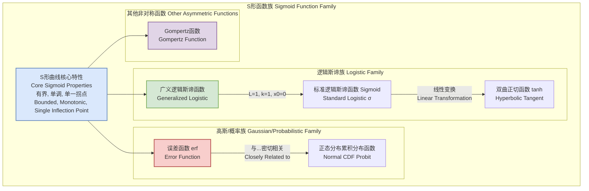
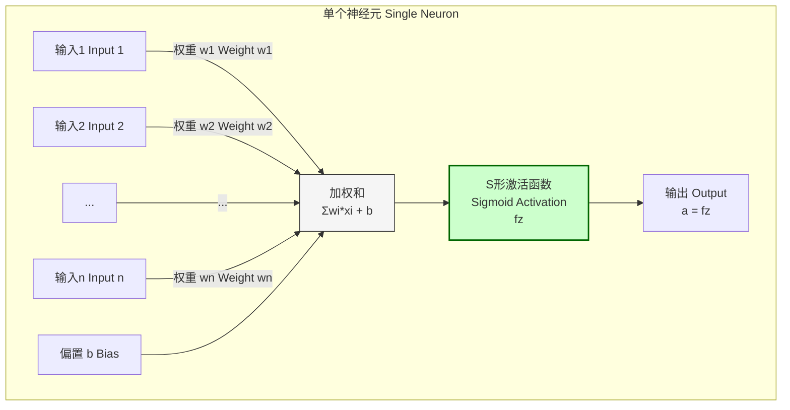

## sigmoidal shape

S形曲线（Sigmoidal Shape），或称乙状结肠形曲线，是一类具有常见“S”形特征的数学函数曲线。这些函数通常是实值、有界且可微的，其定义域为全体实数。它们在水平方向上具有一对渐近线，并且具有单调性（始终增加或始终减少）以及一个拐点。由于其能够平滑地将输入值映射到有限的输出区间（通常是0到1或-1到1），S形曲线在科学和工程的众多领域中得到了广泛应用，用于模拟从受限状态到另一状态的过渡过程。

### 核心概念与数学基础

S形曲线的核心数学特征可以概括为：

*   **有界性 (Boundedness)**：函数值被限制在两个水平渐近线之间。即 $\lim_{x \to -\infty} f(x) = L_{min}$ 和 $\lim_{x \to +\infty} f(x) = L_{max}$，其中 $L_{min}$ 和 $L_{max}$ 是有限值。
*   **单调性 (Monotonicity)**：函数在其整个定义域内是单调递增或单调递减的。这意味着其一阶导数 $f'(x)$ 始终为正或始终为负（除了在个别点上可能为零）。
*   **单一拐点 (Single Inflection Point)**：函数有且仅有一个拐点，在该点，曲线的凹凸性发生改变。这对应于二阶导数 $f''(x)$ 变号的位置。

#### 1. 广义逻辑斯谛函数 (Generalized Logistic Function)

这是最常见和最具代表性的S形函数之一。其数学表达式为：
$$ f(x; L, k, x_0) = \frac{L}{1 + e^{-k(x - x_0)}} $$
其中：
*   $x$：自变量。
*   $L$：曲线的最大值，即上渐近线的值。通常被称为承载能力（carrying capacity）。
*   $k$：曲线的陡峭度（steepness）或增长率。$k$值越大，曲线在拐点附近的过渡越剧烈。
*   $x_0$：曲线拐点的$x$坐标，也是曲线达到 $L/2$ 时的$x$值。它代表了S形曲线的中心点或中点。

该函数的一阶导数为：
$$ \frac{df}{dx} = f'(x) = \frac{Lk e^{-k(x-x_0)}}{(1 + e^{-k(x-x_0)})^2} = k \cdot f(x) \left(1 - \frac{f(x)}{L}\right) $$
这个微分方程形式在生物种群增长模型中非常著名。

#### 2. Gompertz函数 (Gompertz Function)

Gompertz函数是另一种S形曲线，与逻辑斯谛函数不同，它是不对称的。它通常用于模拟增长过程，其中增长在初期和末期比中期要慢。
$$ f(t; a, b, c) = a \cdot e^{-b \cdot e^{-ct}} $$
其中：
*   $t$：自变量，通常代表时间。
*   $a$：上渐近线，即最大值 ($t \to \infty$)。
*   $b$：控制曲线沿t轴的位移。
*   $c$：增长率。

#### 3. 误差函数 (Error Function, erf)

高斯误差函数（及其互补函数）也具有S形特征。
$$ \text{erf}(x) = \frac{2}{\sqrt{\pi}} \int_0^x e^{-t^2} dt $$
该函数的值域为$(-1, 1)$。通过简单的线性变换，可以将其缩放和平移以适应$[0, 1]$或其他区间。例如，$\frac{1}{2}(1 + \text{erf}(x))$ 的值域为$[0, 1]$。

#### 4. 双曲正切函数 (Hyperbolic Tangent, tanh)

双曲正切函数是逻辑斯谛函数的一个移位和缩放版本。
$$ \tanh(x) = \frac{e^x - e^{-x}}{e^x + e^{-x}} = 2 \cdot \sigma(2x) - 1 $$
其中 $\sigma(x)$ 是标准逻辑斯谛函数 $\frac{1}{1+e^{-x}}$。$\tanh(x)$ 的值域为$(-1, 1)$，关于原点对称。

### 关键技术规格

下表比较了不同S形函数的关键参数和特性。

| 函数 (Function) | 数学表达式 (Formula) | 值域 (Range) | 拐点 (Inflection Point) $x_0$ | 对称性 (Symmetry) |
| :--- | :--- | :--- | :--- | :--- |
| **广义逻辑斯谛** | $L / (1 + e^{-k(x-x_0)})$ | $(0, L)$ | $x_0$ | 关于点 $(x_0, L/2)$ 对称 |
| **Gompertz** | $a \cdot e^{-b \cdot e^{-ct}}$ | $(0, a)$ | $t = \frac{\ln(b)}{c}$ | 不对称 (Asymmetric) |
| **双曲正切 (tanh)** | $\tanh(x)$ | $(-1, 1)$ | $x=0$ | 关于原点 $(0,0)$ 对称 |
| **反正切 (Arctan)** | $\frac{1}{\pi}\arctan(x) + \frac{1}{2}$ | $(0, 1)$ | $x=0$ | 关于点 $(0, 1/2)$ 对称 |
| **误差函数 (erf)** | $\frac{1}{2}(1 + \text{erf}(x/\sqrt{2}))$ | $(0, 1)$ | $x=0$ | 关于点 $(0, 1/2)$ 对称 |

### S形函数族关系图

### 常见用例与量化性能指标

#### 1. 机器学习与统计学

*   **逻辑斯谛回归 (Logistic Regression)**：用于二分类问题，S形函数（标准逻辑斯谛函数）将线性模型的输出转换为概率。
    $$ P(Y=1 | \mathbf{x}) = \sigma(\mathbf{w}^T \mathbf{x} + b) = \frac{1}{1 + e^{-(\mathbf{w}^T \mathbf{x} + b)}} $$
    *   **性能指标**：准确率 (Accuracy)、精确率 (Precision)、召回率 (Recall)、F1分数 (F1-Score)、ROC曲线下面积 (AUC-ROC)。对于一个性能良好的分类器，AUC-ROC值通常 > 0.85。

*   **神经网络中的激活函数 (Activation Function in Neural Networks)**：Sigmoid（逻辑斯谛）和tanh函数曾是深度学习中常用的激活函数，用于在神经元中引入非线性。
    *   **性能指标**：模型在测试集上的损失函数值（如交叉熵损失）和分类准确率。

#### 2. 生物学与药理学

*   **种群增长模型 (Population Growth Models)**：逻辑斯谛函数模拟了资源有限环境下的种群增长，其增长上限为环境承载能力 $L$。
*   **剂量-反应曲线 (Dose-Response Curves)**：在药理学中，用于描述药物浓度（剂量）与生物效应（反应）之间的关系。
    $$ \text{Effect} = E_{min} + \frac{E_{max} - E_{min}}{1 + 10^{(\text{LogEC}_{50} - \log[\text{Conc}]) \cdot \text{HillSlope}}} $$
    *   **性能指标**：
        *   **EC₅₀ / IC₅₀**：产生50%最大效应/抑制的浓度。这是一个关键的药效参数，通常报告其95%置信区间（e.g., EC₅₀ = 10.5 nM [9.2, 12.1 nM])。
        *   **R² (决定系数)**：衡量模型拟合数据的优度，R² > 0.95通常被认为是良好的拟合。

#### 3. 化学

*   **酸碱滴定曲线 (Acid-Base Titration Curves)**：在滴定过程中，溶液的pH值随滴定剂体积的变化呈现S形。拐点对应于化学计量点（等当点）。
    *   **性能指标**：通过分析一阶导数或二阶导数的极值来确定等当点的准确性。与理论值的偏差应小于0.1%。

### 神经网络神经元中的S形激活

### 实现考量

*   **数值稳定性 (Numerical Stability)**：在实现S形函数时，特别是逻辑斯谛函数，当输入 $x$ 的绝对值很大时，指数函数 $e^x$ 可能会导致浮点数上溢（overflow）或下溢（underflow）。
    *   例如，对于 $\sigma(x) = 1/(1+e^{-x})$，当 $x$ 是一个很大的正数时，$e^{-x} \to 0$，计算稳定。但当 $x$ 是一个绝对值很大的负数时，$e^{-x}$ 会上溢。
    *   **解决方法**：可以根据 $x$ 的符号使用不同的表达式，或者使用`log-sum-exp`技巧来提高计算对数似然时的稳定性。

*   **算法复杂度 (Algorithmic Complexity)**：对于单个输入值，计算任何S形函数的值都涉及有限次的算术运算（加、减、乘、除）和一次指数/三角函数调用。因此，其时间复杂度为 **O(1)**。

### 性能特征

当使用S形函数拟合实验数据时，性能评估至关重要。

*   **参数估计 (Parameter Estimation)**：通常使用非线性最小二乘法（Non-linear Least Squares, NLS）来估计参数（如 $L, k, x_0$）。
*   **优度拟合 (Goodness-of-Fit)**：
    *   **决定系数 (R-squared, $R^2$)**：表示模型解释的数据方差比例。
    *   **卡方检验 ($\chi^2$ Test)**：比较观测值和模型预测值之间的差异。
    *   **残差分析 (Residual Analysis)**：检查残差是否随机分布，无系统性模式。
*   **参数不确定性 (Parameter Uncertainty)**：
    *   **置信区间 (Confidence Intervals, CI)**：为每个估计参数提供一个区间，以一定的置信水平（如95%）包含其真实值。例如，一个报告的增长率可能是 $k = 0.5 \pm 0.02$ (95% CI)。
*   **模型选择 (Model Selection)**：当多个S形模型（如逻辑斯谛 vs. Gompertz）都能拟合数据时，可以使用信息准则来选择最优模型。
    *   **赤池信息准则 (Akaike Information Criterion, AIC)**
    *   **贝叶斯信息准则 (Bayesian Information Criterion, BIC)**
    这两个准则都惩罚具有更多参数的模型，以避免过拟合。

### 相关技术与数学模型比较

在深度学习领域，S形激活函数（Sigmoid和tanh）面临着来自其他激活函数的竞争，最著名的是**修正线性单元 (Rectified Linear Unit, ReLU)**。

| 特性 (Feature) | Sigmoid (逻辑斯谛) | tanh (双曲正切) | ReLU (修正线性单元) |
| :--- | :--- | :--- | :--- |
| **数学公式** | $\sigma(x) = \frac{1}{1+e^{-x}}$ | $\tanh(x)$ | $f(x) = \max(0, x)$ |
| **值域** | $(0, 1)$ | $(-1, 1)$ | $[0, \infty)$ |
| **导数** | $\sigma'(x) = \sigma(x)(1-\sigma(x))$ | $\tanh'(x) = 1 - \tanh^2(x)$ | $f'(x) = \begin{cases} 1, & x > 0 \\ 0, & x < 0 \end{cases}$ |
| **计算效率** | 低 (涉及指数运算) | 低 (涉及指数运算) | 高 (仅比较和赋值) |
| **梯度消失问题** | 严重 (当输入饱和时，梯度接近0) | 较轻 (梯度范围更大)，但仍存在 | 对正输入无此问题，但负输入会"死亡" |
| **输出中心** | 非零中心 (Not zero-centered) | 零中心 (Zero-centered) | 非零中心 (Not zero-centered) |

**梯度消失问题 (Vanishing Gradient Problem)**：对于Sigmoid和tanh，当输入的绝对值很大时，其导数趋近于0。在深度网络的反向传播过程中，这些小梯度连乘会导致深层网络的梯度变得极小，从而使网络难以训练。ReLU在正区间的导数为常数1，有效缓解了此问题，这也是其在现代深度学习中更受欢迎的主要原因。

### 参考文献

1.  Verhulst, P. F. (1838). "Notice sur la loi que la population suit dans son accroissement". *Correspondance mathématique et physique*, 10, 113–121. (逻辑斯谛函数的早期研究)
2.  Gompertz, B. (1825). "On the Nature of the Function Expressive of the Law of Human Mortality, and on a New Mode of Determining the Value of Life Contingencies". *Philosophical Transactions of the Royal Society of London*, 115, 513–585. DOI: `10.1098/rstl.1825.0026`.
3.  Goutelle, S., Maurin, M., Rougier, F., Barbaut, X., Bourguignon, L., Ducher, M., & Maire, P. (2008). "The Hill equation: a review of its capabilities in pharmacological modelling". *Fundamental & Clinical Pharmacology*, 22(6), 633–648. DOI: `10.1111/j.1472-8206.2008.00633.x`.
4.  Nair, V., & Hinton, G. E. (2010). "Rectified Linear Units Improve Restricted Boltzmann Machines". *Proceedings of the 27th International Conference on Machine Learning (ICML-10)*, 807–814. (关于ReLU的重要论文)