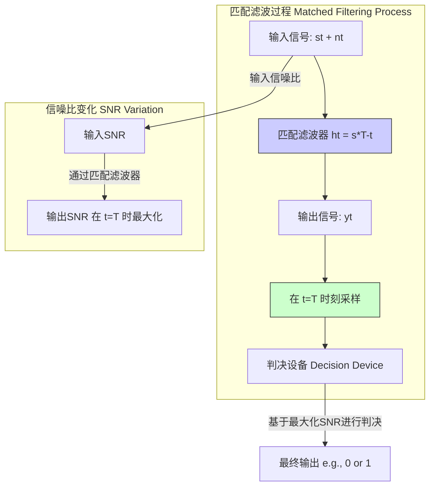
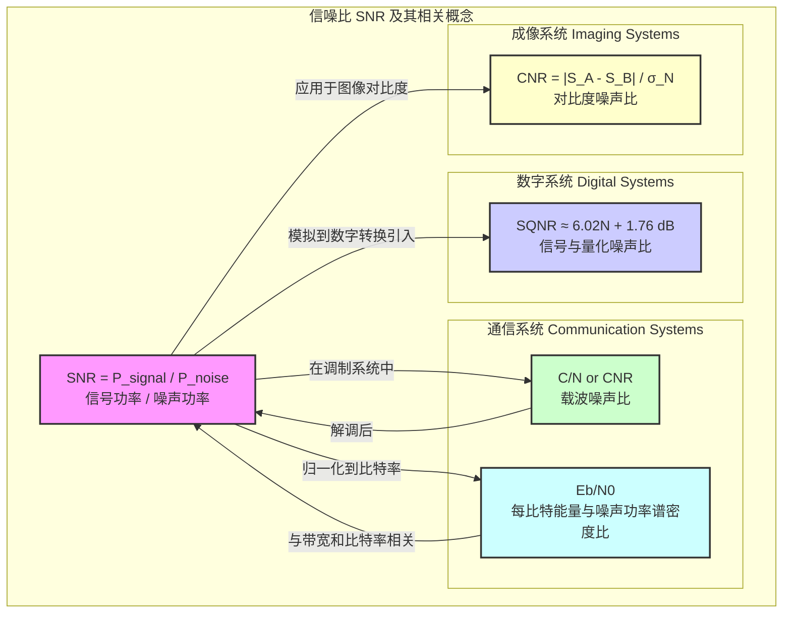

## 信噪比

信噪比（Signal-to-Noise Ratio, SNR 或 S/N）是一个科学和工程中的关键度量，用于比较所需信号的电平与背景噪声的电平。它量化了信号被噪声破坏的程度。一个较高的信噪比意味着噪声对信号的影响较小，从而可以获得更清晰的信号质量和更可靠的数据传输。

### 1. 核心概念与数学基础

从根本上说，信噪比是信号功率与噪声功率之比。

#### 1.1 基于功率的定义

最常见的信噪比定义是信号平均功率与噪声平均功率的比值。它是一个无量纲的纯数。

$$
\text{SNR} = \frac{P_{\text{signal}}}{P_{\text{noise}}}
$$

其中：
*   $P_{\text{signal}}$ 是信号的平均功率。
*   $P_{\text{noise}}$ 是噪声的平均功率。

由于信噪比的动态范围非常大，通常使用对数单位分贝（dB）来表示：

$$
\text{SNR}_{\text{dB}} = 10 \log_{10}\left(\frac{P_{\text{signal}}}{P_{\text{noise}}}\right)
$$

#### 1.2 基于幅度的定义

在许多应用中，直接测量功率可能不方便，但可以测量信号的幅度（例如电压或声压）。假设信号和噪声是在相同阻抗 $Z$ 下测量的，功率与幅度的平方成正比 ($P = V^2/Z$)。因此，信噪比可以表示为信号和噪声均方根（RMS）幅度的平方比：

$$
\text{SNR} = \frac{P_{\text{signal}}}{P_{\text{noise}}} = \frac{A_{\text{signal, rms}}^2 / Z}{A_{\text{noise, rms}}^2 / Z} = \left(\frac{A_{\text{signal, rms}}}{A_{\text{noise, rms}}}\right)^2
$$

其中：
*   $A_{\text{signal, rms}}$ 是信号的均方根幅度。
*   $A_{\text{noise, rms}}$ 是噪声的均方根幅度。

用分贝表示时，该定义变为：

$$
\text{SNR}_{\text{dB}} = 10 \log_{10}\left(\left(\frac{A_{\text{signal, rms}}}{A_{\text{noise, rms}}}\right)^2\right) = 20 \log_{10}\left(\frac{A_{\text{signal, rms}}}{A_{\text{noise, rms}}}\right)
$$

#### 1.3 随机过程的观点

在严格的数学框架下，信号 $s(t)$ 和噪声 $n(t)$ 通常被建模为随机过程。对于宽平稳（Wide-Sense Stationary, WSS）过程，平均功率是其自相关函数在零延迟时的值，即 $P_x = E[|x(t)|^2] = R_{xx}(0)$。

因此，信噪比可以更严谨地定义为：

$$
\text{SNR} = \frac{E[s(t)^2]}{E[n(t)^2]}
$$

假设噪声 $n(t)$ 是一个零均值过程（$E[n(t)]=0$），其功率 $E[n(t)^2]$ 等于其方差 $\sigma_n^2$。

$$
P_{\text{noise}} = \sigma_n^2
$$

对于加性高斯白噪声（Additive White Gaussian Noise, AWGN），噪声功率谱密度 $N_0$ 在所有频率上是恒定的。在带宽 $B$ 内的总噪声功率为：

$$
P_{\text{noise}} = N_0 \cdot B
$$

### 2. 关键技术规格

下表总结了与信噪比相关的关键技术参数。

| 参数 (Parameter) | 符号 (Symbol) | 典型值/范围 (Typical Value/Range) | 单位 (Unit) | 描述 (Description) |
| :--- | :---: | :--- | :---: | :--- |
| 信噪比 | SNR | > 1 | (无量纲) | 信号功率与噪声功率的线性比率。 |
| 分贝信噪比 | $\text{SNR}_{\text{dB}}$ | 10 dB 到 >120 dB | dB | 信噪比的对数表示，适用于宽动态范围。 |
| 信号功率 | $P_S$ | 依赖于应用 | W, mW, dBm | 承载信息的信号部分的平均功率。 |
| 噪声功率 | $P_N$ | 依赖于应用 | W, mW, dBm | 随机、不期望的能量的平均功率。 |
| 噪声功率谱密度 | $N_0$ | $10^{-21}$ 到 $10^{-18}$ | W/Hz | 单位带宽内的噪声功率，常用于AWGN信道。 |
| 带宽 | $B$ | Hz 到 GHz | Hz | 信号或系统所占用的频率范围。 |

### 3. 常见用例与性能指标

信噪比是评估各种系统性能的基础。

| 应用领域 (Application Area) | 典型所需SNR (dB) | 性能指标 (Performance Metric) | 注释 (Notes) |
| :--- | :---: | :--- | :--- |
| **数字通信** | 3 - 15 dB | 误码率 (Bit Error Rate, BER) | SNR直接影响解调后判决的准确性。对于BPSK调制，BER由 $Q(\sqrt{2E_b/N_0})$ 给出，其中 $E_b/N_0$ 是归一化的SNR。 |
| **高保真音频** | > 90 dB | 总谐波失真加噪声 (THD+N) | 高SNR确保了音频回放的清晰度和动态范围，使微弱的音乐细节能够被听到。 |
| **磁共振成像 (MRI)** | 20 - 40 dB | 对比度噪声比 (Contrast-to-Noise Ratio, CNR) | 更高的SNR可以提高图像分辨率，缩短扫描时间，或增强软组织对比度。 |
| **雷达系统** | 10 - 20 dB | 检测概率 ($P_d$) / 虚警概率 ($P_{fa}$) | 雷达方程表明，接收信号功率与距离的四次方成反比，因此SNR是决定最大探测距离的关键因素。 |
| **射电天文学** | 3 - 5 (线性) | 探测显著性 (σ) | 天文学中，一个5σ的探测（SNR≈5）通常被认为是“发现”的黄金标准，对应于极低的偶然性。 |

### 4. 实现考量

在实际应用中，信噪比需要通过测量或估计算法来确定。

#### 4.1 信号与噪声的分离
测量SNR的核心挑战在于将接收到的总信号 $y(t) = s(t) + n(t)$ 分解为信号分量 $s(t)$ 和噪声分量 $n(t)$。

*   **时域方法**: 如果可以找到一个只有噪声存在的时段（例如，通信中的静默期），则可以直接测量噪声功率 $P_N$。然后测量信号加噪声的总功率 $P_{total}$，信号功率可以通过 $P_S = P_{total} - P_N$ 计算得出。
*   **频域方法**: 使用快速傅里叶变换（FFT）将信号转换到频域。如果信号和噪声占据不同的频带，可以分别在各自的频带内积分计算功率。
    *   **算法复杂度**: 对于长度为 $N$ 的信号，基于FFT的功率谱估计算法的复杂度为 $O(N \log N)$。

#### 4.2 匹配滤波器
为了在检测前最大化SNR，通常使用匹配滤波器。对于一个已知信号 $s(t)$，在加性白噪声背景下，匹配滤波器的冲激响应 $h(t)$ 被设计为信号的时间反转和共轭。

$$
h(t) = k \cdot s^*(T-t)
$$

其中 $k$ 是一个任意常数，$T$ 是信号的持续时间。通过匹配滤波器后，在采样时刻 $t=T$ 达到的最大信噪比为：

$$
\text{SNR}_{\text{max}} = \frac{2E_s}{N_0}
$$

其中 $E_s$ 是信号的总能量 ($E_s = \int_0^T |s(t)|^2 dt$)，$N_0$ 是噪声的单边功率谱密度。

### 5. 性能特征与统计度量

由于噪声的随机性，任何对SNR的单次测量本身都是一个随机变量，具有其自身的统计分布。

*   **分布**: 如果噪声是高斯的，那么噪声功率的估计值（基于样本方差）服从卡方（$\chi^2$）分布。因此，SNR的估计值（作为两个功率估计的比值）将服从F分布。
*   **置信区间**: 基于F分布，可以为SNR的测量值计算置信区间。一个95%的置信区间意味着我们有95%的信心认为真实的SNR值落在这个区间内。对于大样本量（根据中心极限定理），功率估计的分布趋于正态分布，这简化了置信区间的计算。
*   **罗斯准则 (Rose Criterion)**: 在图像科学中，这是一个经验法则，指出为了人眼能够可靠地分辨一个图像特征，其信噪比必须至少为5。这为图像质量设定了一个感官上的阈值。

### 6. 相关技术与比较模型

SNR与其他几个关键性能指标密切相关。

#### 6.1 信号与量化噪声比 (SQNR)
在数字系统中，模数转换器（ADC）会引入量化误差，这可以被建模为一种噪声，即量化噪声。SQNR衡量的是信号功率与量化噪声功率之比。对于一个理想的N位ADC和一个满量程正弦波输入，SQNR可以近似为：
$$
\text{SQNR}_{\text{dB}} \approx 6.02N + 1.76 \text{ (dB)}
$$
这个公式表明，每增加一个比特的量化深度，SQNR大约提高6 dB。

#### 6.2 载波噪声比 (C/N or CNR)
在卫星和无线通信中，C/N是调制载波的功率与预检波滤波器带宽内的噪声功率之比。它与解调后的基带信号SNR直接相关，但关系取决于调制方案。
$$
\text{SNR} = \frac{C}{N} \cdot f(\text{modulation}, \text{demodulation})
$$
其中 $f(...)$ 是一个依赖于调制和解调过程的因子。

#### 6.3 每比特能量与噪声功率谱密度比 ($E_b/N_0$)
这是数字通信理论中的一个核心归一化参数。它直接决定了在给定调制方式下的理论最低误码率。它与系统SNR的关系如下：
$$
\frac{E_b}{N_0} = \frac{P_S / R_b}{P_N / B} = \frac{P_S}{P_N} \cdot \frac{B}{R_b} = \text{SNR} \cdot \frac{B}{R_b}
$$
其中：
*   $E_b$ 是每比特的能量。
*   $R_b$ 是比特率（bits per second）。
*   $B$ 是信道带宽。

#### 6.4 对比度噪声比 (CNR)
在医学成像（如MRI、CT）中，CNR比SNR更能描述区分两个相邻组织的能力。
$$
\text{CNR} = \frac{|S_A - S_B|}{\sigma_N}
$$
其中 $S_A$ 和 $S_B$ 是两个感兴趣区域的平均信号强度，$\sigma_N$ 是背景噪声的标准差。高CNR意味着图像对比度明显，易于诊断。

### 7. 参考文献

*   Shannon, C. E. (1948). A Mathematical Theory of Communication. *Bell System Technical Journal*, 27(3), 379-423. DOI: [10.1002/j.1538-7305.1948.tb01338.x](https://doi.org/10.1002/j.1538-7305.1948.tb01338.x)
*   Proakis, J. G., & Salehi, M. (2008). *Digital Communications* (5th ed.). McGraw-Hill. (This textbook provides extensive coverage of SNR, Eb/N0, and their impact on system performance).
*   Edelstein, W. A., Glover, G. H., Hardy, C. J., & Redington, R. W. (1986). The intrinsic signal-to-noise ratio in NMR imaging. *Magnetic Resonance in Medicine*, 3(4), 604-618. DOI: [10.1002/mrm.1910030413](https://doi.org/10.1002/mrm.1910030413)
*   Rose, A. (1948). The sensitivity performance of the human eye on an absolute scale. *Journal of the Optical Society of America*, 38(2), 196-208. DOI: [10.1364/JOSA.38.000196](https://doi.org/10.1364/JOSA.38.000196)