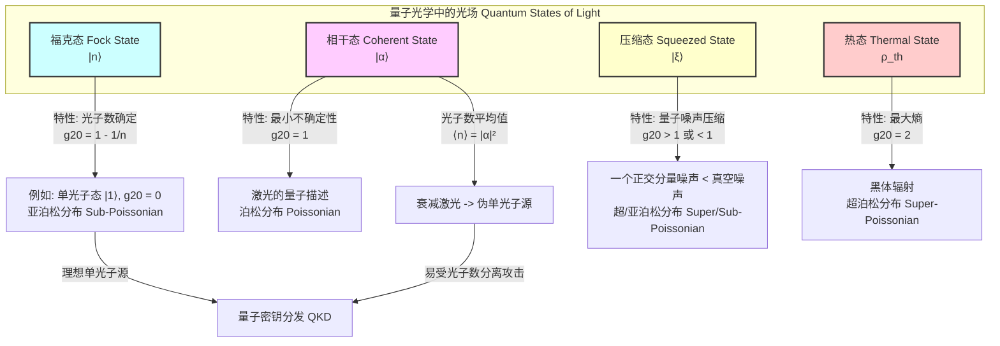

## 单光子

本文档旨在提供关于“单光子”的全面技术性描述，重点关注其科学原理和数学严谨性。单光子是电磁场能量的最小、不可分割的量子化单元，是量子光学、量子信息处理和量子计量学等领域的核心。

### 核心概念与数学基础

在量子力学框架下，光子是电磁场的激发量子。与经典电磁波不同，单光子代表了能量的离散单元。

#### 电磁场的量子化

经典电磁场可以由矢量势 $\vec{A}(\vec{r}, t)$ 描述。在量子场论中，这个场被提升为算符 $\hat{\vec{A}}(\vec{r}, t)$。对于一个特定模式（由波矢 $\vec{k}$ 和偏振 $\lambda$ 定义）的电磁场，可以引入湮灭算符 $\hat{a}_{\vec{k},\lambda}$ 和创生算符 $\hat{a}_{\vec{k},\lambda}^\dagger$。

这些算符遵循玻色子对易关系：
$$ [\hat{a}_{\vec{k},\lambda}, \hat{a}_{\vec{k}',\lambda'}^\dagger] = \delta_{\vec{k},\vec{k}'} \delta_{\lambda,\lambda'} $$
$$ [\hat{a}_{\vec{k},\lambda}, \hat{a}_{\vec{k}',\lambda'}] = [\hat{a}_{\vec{k},\lambda}^\dagger, \hat{a}_{\vec{k}',\lambda'}^\dagger] = 0 $$
其中：
*   $[\hat{A}, \hat{B}] = \hat{A}\hat{B} - \hat{B}\hat{A}$ 是对易子。
*   $\delta_{i,j}$ 是克罗内克函数（Kronecker delta）。

光子数算符 $\hat{n}_{\vec{k},\lambda}$ 定义为：
$$ \hat{n}_{\vec{k},\lambda} = \hat{a}_{\vec{k},\lambda}^\dagger \hat{a}_{\vec{k},\lambda} $$
该算符的本征态是光子数态，也称为福克态（Fock state），记作 $|n_{\vec{k},\lambda}\rangle$。其本征值方程为：
$$ \hat{n}_{\vec{k},\lambda} |n_{\vec{k},\lambda}\rangle = n_{\vec{k},\lambda} |n_{\vec{k},\lambda}\rangle $$
其中 $n_{\vec{k},\lambda}$ 是一个非负整数，表示该模式下的光子数量。

**单光子态**是福克态中 $n=1$ 的情况，记作 $|1\rangle$。它描述了一个确切包含一个能量量子的电磁场模式。
$$ |1\rangle = \hat{a}^\dagger |0\rangle $$
这里 $|0\rangle$ 是真空态，表示没有任何光子存在的状态。

#### 能量与动量

一个频率为 $\nu$（角频率为 $\omega = 2\pi\nu$）的单光子所携带的能量 $E$ 为：
$$ E = h\nu = \hbar\omega $$
其中：
*   $h \approx 6.626 \times 10^{-34} \text{ J}\cdot\text{s}$ 是普朗克常数。
*   $\hbar = h/2\pi$ 是约化普朗克常数。

该光子的动量大小 $p$ 与其波长 $\lambda$（波数 $k = 2\pi/\lambda$）相关：
$$ p = \frac{h}{\lambda} = \hbar k $$
能量和动量通过相对论关系 $E=pc$ 联系起来，其中 $c$ 是真空中的光速。

### 关键技术规格

光子作为基本粒子，其内禀属性是恒定的。然而，其运动学属性（如能量）取决于其状态。

| 属性 (Property) | 符号 (Symbol) | 值/关系式 (Value/Relation) | 单位 (Unit) |
| :--- | :--- | :--- | :--- |
| 静止质量 (Rest Mass) | $m_0$ | $< 1 \times 10^{-18} \text{ eV}/c^2$ (实验上限) | eV/$c^2$ |
| 电荷 (Electric Charge) | $q$ | $0$ (理论值) | C (库仑) |
| 自旋 (Spin) | $s$ | $1$ | $\hbar$ |
| 真空中速度 (Speed in Vacuum) | $c$ | $299,792,458$ (定义值) | m/s |
| 能量 (Energy) | $E$ | $E = h\nu$ | J (焦耳), eV (电子伏) |
| 动量 (Momentum) | $p$ | $p = h/\lambda$ | kg·m/s |
| 角频率 (Angular Frequency) | $\omega$ | $\omega = E/\hbar$ | rad/s |
| 波长 (Wavelength) | $\lambda$ | $\lambda = hc/E$ | m (米), nm (纳米) |

### 典型应用场景

单光子技术是多种前沿量子技术的基石。

*   **量子密钥分发 (Quantum Key Distribution, QKD)**
    *   **描述**: 利用单光子传输密钥信息。由于任何窃听行为都会不可避免地干扰光子的量子态（根据量子不可克隆定理），从而被合法通信方发现。
    *   **协议**: BB84, E91
    *   **性能指标**:
        *   **安全密钥率 (Secure Key Rate, SKR)**: > 1 Mbit/s (短距离光纤)
        *   **量子比特错误率 (Quantum Bit Error Rate, QBER)**: 通常要求 < 3-5% 才能生成安全密钥。
        *   **传输距离**: > 1000 km (通过卫星中继)

*   **线性光学量子计算 (Linear Optical Quantum Computing, LOQC)**
    *   **描述**: 使用光子作为量子比特（qubit）。单光子态 $|1\rangle$ 和真空态 $|0\rangle$ 可以编码一个qubit。量子门操作通过分束器、移相器和单光子探测器实现。
    *   **性能指标**:
        *   **量子门保真度 (Gate Fidelity)**: > 99% (对于两比特门)
        *   **光子不可区分性 (Photon Indistinguishability)**: > 99% (通过HOM干涉测量)

*   **量子计量与传感 (Quantum Metrology & Sensing)**
    *   **描述**: 利用单光子或N光子态的量子特性（如量子纠缠）来超越经典测量方法的精度极限（标准量子极限, SQL）。
    *   **应用**: 亚散粒噪声成像 (sub-shot-noise imaging)。
    *   **性能指标**:
        *   **信噪比 (Signal-to-Noise Ratio, SNR) 增强**: 理论上可达 $\sqrt{N}$ 倍的增强（使用N光子纠缠态，相对于经典方法）。

*   **基础物理学检验 (Foundational Physics Tests)**
    *   **描述**: 利用纠缠光子对来检验量子力学的基本假设，如贝尔不等式。
    *   **性能指标**:
        *   **贝尔参数 (Bell Parameter, S)**: 经典理论预言 $S \le 2$，而量子力学预言最大值为 $2\sqrt{2}$。实验结果通常以超过经典极限的标准差数来表示，例如 $> 10\sigma$。

### 实现方案考量

产生和探测单个光子是具有挑战性的技术任务。

#### 单光子源 (Single-Photon Sources)

理想的单光子源应按需、确定性地产生具有高纯度和高不可区分性的单光子。

*   **自发参量下转换 (Spontaneous Parametric Down-Conversion, SPDC)**:
    *   **原理**: 高频泵浦光子在非线性晶体（如BBO, PPLN）中自发分裂成一个信号光子和一个闲置光子对。探测其中一个光子（闲置光子）可以预报另一个光子（信号光子）的存在。
    *   **特点**: 概率性产生，但技术成熟，易于实现。输出光子数遵循热分布，需要预报机制来近似单光子。

*   **量子点 (Quantum Dots, QDs)**:
    *   **原理**: 半导体纳米晶体，其电子能级是分立的。通过光学或电学方式激发一个激子，其复合时会辐射一个单光子。
    *   **特点**: 可实现高纯度和高效率的按需发射，接近确定性单光子源。但不同量子点之间的同质性以及与环境的耦合是挑战。

*   **金刚石氮-空位色心 (Nitrogen-Vacancy Centers in Diamond)**:
    *   **原理**: 金刚石晶格中的一个氮原子取代碳原子，并在邻近位置有一个空位，形成一个原子级的缺陷。该缺陷具有稳定的、可光学操控的能级，可用于发射单光子。
    *   **特点**: 在室温下即可工作，具有极长的自旋相干时间，但光子收集效率通常较低。

*   **衰减激光 (Attenuated Laser)**:
    *   **原理**: 将相干态的激光束通过高倍率衰减器，使其平均光子数 $\langle n \rangle \ll 1$。
    *   **特点**: 实现简单，但本质上是伪单光子源。其光子数遵循泊松分布，存在发射多个光子的非零概率，这在QKD等应用中构成安全漏洞（如光子数分离攻击）。

#### 单光子探测器 (Single-Photon Detectors)

*   **单光子雪崩二极管 (Single-Photon Avalanche Diode, SPAD)**:
    *   **原理**: 在反向偏置电压高于击穿电压的模式下工作的雪崩光电二极管。单个光子吸收后产生的载流子足以触发宏观的雪崩电流。
    *   **特点**: 体积小、成本较低，但存在暗计数、后脉冲和时间抖动等问题。

*   **超导纳米线单光子探测器 (Superconducting Nanowire Single-Photon Detector, SNSPD)**:
    *   **原理**: 在低温（~1-4 K）下，一根超导纳米线被偏置在略低于其临界电流的位置。当一个光子被吸收，会在纳米线上形成一个局部热点（正常态区域），导致电阻突然出现，从而产生可测量的电压脉冲。
    *   **特点**: 极高的探测效率（>98%），极低的暗计数率（<1 Hz），极低的时间抖动（<10 ps），但需要低温制冷系统。

### 性能特征与统计测量

表征单光子源的关键指标是其光子统计特性。

#### 纯度 (Purity) - 二阶相干函数

单光子源的纯度通过测量其二阶相干函数 $g^{(2)}(\tau)$ 来量化。它描述了在时间 $t$ 和 $t+\tau$ 探测到光子的条件概率。
$$ g^{(2)}(\tau) = \frac{\langle \hat{I}(t) \hat{I}(t+\tau) \rangle}{\langle \hat{I}(t) \rangle^2} = \frac{\langle \hat{a}^\dagger(t) \hat{a}^\dagger(t+\tau) \hat{a}(t+\tau) \hat{a}(t) \rangle}{\langle \hat{a}^\dagger(t) \hat{a}(t) \rangle^2} $$
其中 $\hat{I}(t)$ 是光强算符。

对于时间零延迟（$\tau=0$），$g^{(2)}(0)$ 表征了同时探测到两个或更多光子的概率。
*   **理想单光子源**: 一次只发射一个光子，因此 $g^{(2)}(0) = 0$。
*   **相干态 (激光)**: 光子随机到达，遵循泊松分布，$g^{(2)}(0) = 1$。
*   **热态 (混乱光)**: 光子倾向于成团到达，$g^{(2)}(0) = 2$。

实验上，一个源被认为是高质量的单光子源，如果其测得的 $g^{(2)}(0) < 0.5$。

#### 不可区分性 (Indistinguishability) - HOM 干涉

不可区分性是指由一个源在不同时间发射的两个光子，或者由两个独立源发射的光子，在所有自由度（频率、偏振、时空模式）上完全相同的程度。它通过**宏-欧-曼德尔 (Hong-Ou-Mandel, HOM) 干涉**来测量。

当两个完全不可区分的光子同时到达一个50:50分束器的两个输入端口时，由于量子干涉，它们总会从同一个输出端口离开（聚束效应）。因此，在两个输出端口进行符合计数测量的结果将为零。
HOM干涉的可见度 $V$ 定义为：
$$ V = \frac{C_{dist} - C_{indist}}{C_{dist}} $$
其中 $C_{dist}$ 是光子可区分时的符合计数（例如，有大的时间延迟），$C_{indist}$ 是光子不可区分时的符合计数（零时间延迟）。
*   **理想情况**: $V=1$ (100% 不可区分)。
*   **实验**: 高质量源的 $V > 0.95$。

### 相关技术对比

单光子态（福克态）是众多量子态中的一种。理解其与其他光场状态的对比至关重要。

#### 单光子态 vs. 相干态

**相干态** $|\alpha\rangle$ 是激光的量子描述，其光子数分布是泊松分布：
$$ |\alpha\rangle = e^{-|\alpha|^2/2} \sum_{n=0}^{\infty} \frac{\alpha^n}{\sqrt{n!}} |n\rangle $$
其光子数概率为 $P(n) = e^{-\bar{n}} \frac{\bar{n}^n}{n!}$，其中平均光子数 $\bar{n} = |\alpha|^2$。
对于衰减激光（$\bar{n} \ll 1$），虽然 $P(1) \approx \bar{n}$ 是最大的，但仍存在 $P(n>1) \approx \bar{n}^2/2$ 的概率，这为窃听者提供了可乘之机。而单光子态 $|1\rangle$ 的光子数分布是 $P(n) = \delta_{n,1}$，从根本上杜绝了多光子事件。

#### 单光子态 vs. 压缩态

**压缩态** $|\xi\rangle$ 的特点是其中一个正交分量（如振幅或相位）的量子噪声被压缩到低于真空噪声的水平，代价是另一个正交分量的噪声增加，但仍满足海森堡不确定性原理。单光子态 $|1\rangle$ 具有确定的光子数（能量），因此其振幅噪声为零，但其相位是完全不确定的。

## 参考文献

1.  Eisaman, M. D., Fan, J., Migdall, A., & Polyakov, S. V. (2011). Invited Review Article: Single-photon sources and detectors. *Review of Scientific Instruments*, 82(7), 071101. DOI: [10.1063/1.3610677](https://doi.org/10.1063/1.3610677)
2.  Hong, C. K., Ou, Z. Y., & Mandel, L. (1987). Measurement of subpicosecond time intervals between two photons by interference. *Physical Review Letters*, 59(18), 2044–2046. DOI: [10.1103/PhysRevLett.59.2044](https://doi.org/10.1103/PhysRevLett.59.2044)
3.  Bennett, C. H., & Brassard, G. (1984). Quantum cryptography: Public key distribution and coin tossing. In *Proceedings of IEEE International Conference on Computers, Systems and Signal Processing* (pp. 175-179).
4.  Natarajan, C. M., Tanner, M. G., & Hadfield, R. H. (2012). Superconducting nanowire single-photon detectors: physics and applications. *Superconductor Science and Technology*, 25(6), 063001. DOI: [10.1088/0953-2048/25/6/063001](https://doi.org/10.1088/0953-2048/25/6/063001)