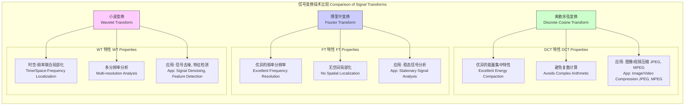

## 空间频率

空间频率（Spatial Frequency）是信号处理、光学和成像科学中的一个基本概念。它衡量的是空间信号（如图像）中亮度或结构变化的周期性速率。类似于时间频率描述信号随时间的变化快慢，空间频率描述的是信号在空间维度上的变化快慢。低空间频率对应于图像中大范围、平缓变化的区域（如天空、墙壁），而高空间频率则对应于图像中快速变化的细节、边缘和纹理。

### 核心概念与数学基础

从数学上讲，任何复杂的空间信号都可以被看作是不同频率、振幅、和相位的正弦波（或余弦波）的叠加。将信号分解为其组成频率分量的过程由傅里叶分析（Fourier Analysis）实现。

#### 一维傅里叶变换

对于一维空间信号 $f(x)$，其傅里叶变换 $F(u)$ 定义为：

$$
F(u) = \int_{-\infty}^{\infty} f(x) e^{-i 2\pi u x} dx
$$

其中：
*   $f(x)$ 是空间域中的信号函数，其中 $x$ 代表空间位置。
*   $F(u)$ 是频率域中的信号表示，也称为频谱。
*   $u$ 是空间频率，单位通常是 **周期/单位长度** (例如，周期/米, cycles/m)。
*   $i$ 是虚数单位，即 $i^2 = -1$。
*   $e^{-i 2\pi u x}$ 是欧拉公式 $e^{i\theta} = \cos(\theta) + i\sin(\theta)$ 的一部分，代表一个复指数，是构成信号的基本“正弦波”基函数。

相应的逆傅里叶变换可以将频谱 $F(u)$ 转换回空间域信号 $f(x)$：

$$
f(x) = \int_{-\infty}^{\infty} F(u) e^{i 2\pi u x} du
$$

#### 二维傅里叶变换

对于二维信号，如图像 $f(x, y)$，二维傅里叶变换是其自然延伸：

$$
F(u, v) = \int_{-\infty}^{\infty} \int_{-\infty}^{\infty} f(x, y) e^{-i 2\pi (ux + vy)} dx dy
$$

其中：
*   $f(x, y)$ 是二维空间域信号（图像），$x$ 和 $y$ 是空间坐标。
*   $F(u, v)$ 是二维频谱。
*   $u$ 和 $v$ 分别是沿 $x$ 和 $y$ 方向的空间频率。
*   频谱的原点 $(u, v) = (0, 0)$ 对应于图像的直流（DC）分量，即图像的平均亮度。离原点越远的点，对应的空间频率越高。

逆二维傅里叶变换为：

$$
f(x, y) = \int_{-\infty}^{\infty} \int_{-\infty}^{\infty} F(u, v) e^{i 2\pi (ux + vy)} du dv
$$

频谱 $F(u, v)$ 是一个复数函数，可以表示为幅度和相位的形式：
*   **幅度谱 (Amplitude Spectrum)**: $|F(u, v)|$，表示相应频率分量的强度或“能量”。
*   **相位谱 (Phase Spectrum)**: $\angle F(u, v)$，表示相应频率分量的空间位移。

在图像处理中，幅度谱决定了哪些频率成分存在，而相位谱决定了这些成分如何组合以形成最终的结构。

```mermaid
graph TD
    subgraph "空间域 Spatial Domain"
        A["图像 fx, y<br>Image fx, y"]
        B["卷积操作<br>Convolution<br>fx,y * hx,y["
    end

    subgraph "频率域 Frequency Domain"
        C["频谱 Fu, v<br>Spectrum Fu, v"]
        D["乘法操作<br>Multiplication<br>Fu,v · Hu,v["
        E["低频分量<br>Low Frequencies<br>中心区域<br>Central Region"] --> F["图像的平滑区域/大致轮廓<br>Smooth Areas / Coarse Structure"]
        G["高频分量<br>High Frequencies<br>边缘区域<br>Outer Region"] --> H["图像的边缘/细节/噪声<br>Edges / Details / Noise"]
    end

    A -- "傅里叶变换 Fourier Transform" --> C
    C -- "逆傅里叶变换 Inverse FT" --> A
    B -- "傅里叶变换 Convolution Theorem" --> D
    D -- "逆傅里叶变换 Inverse FT" --> B

    C --> E
    C --> G

    style A fill:#lightblue,stroke:#333
    style C fill:#lightgreen,stroke:#333
```

### 关键技术规格

空间频率及其相关参数的测量是定量分析和系统设计的核心。

| 参数 (Parameter) | 符号 (Symbol) | 定义 (Definition) | 常用单位 (Common Units) |
| :--- | :--- | :--- | :--- |
| **空间频率** | $u, v, f$ | 单位距离内的周期数。 | 周期/毫米 (cycles/mm), 线对/毫米 (lp/mm), 周期/米 (cycles/m) |
| **角空间频率** | $k_x, k_y$ | $k = 2\pi f$，单位距离内的弧度数。 | 弧度/米 (rad/m), 弧度/毫米 (rad/mm) |
| **采样频率** | $f_s$ | 单位距离内的样本数。 | 样本/毫米 (samples/mm), 点/英寸 (DPI) |
| **奈奎斯特频率** | $f_{Nyquist}$ | $f_{Nyquist} = f_s / 2$。为避免混叠，信号中的最高频率必须小于奈奎斯特频率。 | 与空间频率单位相同 |
| **调制传递函数** | MTF | 成像系统在不同空间频率下传递对比度的能力。 | 无量纲 (0 到 1) |

**典型值范围:**
*   **人眼视觉系统**: 在最佳照明条件下，对 3-5 cycles/degree (视角单位) 的频率最敏感，分辨率极限约为 60 cycles/degree。
*   **医学影像 (MRI/CT)**: 诊断级图像的空间分辨率通常在 0.5 lp/mm 到 2.0 lp/mm 之间。
*   **数码相机传感器**: 像素间距决定了奈奎斯特频率。例如，一个 5μm 像素间距的传感器，其奈奎斯特频率为 $1 / (2 \times 5 \times 10^{-3} \text{mm}) = 100$ lp/mm。
*   **卫星遥感**: 高分辨率卫星（如 WorldView-3）的全色波段地面采样距离 (GSD) 约为 0.31米，对应的奈奎斯特频率为 $1 / (2 \times 0.31\text{m}) \approx 1.6$ cycles/m。

### 常见用例

空间频率分析在众多科学和工程领域中都有着广泛的应用。

*   **图像滤波**:
    *   **低通滤波 (Low-pass Filtering)**: 在频率域中，通过一个滤除高频分量的滤波器 $H(u,v)$ 与图像频谱 $F(u,v)$ 相乘，可以实现图像平滑和降噪。高斯低通滤波器是一种常用选择。
    *   **高通滤波 (High-pass Filtering)**: 通过滤除低频分量，可以增强图像的边缘和细节，实现图像锐化。
    *   **性能指标**: 滤波后图像的信噪比 (Signal-to-Noise Ratio, SNR) 提升可作为定量指标。例如，对于高斯白噪声，理想低通滤波可以将带外噪声完全抑制。

*   **图像压缩 (JPEG)**:
    *   JPEG 压缩标准利用了离散余弦变换 (DCT)，一种与傅里叶变换密切相关的变换。
    *   图像被分成 8x8 的像素块，并对每个块进行 DCT。
    *   变换后的系数（代表不同空间频率的幅度）被量化。人眼对高频分量的不敏感性被利用，因此高频系数会进行更粗糙的量化（即用更少的比特表示），从而实现高压缩率。
    *   **性能指标**: 压缩比 (Compression Ratio)，通常在 10:1 到 20:1 范围内可以获得可接受的图像质量。峰值信噪比 (Peak Signal-to-Noise Ratio, PSNR) 用于衡量压缩后的图像质量，通常高于 30 dB 被认为是高质量。

*   **医学成像 (MRI)**:
    *   磁共振成像 (MRI) 的原始数据是在一个被称为 **k空间** 的域中采集的，k空间本质上就是图像的二维空间频率域。
    *   采集过程通过改变梯度磁场来系统性地填充 k 空间的不同位置 $(k_x, k_y)$。
    *   图像重建过程就是对采集到的 k 空间数据执行二维逆傅里叶变换。
    *   **性能指标**: 空间分辨率直接取决于 k 空间采样的最大范围 ($k_{max}$)。更高的 $k_{max}$ 值意味着能够解析更精细的细节（更高的空间频率），但通常需要更长的扫描时间。

### 实现考量

在计算机上处理空间频率通常涉及离散傅里叶变换 (DFT)。

#### 离散傅里叶变换 (DFT)

对于一个大小为 $M \times N$ 的数字图像 $f(x, y)$，其二维 DFT 定义为：

$$
F(u, v) = \sum_{x=0}^{M-1} \sum_{y=0}^{N-1} f(x, y) e^{-i 2\pi (\frac{ux}{M} + \frac{vy}{N})}
$$

其中 $u=0, 1, ..., M-1$ 且 $v=0, 1, ..., N-1$。

#### 算法复杂度分析

*   **直接计算 DFT**: 直接根据定义计算二维 DFT 需要 $M \times N$ 个输出点，每个点需要 $M \times N$ 次复数乘法和加法。因此，总的计算复杂度为 $O(M^2 N^2)$。对于一个 $512 \times 512$ 的图像，这将是计算密集型的。
*   **快速傅里叶变换 (FFT)**: FFT 是一种高效计算 DFT 的算法。它通过分治策略将计算复杂度显著降低。对于一维信号，FFT 的复杂度为 $O(K \log K)$，其中 $K$ 是信号长度。对于 $M \times N$ 的二维图像，可以通过先对每一行进行 FFT，然后对结果的每一列进行 FFT 来实现。总复杂度为 $O(MN (\log M + \log N))$ 或简写为 $O(MN \log(MN))$。这使得在个人计算机上对大尺寸图像进行傅里叶分析成为可能。

### 性能特征

*   **功率谱密度 (Power Spectral Density, PSD)**:
    PSD 描述了信号的功率如何随频率分布。对于二维图像，PSD 定义为傅里叶变换幅度的平方，通常会进行归一化：
    $$
    P(u, v) = \frac{|F(u, v)|^2}{MN}
    $$
    PSD 是一个实值函数，它丢弃了相位信息，但对于分析图像的纹理、方向性或周期性结构非常有用。例如，一个具有强烈垂直条纹的图像，其 PSD 会在水平频率轴上显示出能量集中。

*   **调制传递函数 (Modulation Transfer Function, MTF)**:
    MTF 是评估光学或成像系统性能的关键指标。它量化了系统将物体的对比度传递到图像中的能力，是空间频率的函数。
    $$
    \text{MTF}(u, v) = \frac{C_{\text{image}}(u, v)}{C_{\text{object}}(u, v)}
    $$
    其中 $C$ 是对比度，定义为 $(I_{max} - I_{min}) / (I_{max} + I_{min})$。MTF 值通常从低频处的 1（完美传递）下降到系统截止频率处的 0。MTF 曲线下的面积可以作为系统综合性能的单一指标。一个系统的 MTF 在 50% 处的空间频率（MTF50）常被用作分辨率的有效度量。

### 相关技术

空间频率分析的核心是傅里叶变换，但其他变换在特定应用中提供了独特的优势。



#### 数学模型比较

*   **傅里叶变换 (Fourier Transform)**:
    *   **模型**: 如前所述，使用复指数 $e^{-i 2\pi u x}$ 作为基函数。
    *   **特点**: 基函数在整个空间域上都有支撑，因此提供了完美的频率分辨率，但完全没有空间局部化信息。一个单一的频率分量 $F(u)$ 对应于遍布整个信号 $f(x)$ 的正弦波。

*   **离散余弦变换 (Discrete Cosine Transform, DCT)**:
    *   **模型 (DCT-II)**:
        $$
        X_k = \sum_{n=0}^{N-1} x_n \cos\left[\frac{\pi}{N}\left(n+\frac{1}{2}\right)k\right]
        $$
    *   **特点**: DCT 只使用余弦函数作为基函数。对于具有强相关性的典型图像信号，DCT 具有非常好的“能量集中”特性，意味着大部分信号能量集中在少数几个低频 DCT 系数中。这是其在 JPEG 压缩中取得成功的关键。

*   **小波变换 (Wavelet Transform)**:
    *   **模型 (连续)**:
        $$
        W(a, b) = \int_{-\infty}^{\infty} f(t) \frac{1}{\sqrt{a}} \psi^*\left(\frac{t-b}{a}\right) dt
        $$
    *   **特点**: 小波变换使用一组由单一“母小波” $\psi(t)$ 经过缩放（由 $a$ 控制）和位移（由 $b$ 控制）产生的基函数。这使得小波变换能够同时提供空间和频率的局部化信息。高频（小 $a$）分析具有精细的空间分辨率，而低频（大 $a$）分析具有精细的频率分辨率，这被称为多分辨率分析。它在分析非平稳信号（如包含瞬时尖峰或中断的信号）方面优于傅里叶变换。

### 参考文献
1.  Cooley, J. W., & Tukey, J. W. (1965). An algorithm for the machine calculation of complex Fourier series. *Mathematics of Computation*, 19(90), 297-301. DOI: [10.1090/S0025-5718-1965-0178551-1](https://doi.org/10.1090/S0025-5718-1965-0178551-1)
2.  Lauterbur, P. C. (1973). Image formation by induced local interactions: examples employing nuclear magnetic resonance. *Nature*, 242(5394), 190-191. DOI: [10.1038/242190a0](https://doi.org/10.1038/242190a0)
3.  De Valois, R. L., & De Valois, K. K. (1988). Spatial vision. *Annual Review of Psychology*, 39(1), 419-457. DOI: [10.1146/annurev.ps.39.020188.002223](https://doi.org/10.1146/annurev.ps.39.020188.002223)
4.  Goodman, J. W. (2005). *Introduction to Fourier optics* (3rd ed.). Roberts and Company Publishers. (本书是傅里叶光学领域的权威教科书).
5.  Wallace, G. K. (1991). The JPEG still picture compression standard. *Communications of the ACM*, 34(4), 30-44. DOI: [10.1145/103085.103089](https://doi.org/10.1145/103085.103089)