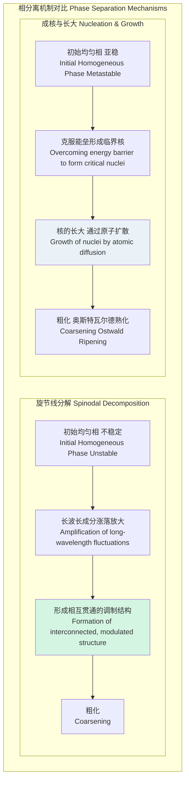

## 类旋节线分解 (spinodal like decomposition)

类旋节线分解是一种相变机制，描述了热力学上不稳定的均相体系如何自发地分离成两个或多个具有不同成分或序参量的共存相。与通过成核和长大（nucleation and growth）进行的相变不同，旋节线分解不需要克服能量势垒来形成新相的临界核。相反，它是由成分的微小、长波长涨落的连续放大驱动的，导致形成具有特征性、相互贯通的微观结构。术语“类旋节线”（spinodal-like）通常用于描述那些在形态学或动力学上类似于经典旋节线分解，但可能发生在更复杂系统（如受外场影响的材料、具有长程相互作用的系统或生物系统）中的过程。

### 核心概念与数学基础

#### 1. 热力学驱动力：吉布斯自由能

对于一个二元混合物（组分为A和B），其混合吉布斯自由能（Gibbs free energy）$G$ 是成分（通常用组分B的摩尔分数 $c$ 表示）和温度 $T$ 的函数。体系的稳定性由自由能曲线对成分的二阶导数 $\frac{\partial^2 G}{\partial c^2}$ 决定。

- **稳定区 (Stable Region)**: $\frac{\partial^2 G}{\partial c^2} > 0$。任何成分涨落都会增加体系的自由能，因此体系是稳定的。
- **亚稳区 (Metastable Region)**: $\frac{\partial^2 G}{\partial c^2} > 0$。体系对微小涨落是稳定的，但对超过临界尺寸的大涨落不稳定，会通过成核和长大机制发生相变。
- **不稳定区 (Unstable Region)**: $\frac{\partial^2 G}{\partial c^2} < 0$。任何微小的成分涨落都会降低体系的自由能，导致自发的相分离。这个区域被称为旋节线区域。

相图中的**双节线 (binodal curve)** 定义了共存相的平衡成分，满足共同切线准则。**旋节线 (spinodal curve)** 定义了不稳定区的边界，其数学条件为：

$$
\frac{\partial^2 G(c, T)}{\partial c^2} = 0
$$

其中：
- $G(c, T)$ 是单位体积的吉布斯自由能。
- $c$ 是成分（或序参量）。
- $T$ 是绝对温度。

```mermaid
graph TD
    subgraph "自由能与相图 Free Energy & Phase Diagram"
        A["自由能-成分曲线<br>G-c Curve"] --> B["二阶导数<br>Second Derivative ∂²G/∂c²[";
        B -- "> 0" --> C["稳定/亚稳区<br>Stable/Metastable"];
        B -- "< 0" --> D["不稳定区 旋节线区<br>Unstable Spinodal Region"];
        
        C --> E["相图上的双节线外部/之间<br>Outside/Between Binodal Curves on Phase Diagram"];
        D --> F["相图上的旋节线内部<br>Inside Spinodal Curves on Phase Diagram"];
        
        E -- "需要克服成核能垒<br>Requires overcoming nucleation barrier" --> G["成核与长大<br>Nucleation & Growth"];
        F -- "无能垒，自发分解<br>No barrier, spontaneous decomposition" --> H["旋节线分解<br>Spinodal Decomposition"];
    end

    style D fill:#ffcccc,stroke:#990000
    style H fill:#ccffcc,stroke:#006600
```

#### 2. Cahn-Hilliard 方程

Cahn和Hilliard通过引入梯度能量项对经典扩散理论进行了修正，以描述非均匀体系的能量。总自由能 $F$ 不仅取决于局部成分，还取决于成分梯度 $\nabla c$。

$$
F = \int_V \left[ f(c) + \kappa (\nabla c)^2 \right] dV
$$

其中：
- $F$ 是体系的总自由能。
- $V$ 是体系的体积。
- $f(c)$ 是均匀体系的自由能密度（等同于上述的 $G$）。
- $\kappa$ 是梯度能量系数，与原子间相互作用的范围和强度有关，通常为正值 ($\kappa > 0$)，以惩罚尖锐的界面。
- $\nabla c$ 是成分梯度。

相分离的动力学由Cahn-Hilliard方程描述，这是一个四阶非线性偏微分方程：

$$
\frac{\partial c}{\partial t} = \nabla \cdot \left( M \nabla \mu \right) = \nabla \cdot \left[ M \nabla \left( \frac{\partial f}{\partial c} - 2\kappa \nabla^2 c \right) \right]
$$

当迁移率 $M$ 假定为常数时，方程简化为：

$$
\frac{\partial c}{\partial t} = M \nabla^2 \left( \frac{\partial f}{\partial c} - 2\kappa \nabla^2 c \right)
$$

其中：
- $\frac{\partial c}{\partial t}$ 是成分随时间的变化率。
- $M$ 是原子迁移率 (mobility)，描述了扩散速率，与扩散系数有关。
- $\mu$ 是化学势，定义为 $\mu = \frac{\delta F}{\delta c} = \frac{\partial f}{\partial c} - 2\kappa \nabla^2 c$。
- $\nabla^2$ 是拉普拉斯算子。

这个方程的核心思想是，扩散通量 $J = -M \nabla \mu$ 不仅由浓度梯度驱动，而是由化学势梯度驱动。在旋节线区域内，$\frac{\partial f}{\partial c}$ 的某些项为负，可以导致**上坡扩散 (uphill diffusion)**，即原子从低浓度区向高浓度区移动，从而放大了成分涨落。

#### 3. 线性理论与特征波长

在分解的早期阶段，成分偏离平均值 $c_0$ 的幅度很小 ($c(\mathbf{r}, t) - c_0 \ll 1$)。此时可以对Cahn-Hilliard方程进行线性化。将成分涨落表示为傅里叶级数：

$$
c(\mathbf{r}, t) - c_0 = \sum_{\mathbf{k}} A(\mathbf{k}, t) e^{i\mathbf{k} \cdot \mathbf{r}}
$$

其中 $A(\mathbf{k}, t)$ 是波矢为 $\mathbf{k}$ 的傅里叶分量的振幅。将其代入Cahn-Hilliard方程，可得振幅的演化方程：

$$
\frac{dA(\mathbf{k}, t)}{dt} = R(\mathbf{k}) A(\mathbf{k}, t)
$$

其中 $R(\mathbf{k})$ 是放大因子：

$$
R(\mathbf{k}) = -M k^2 \left( \left. \frac{\partial^2 f}{\partial c^2} \right|_{c_0} + 2\kappa k^2 \right)
$$

其中 $k = |\mathbf{k}|$ 是波数。

- 当 $R(\mathbf{k}) > 0$ 时，该傅里叶分量的振幅会指数增长，发生相分离。这要求 $\left. \frac{\partial^2 f}{\partial c^2} \right|_{c_0} < 0$，这正是旋节线区域的热力学条件。
- 存在一个临界波数 $k_c = \sqrt{-\frac{1}{2\kappa} \frac{\partial^2 f}{\partial c^2}}$。当 $k > k_c$ 时，$R(\mathbf{k}) < 0$，短波长的涨落会衰减，这是因为梯度能量项 $2\kappa k^2$ 的惩罚作用。
- 放大因子 $R(\mathbf{k})$ 在某个特定波数 $k_m$ 处达到最大值，该波数对应的涨落增长最快，从而主导了微观结构的特征尺度。

$$
k_m = \frac{k_c}{\sqrt{2}} = \sqrt{-\frac{1}{4\kappa} \frac{\partial^2 f}{\partial c^2}}
$$

这对应一个特征波长 $\lambda_m$：

$$
\lambda_m = \frac{2\pi}{k_m} = 2\pi \sqrt{-4\kappa / \frac{\partial^2 f}{\partial c^2}}
$$

这个特征波长决定了分解初期形成的相互贯通结构的周期性尺寸。

#### 4. “类旋节线”现象

经典理论主要适用于各向同性的流体或立方晶系固溶体。而“类旋节线”分解则将这一概念扩展到更复杂的场景：
*   **弹性应变能**: 在固态相变中，不同成分的相具有不同的晶格常数，这会导致相干应变能。该能量项会影响自由能，使得分解优先沿特定的晶体学方向进行，形成各向异性的调制结构。
*   **外场**: 电场、磁场或应力场可以改变体系的自由能形貌，诱导或调控相分离的方向和动力学。
*   **长程相互作用**: 除了梯度能量所代表的短程相互作用，体系中可能存在其他长程相互作用（如偶极相互作用、静电相互作用），这会改变 $R(\mathbf{k})$ 的形式，可能导致非典型的结构演化。
*   **复杂流体与生物系统**: 在聚合物共混物、胶体悬浮液、嵌段共聚物和生物膜中，其相分离过程在形态和动力学上表现出与旋节线分解惊人的相似性，尽管其底层的自由能函数和动力学方程可能更为复杂。

### 关键技术规格

下表列出了一些典型二元合金体系在进行旋节线分解时的关键参数。这些值具有代表性，但会随具体成分、温度和处理历史而变化。

| 参数 (Parameter) | 符号 (Symbol) | Al-Zn (40 at.%) @ 150°C | Cu-Ni-Sn (Cu-9Ni-6Sn wt.%) | 单位 (Unit) | 描述 (Description) |
| :--- | :--- | :--- | :--- | :--- | :--- |
| 梯度能量系数 (Gradient Energy Coeff.) | $\kappa$ | ~$5 \times 10^{-11}$ | ~$10^{-10}$ | J/m | 界面能的量度 |
| 迁移率 (Mobility) | $M$ | ~$10^{-22}$ | ~$10^{-24}$ | m²·mol/(J·s) | 原子扩散能力的量度 |
| 自由能曲率 (Free Energy Curvature) | $\partial^2 f / \partial c^2$ | ~$-2 \times 10^9$ | ~$-5 \times 10^9$ | J/m³ | 相分离的热力学驱动力 |
| 主导波长 (Dominant Wavelength) | $\lambda_m$ | 3 - 8 | 5 - 15 | nm | 分解初期形成的结构特征尺寸 |
| 分解时间尺度 (Decomposition Timescale) | $\tau \sim 1/R(k_m)$ | 秒 - 分钟 (seconds - minutes) | 分钟 - 小时 (minutes - hours) | s | 达到显著相分离所需的时间 |

### 常见用例

旋节线分解被广泛应用于材料科学和工程领域，以制造具有特定性能的纳米结构材料。

| 应用领域 (Application Area) | 材料体系 (Material System) | 实现的性能提升 (Performance Improvement) | 定量指标 (Quantitative Metrics) |
| :--- | :--- | :--- | :--- |
| 高强度合金 (High-Strength Alloys) | Cu-Ni-Sn, Al-Zn, Fe-Cr | 通过形成精细、共格的第二相来钉扎位错，实现沉淀硬化。 | 硬度提升: 50-200% (e.g., from 150 HV to 400 HV) |
| 永磁材料 (Permanent Magnets) | Alnico (Al-Ni-Co-Fe) | 形成铁磁性相和非/弱磁性相的交错网络，产生形状各向异性，提高矫顽力。 | 矫顽力 (Coercivity): > 50 kA/m |
| 多孔玻璃 (Porous Glasses) | Vycor (Na₂O-B₂O₃-SiO₂) | 形成富硅相和富硼相的网络。通过酸浸去除富硼相，得到纳米多孔玻璃。 | 孔径 (Pore Size): 4-10 nm; 比表面积: > 100 m²/g |
| 聚合物共混物 (Polymer Blends) | PS/PVME | 控制相分离形态以获得特定的光学或机械性能，如冲击韧性。 | 冲击强度提升: > 100% |

### 实现考量

Cahn-Hilliard方程通常通过数值方法求解，以模拟微观结构的演化。

#### 1. 数值方法
*   **有限差分法 (Finite Difference Method, FDM)**: 将空间离散化为网格，并用差分格式近似微分算子。实现简单，但对网格尺寸敏感，为保证数值稳定性通常需要使用隐式或半隐式时间积分方案。
*   **谱方法 (Spectral Method)**: 利用快速傅里叶变换 (FFT) 在傅里叶空间中进行计算。对于周期性边界条件，谱方法非常高效且精度高。拉普拉斯算子 $\nabla^2$ 在傅里叶空间中变为简单的乘法 $-k^2$，大大简化了计算。

#### 2. 算法流程（基于谱方法）

```mermaid
graph TD
    subgraph "Cahn-Hilliard 方程的谱方法求解流程 Spectral Method Solver for Cahn-Hilliard Equation"
        Start["初始化: 定义成分场 cr, t=0<br>Initialize: Define composition field cr, t=0"] --> A["1. 傅里叶变换 cr, t -> ck, t<br>1. FFT: cr, t -> ck, t"];
        A --> B["2. 计算非线性项 hc = ∂f/∂c<br>2. Calculate nonlinear term hc = ∂f/∂c"];
        B --> C["3. 傅里叶变换 hc -> hk<br>3. FFT: hc -> hk"];
        C --> D["4. 在傅里叶空间中更新 ck, t+Δt<br>4. Update in Fourier space: ck, t+Δt"];
        D --> E["5. 逆傅里叶变换 ck, t+Δt -> cr, t+Δt<br>5. IFFT: ck, t+Δt -> cr, t+Δt"];
        E --> F["达到最终时间?<br>Reached final time?[";
        F -- "否 No" --> A;
        F -- "是 Yes" --> End["结束: 输出最终微观结构<br>End: Output final microstructure"];
    end

    style D fill:#ccf,stroke:#333,stroke-width:2px
```

#### 3. 算法复杂度
对于一个 $N \times N$ 的二维网格（或 $N^3$ 的三维网格）：
*   **有限差分法 (显式)**: 每时间步的复杂度为 $O(N^2)$ (2D) 或 $O(N^3)$ (3D)。但时间步长 $\Delta t$ 受稳定性条件限制，$\Delta t \propto (\Delta x)^4$，非常严格。
*   **谱方法 (FFT)**: 每时间步的复杂度主要由FFT决定，为 $O(N^2 \log N)$ (2D) 或 $O(N^3 \log N)$ (3D)。谱方法通常允许更大的时间步长，因此总体效率更高。

### 性能特征

#### 1. 动力学演化
相分离过程通常分为几个阶段：
*   **早期阶段**: 成分涨落的振幅按指数增长，形成具有特征波长 $\lambda_m$ 的调制结构。此阶段由线性理论很好地描述。
*   **中期阶段**: 振幅增长减慢，非线性项变得重要。结构开始变得清晰，但仍保持初始的特征尺度。
*   **粗化阶段 (Coarsening)**: 体系试图进一步降低总界面能。小区域溶解，大区域生长，导致结构的特征长度 $L(t)$ 随时间增长。对于晚期粗化，其动力学标度律通常为 $L(t) \propto t^n$。对于经典旋节线分解，理论预测 $n=1/3$，这与Lifshitz-Slyozov-Wagner (LSW) 理论对成核长大粗化过程的预测一致。

#### 2. 结构因子
结构因子 $S(\mathbf{k}, t)$ 是微观结构的傅里叶变换的模平方，是实验（如X射线或中子小角散射）中可直接测量的量。
$$
S(\mathbf{k}, t) = \langle |c(\mathbf{k}, t)|^2 \rangle
$$
在旋节线分解过程中，$S(\mathbf{k}, t)$ 的演化具有鲜明特征：
*   初期，$S(\mathbf{k}, t)$ 在 $k_m$ 附近出现一个峰，峰高随时间指数增长，而峰位 $k_m$ 保持不变。
*   进入粗化阶段后，峰位 $k_m(t)$ 向 $k=0$ 移动，反映了特征尺寸 $L(t) \sim 1/k_m(t)$ 的增长。峰高继续增加，峰宽变窄，表明结构越来越有序。

### 相关技术对比

旋节线分解最常与成核和长大机制进行比较。

#### 1. 数学模型对比

| 特征 (Feature) | 旋节线分解 (Spinodal Decomposition) | 成核与长大 (Nucleation & Growth) |
| :--- | :--- | :--- |
| **热力学驱动** | 不稳定区 ($\partial^2 f / \partial c^2 < 0$) | 亚稳区 ($\partial^2 f / \partial c^2 > 0$) |
| **相变势垒** | 无能量势垒 | 存在临界成核能垒 $\Delta G^*$ |
| **成分变化** | 微小、连续的成分变化遍布整个体系 | 局部、大幅度的成分变化形成离散的核 |
| **界面** | 初始界面模糊、弥散 | 形成时即为清晰界面 |
| **微观结构** | 相互贯通、周期性的网络结构 | 分散的第二相颗粒分布在基体中 |
| **动力学模型** | Cahn-Hilliard 方程 (扩散型) | 经典成核理论 (CNT) + 扩散/界面控制生长 |

#### 2. 机制对比图



## 参考文献 (References)
1.  Cahn, J. W., & Hilliard, J. E. (1958). Free Energy of a Nonuniform System. I. Interfacial Free Energy. *The Journal of Chemical Physics*, 28(2), 258–267. **DOI**: [10.1063/1.1744102](https://doi.org/10.1063/1.1744102)
2.  Cahn, J. W. (1961). On spinodal decomposition. *Acta Metallurgica*, 9(9), 795–801. **DOI**: [10.1016/0001-6160(61)90182-1](https://doi.org/10.1016/0001-6160(61)90182-1)
3.  Langer, J. S. (1971). Theory of spinodal decomposition in alloys. *Annals of Physics*, 65(1-2), 53–86. **DOI**: [10.1016/0003-4916(71)90163-5](https://doi.org/10.1016/0003-4916(71)90163-5)
4.  Binder, K., & Fratzl, P. (2001). Spinodal decomposition. In *Phase Transformations in Materials* (pp. 409-480). Wiley-VCH. **DOI**: [10.1002/3527602283.ch6](https://doi.org/10.1002/3527602283.ch6)
5.  Zhu, J., Chen, L. Q., Shen, J., & Tikare, V. (2001). Coarsening kinetics from a variable-mobility Cahn-Hilliard equation: Application of a semi-implicit Fourier spectral method. *Physical Review E*, 64(5), 051602. **DOI**: [10.1103/PhysRevE.64.051602](https://doi.org/10.1103/PhysRevE.64.051602)