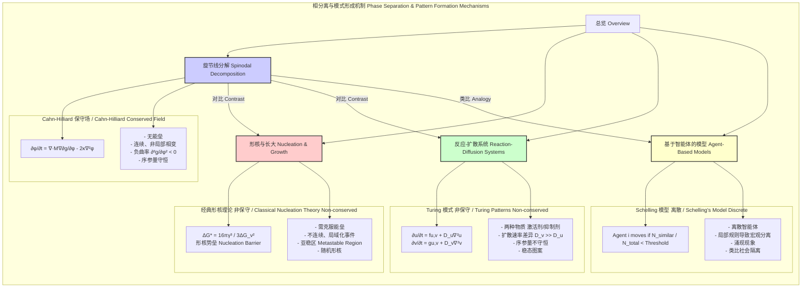

## 类旋节线机制 (Spinodal-like Mechanism)

类旋节线机制是一种描述热力学不稳定系统如何自发地、连续地分离成两个或多个不同相的物理化学过程。该机制最初由约翰·卡恩 (John Cahn) 和约翰·希利亚德 (John Hilliard) 在研究二元合金的相分离时提出，其核心特征是相分离过程没有形核能垒，而是通过小幅度、长波长的组分涨落的放大来实现。术语“类旋节线”表明该机制不仅限于经典的冶金和高分子体系，其核心的数学和物理思想可以推广到许多表现出类似自发、涌现性结构形成行为的非平衡系统，如生物模式形成、社会动力学和软物质系统。

### 1. 核心概念与数学基础

类旋节线机制的理论基础是体系的自由能 G 对其组分（或更广义的序参量）$\phi$ 的依赖关系。在一个二元混合物中，$\phi$ 可以代表其中一个组分的局部浓度。

#### 1.1 热力学驱动力

对于一个非均匀体系，其总吉布斯自由能 (Gibbs Free Energy) G 不仅取决于各处的局部组分，还取决于组分梯度的存在。其泛函形式可以写为：

$$
G[\phi(\mathbf{r})] = \int_V \left[ g(\phi) + \kappa (\nabla \phi)^2 \right] dV
$$

其中：
*   $G[\phi(\mathbf{r})]$ 是体系总自由能，是序参量场 $\phi(\mathbf{r})$ 的一个泛函。
*   $V$ 是体系的总体积。
*   $\mathbf{r}$ 是空间位置矢量。
*   $g(\phi)$ 是单位体积的**体自由能密度 (bulk free energy density)**。它的形状决定了体系的相行为。对于一个倾向于相分离的体系， $g(\phi)$ 曲线在某一浓度范围内呈双井状。
*   $\phi$ 是序参量，例如组分A的摩尔分数，取值范围为 [0, 1]。
*   $\kappa$ 是**梯度能量系数 (gradient energy coefficient)**，单位为 J·m²/mol。它是一个正值常数（$\kappa > 0$），表示维持组分浓度梯度需要付出的能量代价。这个能量项抑制了无限尖锐的相界面的形成。
*   $(\nabla \phi)^2$ 是浓度梯度的平方，代表了体系的非均匀性程度。

#### 1.2 旋节线与亚稳区

在相图中，体系的状态由 $g(\phi)$ 的形状决定：
*   **双节线 (Binodal Curve)**：定义了稳定相的平衡浓度。由 $\frac{\partial g}{\partial \phi}$ 在两个不同浓度值相等（公共切线法则）确定。位于双节线之间的区域是亚稳区或不稳定区。
*   **旋节线 (Spinodal Curve)**：定义了体系稳定性的边界。由自由能曲线的曲率决定：
    $$
    \frac{\partial^2 g(\phi)}{\partial \phi^2} = 0
    $$
    *   当 $\frac{\partial^2 g}{\partial \phi^2} > 0$ 时，体系是稳定或亚稳的。小的浓度涨落会使自由能增加，因此会自发消失。
    *   当 $\frac{\partial^2 g}{\partial \phi^2} < 0$ 时，体系是**热力学不稳定**的。任何微小的浓度涨落都会导致自由能降低，因此会被自发地、指数级地放大。这个区域就是旋节线分解发生的区域。

```mermaid
graph TD
    subgraph "自由能与相图 Free Energy & Phase Diagram"
        A["自由能密度 gφ vs 组分 φ<br>Free Energy Density gφ vs. Composition φ"] --> B["gφ 曲线的形状决定稳定性<br>Shape of gφ curve determines stability[";
        B --> C["拐点: ∂²g/∂φ² = 0<br>Inflection Points"];
        B --> D["公切线点<br>Common Tangent Points"];
        C ==> E[旋节线 Spinodal Curve<br>不稳定区的边界];
        D ==> F[双节线 Binodal Curve<br>亚稳区的边界];
        
        G[相图 T vs φ<br>Phase Diagram T vs φ]
        E --> G;
        F --> G;
        
        subgraph "相图中的区域 Regions in Phase Diagram"
            H["稳定区 Stable Region<br>∂²g/∂φ² > 0"];
            I["亚稳区 Metastable Region<br>位于双节线和旋节线之间"];
            J["不稳定区 Unstable Region<br>∂²g/∂φ² < 0"];
        end
        G --> H;
        G --> I;
        G --> J;
        
        I -- "需要克服形核能垒<br>Needs to overcome nucleation barrier" --> K[形核与长大 Nucleation & Growth];
        J -- "无能垒, 自发分解<br>No barrier, spontaneous decomposition" --> L[旋节线分解 Spinodal Decomposition];
    end

    style L fill:#ffcccc,stroke:#990000
    style K fill:#ccffcc,stroke:#006600
```

#### 1.3 Cahn-Hilliard 方程

描述旋节线分解动力学的核心方程是 Cahn-Hilliard 方程。它是一个非线性的四阶偏微分方程。首先定义化学势差 $\mu$：
$$
\mu = \frac{\delta G}{\delta \phi} = \frac{\partial g}{\partial \phi} - 2\kappa \nabla^2 \phi
$$
这是一个广义的化学势，包含了梯度能量的贡献。物质的扩散通量 $J$ 正比于化学势的梯度（而不是浓度的梯度）：$J = -M \nabla \mu$，其中 $M$ 是迁移率 (mobility)。结合质量守恒定律 $\frac{\partial \phi}{\partial t} = -\nabla \cdot J$，我们得到 Cahn-Hilliard 方程：

$$
\frac{\partial \phi}{\partial t} = \nabla \cdot \left( M \nabla \left[ \frac{\partial g}{\partial \phi} - 2\kappa \nabla^2 \phi \right] \right)
$$

这个方程描述了序参量场 $\phi(\mathbf{r}, t)$ 如何随时间演化。

#### 1.4 线性稳定性分析

在分解的早期阶段，浓度涨落 $\delta \phi(\mathbf{r}, t) = \phi(\mathbf{r}, t) - \phi_0$ 很小，其中 $\phi_0$ 是体系的平均浓度。我们可以对 Cahn-Hilliard 方程进行线性化处理。将 $\delta \phi$ 展开为傅里叶级数，考虑其中一个波矢为 $\mathbf{q}$ 的分量 $\delta \phi_{\mathbf{q}} \propto e^{i\mathbf{q}\cdot\mathbf{r} + R(\mathbf{q})t}$。将其代入线性化的 Cahn-Hilliard 方程，可以得到增长因子 $R(\mathbf{q})$：

$$
R(\mathbf{q}) = -M q^2 \left( \left. \frac{\partial^2 g}{\partial \phi^2} \right|_{\phi_0} + 2\kappa q^2 \right)
$$

其中 $q = |\mathbf{q}|$ 是波数。
*   由于 $M, \kappa > 0$，要使 $R(\mathbf{q}) > 0$（即涨落被放大），括号内的项必须为负。
*   这要求 $\left. \frac{\partial^2 g}{\partial \phi^2} \right|_{\phi_0} < 0$，这正是体系处于不稳定区的条件。
*   同时，波数 $q$ 必须小于一个临界值 $q_c = \sqrt{-\frac{1}{2\kappa} \frac{\partial^2 g}{\partial \phi^2}}$。大于 $q_c$ 的短波长涨落（对应大的 $q$）会被梯度能量项抑制而衰减。

$R(\mathbf{q})$ 在 $q_m = q_c / \sqrt{2}$ 处取得最大值 $R_{max}$。这对应一个特征波长 $\lambda_m = 2\pi/q_m$，它是在分解初期被优先放大的结构尺寸。这解释了旋节线分解为何会形成具有特征长度尺度的周期性结构。

### 2. 关键技术规格

以下表格以一个典型的聚合物共混物体系（如 聚苯乙烯/聚乙烯-丁烯）为例，展示了类旋节线机制中的关键参数。

| 参数 (Parameter) | 符号 (Symbol) | 典型值 (Typical Value) | 单位 (Unit) | 物理意义 (Physical Meaning) |
| :--- | :---: | :--- | :---: | :--- |
| Flory-Huggins 相互作用参数 | $\chi$ | 0.05 - 0.2 (在临界点以上) | 无量纲 | 度量两种聚合物链段间不相容性的能量 |
| 梯度能量系数 | $\kappa$ | $10^{-11} - 10^{-9}$ | J/m | 维持浓度梯度的能量惩罚 |
| 迁移率 | $M$ | $10^{-15} - 10^{-12}$ | m²·s/J | 原子或分子扩散的动力学系数 |
| 临界温度 | $T_c$ | 150 - 250 | °C | 体系从单相转变为两相的温度 |
| 临界波长 | $\lambda_c$ | 5 - 20 | nm | 能被放大的最小结构波长 |
| 主导波长 | $\lambda_m$ | 8 - 30 | nm | 分解初期增长最快的结构特征尺寸 |
| 临界过冷度 | $\Delta T$ | 10 - 50 | K | 实验温度低于临界点的程度 |

### 3. 常见用例与性能指标

类旋节线机制被广泛应用于材料制备和理解生物现象中。

| 应用领域 (Application Domain) | 具体用例 (Specific Use Case) | 性能指标 (Quantitative Performance Metrics) |
| :--- | :--- | :--- |
| **多孔材料制备** | 通过旋节线分解和选择性刻蚀制备多孔玻璃（如Vycor玻璃）或聚合物膜 | - 孔径分布：10-100 nm (标准差 < 15%) <br> - 比表面积：50-300 m²/g <br> - 孔隙率：30-70% |
| **高性能合金** | 镍基高温合金或铝合金的时效硬化，形成弥散的强化相 | - 屈服强度提升：+150 至 +400 MPa <br> - 析出相尺寸：5-50 nm <br> - 时效时间：1-100 小时 |
| **高分子共混物** | 改善材料韧性或光学性能，形成双连续结构 | - 冲击强度：从 5 kJ/m² 提升至 > 50 kJ/m² (断裂韧性) <br> - 相畴尺寸：0.1 - 1 µm |
| **生物物理** | 细胞膜上脂筏 (lipid raft) 的形成 | - 脂筏尺寸：20-200 nm <br> - 形成时间尺度：毫秒至秒 <br> - 蛋白富集系数：5-10倍 |
| **软物质** | 胶体或乳液的相分离动力学控制 | - 粗化速率指数 ($L(t) \sim t^n$): 理论值 n=1/3 <br> - 结构因子峰位移动：$q_m(t) \sim t^{-1/3}$ |

### 4. 实现考量与算法分析

在计算模拟中，通常使用数值方法求解 Cahn-Hilliard 方程。

*   **算法选择**:
    *   **有限差分法 (Finite Difference Method, FDM)**：实现简单，将空间离散为网格，使用差分格式近似微分算子。显式格式简单但有严格的稳定性条件，隐式或半隐式（如 Crank-Nicolson）格式稳定性更好但需要求解线性方程组。
    *   **谱方法 (Spectral Method)**：利用快速傅里叶变换 (FFT) 在傅里叶空间中进行计算。对于周期性边界条件，谱方法精度极高，且可以高效地计算高阶导数。

*   **算法复杂度分析**:
    *   假设计算区域为一个 $N \times N \times N$ 的三维网格。
    *   **显式有限差分法**: 每个时间步的计算复杂度为 **$O(N^3)$**。时间步长 $\Delta t$ 受到稳定性条件的严格限制：$\Delta t \propto (\Delta x)^4$，其中 $\Delta x$ 是网格尺寸。这使得模拟非常耗时。
    *   **谱方法**: 每个时间步的计算复杂度主要由FFT决定，为 **$O(N^3 \log N)$**。虽然单步计算量略高，但其数值稳定性允许使用更大的时间步长，总体效率通常远高于显式FDM。

*   **实现要点**:
    *   **边界条件**: 周期性边界条件最常用于模拟体相行为。对于有限体系，可以使用无通量边界条件（$\nabla \phi |_{\partial V} = 0$ 和 $\nabla (\nabla^2 \phi) |_{\partial V} = 0$）。
    *   **自由能模型**: 需要为 $g(\phi)$ 选择一个具体的函数形式，例如简单多项式 $g(\phi) = A\phi^2(1-\phi)^2$ 或更真实的Flory-Huggins模型。
    *   **初始条件**: 通常是在平均浓度 $\phi_0$ 的基础上叠加一个小的随机噪声，以模拟热涨落。

### 5. 性能特征与统计度量

旋节线分解形成的结构具有独特的统计特征。

*   **形态 (Morphology)**: 在分解早期和中期，当两相体积分数接近时（例如，40%-60%），会形成一个**双连续 (co-continuous)** 的互穿网络结构。如果体积分数偏离，则会形成分散的液滴状结构。
*   **动力学标度 (Dynamic Scaling)**: 在分解的后期（粗化阶段），体系表现出动力学标度行为。这意味着结构的统计性质在不同时间是自相似的。
    *   **特征长度尺度**: 结构的平均尺寸 $L(t)$ 随时间增长，遵循幂律关系 $L(t) \sim t^n$。对于流体动力学不重要的固态体系，粗化机制是原子扩散（Lifshitz-Slyozov-Wagner 机制），理论预测 $n=1/3$。
    *   **结构因子 (Structure Factor)**: $S(\mathbf{q}, t)$ 是浓度场傅里叶变换的模方，可以通过散射实验（如X射线或中子散射）测量。
        $$
        S(\mathbf{q}, t) = \langle |\phi_{\mathbf{q}}(t)|^2 \rangle
        $$
        在动力学标度假设下，$S(q, t)$ 可以写成 $S(q, t) = (L(t))^d F(qL(t))$，其中 $d$ 是空间维度，$F(x)$ 是一个不依赖于时间的标度函数。实验数据在不同时间归一化后应能重叠在一条主曲线上。
*   **统计分布**:
    *   相畴尺寸分布通常是自相似的，可以用一个标度分布函数来描述。
    *   置信区间：在实验测量或模拟中，如粗化指数 $n=0.33 \pm 0.02$ (95% CI)，可以用来验证理论模型。

### 6. 相关技术与比较模型

类旋节线机制是相分离的两种主要途径之一，并与其它模式形成机制有联系。



*   **与形核与长大的比较**:
    *   **驱动力**: 旋节线分解由不稳定性驱动（$\partial^2 g / \partial \phi^2 < 0$），而形核与长大发生在亚稳区（$\partial^2 g / \partial \phi^2 > 0$）。
    *   **能垒**: 旋节线分解没有热力学能垒，是自发过程。形核需要克服形成新相界面的自由能垒 $\Delta G^*$。
    *   **形态演化**: 旋节线分解初始形成小幅度、长波长的周期性结构，并逐渐演化为双连续结构。形核与长大则是通过形成离散、孤立的新相核心，然后这些核心长大并最终合并。
*   **与反应-扩散系统（图灵模式）的比较**:
    *   **守恒律**: Cahn-Hilliard 方程描述的是一个**保守系统**（$\int \phi dV = \text{const}$），例如，总的原子数是守恒的。而图灵模式（如 Gierer-Meinhardt 模型）中的反应项代表物质的产生和消耗，是**非保守系统**。
    *   **机制**: 旋节线分解是单一序参量通过上坡扩散（up-hill diffusion）实现的。图灵模式通常需要至少两种物质（一个短程的自激活剂和一个长程的抑制剂）以及它们之间显著的扩散速率差异。
*   **与基于智能体的模型的类比**:
    *   像谢林（Schelling）的种族隔离模型这样的基于智能体的模型，虽然在数学形式上完全不同（离散、基于规则），但其表现出的宏观行为与旋节线分解有惊人的相似之处。个体基于局部邻域的“满意度”（类似于最小化局部“能量”）做出的简单移动决策，可以涌现出大规模的、自发的宏观分离模式。这可以被视为一种社会或计算领域的“类旋节线机制”。

### 7. 参考文献 (References)

1.  Cahn, J. W., & Hilliard, J. E. (1958). Free Energy of a Nonuniform System. I. Interfacial Free Energy. *The Journal of Chemical Physics*, 28(2), 258–267. **DOI**: [10.1063/1.1744102](https://doi.org/10.1063/1.1744102) (奠基性论文，提出了梯度能量的概念).
2.  Cahn, J. W. (1961). On spinodal decomposition. *Acta Metallurgica*, 9(9), 795-801. **DOI**: [10.1016/0001-6160(61)90182-1](https://doi.org/10.1016/0001-6160(61)90182-1) (对旋节线分解动力学的经典线性分析).
3.  Bray, A. J. (2002). Theory of phase-ordering kinetics. *Advances in Physics*, 51(2), 481-587. **DOI**: [10.1080/00018730110117433](https://doi.org/10.1080/00018730110117433) (关于相序动力学，包括粗化阶段的权威综述).
4.  Cross, M. C., & Hohenberg, P. C. (1993). Pattern formation outside of equilibrium. *Reviews of Modern Physics*, 65(3), 851–1112. **DOI**: [10.1103/RevModPhys.65.851](https://doi.org/10.1103/RevModPhys.65.851) (将旋节线分解置于更广泛的非平衡模式形成框架中的经典综述).