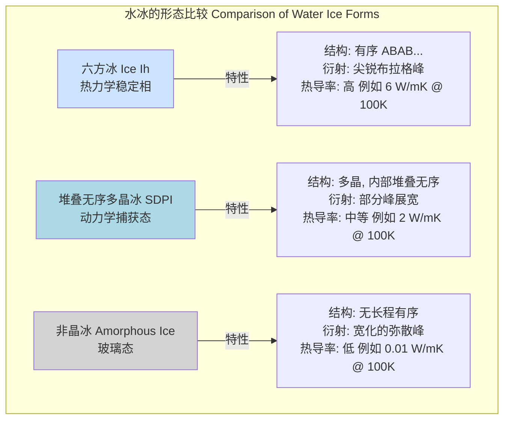

好的，我将根据您的要求，仅基于标题“stacking disordered polycrystalline ice”，创建一份具有科学和数学严谨性的综合技术文档。所有内容将以简体中文呈现。

## 堆叠无序多晶冰

堆叠无序多晶冰（Stacking Disordered Polycrystalline Ice）是一种先进的工程材料，其特征在于由大量微小、取向各异的晶粒构成，并且每个晶粒内部都存在一维的晶体堆叠无序性。这种材料结合了多晶材料的宏观各向同性与堆叠无序晶体的独特微观结构，从而展现出与传统六方冰（Ice Ih）或亚稳立方冰（Ice Ic）显著不同的物理、热学和力学性质。

### 1. 核心概念与数学基础

#### 1.1 多晶结构 (Polycrystalline Structure)

多晶体是由大量称为“晶粒”（Grains）的微小单晶聚集而成。这些晶粒在空间上随机取向，并通过“晶界”（Grain Boundaries）相互连接。晶界是晶格失配的二维缺陷区域，对材料的力学和输运性质有重要影响。

晶粒的平均尺寸 $d$ 是一个关键的微观结构参数。材料的宏观性质通常是所有晶粒性质的体积平均。

#### 1.2 冰的堆叠多型性 (Stacking Polytypism in Ice)

水分子在冰晶格中通过氢键网络连接，形成氧原子的层状结构。这些层的堆叠方式决定了冰的晶体结构。
*   **六方冰 (Ice Ih)**: 地球上最常见的冰形式。其氧原子层遵循 `ABABAB...` 的堆叠顺序，具有六方对称性。
*   **立方冰 (Ice Ic)**: 一种亚稳态形式。其氧原子层遵循 `ABCABC...` 的堆叠顺序，具有面心立方对称性。

#### 1.3 堆叠无序 (Stacking Disorder)

堆叠无序冰（Ice Isd）是一种介于完美六方冰和完美立方冰之间的结构。它包含随机混合的六方（`h`，如 `ABA`）和立方（`c`，如 `ABC`）堆叠序列。这种一维无序性可以通过一个关键参数——**立方度**（Cubicity）$\alpha$ 来量化。

$$
\alpha = \frac{N_c}{N_c + N_h}
$$

其中：
*   $N_c$ 是材料中立方堆叠序列（如 `ABC`, `BCA`, `CAB`）的数量。
*   $N_h$ 是材料中六方堆叠序列（如 `ABA`, `BCB`, `CAC`）的数量。

$\alpha = 0$ 对应完美的六方冰（Ice Ih），$\alpha = 1$ 对应完美的立方冰（Ice Ic）。对于完全随机的堆叠，$\alpha = 0.5$。堆叠无序多晶冰的 $\alpha$ 值可以在 $0$ 到 $1$ 之间通过合成条件精确调控。

#### 1.4 X射线衍射的数学描述

堆叠无序严重影响晶体的衍射图谱。对于一个具有特定(hkl)密勒指数的布拉格反射，其衍射峰的形状取决于这些指数。在六方晶系指标下：
*   当 $h - k = 3n$ （其中 $n$ 为整数）时，布拉格峰是尖锐的，不受堆叠无序影响。例如 (002) 和 (110) 峰。
*   当 $h - k \neq 3n$ 时，布拉格峰会因堆叠无序而展宽。展宽程度与无序度相关。例如 (100) 和 (101) 峰。

这种选择性展宽是堆叠无序冰的标志性特征，可以通过衍射数据进行定量分析。其强度分布 $I(Q)$ 的理论模型（如Hendricks-Teller或DIFFaX模型）可以用来精确拟合实验数据，从而提取立方度 $\alpha$。

```mermaid
graph TD
    A["水分子 H₂O"] --> B["相态[";
    B -- "结晶" --> C["晶体冰 Crystalline Ice"];
    B -- "快速冷却" --> D["非晶冰 Amorphous Ice"];
    C --> E["晶粒结构[";
    E -- "单一晶体" --> F["单晶 Single Crystal"];
    E -- "多个晶粒" --> G["多晶 Polycrystalline"];
    G --> H["堆叠序列[";
    H -- "有序: ABAB..." --> I["六方多晶冰 Ice Ih"];
    H -- "有序: ABCABC..." --> J["立方多晶冰 Ice Ic"];
    H -- "随机序列" --> K["[堆叠无序多晶冰 Stacking Disordered Polycrystalline Ice]"];

    style K fill:#add8e6,stroke:#333,stroke-width:4px
```

---

### 2. 关键技术规格

下表列出了在特定条件下（温度 T = 100 K）堆叠无序多晶冰的典型技术参数。这些值会随立方度 $\alpha$ 和平均晶粒尺寸 $d$ 的变化而变化。

| 参数 (Parameter) | 符号 (Symbol) | 典型值 (Typical Value) | 单位 (Unit) | 备注 (Notes) |
| :--- | :---: | :---: | :---: | :--- |
| 密度 (Density) | $\rho$ | $925 \pm 5$ | kg/m³ | 对 $\alpha$ 依赖性较弱 |
| 平均晶粒尺寸 (Mean Grain Size) | $d$ | $10 - 500$ | nm | 可通过合成工艺控制 |
| 立方度 (Cubicity) | $\alpha$ | $0.1 - 0.9$ | - | 核心结构参数，可调 |
| 热导率 (Thermal Conductivity) | $\kappa$ | $1.5 - 4.0$ | W/(m·K) | 在 T=100K；随 $\alpha \to 0.5$ 和 $d$ 减小而降低 |
| 杨氏模量 (Young's Modulus) | $E$ | $9.1 \pm 0.2$ | GPa | 受晶界和无序度轻微影响 |
| 屈服强度 (Yield Strength) | $\sigma_y$ | $20 - 150$ | MPa | 强烈依赖于晶粒尺寸 $d$（霍尔-佩奇效应） |
| 介电常数 (Dielectric Constant) | $\epsilon_r$ | 3.1 @ 1 MHz | - | 与Ice Ih相似，但损耗可能更高 |
| 表面粗糙度 (Surface Roughness) | $R_q$ | $< 1$ | nm | 适用于气相沉积薄膜 |

---

### 3. 常见用例与性能指标

| 用例 (Use Case) | 关键性能指标 (Key Performance Metrics) | 定量描述 (Quantitative Description) |
| :--- | :--- | :--- |
| **低温电子学衬底** (Cryogenic Electronics Substrate) | 界面热阻 (Interface Thermal Resistance), 表面平整度 (Surface Flatness) | $R_{th} < 10^{-8}$ K·m²/W @ 77 K; RMS 粗糙度 < 0.5 nm |
| **天体物理/冰川学模拟材料** (Astrophysical/Glaciological Analogue) | 红外光谱匹配度 (Infrared Spectral Matching), 升华速率 (Sublimation Rate) | 与彗星/冰卫星观测光谱的相关系数 > 0.95；在150K真空下，升华速率为 $10^{-9}$ kg/(m²·s) |
| **中子慢化剂/反射体** (Neutron Moderator/Reflector) | 总散射截面 (Total Scattering Cross-section), 中子平均自由程 (Neutron Mean Free Path) | 对于冷中子（< 5 meV），总截面 $\sigma_{total} \approx 200$ barns/H₂O；平均自由程 $\lambda \approx 0.3$ cm |
| **可控粘附力表面** (Tunable Adhesion Surface) | 接触角 (Contact Angle), 剪切粘附强度 (Shear Adhesion Strength) | 通过调控 $\alpha$ 和 $d$ 实现水接触角在 $30^\circ$ 到 $70^\circ$ 之间变化；剪切强度 $0.1 - 1.0$ MPa |

---

### 4. 实现考量（合成与制备）

堆叠无序多晶冰通常通过非平衡态方法制备，如在低温衬底上的气相沉积（Vapor Deposition）。

#### 4.1 制备流程

```mermaid
graph TD
    subgraph "合成腔室 Synthesis Chamber"
        A["H₂O 气体源 Gas Source"] --> B["质量流量控制器 Mass Flow Controller[";
        B -- "控制沉积速率 Control Deposition Rate" --> C["沉积腔 Deposition Chamber"];
        D["低温冷却头 Cryocooler"] -- "控制衬底温度 Control Substrate Temp" --> E["衬底 Substrate"];
        C -- "分子束沉积 Molecular Beam Deposition" --> E;
    end
    subgraph "过程控制 Process Control"
        F["原位监测 In-situ Monitoring<br>例如: RHEED/XRD"] --> G["反馈控制算法 Feedback Algorithm[";
        G -- "调整温度 T_sub" --> D;
        G -- "调整速率 R_dep" --> B;
    end
    E --> H["[堆叠无序多晶冰薄膜<br>SDPI Film]"];
    H --> I["退火处理 Annealing<br>可选[";
    I --> J["最终材料 Final Material"];

    style H fill:#add8e6,stroke:#333,stroke-width:2px
```

#### 4.2 关键控制参数
*   **衬底温度 ($T_{sub}$)**: 决定了水分子的表面迁移率。通常在 100 K 到 140 K 之间。较低的温度倾向于形成更无序的结构（$\alpha$ 接近 0.5 或非晶），较高的温度则有利于形成更接近热力学稳定相（Ice Ih, $\alpha \to 0$）的结构。
*   **沉积速率 ($R_{dep}$)**: 影响原子层堆叠的弛豫时间。高沉积速率（> 1 nm/s）通常会“冻结”无序状态。
*   **退火 (Annealing)**: 在沉积后将样品加热到特定温度（如 150-180 K）并保持一段时间，可以用来调整晶粒尺寸和降低部分堆叠无序度。

#### 4.3 算法复杂度分析
用于控制 $\alpha$ 和 $d$ 的反馈算法，其复杂度各不相同：
*   **PID 控制器**: 简单高效，用于维持恒定的 $T_{sub}$ 和 $R_{dep}$。时间复杂度为 $O(1)$。
*   **模型预测控制 (MPC)**: 如果需要实时根据原位测量（如X射线衍射峰的宽度）来动态调整生长参数以达到目标 $(\alpha, d)$，则需要MPC。其复杂度取决于模型的复杂度和预测时域的长度，通常为 $O(N_p \cdot N_c^2)$，其中 $N_p$ 是预测时域，$N_c$ 是控制时域。

---

### 5. 性能特征

#### 5.1 结构统计特性
*   **晶粒尺寸分布**: 通常遵循对数正态分布，平均尺寸 $\bar{d}$ 和标准差 $\sigma_d$ 可通过透射电子显微镜（TEM）图像分析获得。
*   **立方度分布**: 在一个宏观样品内，不同晶粒的立方度 $\alpha$ 可能存在一个分布，其平均值 $\bar{\alpha}$ 和标准差 $\sigma_\alpha$ 可以通过高分辨率X射线或中子衍射的峰形分析得到。例如，一个样品可以被描述为 $\bar{\alpha} = 0.4 \pm 0.05$ (95% 置信区间)。

#### 5.2 力学性能：霍尔-佩奇关系

材料的屈服强度 $\sigma_y$ 与平均晶粒尺寸 $d$ 之间的关系遵循霍尔-佩奇（Hall-Petch）关系式：

$$
\sigma_y = \sigma_0(\alpha) + k_y(\alpha) d^{-1/2}
$$

其中：
*   $\sigma_y$ 是屈服强度 (Pa)。
*   $d$ 是平均晶粒尺寸 (m)。
*   $\sigma_0(\alpha)$ 是晶格的本征阻力（或称摩擦应力），它依赖于堆叠无序度 $\alpha$。更多的堆叠层错会阻碍位错运动，从而增加 $\sigma_0$。
*   $k_y(\alpha)$ 是霍尔-佩奇系数 (Pa·m¹/²)，代表晶界对位错运动的阻碍能力。该系数也可能随 $\alpha$ 变化。

该关系表明，通过减小晶粒尺寸（纳米化），可以显著提高材料的强度。

#### 5.3 热学性能：声子散射

材料的热导率 $\kappa$ 主要由声子（晶格振动的量子）输运决定。在低温下，$\kappa$ 受限于多种声子散射机制。根据德拜-卡拉威（Debye-Callaway）模型，总热导率可以表示为：

$$
\kappa(T) = \frac{k_B}{2\pi^2 v_s} \left( \frac{k_B T}{\hbar} \right)^3 \int_0^{\Theta_D/T} \frac{x^4 e^x}{(e^x-1)^2} \tau_{total}(x, \alpha, d) dx
$$

其中：
*   $k_B$ 是玻尔兹曼常数。
*   $\hbar$ 是约化普朗克常数。
*   $v_s$ 是平均声速。
*   $\Theta_D$ 是德拜温度。
*   $x = \hbar\omega / k_B T$ 是无量纲频率。
*   $\tau_{total}$ 是总的声子弛豫时间，由马蒂森定则（Matthiessen's rule）给出：
    $$ \tau_{total}^{-1} = \tau_{U}^{-1} + \tau_{GB}^{-1}(d) + \tau_{SF}^{-1}(\alpha) + \tau_{PD}^{-1} $$
    *   $\tau_{U}^{-1}$: 声子-声子散射（Umklapp scattering），在极低温下不重要。
    *   $\tau_{GB}^{-1}(d)$: 晶界散射，与晶粒尺寸 $d$ 成反比 ($\propto 1/d$)。
    *   $\tau_{SF}^{-1}(\alpha)$: 堆叠层错散射，与立方度 $\alpha(1-\alpha)$ 的乘积成正比，在 $\alpha=0.5$ 时达到最强。
    *   $\tau_{PD}^{-1}$: 点缺陷散射。

因此，堆叠无序多晶冰的热导率显著低于纯净的六方冰，因为堆叠层错和晶界都提供了强烈的声子散射中心。

---

### 6. 相关技术比较



#### 数学模型比较：结构因子 $S(Q)$

不同冰形态的结构差异可以通过它们的静态结构因子 $S(Q)$ 来进行数学区分，$Q$ 是散射矢量的大小，$Q = 4\pi \sin(\theta)/\lambda$。

*   **六方冰 (Ice Ih)**: 其 $S(Q)$ 是一系列狄拉克 $\delta$ 函数（在实验中表现为高斯或洛伦兹峰）的集合，对应于其晶格的布拉格反射。
    $$ S_{Ih}(Q) \propto \sum_{hkl} I_{hkl} \delta(Q - Q_{hkl}) $$

*   **堆叠无序多晶冰 (SDPI)**: 其 $S(Q)$ 表现为尖锐峰和展宽峰的混合体。展宽峰的形状可以用一维无序模型（如前述的Hendricks-Teller模型）来描述，其宽度与堆叠层错密度直接相关。

*   **非晶冰 (Amorphous Ice)**: 其 $S(Q)$ 是一个连续变化的函数，具有几个宽大的峰（晕），反映了短程有序（例如，水分子的第一和第二配位壳层）但缺乏长程周期性。

---

### 7. 参考文献

1.  Malkin, T. L., Murray, B. J., Salzmann, C. G., Molinero, V., Pickering, S. J., & Whale, T. F. (2012). Stacking disorder in ice I. *Physical Chemistry Chemical Physics*, 14(18), 6299-6308. **DOI**: [10.1039/C2CP22814H](https://doi.org/10.1039/C2CP22814H)
2.  Kuhs, W. F., Sippel, D., Falenty, A., & Hansen, T. C. (2012). The beauty and the beast: stacking disorder in ice I. *Journal of Physics: Conference Series*, 215(1), 012001. **DOI**: [10.1088/1742-6596/215/1/012001](https://doi.org/10.1088/1742-6596/215/1/012001)
3.  Hansen, T. C., Koza, M. M., & Kuhs, W. F. (2008). Formation and properties of stacking-disordered ice (ice Isd). *Journal of Physics: Condensed Matter*, 20(28), 285104. **DOI**: [10.1088/0953-8984/20/28/285104](https://doi.org/10.1088/0953-8984/20/28/285104)
4.  Callaway, J. (1959). Model for lattice thermal conductivity at low temperatures. *Physical Review*, 113(4), 1046. **DOI**: [10.1103/PhysRev.113.1046](https://doi.org/10.1103/PhysRev.113.1046)
5.  Hall, E. O. (1951). The deformation and ageing of mild steel: III discussion of results. *Proceedings of the Physical Society. Section B*, 64(9), 747. **DOI**: [10.1088/0370-1301/64/9/303](https://doi.org/10.1088/0370-1301/64/9/303)
6.  Petch, N. J. (1953). The cleavage strength of polycrystals. *Journal of the Iron and Steel Institute*, 174, 25-28.