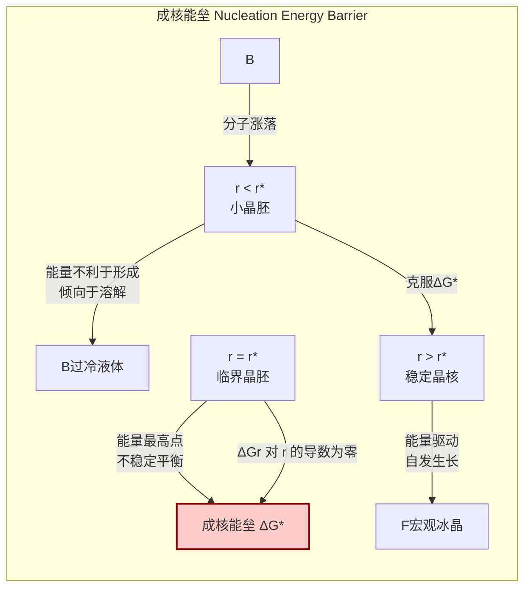

## 过冷水 (supercooled water)

过冷水是指在标准大气压下，温度低于其正常凝固点0°C（273.15 K）但仍保持液态的水。这是一种热力学上的亚稳态（metastable state），意味着它相对于固态的冰来说能量更高，但由于成核过程存在一个能量壁垒，系统可以暂时被“困”在液态。对过冷水的深入理解在气象学、材料科学、生物学和物理化学等多个领域都至关重要。

### 核心概念与数学基础

#### 1. 亚稳态与吉布斯自由能 (Metastability and Gibbs Free Energy)

物质的相变由吉布斯自由能 ($G$) 驱动，系统总是趋向于达到吉布斯自由能最低的稳定状态。对于水-冰系统，其自由能是温度 ($T$) 和压力 ($P$) 的函数。

在恒定压力下，液态水和冰的吉布斯自由能之差 ($\Delta G_{sl}$) 决定了相变的自发性：
$$ \Delta G_{sl} = G_{solid} - G_{liquid} = \Delta H_{sl} - T \Delta S_{sl} $$
其中：
*   $G_{solid}$ 是冰的吉布斯自由能。
*   $G_{liquid}$ 是液态水的吉布斯自由能。
*   $\Delta H_{sl}$ 是凝固焓（熔化热的负值），是一个负值。
*   $\Delta S_{sl}$ 是凝固熵，是一个负值。
*   $T$ 是绝对温度（单位：K）。

在凝固点 $T_m$ (0°C 或 273.15 K)，$\Delta G_{sl} = 0$，液态和固态共存。
*   当 $T > T_m$ 时，$\Delta G_{sl} > 0$，$G_{solid} > G_{liquid}$，液态是稳定相。
*   当 $T < T_m$ 时，$\Delta G_{sl} < 0$，$G_{solid} < G_{liquid}$，固态（冰）是稳定相。

尽管在 $T < T_m$ 时，从宏观热力学角度看，水应该结冰，但相变的启动需要克服一个称为**成核能垒**（nucleation energy barrier）的障碍。过冷水就是系统在越过这个能垒之前所处的亚稳态。

```mermaid
graph TD
    subgraph "水在1个标准大气压下的相态与吉布斯自由能"
        A[高温, T > 100°C] --> B["水蒸气 稳定相<br>G<sub>gas</sub> 最低[";
        B --> C["液态水 稳定相<br>0°C < T < 100°C<br>G<sub>liquid</sub> 最低[";
        C --> D["冰 稳定相<br>T < 0°C<br>G<sub>solid</sub> 最低[";
        C --> E["[过冷水 亚稳态]<br>T < 0°C<br>G<sub>liquid</sub> > G<sub>solid</sub>"];
        E -- "克服成核能垒" --> D;
        E -- "扰动或达到均相成核温度" --> D;
    end

    style E fill:#cce5ff,stroke:#004080,stroke-width:2px
    style D fill:#d4edda,stroke:#155724,stroke-width:2px
```

#### 2. 经典成核理论 (Classical Nucleation Theory - CNT)

经典成核理论（CNT）为理解过冷水如何结冰提供了数学框架。它假设在过冷液体中，微小的冰晶胚（ice embryo）通过分子的随机运动不断形成和溶解。当一个晶胚的尺寸超过某个临界值时，它才能稳定存在并自发长大，从而引发整个液体的凝固。

形成一个半径为 $r$ 的球形冰晶胚所引起的总吉布斯自由能变化 $\Delta G(r)$ 由两部分组成：
1.  **体积自由能**：由于相变到更稳定的固相而释放的能量，与晶胚体积成正比。
2.  **表面自由能**：形成新的固-液界面所需要的能量，与晶胚表面积成正比。

其数学表达式为：
$$ \Delta G(r) = -\frac{4}{3}\pi r^3 \Delta G_v + 4\pi r^2 \gamma_{sl} $$
其中：
*   $r$ 是冰晶胚的半径 (m)。
*   $\Delta G_v$ 是单位体积的固-液相变吉布斯自由能差 ($J/m^3$)。它是一个正值，因为 $G_{liquid} > G_{solid}$。$\Delta G_v \approx \frac{\Delta H_f (T_m - T)}{T_m V_m}$，其中 $\Delta H_f$ 是摩尔熔化焓，$V_m$ 是摩尔体积。
*   $\gamma_{sl}$ 是固-液界面能 ($J/m^2$)，即单位面积的界面张力。

为了找到成核能垒，我们对 $\Delta G(r)$ 求导并令其为零：
$$ \frac{d(\Delta G(r))}{dr} = -4\pi r^2 \Delta G_v + 8\pi r \gamma_{sl} = 0 $$
解得**临界核半径** $r^*$：
$$ r^* = \frac{2\gamma_{sl}}{\Delta G_v} $$
将 $r^*$ 代回 $\Delta G(r)$ 方程，得到**成核能垒** $\Delta G^*$：
$$ \Delta G^* = \frac{16\pi \gamma_{sl}^3}{3(\Delta G_v)^2} $$

只有当晶胚的半径 $r > r^*$ 时，它才能稳定生长。$\Delta G^*$ 代表了系统需要克服的能量壁垒。



#### 3. 成核速率 (Nucleation Rate)

成核速率 $J$（单位体积单位时间内形成的临界核数量，单位：$m^{-3}s^{-1}$）描述了过冷水结冰的速度。它通常用阿伦尼乌斯类型的方程表示：
$$ J = A \exp\left(-\frac{\Delta G^*}{k_B T}\right) $$
其中：
*   $A$ 是指前因子 (pre-exponential factor)，与分子碰撞频率和附着到晶胚表面的动力学过程有关。
*   $k_B$ 是玻尔兹曼常数 ($1.380649 \times 10^{-23} J/K$)。
*   $T$ 是绝对温度 (K)。

这个方程表明，成核速率对温度和成核能垒极为敏感。随着温度降低（过冷度增加），$\Delta G_v$ 增大，导致 $\Delta G^*$ 和 $r^*$ 减小，从而指数级地增加了成核速率 $J$。

---

### 关键技术规格

下表列出了过冷水在不同温度下的一些关键物理性质。这些值是近似值，会受到压力和水中溶质的轻微影响。

| 属性 | 符号/单位 | 0 °C | -10 °C | -20 °C | -35 °C (接近 $T_H$) |
| :--- | :--- | :--- | :--- | :--- | :--- |
| 密度 (Density) | $\rho$ (kg/m³) | 999.84 | 998.12 | 993.55 | 983.85 |
| 比热容 (Specific Heat Capacity) | $c_p$ (J/g·K) | 4.218 | 4.263 | 4.391 | 4.675 |
| 粘度 (Viscosity) | $\eta$ (mPa·s) | 1.792 | 2.549 | 4.042 | 10.95 |
| 固-液界面能 (Interfacial Energy) | $\gamma_{sl}$ (mJ/m²) | ~29.1 | ~30.5 | ~32.0 | ~34.2 |
| 均相成核温度 (Homogeneous Nucleation Temp) | $T_H$ (°C) | \- | \- | \- | ~ -41 (在1 atm) |

*注：均相成核温度 ($T_H$) 是理论上纯水自发结冰的最低温度。实验测量值通常在 -38°C 到 -42°C 之间，具体取决于实验条件和测量方法。*

---

### 常见用例与性能指标

*   **大气科学 (Atmospheric Science)**
    *   **应用**: 云的形成和降水过程。在高空大气中，温度低于0°C的云层通常由过冷水滴组成。这些水滴最终通过与冰晶（均相或异相成核形成）相互作用或直接冻结来形成降水。
    *   **性能指标**:
        *   云中液态水含量 (Liquid Water Content, LWC): g/m³。
        *   过冷水滴的数密度和尺寸分布。
        *   冰成核粒子的浓度 (Ice Nucleating Particle, INP concentration): L⁻¹。

*   **生物低温保存 (Cryopreservation)**
    *   **应用**: 保护细胞、组织和器官在低温下免受冰晶损伤。通过精确控制降温速率，可以诱导细胞外结冰，而使细胞内部保持过冷状态，并通过脱水来避免致命的胞内结冰。
    *   **性能指标**:
        *   细胞存活率 (%): 解冻后具有生物活性的细胞百分比。
        *   最大可容忍的过冷度 (Maximum tolerated supercooling degree)。
        *   临界降温速率 (Critical cooling rate): 避免胞内结冰所需的最低降温速率。

*   **航空航天 (Aerospace)**
    *   **应用**: 研究飞机在飞越含过冷水滴的云层时的机翼结冰问题。过冷水滴撞击机翼表面后会瞬间结冰，改变空气动力学外形，可能导致灾难性后果。
    *   **性能指标**:
        *   冰积聚率 (Ice accretion rate): kg·m⁻²·s⁻¹。
        *   撞击效率 (Impingement efficiency): 到达表面的水滴质量与路径上总水滴质量之比。

---

### 实现考量

在实验室或工业应用中生成和维持过冷水需要对多个因素进行精确控制。

*   **纯度 (Purity)**: 水的纯度是实现深度过冷的关键。杂质颗粒（如灰尘、细菌）可以作为**异相成核点**（heterogeneous nucleation sites），显著提高成核温度（即降低过冷度）。因此，通常需要使用超纯水（例如，电阻率 > 18 MΩ·cm）。
*   **体积 (Volume)**: 样品体积越小，包含有效成核点的概率就越低。因此，微升级或纳升级的液滴比大体积的水更容易实现深度过冷。这被称为“体积效应”。
*   **冷却速率 (Cooling Rate)**: 较快的冷却速率可以帮助系统“越过”某些成核温度窗口，从而达到更低的温度。然而，极高的冷却速率（> $10^6$ K/s）可能导致玻璃化，形成非晶态冰（amorphous ice），而不是结晶。
*   **表面相互作用 (Surface Interaction)**: 容器壁也可能成为异相成核点。使用疏水或经过特殊处理的光滑表面可以减少壁诱导的成核。

**成核概率分析**:
一个体积为 $V$ 的水样在温度 $T$ 下，在时间 $t$ 内不结冰的概率 $P_{nf}(t)$ 可以建模为：
$$ P_{nf}(t) = \exp(-J(T) \cdot V \cdot t) $$
这个模型显示了结冰事件的随机性。对于给定的 $V$ 和 $T$，平均等待时间（或寿命）为 $\tau = (J(T) \cdot V)^{-1}$。这解释了为什么即使在相同条件下，相同的两个水滴也可能在完全不同的时间结冰。

---

### 性能特征与统计度量

过冷水的凝固是一个随机（stochastic）过程，其性能必须用统计方法来描述。

*   **凝固温度分布**: 对于大量相同体积的纯水滴，其凝固温度不是一个单一值，而是遵循一个统计分布。这个分布通常是不对称的，可以用均值、中位数和标准差来表征。例如，对于直径为50μm的纯水滴，其均相成核温度的实验分布可能集中在 -37.5°C ± 0.5°C (95% 置信区间)。
*   **成核速率的测量**: 实验上，成核速率 $J(T)$ 可以通过测量大量液滴在不同恒定温度下的凝固时间分布来确定。通过拟合 $P_{nf}(t)$ 模型，可以反推出 $J(T)$。
*   **过冷水的“反常”行为**: 当水被过冷时，其许多物理性质（如热容、密度、粘度）表现出与常温水不同的“反常”行为，并且在接近一个假想的“第二临界点”（约228 K）时，这些性质的发散趋势会加剧。

---

### 相关技术与比较模型

#### 1. 均相成核 vs. 异相成核 (Homogeneous vs. Heterogeneous Nucleation)

这是两种主要的成核机制。
*   **均相成核 (Homogeneous Nucleation)**: 在完全纯净的液体中，由液体分子自身的涨落形成晶核。这是物质的内在属性，需要最大的过冷度。其能垒为 $\Delta G^*_{hom}$。
*   **异相成核 (Heterogeneous Nucleation)**: 在杂质颗粒、容器壁或其他界面上形成晶核。这些外来表面降低了形成新相所需的表面能，从而显著降低了成核能垒。

异相成核的能垒 $\Delta G^*_{het}$ 与均相成核能垒的关系为：
$$ \Delta G^*_{het} = \Delta G^*_{hom} \cdot f(\theta) $$
其中 $f(\theta)$ 是一个形状因子，取决于固-液-基底三相间的接触角 $\theta$：
$$ f(\theta) = \frac{(2 + \cos\theta)(1 - \cos\theta)^2}{4} $$
由于 $0 \le \theta \le 180°$，所以 $0 \le f(\theta) \le 1$。对于有效的成核点，$\theta$ 较小，$f(\theta)$ 远小于1，因此 $\Delta G^*_{het} \ll \Delta G^*_{hom}$。这就是为什么在自然界和大多数工业应用中，水在接近0°C时就会结冰。

```mermaid
graph TD
    subgraph "成核机制比较 Nucleation Mechanism Comparison"
        A["过冷水 Supercooled Water"] --> B["均相成核<br>Homogeneous Nucleation[";
        A --> C["异相成核<br>Heterogeneous Nucleation[";
        
        B -- "内在属性<br>Intrinsic Property" --> B1["需要极大过冷度<br>e.g., T ≈ -40°C"];
        B -- "能垒<br>Energy Barrier" --> B2["ΔG*<sub>hom</sub> = 16πγ³/3ΔG<sub>v</sub>²"];
        
        C -- "外部催化<br>External Catalysis" --> C1["由杂质/表面引发<br>e.g., T ≈ -5°C to -15°C"];
        C -- "能垒<br>Energy Barrier" --> C2["ΔG*<sub>het</sub> = ΔG*<sub>hom</sub> * fθ"];
        
        C2 -- "fθ < 1" --> C3["能垒显著降低<br>Significantly Lower Barrier"];
        B1 -- "更高能量需求" --> C1;
    end

    style B fill:#e3f2fd,stroke:#0d47a1
    style C fill:#fff3e0,stroke:#e65100
```

#### 2. 玻璃化 (Vitrification)

玻璃化是绕过结晶，直接将液体转变为无定形固态（玻璃态）的过程。对于水而言，这需要极高的冷却速率（> $10^6$ K/s），以防止分子有足够的时间排列成有序的晶格结构。

*   **与过冷水的关系**: 玻璃化可以看作是“受挫”的结晶。系统被冷却得如此之快，以至于粘度急剧增加，分子动力学被“冻结”，从而无法完成成核和生长过程。
*   **数学模型**: 玻璃化转变通常用时间-温度-相变（TTT）图来描述，该图显示了在不同温度下开始结晶所需的时间。要实现玻璃化，冷却曲线必须避免与TTT图中的“结晶鼻”（crystallization nose）相交。

---

### 参考文献

1.  Turnbull, D., & Fisher, J. C. (1949). Rate of nucleation in condensed systems. *The Journal of Chemical Physics*, 17(1), 71-73. **DOI**: [10.1063/1.1747055](https://doi.org/10.1063/1.1747055)
2.  Debenedetti, P. G. (2003). Supercooled and glassy water. *Journal of Physics: Condensed Matter*, 15(45), R1669-R1726. **DOI**: [10.1088/0953-8984/15/45/R01](https://doi.org/10.1088/0953-8984/15/45/R01)
3.  Mishima, O., & Stanley, H. E. (1998). The relationship between liquid, supercooled and glassy water. *Nature*, 396(6709), 329-335. **DOI**: [10.1038/24540](https://doi.org/10.1038/24540)
4.  Koop, T., Luo, B., Tsias, A., & Peter, T. (2000). Water activity as the determinant for homogeneous ice nucleation in aqueous solutions. *Nature*, 406(6796), 611-614. **DOI**: [10.1038/35020541](https://doi.org/10.1038/35020541)