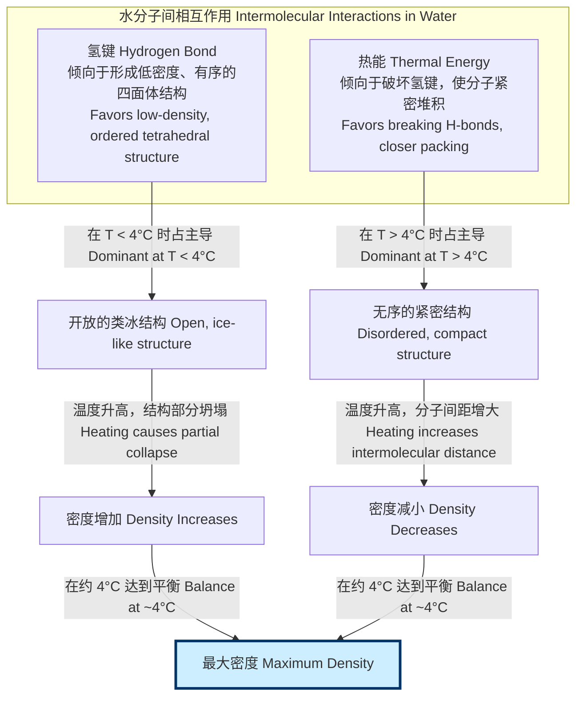
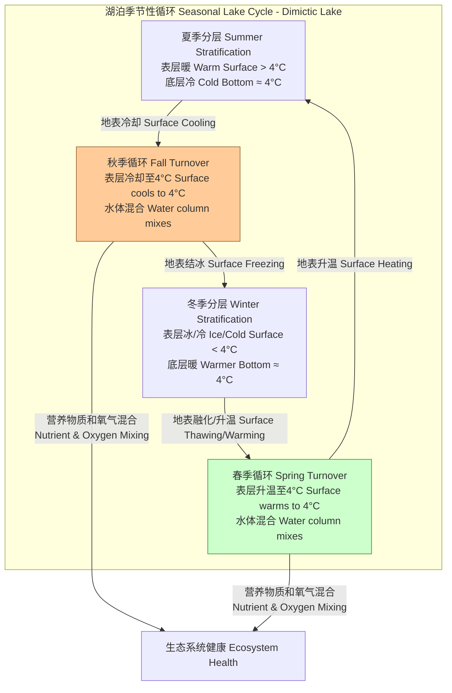

## 最大密度温度

最大密度温度（Temperature of Maximum Density, TMD）是指在给定压力下，特定物质（最典型的是液态水）达到其最高密度的温度点。与大多数物质受热时单调膨胀（密度降低）的行为不同，水在从冰点（0 °C）升温时，其密度会先增大，在约 3.98 °C（标准大气压下）达到峰值，然后才开始随温度升高而减小。这种反常的热膨胀行为是水独特的物理化学性质的直接体现，对地球上的生命和环境过程具有深远影响。

### 核心概念与数学基础

#### 物理学解释

水的密度反常现象源于其分子结构和分子间作用力，特别是氢键（Hydrogen Bond）。

*   **氢键的结构效应**: 在低温下（接近冰点），水分子通过氢键形成一个相对有序、开放且类似晶体的四面体网络结构。这种结构占据了较大的体积，因此密度较低。
*   **热能的破坏效应**: 当温度从 0 °C 升高时，分子获得的热能（动能）开始部分破坏这些氢键网络。四面体结构坍塌，分子可以更紧密地堆积在一起，从而导致体积收缩，密度增大。
*   **竞争与平衡**: 在 0 °C 到 3.98 °C 之间，氢键结构破坏带来的密度增加效应超过了分子热运动加剧引起的热膨胀效应。当温度达到 3.98 °C 时，这两种相反的效应达到一个微妙的平衡，此时水的堆积效率最高，密度达到最大值。
*   **正常热膨胀**: 当温度超过 3.98 °C 后，正常的分子热运动（即分子间平均距离增大）成为主导因素，水的密度开始像大多数其他液体一样随温度升高而单调下降。

下面的Mermaid图展示了这一物理过程的因果关系。

#### 数学模型

水的密度 $\rho$ 与温度 $T$ 之间的关系可以通过一个经验多项式来精确描述。最大密度温度 $T_{md}$ 是密度函数 $\rho(T)$ 的一阶导数为零的点。

一个常用的水密度经验公式（适用于 0 °C 到 40 °C）如下：

$$
\rho(T) = a_0 + a_1 T + a_2 T^2 + a_3 T^3 + a_4 T^4 + a_5 T^5
$$

其中：
*   $\rho(T)$ 是在温度 $T$ 时的密度，单位为 kg/m³。
*   $T$ 是摄氏温度（°C）。
*   $a_0, a_1, ..., a_5$ 是经验拟合系数。根据 Tanaka 等人 (2001) 的工作，这些系数的值为：
    *   $a_0 = 999.83952 \text{ kg/m³}$
    *   $a_1 = 16.952577 \times 10^{-3} \text{ kg/(m³·°C)}$
    *   $a_2 = -7.9905127 \times 10^{-6} \text{ kg/(m³·°C²)}$
    *   $a_3 = -4.6241757 \times 10^{-9} \text{ kg/(m³·°C³)}$
    *   $a_4 = 1.0584601 \times 10^{-12} \text{ kg/(m³·°C⁴)}$
    *   $a_5 = -2.8103006 \times 10^{-16} \text{ kg/(m³·°C⁵)}$

为了找到最大密度温度 $T_{md}$，我们需要求解密度函数对温度的导数等于零的方程：

$$
\frac{d\rho(T)}{dT} = 0
$$

对上述多项式求导，我们得到：

$$
\frac{d\rho(T)}{dT} = a_1 + 2a_2 T + 3a_3 T^2 + 4a_4 T^3 + 5a_5 T^4
$$

将 $T = T_{md}$ 代入并令其为零，即可通过数值方法（如牛顿-拉夫逊法）求解这个四次方程，得到 $T_{md}$ 的精确值。

### 关键技术规格

下表列出了纯水（VSMOW - 维也纳标准平均海水）在不同条件下的最大密度温度。

| 参数 (Parameter) | 值 (Value) | 单位 (Unit) | 条件 (Conditions) |
| :--- | :--- | :--- | :--- |
| 最大密度温度 ($T_{md}$) | 3.984 | °C | 纯 H₂O, 1 atm (101.325 kPa) |
| 对应最大密度 ($\rho_{max}$) | 999.97495 | kg/m³ | 在 $T_{md}$ 和 1 atm |
| $T_{md}$ 的压力依赖性 ($\frac{dT_{md}}{dP}$) | -0.020 | °C/MPa | 在 0.1 MPa 附近 |
| 重水 (D₂O) 的 $T_{md}$ | 11.23 | °C | 纯 D₂O, 1 atm |
| 重水 (D₂O) 的 $\rho_{max}$ | 1105.34 | kg/m³ | 在其 $T_{md}$ 和 1 atm |

**注**: 压力升高会降低最大密度温度。例如，在大约 20 MPa (约 200 atm) 的压力下，$T_{md}$ 会降至 0 °C 以下。

### 常见用例与性能指标

#### 湖沼学（Limnology）

水的最大密度温度是驱动温带地区湖泊季节性循环（分层与混合）的关键因素。

*   **夏季分层**: 湖泊表层水被加热，温度远高于 4 °C，密度较低，漂浮在密度较高的 4 °C 左右的底层水之上，形成稳定的热分层。
*   **秋季混合**: 随着气温下降，表层水冷却。当表层水温降至 4 °C 时，其密度达到最大，变得比下层水更重，于是下沉，引发整个水体的垂直对流和混合。这个过程称为“秋季循环”或“翻转”。
*   **冬季分层**: 气温继续下降，表层水温降至 4 °C 以下，密度再次变小。最终，表层结冰（冰的密度远小于水），形成稳定的逆温分层，保护了湖底生物免于冻结。
*   **春季混合**: 春季冰融化后，表层水被加热。当水温达到 4 °C 时，再次引发整个水体的混合，称为“春季循环”。

**性能指标**:
*   **湖泊稳定性 (Lake Stability)**: 可用布伦特-维赛拉频率（Brunt–Väisälä frequency, $N$）来量化，其平方 $N^2$ 正比于密度梯度。
    $$ N^2 = -\frac{g}{\rho_0} \frac{d\rho}{dz} $$
    其中 $g$ 是重力加速度，$\rho_0$ 是参考密度，$z$ 是垂直坐标。在夏季和冬季分层期，$N^2 > 0$，水体稳定；在春秋混合期，$N^2 \approx 0$，水体不稳定，易于混合。
*   **循环效率**: 混合过程将深层的营养物质带到表层，并将表层的溶解氧输送到深层，对湖泊生态系统的生产力和健康至关重要。

下图展示了温带湖泊的季节性循环过程。

### 实施考量

在科学计算和工程模型中，精确计算 $T_{md}$ 或在特定温度下水的密度至关重要。

*   **模型选择**:
    *   **高精度需求**: 对于计量学或高精度科学研究，应使用国际标准，如 IAPWS-95 (International Association for the Properties of Water and Steam) 公式。这是一个非常复杂的方程组，但提供了在宽广温压范围内的最高精度。
    *   **常规应用**: 对于大多数环境或工程模型，上述的多项式拟合（如 Tanaka et al., 2001）提供了足够的精度，且计算成本低得多。
*   **数值求解算法**:
    *   **问题**: 求解 $\frac{d\rho}{dT} = 0$ 以找到 $T_{md}$。
    *   **方法**:
        1.  **牛顿-拉夫逊法 (Newton-Raphson Method)**: 收敛速度快（二次收敛），但需要一个好的初始猜测值（例如，4 °C），并且需要计算二阶导数。算法复杂度为 $O(\log(1/\epsilon))$ 次迭代，其中 $\epsilon$ 是所需精度。
        2.  **二分法 (Bisection Method)**: 保证收敛，但速度较慢（线性收敛）。适用于不确定导数行为的情况。
        3.  **多项式求根**: 由于导数是四次多项式，可以使用专门的多项式求根算法（如 Jenkins-Traub 算法）直接求解所有根，然后选择在物理范围内的实根。
*   **算法复杂度**: 对于一个 $n$ 阶多项式密度模型，评估密度 $\rho(T)$ 的计算复杂度是 $O(n)$。评估其导数的复杂度也是 $O(n)$。因此，在数值求解的每次迭代中，计算成本是可控的。

### 性能特征

*   **测量精度**: 现代实验对纯水 $T_{md}$ 的测量精度非常高。例如，一个报告值可以是 $T_{md} = 3.984 \pm 0.001$ °C (95% 置信区间)。不确定性主要来源于温度测量的系统误差和水样纯度的控制。
*   **曲线平坦度**: 在最大密度点附近，密度曲线非常平坦。这可以通过二阶导数来量化：
    $$ \frac{d^2\rho}{dT^2} \bigg|_{T=T_{md}} $$
    这个值是一个负数，其绝对值的大小表示了密度峰值的“尖锐”程度。对于水来说，这个值相对较小，意味着在 3 °C 到 5 °C 的范围内，密度变化非常微小。这对于需要稳定密度的实验（如密度基准）是有利的。

### 相关技术与比较模型

#### 与“正常”液体的比较

大多数简单液体（如液态氩、烷烃）不显示密度最大值。它们的密度随温度升高而单调减小。这可以用简单的自由体积理论来解释，其中温度升高仅导致分子间平均距离的增加。

*   **数学模型**: 对于正常液体，一个简单的线性模型通常是足够好的近似：
    $$ \rho(T) \approx \rho_0 [1 - \beta(T - T_0)] $$
    其中：
    *   $\rho_0$ 是在参考温度 $T_0$ 时的密度。
    *   $\beta$ 是体膨胀系数（coefficient of thermal expansion），对于正常液体，$\beta > 0$ 且近似为常数。
    *   对于水，$\beta$ 在 3.98 °C 时变号，从负值变为正值。

#### 其他具有密度反常的物质

水并非唯一具有此特性的物质。其他物质，如液态硅（Si）、锗（Ge）、镓（Ga）、铋（Bi）和某些化合物（如 SiO₂），也表现出密度反常。

*   **共同特征**: 这些物质在固态时通常具有开放的、共价键合的结构，其配位数较低。熔化时，这种结构部分保留，但在加热时会进一步坍塌，导致密度增加，与正常的热膨胀竞争。
*   **比较模型 (Two-State Models)**: 解释这种行为的一个流行理论是“双态模型”。该模型假设液体是两种不同局部结构（一种是低密度、有序的“A”态，另一种是高密度、无序的“B”态）的混合物。
    $$ \rho(T) = x_A(T)\rho_A + x_B(T)\rho_B $$
    其中 $x_A$ 和 $x_B$ 是两种状态的摩尔分数 ($x_A + x_B = 1$)，它们是温度的函数。随着温度升高，平衡会从低密度的 A 态向高密度的 B 态移动，导致密度增加。与此同时，每个状态自身也会热膨胀。这两种效应的竞争导致了密度最大值的出现。

### 参考文献

1.  Tanaka, M., Girard, G., Davis, R., Peuto, A., & Bignell, N. (2001). Recommended table for the density of water between 0 °C and 40 °C based on recent experimental reports. *Metrologia*, 38(4), 301–309. DOI: [10.1088/0026-1394/38/4/3](https://doi.org/10.1088/0026-1394/38/4/3)
2.  Wagner, W., & Pruß, A. (2002). The IAPWS Formulation 1995 for the Thermodynamic Properties of Ordinary Water Substance for General and Scientific Use. *Journal of Physical and Chemical Reference Data*, 31(2), 387–535. DOI: [10.1063/1.1461829](https://doi.org/10.1063/1.1461829)
3.  Kell, G. S. (1975). Density, thermal expansivity, and compressibility of liquid water from 0° to 150°C: Correlations and tables for atmospheric pressure and saturation reviewed and expressed on 1968 temperature scale. *Journal of Chemical & Engineering Data*, 20(1), 97–105. DOI: [10.1021/je60064a005](https://doi.org/10.1021/je60064a005)