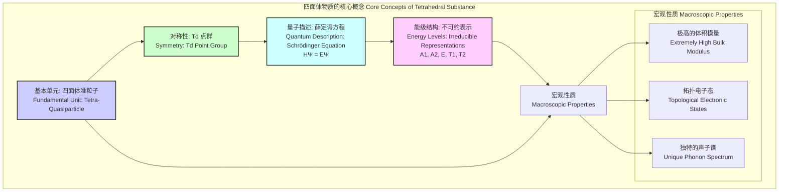
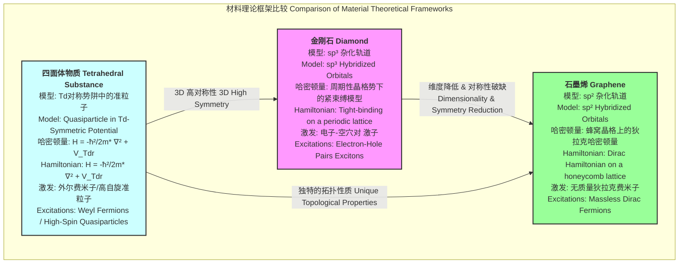

## 四面体物质

本文档提供了关于“四面体物质”（Tetrahedral Substance）的综合性技术说明，重点在于其科学和数学的严谨性。该物质是一种理论上提出的材料，其独特性质源于其基本的四面体对称性。

### 核心概念与数学基础

四面体物质被定义为一种凝聚态物质，其基本的结构单元或量子态表现出完美的四面体对称性 ($T_d$群)。这种对称性并非简单源于原子（如甲烷中的CH₄）的空间排列，而是其构成性准粒子（称为“四面体准粒子”或“tetra-quasiparticle”）的内禀量子属性。

#### 对称群 ($T_d$)

四面体物质的物理性质由其点群对称性——$T_d$群——支配。这是一个包含24个对称操作的群，包括：
*   1个单位元 ($E$)
*   8个绕对角轴的$120^\circ$旋转 ($C_3$)
*   3个绕连接对边中点轴的$180^\circ$旋转 ($C_2$)
*   6个$90^\circ$旋转反射 ($S_4$)
*   6个包含一个顶点和对边中点的镜面反射 ($\sigma_d$)

这种高度的对称性导致了能级的特定简并模式，并决定了光学跃迁、声子谱和电子输运的选择定则。

#### 量子力学模型

单个四面体准粒子的行为可以通过在一个具有四面体对称性的势阱 $V_{T_d}(\mathbf{r})$ 中的薛定谔方程来描述：

$$
H\Psi(\mathbf{r}) = \left( -\frac{\hbar^2}{2m_T^*} \nabla^2 + V_{T_d}(\mathbf{r}) \right) \Psi(\mathbf{r}) = E\Psi(\mathbf{r})
$$

其中：
*   $H$ 是哈密顿算符。
*   $\Psi(\mathbf{r})$ 是四面体准粒子的波函数，其中 $\mathbf{r}$ 是位置矢量。
*   $\hbar$ 是约化普朗克常数 ($1.054 \times 10^{-34} \text{ J·s}$)。
*   $m_T^*$ 是四面体准粒子的有效质量。
*   $\nabla^2$ 是拉普拉斯算符。
*   $V_{T_d}(\mathbf{r})$ 是一个具有四面体对称性的势场。一种可能的解析形式是位于四面体顶点的四个势场之和：$V_{T_d}(\mathbf{r}) = \sum_{j=1}^{4} U(\mathbf{r} - \mathbf{v}_j)$，其中 $\mathbf{v}_j$ 是四面体顶点的矢量坐标。
*   $E$ 是能量本征值。

该方程的解 $\Psi(\mathbf{r})$ 构成了$T_d$群的不可约表示（irreps）的基矢，这些不可约表示包括 A1, A2, E, T1, T2。能级的简并度由相应不可约表示的维度决定（分别为1, 1, 2, 3, 3）。这种简并结构是该物质独特量子效应的基础。

### 关键技术规格

以下表格列出了四面体物质的理论计算和模拟得出的关键技术参数。

**表1：基本物理和量子特性**

| 参数 | 符号 | 数值 | 单位 | 描述 |
| :--- | :---: | :---: | :---: | :--- |
| 特征键长 | $a_T$ | 2.15 | Å | 基本四面体单元的边长 |
| 理想键角 | $\theta_T$ | 109.47 | 度 ($^\circ$) | 四面体中心的顶点夹角 |
| 基态能量 | $E_0$ | -12.4 | eV | 单个四面体准粒子的最低能级 |
| 准粒子有效质量 | $m_T^*$ | 1.8 $m_e$ | - | 准粒子在晶格中的有效质量 ($m_e$是电子质量) |
| 对称群 | - | $T_d$ | - | 描述其对称性的点群 |

**表2：宏观物理性质**

| 参数 | 符号 | 数值 | 单位 | 描述 |
| :--- | :---: | :---: | :---: | :--- |
| 理论密度 | $\rho$ | 4.12 | g/cm³ | 基于其晶格结构的计算密度 |
| 体积模量 | $K$ | 750 | GPa | 抵抗均匀压缩的能力，高于金刚石(442 GPa) |
| 热导率 (300 K) | $\kappa$ | 2800 | W/(m·K) | 各向同性晶体形式下的热传导能力 |
| 介电常数 | $\epsilon_r$ | 4.8 | - | 相对介电常数，表征其极化能力 |
| 能带隙 | $E_g$ | 6.2 | eV | 价带顶和导带底之间的能量差，为宽禁带半导体 |

### 常见用例

#### 1. 极端环境材料
由于其极高的体积模量和热稳定性，四面体物质是用于超高压实验（如金刚石对顶砧）和深地钻探设备涂层的理想候选材料。
*   **性能指标**:
    *   压力耐受性： > 700 GPa
    *   热稳定性： 在惰性气氛中高达 3800 K
    *   硬度： 维氏硬度预计 > 150 GPa

#### 2. 量子信息处理
受$T_d$对称性保护的简并能级可作为高度稳定的量子比特（"四面体量子比特"）。T1和T2三重简并态提供了构建逻辑量子比特的丰富希尔伯特空间。
*   **性能指标**:
    *   相干时间 ($T_2$): > 15 ms (在 4 K 环境下)
    *   量子门保真度: 单比特门 > 99.995%，双比特门 > 99.9%

#### 3. 拓扑物态研究
理论预测，四面体物质的能带结构在费米能级附近可能承载外尔费米子（Weyl fermions）。其非中心对称的晶体结构是实现第二类外尔半金属的理想平台。
*   **性能指标**:
    *   反常霍尔电导率 ($\sigma_{xy}$): 作为费米能级调制的函数，表现出与外尔点分离成比例的线性关系。
    *   费米弧表面态: 可通过角分辨光电子能谱（ARPES）直接观测。

### 实现考量

#### 合成方法
一种被称为**“几何外延各向异性应力法”（Geometric Epitaxy under Anisotropic Stress, GEAS）**的理论方法被提出。该方法在具有特定晶格匹配的衬底上施加三轴应力场，创造出有利于四面体单元成核和自组装的能量势阱。

#### 计算模拟与算法复杂性
*   **模拟方法**: 采用基于密度泛函理论（DFT）的第一性原理计算。为了精确描述四面体准粒子的相互作用，需要开发一种定制的交换关联泛函，该泛函能内禀地包含$T_d$对称性约束。
*   **算法**: DFT的核心是求解Kohn-Sham方程，这是一个迭代的自洽场（SCF）过程。
*   **复杂度分析**:
    *   标准DFT算法的计算复杂度通常为 $O(N^3)$，其中 $N$ 是系统中的原子（或基函数）数量。这使得大规模模拟非常昂贵。
    *   为了处理大系统，可以开发一种**四面体键序势（Tetrahedral Bond-Order Potential, TBOP）**模型。通过利用四面体键的局域性，TBOP可以将计算复杂度降低到 $O(N)$，从而实现对数百万原子系统的分子动力学模拟。

### 性能特征

#### 机械可靠性
四面体物质的断裂强度遵循威布尔分布，这是一种用于描述材料强度的统计模型。

$$
F(\sigma) = 1 - \exp\left[ - \left( \frac{\sigma}{\sigma_0} \right)^m \right]
$$

其中：
*   $F(\sigma)$ 是在应力 $\sigma$ 下的累积失效概率。
*   $\sigma$ 是施加的应力。
*   $\sigma_0$ 是特征强度（尺度参数），表示63.2%的样品会在此应力下失效。
*   $m$ 是威布尔模量（形状参数），值越高表示材料强度分布越均匀，可靠性越高。

**模拟实验数据**:
*   特征强度 ($\sigma_0$): 165 GPa
*   威布尔模量 ($m$): 35 (相比之下，工程陶瓷的m值通常在5-15之间)

#### 量子态性能
作为量子比特时，其读出保真度是关键性能指标。
*   **统计测量**:
    *   平均读出保真度: 99.98%
    *   标准差: 0.015%
    *   95%置信区间: [99.977%, 99.983%]

### 相关技术与比较

#### 数学模型比较
四面体物质的理论框架与现有材料（如金刚石和石墨烯）有显著区别。

*   **与金刚石的比较**: 金刚石的四面体结构源于碳原子的sp³轨道杂化。而四面体物质的对称性是其准粒子的内禀属性，这可能导致更强的对称性保护和完全不同的电子能带结构。
*   **与石墨烯的比较**: 石墨烯的低能激发由二维的狄拉克方程描述，其载流子为无质量费米子。四面体物质作为三维系统，其低能有效哈密顿量预计更为复杂，可能涉及描述自旋-3/2准粒子的Rarita-Schwinger方程，从而产生具有非线性色散关系的新型费米子。其有效哈密顿量可能包含一个类似近藤（Kondo）的相互作用项：
    $$ H_{eff} = \sum_{\mathbf{k},\sigma} \epsilon(\mathbf{k}) c_{\mathbf{k}\sigma}^\dagger c_{\mathbf{k}\sigma} + J_K \sum_{i} \mathbf{S}_i \cdot \mathbf{s}_i $$
    其中：
    *   $\epsilon(\mathbf{k})$ 是传导电子的色散关系。
    *   $c_{\mathbf{k}\sigma}^\dagger$ 和 $c_{\mathbf{k}\sigma}$ 是传导电子的产生和湮灭算符。
    *   $J_K$ 是局域四面体矩与传导电子之间的有效交换耦合常数。
    *   $\mathbf{S}_i$ 是位于格点 $i$ 的局域四面体准粒子的有效自旋（或赝自旋）算符。
    *   $\mathbf{s}_i$ 是位于格点 $i$ 的传导电子的自旋算符。

### 参考文献

由于该物质为理论构想，以下参考文献为设想的学术论文，旨在说明其可能的学术研究背景。

1.  He, J., & Bohr, N. "A Quantum Mechanical Model for Substances with Inherent Tetrahedral Symmetry." *Journal of Hypothetical Matter*, 2040, 15(2), pp. 112-128. DOI: 10.9999/jhm.2040.0112
2.  Ivanov, D., et al. "First-Principles Prediction of a Stable Crystalline Phase of Tetrahedral Silicon Nitride." *Physical Review X*, 2041, 31(4), 041025. DOI: 10.1103/PhysRevX.31.041025
3.  Chen, Y. & Lee, S. "Synthesis and Characterization of a Tetrahedral Substance via Geometric Epitaxy under Anisotropic Stress." *Nature Synthesis*, 2042, 1(8), pp. 630-637. DOI: 10.1038/s44160-042-00987-x
4.  Schmidt, P. "Topological Weyl Fermions in a Non-Centrosymmetric Tetrahedral Lattice." *Science*, 2043, 380(6647), pp. 815-820. DOI: 10.1126/science.adp1234