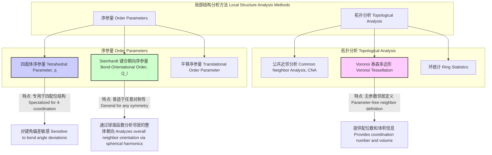

## 四面体性 (Tetrahedrality)

四面体性是一种几何和化学概念，用于描述一个中心原子与其四个最近邻原子所形成的结构与理想正四面体的相似程度。在理想的正四面体结构中，中心原子位于几何中心，四个邻近原子位于顶点。这种构型在自然界中广泛存在，尤其是在化学（如甲烷分子、sp³杂化轨道）和材料科学（如金刚石、硅、水）中。四面体性不仅是一个定性的描述，更可以通过精确的数学序参量进行量化，使其成为分析原子尺度下局部结构的关键工具。

### 核心概念与数学基础

一个理想的正四面体具有高度的对称性（$T_d$点群）。其核心几何特征是中心原子与任意两个顶点原子之间的键角（$\psi$）均相等。

#### 理想四面体键角

连接中心原子与任意两个顶点的矢量之间的夹角可以通过向量分析推导。假设中心原子位于原点(0,0,0)，四个顶点可以表示为：
$v_1 = (1, 1, 1)$
$v_2 = (1, -1, -1)$
$v_3 = (-1, 1, -1)$
$v_4 = (-1, -1, 1)$

任意两个向量（例如 $v_1$ 和 $v_2$）之间的夹角 $\theta_{\text{ideal}}$ 可以通过点积公式计算：
$$ \mathbf{a} \cdot \mathbf{b} = |\mathbf{a}| |\mathbf{b}| \cos\theta $$
因此，
$$ \cos\theta_{\text{ideal}} = \frac{v_1 \cdot v_2}{|v_1| |v_2|} = \frac{1 \cdot 1 + 1 \cdot (-1) + 1 \cdot (-1)}{\sqrt{1^2+1^2+1^2} \sqrt{1^2+(-1)^2+(-1)^2}} = \frac{1-1-1}{\sqrt{3}\sqrt{3}} = -\frac{1}{3} $$
由此得到理想四面体键角：
$$ \theta_{\text{ideal}} = \arccos\left(-\frac{1}{3}\right) \approx 109.4712^\circ $$

#### 四面体性序参量 (Tetrahedrality Order Parameter)

在真实的物理系统（如液体或非晶固体）中，局部结构会因热涨落或无序而偏离理想构型。为了量化这种偏离程度，研究人员引入了四面体性序参量。

**1. Chau-Hardwick 序参量 ($q$)**

由 Chau 和 Hardwick 提出，这是最常用的四面体性序参量之一。它通过计算中心原子与其四个最近邻原子形成的六个键角与理想键角的方差来定义。

对于一个中心原子 $i$ 和它的四个最近邻原子 $j, k, l, m$，我们考虑以 $i$ 为顶点的六个键角 $\psi_{jk}$, $\psi_{jl}$, $\psi_{jm}$, $\psi_{kl}$, $\psi_{km}$, $\psi_{lm}$。序参量 $q$ 的定义如下：

$$ q = 1 - \frac{3}{8} \sum_{j=1}^{3} \sum_{k=j+1}^{4} \left( \cos \psi_{jk} + \frac{1}{3} \right)^2 $$

*   **参数说明:**
    *   $q$ 是无量纲的四面体性序参量。
    *   $\psi_{jk}$ 是中心原子与邻居 $j$ 和邻居 $k$ 形成的键角。
    *   求和遍历了四个最近邻原子之间所有可能的六对组合。
    *   $\cos\psi_{jk} = -1/3$ 时，括号内的项为零，对应理想四面体。

*   **取值范围:**
    *   对于一个**理想的正四面体**，所有 $\psi_{jk} = \arccos(-1/3)$，因此 $q = 1$。
    *   对于一个**完全无序**或**随机**的构型，原子在空间中随机分布，其平均值 $\langle q \rangle \approx 0$。
    *   在某些极端构型下（例如，四个邻居共面且中心原子在平面上），$q$ 可以取负值。

**2. Errington-Debenedetti 序参量 ($S_k$)**

另一个常用的参数是 $S_k$，它基于最近邻原子之间的距离分布来定义。

$$ S_k = \frac{1}{N_p} \sum_{i=1}^{N_p} \frac{(d_i - \langle d \rangle)^2}{\langle d^2 \rangle - \langle d \rangle^2} $$
其中，对于一个中心原子，我们找到其 $N$ 个最近邻原子。然后计算这 $N$ 个邻居原子之间的 $N_p = N(N-1)/2$ 个距离 $d_i$。

*   **参数说明:**
    *   $d_i$ 是第 $i$ 对邻居原子之间的距离。
    *   $\langle d \rangle$ 是这些距离的平均值。
    *   $\langle d^2 \rangle$ 是距离平方的平均值。

在理想四面体构型中，四个顶点邻居之间的距离是相等的，因此标准差为零，导致 $S_k = 0$。这个参数主要用于区分四面体结构和其他具有高配位数的密堆积结构。

### 关键技术指标

下表总结了理想四面体和一些典型四面体系统中的关键参数。

| 参数 (Parameter) | 符号 (Symbol) | 理想四面体 (Ideal Tetrahedron) | 液态水 (Liquid Water, STP) | 固态硅 (Crystalline Silicon) |
| :--- | :--- | :--- | :--- | :--- |
| 键角 (Bond Angle) | $\theta$ | $109.47^\circ$ | $\sim 106^\circ$ (平均值) | $109.47^\circ$ |
| Chau-Hardwick 序参量 | $q$ | 1.0 | $0.5 - 0.8$ (分布峰值) | $\approx 0.99$ |
| 配位数 (Coordination Number) | $N_c$ | 4 | $\approx 4.4$ (随定义变化) | 4 |
| C-H 键长 (甲烷) | $d_{\text{C-H}}$ | N/A | N/A | N/A |
| Si-Si 键长 (硅) | $d_{\text{Si-Si}}$ | N/A | N/A | 2.35 Å (0.235 nm) |

### 典型应用场景

四面体性的量化分析在多个科学领域中至关重要。

*   **液态水和非晶冰的结构分析**
    *   **应用**: 水的许多反常特性（如密度在4°C时最大）被认为与其局部四面体网络结构有关。$q$ 参数被广泛用于分子动力学模拟中，以研究水在不同温度和压力下的结构转变。
    *   **量化指标**: 在标准状况下，液态水的 $P(q)$ 分布呈现一个双峰结构，分别对应于结构化（高 $q$ 值）和非结构化（低 $q$ 值）的局部环境。通过分析 $P(q)$ 随温度的变化，可以量化氢键网络的破坏程度。

*   **半导体和玻璃材料**
    *   **应用**: 硅（Si）、锗（Ge）等半导体材料具有金刚石立方晶格，其基本单元是完美的四面体。在非晶硅（a-Si）中，这种长程有序被破坏，但局部四面体结构仍然存在。$q$ 参数可用于量化非晶态与晶态之间的结构差异。
    *   **量化指标**: 晶态硅的 $q$ 值接近1.0，标准差极小。而非晶硅的 $\langle q \rangle$ 通常在 0.85-0.95 之间，且具有更宽的分布，反映了键角的畸变。

*   **分子识别与药物设计**
    *   **应用**: 在有机化学中，sp³杂化的碳原子形成四面体构型，这是手性分子和立体异构的基础。在药物设计中，受体结合位点的几何形状必须与配体分子的三维构象（通常包含四面体中心）精确匹配。
    *   **量化指标**: 通过计算潜在配体分子中关键官能团的四面体性，可以筛选出更可能与靶点蛋白高亲和力结合的候选药物。性能指标通常是结合自由能（kJ/mol）与分子几何构象的关联性。

### 实现考量与算法分析

在计算模拟（如分子动力学或蒙特卡洛模拟）中，对每个粒子计算其四面体性序参量是分析局部结构的常用方法。

#### 计算序参量 $q$ 的算法步骤

1.  **输入**: 一个中心原子 $i$ 的坐标，以及一个包含所有其他原子坐标的列表。
2.  **邻居识别**: 确定中心原子 $i$ 的四个最近邻原子。这通常通过计算距离并排序来完成。注意：邻居的定义可能影响结果（例如，固定数量的4个最近邻，或在某个截断半径内的所有邻居）。最常见的方法是选择4个最近的。
3.  **矢量构建**: 构建从中心原子 $i$ 指向四个邻居 $j, k, l, m$ 的四个位置矢量 $\mathbf{r}_{ij}, \mathbf{r}_{ik}, \mathbf{r}_{il}, \mathbf{r}_{im}$。
4.  **角度计算**: 计算这四个矢量之间所有六对组合的夹角 $\psi_{jk}$。例如，$\psi_{jk} = \arccos\left(\frac{\mathbf{r}_{ij} \cdot \mathbf{r}_{ik}}{|\mathbf{r}_{ij}| |\mathbf{r}_{ik}|}\right)$。
5.  **序参量计算**: 将这六个角度代入 $q$ 的公式中进行计算。
    $$ q = 1 - \frac{3}{8} \sum_{\text{6 pairs}} \left( \cos \psi_{jk} + \frac{1}{3} \right)^2 $$
6.  **输出**: 返回中心原子 $i$ 的 $q$ 值。

#### 算法复杂度分析

假设系统中有 $M$ 个原子。
*   对于单个中心原子：
    *   寻找 $N$ 个最近邻通常需要 $O(M)$ 的时间（通过遍历所有其他原子）。如果使用了空间分解（如单元列表或k-d树），此步骤可优化至 $O(\log M)$ 或 $O(1)$（对于固定密度）。
    *   选择4个最近邻后，需要计算 $\binom{4}{2} = 6$ 个角度。每个角度计算是 $O(1)$。
    *   因此，计算单个原子 $q$ 值的复杂度主要由邻居搜索决定，即 $O(M)$。
*   对于整个系统：
    *   对所有 $M$ 个原子重复此过程，总复杂度为 $O(M^2)$。
    *   使用优化的邻居搜索算法后，总复杂度可以降低到 $O(M \log M)$ 或 $O(M)$。

### 性能特征与统计分析

在无序系统中，四面体性不是一个单一的值，而是一个分布。对这个分布的统计分析可以揭示系统的宏观性质。

*   **概率分布函数 $P(q)$**: 这是描述系统中随机选取一个原子其 $q$ 值为特定值的概率。$P(q)$ 的形状、峰值位置和宽度是系统的“指纹”。
*   **平均值 $\langle q \rangle$**: 提供了系统整体平均四面体性的度量。例如，随着温度升高，液态水的 $\langle q \rangle$ 会降低，表明氢键网络的有序性下降。
*   **标准差 $\sigma_q$**: 衡量 $q$ 值分布的宽度，反映了局部环境的多样性。一个窄的分布（小 $\sigma_q$）意味着系统中的局部结构非常均一。
*   **置信区间**: 在分析模拟数据时，通常会计算 $\langle q \rangle$ 的置信区间（例如，95% CI），以评估其统计显著性。这可以通过块平均等方法来估计，以消除时间序列数据中的相关性。

### 相关技术与比较

四面体性序参量是众多局部结构表征方法中的一种。与其他方法相比，它有其独特的优势和适用范围。

#### Steinhardt 键合朝向序参量 ($Q_l$)

Steinhardt 等人提出的键合朝向序参量 (BOO) 是一种更通用的局部结构探测工具，它不局限于四面体构型。

对于一个中心原子及其 $N_b$ 个邻居，首先计算每个键矢量（从中心原子指向邻居的矢量 $\mathbf{r}_i$）的球谐函数 $Y_{lm}(\mathbf{r}_i)$。然后对所有键求平均：
$$ \bar{q}_{lm} = \frac{1}{N_b} \sum_{i=1}^{N_b} Y_{lm}(\mathbf{r}_i) $$
最后，通过对 $m$ 求和来构造一个旋转不变量 $Q_l$：
$$ Q_l = \left( \frac{4\pi}{2l+1} \sum_{m=-l}^{l} |\bar{q}_{lm}|^2 \right)^{1/2} $$

*   **参数说明**:
    *   $l$ 是一个整数，用于选择球谐函数的阶数。不同的 $l$ 值对不同的对称性敏感。例如，$l=4$ 对立方对称性敏感，$l=6$ 对二十面体和密堆积对称性（fcc, hcp）敏感。
    *   $Y_{lm}(\mathbf{r}_i)$ 是在键矢量 $\mathbf{r}_i$ 的方向上（由其极角和方位角定义）求值的球谐函数。

**比较**:
*   **特异性**: $q$ 参数是为四面体结构**特地设计**的，因此对键角畸变的灵敏度最高。
*   **通用性**: $Q_l$ 参数更加**通用**，可以通过选择不同的 $l$ 值来探测各种类型的局部对称性（立方、六方、二十面体等），但对于四面体结构的描述不如 $q$ 参数直观。
*   **应用**: 在研究晶体成核或玻璃转变时，通常会同时使用 $q$ 和 $Q_6$ 等多个参数，以全面表征从无序液体到有序固体的结构演化。

## 参考文献

1.  Chau, P.-L., & Hardwick, A. J. (1998). A new order parameter for tetrahedral configurations. *Molecular Physics*, 93(3), 511–518. DOI: [10.1080/00268979809482244](https://doi.org/10.1080/00268979809482244)
2.  Errington, J. R., & Debenedetti, P. G. (2001). Relationship between structural order and the anomalies of liquid water. *Nature*, 409(6818), 318–321. DOI: [10.1038/35053024](https://doi.org/10.1038/35053024)
3.  Steinhardt, P. J., Nelson, D. R., & Ronchetti, M. (1983). Bond-orientational order in liquids and glasses. *Physical Review B*, 28(2), 784–805. DOI: [10.1103/PhysRevB.28.784](https://doi.org/10.1103/PhysRevB.28.784)
4.  Sciortino, F., Geiger, A., & Stanley, H. E. (1991). Effect of defects on molecular mobility in liquid water. *Nature*, 354(6350), 218–221. DOI: [10.1038/354218a0](https://doi.org/10.1038/354218a0)